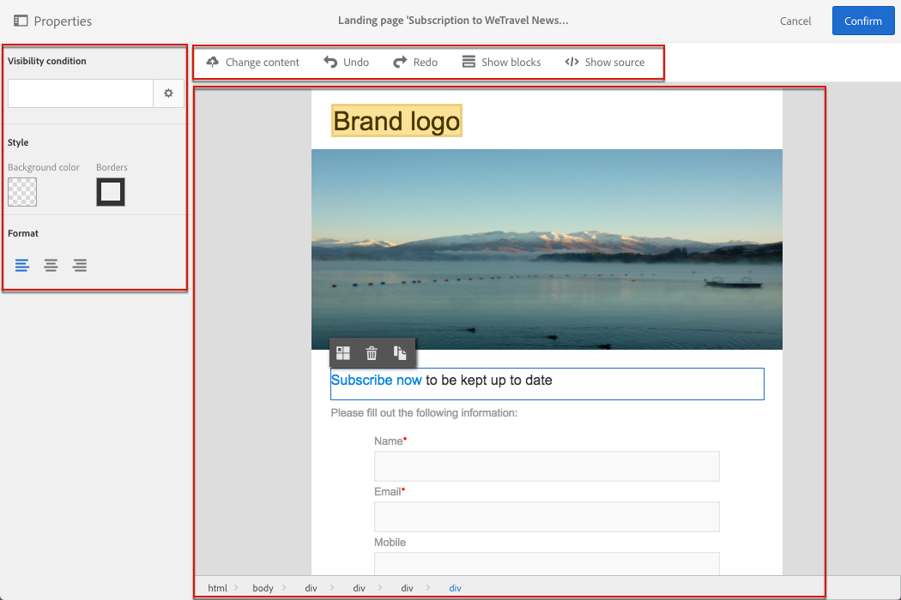

# 랜딩 페이지 디자인{#designing-a-landing-page}

## 랜딩 페이지 컨텐츠 디자인 정보 {#about-content-design}

랜딩 페이지는 모든 [마케팅 활동](../../start/using/marketing-activities.md#about-marketing-activities)으로 만들어집니다.

랜딩 페이지를 디자인할 때 페이지 자체의 콘텐츠, 확인 페이지 및 오류 페이지를 정의해야 합니다. 작업 모음 아래에 있는 전환기를 사용하여 이러한 각 페이지를 표시하고 구성합니다.

랜딩 페이지의 콘텐츠는 캠페인 콘텐츠 편집기를 통해 디자인되었습니다.

>[!NOTE]
>
>Adobe Campaign Standard 19.0 릴리스 전에 인스턴스가 설치된 경우 기존 전자 메일 콘텐츠 편집기에 액세스할 수 있습니다. 인터페이스, 사용 원칙 및 구성은 랜딩 페이지에 대해 아래에 설명된 것과 거의 동일합니다. 하지만 19.0 릴리스부터 더 이상 사용되지 않는 기존 전자 메일 콘텐츠 편집기에서 모든 기능을 사용하거나 유지 관리할 수 없습니다. 확장된 기능을 갖춘 드래그 앤 드롭 인터페이스에서 전자 메일 콘텐츠를 신속하게 편집하려면 [전자 메일 디자이너를 사용하십시오](../../designing/using/designing-content-in-adobe-campaign.md).

이 페이지에서는 랜딩 페이지 콘텐츠 편집기의 특성에 대해 설명합니다. 하나 이상의 마케팅 활동에 공통되는 작업에 대한 자세한 내용은 **전자 메일 콘텐츠 디자인** 안내서에서 다음 섹션을 참조하십시오.

* [개인화 필드 삽입](../../designing/using/personalization.md#inserting-a-personalization-field)
* [콘텐츠 블록 추가](../../designing/using/personalization.md#adding-a-content-block)
* [링크 삽입](../../designing/using/links.md#inserting-a-link)
* [이미지 삽입](../../designing/using/images.md)
* [콘텐츠 디자인을 위한 일반적인 모범 사례](../../designing/using/designing-content-in-adobe-campaign.md#content-design-best-practices)

>[!NOTE]
>HTML 형식으로 이미 사전 정의된 랜딩 페이지가 있는 경우, **[!UICONTROL Change content]** 버튼을 사용하여 직접 가져올 수 있습니다.
>
>Adobe Campaign에서 HTML 페이지를 가져오기 전에 다양한 브라우저에서 열리고 올바르게 표시되는지 확인하십시오. HTML 페이지에 JavaScript 스크립트가 있는 경우, 편집기 외부에서 오류 없이 실행되어야 합니다. 일반적으로 메시지 콘텐츠에 스크립트를 사용하여 전자 메일 클라이언트가 올바로 처리하는지 확인하지 않습니다.

## 랜딩 페이지 콘텐츠 편집기 인터페이스{#landing-page-content-editor-interface}

랜딩 페이지 콘텐츠 편집기를 사용하면 Adobe Campaign에서 콘텐츠를 쉽게 정의, 수정 및 개인화할 수 있습니다. 여기에 액세스하려면 랜딩 페이지 대시보드의 **[!UICONTROL Content]** 블록을 클릭합니다.

콘텐츠 편집기는 세 개의 서로 다른 섹션으로 구성됩니다. 이러한 섹션에서 콘텐츠를 보고 편집할 수 있습니다.

1. 화면의 왼쪽에 있는 **팔레트**&#x200B;를 사용하면 선택한 블록에 연결된 일반 옵션을 수정할 수 있습니다. 수정할 수 있는 옵션은 다음과 같습니다. 배경색, 테두리, 텍스트 정렬, 표시 여부 조건 등 [개인화 필드 삽입](../../designing/using/personalization.md#inserting-a-personalization-field)을 참조하십시오.
1. **작업 모음**&#x200B;에는 페이지에 대한 일반 옵션이 포함되어 있습니다. 템플릿을 선택하고 디스플레이 모드를 변경할 수 있습니다.
1. 기본 **편집 영역**&#x200B;에서는 이미지에 링크 삽입, 글꼴 변경, 필드 삭제 등과 같은 상황별 도구 모음을 사용하여 콘텐츠와 직접 상호 작용할 수 있습니다.

**작업 모음**&#x200B;에는 만들어지는 콘텐츠와 상호 작용할 수 있는 여러 개의 버튼이 포함되어 있습니다.

<table> 
 <thead> 
  <tr> 
   <th> 아이콘  </th> 
   <th> 버튼 이름  </th> 
   <th> 채널  </th> 
   <th> 설명  </th> 
  </tr> 
 </thead> 
 <tbody> 
  <tr> 
   <td>    </td> 
   <td> 콘텐츠 변경   </td> 
   <td> 랜딩 페이지 및 전자 메일  </td> 
   <td> 즉시 사용 가능한 콘텐츠를 선택하거나 자신의 HTML 콘텐츠를 가져올 수 있습니다. <a href="../../designing/using/using-existing-content.md">기존 콘텐츠 로드</a>를 참조하십시오.  </td> 
  </tr> 
  <tr> 
   <td>    </td> 
   <td> 실행 취소   </td> 
   <td> 모두  </td> 
   <td> 마지막으로 수행된 작업을 취소합니다.  </td> 
  </tr> 
  <tr> 
   <td>    </td> 
   <td> 다시 실행   </td> 
   <td> 모두  </td> 
   <td> 취소한 마지막 작업을 다시 실행합니다.  </td> 
  </tr> 
  <tr> 
   <td>    </td> 
   <td> 블록 표시   </td> 
   <td> 랜딩 페이지 및 전자 메일  </td> 
   <td> 콘텐트 블록 주위에 상자를 표시할 수 있습니다( <strong>&lt;div&gt;</strong> HTML 태그에 해당됨).  </td> 
  </tr> 
  <tr> 
   <td>    </td> 
   <td> 소스 표시   </td> 
   <td> 랜딩 페이지 및 전자 메일  </td> 
   <td> 페이지의 HTML 소스 코드를 표시할 수 있습니다.  </td> 
  </tr> 
 </tbody> 
</table>

**도구 모음**&#x200B;은 선택한 영역에 따라 다양한 기능을 제공하는 편집기 인터페이스의 상황별 요소입니다. 여기에는 동작 버튼과 텍스트 스타일을 변경할 수 있는 버튼이 포함되어 있습니다. 수행한 수정 사항은 항상 선택한 영역에 적용됩니다. 예를 들어 블록을 선택하면 블록을 삭제하거나 복제할 수 있습니다. 블록 내의 텍스트를 선택한 후 링크로 변환하거나 굵게 만들 수 있습니다.

>[!IMPORTANT]
>
>특정 도구 모음 기능을 사용하면 HTML 콘텐츠를 포맷할 수 있습니다. 하지만 페이지에 CSS 스타일 시트가 포함되어 있는 경우, 스타일 시트의 **지침**&#x200B;은 도구 모음을 통해 지정된 지침보다 **우선 순위**&#x200B;가 될 수 있습니다.

<table> 
 <thead> 
  <tr> 
   <th> 아이콘  </th> 
   <th> 버튼 이름  </th> 
   <th> 컨텍스트  </th> 
   <th> 설명  </th> 
  </tr> 
 </thead> 
 <tbody> 
  <tr> 
   <td>    </td> 
   <td> 외부 URL에 연결   </td> 
   <td> 모든 요소  </td> 
   <td> URL에 링크를 추가할 수 있습니다. 링크 구성 방법에 대한 자세한 내용은 <a href="../../designing/using/links.md#inserting-a-link">링크 삽입</a> 섹션에 나와 있습니다.  </td> 
  </tr> 
  <tr> 
   <td>    </td> 
   <td> 랜딩 페이지에 링크   </td> 
   <td> 모든 요소  </td> 
   <td> Adobe Campaign 랜딩 페이지에 액세스할 수 있습니다. 링크 구성 방법에 대한 자세한 내용은 <a href="../../designing/using/links.md#inserting-a-link">링크 삽입</a> 섹션에 나와 있습니다.  </td> 
  </tr> 
  <tr> 
   <td>    </td> 
   <td> 구독 링크   </td> 
   <td> 모든 요소  </td> 
   <td> 서비스 구독 링크를 삽입할 수 있습니다. 링크 구성 방법에 대한 자세한 내용은 <a href="../../designing/using/links.md#inserting-a-link">링크 삽입</a> 섹션에 나와 있습니다.  </td> 
  </tr> 
  <tr> 
   <td>    </td> 
   <td> 구독 취소 링크   </td> 
   <td> 모든 요소  </td> 
   <td> 서비스 구독 취소 링크를 삽입할 수 있습니다. 링크 구성 방법에 대한 자세한 내용은 <a href="../../designing/using/links.md#inserting-a-link">링크 삽입</a> 섹션에 나와 있습니다.  </td> 
  </tr> 
  <tr> 
   <td>    </td> 
   <td> 링크 제거   </td> 
   <td> 링크  </td> 
   <td> 확인 후 링크가 연결된 모든 구성과 링크를 삭제할 수 있습니다.  </td> 
  </tr> 
  <tr> 
   <td>    </td> 
   <td> 개인화 필드 삽입   </td> 
   <td> 텍스트 요소  </td> 
   <td> 데이터베이스의 필드를 콘텐츠에 추가할 수 있습니다. <a href="../../designing/using/personalization.md#inserting-a-personalization-field">개인화 필드 삽입</a>을 참조하십시오.  </td> 
  </tr> 
  <tr> 
   <td>    </td> 
   <td> 콘텐츠 블록 삽입   </td> 
   <td> 텍스트 요소  </td> 
   <td> 콘텐츠에 개인화 블록을 추가할 수 있습니다. <a href="../../designing/using/personalization.md#adding-a-content-block">콘텐츠 블록 추가</a>를 참조하십시오.  </td> 
  </tr> 
  <tr> 
   <td>    </td> 
   <td> 동적 콘텐츠 활성화   </td> 
   <td> 텍스트 요소  </td> 
   <td> 콘텐츠에 동적 콘텐츠를 삽입할 수 있습니다. <a href="../../channels/using/designing-a-landing-page.md#defining-dynamic-content-in-a-landing-page">동적 콘텐츠 정의</a>를 참조하십시오.  </td> 
  </tr> 
  <tr> 
   <td>    </td> 
   <td> 동적 콘텐츠 비활성화   </td> 
   <td> 텍스트 요소  </td> 
   <td> 동적 컨텐츠를 삭제할 수 있습니다.  </td> 
  </tr> 
  <tr> 
   <td>    </td> 
   <td> 글꼴 확대   </td> 
   <td> 텍스트 요소  </td> 
   <td> 선택한 텍스트의 크기를 늘립니다( <strong>&lt;span style="font-size:"&gt;</strong>추가).  </td> 
  </tr> 
  <tr> 
   <td>    </td> 
   <td> 글꼴 감소   </td> 
   <td> 텍스트 요소  </td> 
   <td> 선택한 텍스트의 크기를 줄입니다( <strong>&lt;span style="font-size:"&gt;</strong>추가).  </td> 
  </tr> 
  <tr> 
   <td>    </td> 
   <td> 굵은 글씨체   </td> 
   <td> 텍스트 요소  </td> 
   <td> 선택한 텍스트에 굵은 스타일을 추가합니다(텍스트를 <strong>&lt;strong&gt;</strong><strong>&lt;/strong&gt;</strong> 태그로 래핑).  </td> 
  </tr> 
  <tr> 
   <td>    </td> 
   <td> 기울임꼴   </td> 
   <td> 텍스트 요소  </td> 
   <td> 기울임꼴 스타일을 선택한 텍스트에 추가합니다(텍스트를 <strong>&lt;em&gt;</strong><strong>&lt;/em&gt;</strong> 태그로 래핑).  </td> 
  </tr> 
  <tr> 
   <td>    </td> 
   <td> 밑줄   </td> 
   <td> 텍스트 요소  </td> 
   <td> 선택한 텍스트의 밑줄(<strong>&lt;span style="text-decoration: underline;"&gt;</strong> 태그).  </td> 
  </tr> 
  <tr> 
   <td>    </td> 
   <td> 배경색 변경   </td> 
   <td> 텍스트 요소  </td> 
   <td> 선택한 블록의 배경색을 변경할 수 있습니다(style="background-color 추가: rgba(170, 86, 255, 0.87)).  </td> 
  </tr> 
  <tr> 
   <td>    </td> 
   <td> 글꼴 색상 변경   </td> 
   <td> 텍스트 요소  </td> 
   <td> 블록의 모든 텍스트 색상을 변경하거나 블록에서 선택한 텍스트만 변경할 수 있습니다(<strong>&lt;span style="color: #56ff56;"&gt;</strong>).  </td> 
  </tr> 
  <tr> 
   <td>    </td> 
   <td> 이미지   </td> 
   <td> 이미지가 포함된 블록  </td> 
   <td> 로컬에 저장된 파일의 이미지를 삽입할 수 있습니다.  </td> 
  </tr> 
  <tr> 
   <td>    </td> 
   <td> 삭제   </td> 
   <td> 모든 블록  </td> 
   <td> 블록 및 해당 콘텐츠를 삭제합니다.  </td> 
  </tr> 
  <tr> 
   <td>    </td> 
   <td> 복제   </td> 
   <td> 모든 블록  </td> 
   <td> 연결된 스타일을 포함하여 블록을 복제합니다.  </td> 
  </tr> 
 </tbody> 
</table>

## 랜딩 페이지 구조 및 스타일 관리{#managing-landing-page-structure-and-style}

### 콘텐츠 편집기에서 블록 관리 {#managing-blocks-in-the-content-editor}

다른 HTML 콘텐츠 요소는 랜딩 페이지에 **&lt;div>** **&lt;/div>** 태그에 해당하는 블록으로 표시됩니다. 상호 작용할 블록을 선택합니다. 그러면 파란색 상자로 둘러싸일 것입니다.

블록을 선택하면 해당 HTML 요소의 상위 개체가 편집 영역 하단에 있는 이동 경로에 표시됩니다.

마우스가 이동 경로 요소 중 하나를 마우스로 가리키면 관련 요소가 강조 표시됩니다. 따라서 많은 블록 사이를 쉽게 탐색하고 수정할 HTML 요소를 정확하게 선택할 수 있습니다.

팔레트 및 상황별 도구 모음의 옵션을 사용하여 블록을 수정, 삭제 또는 복제합니다.

텍스트가 포함된 블록의 경우 블록에서 다시 클릭하여 텍스트 편집 모드를 활성화합니다. 블록 주위의 프레임은 녹색으로 바뀝니다. 그런 다음 텍스트를 선택하거나 입력할 수 있습니다. 팔레트 및 상황별 도구 모음의 옵션을 사용하여 링크를 추가하거나 텍스트 서식을 수정합니다.

블록의 요소에 대해 정의된 매개 변수(링크, 개인화 필드, 콘텐츠 블록 등)는 팔레트에서 언제든지 수정할 수 있습니다.

### 콘텐츠 편집기에서 테두리 및 배경 추가 {#adding-a-border-and-a-background-in-the-content-editor}

차트에서 색상을 선택하여 **배경색**&#x200B;을 정의할 수도 있습니다. 이 색상이 선택한 블록에 적용됩니다.

선택한 블록에 **테두리**&#x200B;를 추가할 수 있습니다.

### 콘텐츠 편집기에서 텍스트 스타일 변경 {#changing-the-text-style-in-the-content-editor}

텍스트 스타일을 변경하려면 텍스트 블록 내부를 클릭해야 합니다.

텍스트 정렬을 변경하려면 왼쪽 팔레트에서 다음 세 가지 아이콘 중 하나를 선택합니다.

* **왼쪽 정렬**: 선택한 블록의 왼쪽으로 텍스트를 정렬합니다(style=&quot;text-align: left;&quot;).
* **가운데 정렬**: 선택한 블록의 가운데로 텍스트를 정렬합니다(style=&quot;text-align: center;&quot;).
* **오른쪽 정렬**: 선택한 블록의 오른쪽으로 텍스트를 정렬합니다(style=&quot;text-align: right;&quot;).

도구 모음을 사용하여 글꼴 크기를 조정하고, 텍스트를 굵게 또는 기울임꼴로 만들거나, 텍스트에 밑줄 또는 색상을 변경하는 것과 같이 글꼴 속성을 변경할 수도 있습니다. [이 섹션](../../channels/using/designing-a-landing-page.md#landing-page-content-editor-interface)을 참조하십시오.

### 랜딩 페이지에 이미지 삽입 {#inserting-images-in-a-landing-page}

1. 랜딩 페이지 콘텐츠에서 이미지가 포함된 블록을 선택합니다.
1. **[!UICONTROL Insert]** 버튼을 선택합니다.

   

1. 상황별 툴바에서 선택할 수 있습니다. **[!UICONTROL Local image]**

   

1. 파일을 선택합니다.

   

1. 필요에 따라 이미지 속성을 조정합니다.

   

## 랜딩 페이지에서 동적 콘텐츠 정의{#defining-dynamic-content-in-a-landing-page}

랜딩 페이지에서 동적 콘텐츠를 정의하려면 이동 경로를 사용하여 블록을 선택하거나 요소를 직접 클릭합니다.

이미지와 같은 특정 블록은 직접 선택할 수 없습니다. 이 경우 이동 경로를 사용하여 상위 블록을 선택합니다. 그러면 이미지를 포함하여 이 상위 요소에 포함된 모든 요소를 수정할 수 있습니다. 조건은 상위 블록 내의 모든 하위 요소에 적용됩니다.

이동 경로는 [블록 관리](../../channels/using/designing-a-landing-page.md#managing-landing-page-structure-and-style) 섹션에 나와 있습니다.

랜딩 페이지에서 동적 콘텐츠를 정의하는 다음 단계는 전자 메일에 대해 수행하는 단계와 유사합니다. [이 섹션](../../designing/using/personalization.md#defining-dynamic-content-in-an-email)을 참조하십시오.

>[!NOTE]
>
>변형 요소읜 윤곽선이 빨간색으로 표시되면 표현식이 아직 정의되지 않은 것입니다.

블록의 다른 동적 콘텐츠 사이를 탐색할 수 있습니다. 수행 방법:

1. 블록을 선택합니다.

   이미지의 오른쪽 및 왼쪽 측면에 화살표가 나타납니다.

1. 오른쪽 화살표를 클릭하여 사용 가능한 동적 콘텐츠를 검색합니다.

   

   사용 가능한 마지막 또는 첫 번째 동적 컨텐츠에 도달 여부에 따라 양쪽의 화살표가 흐려집니다.

   

1. 블록에 적용된 모든 조건을 삭제하려면 해당 블록을 선택하고 **[!UICONTROL Disable dynamic content]**&#x200B;아이콘을 클릭합니다.
1. 유지할 동적 콘텐츠를 선택합니다.

   

팔레트에서 수행 방법:

* 표현식이 입력된 콘텐츠는 더 이상 빨간색으로 윤곽선이 표시되지 않고 회색으로 표시됩니다.
* 현재 선택된 콘텐츠는 파란색으로 표시됩니다.

