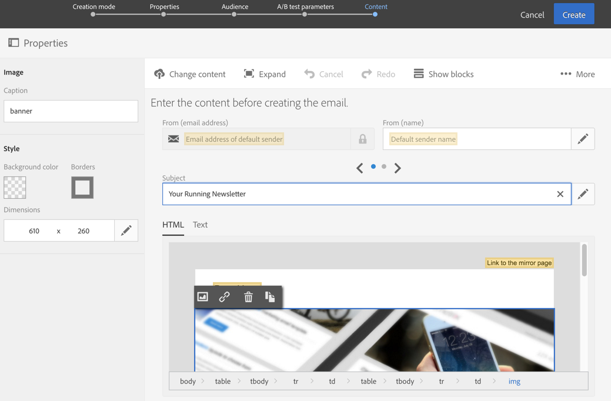

# Designing an A/B test email{#designing-an-a-b-test-email}

Adobe Campaign의 A/B 테스트 기능을 사용하면 2-3 개의 이메일 변형을 정의할 수 있습니다. 가장 좋은 결과를 얻기 위해 각 변형이 모집단 샘플로 전송됩니다. 일단 결정된 변형 변형이 나머지 모집단에게 전송됩니다.

이메일의 컨텐츠, 주제 또는 발신자를 다르게 선택할 수 있습니다.

>[!NOTE]
>
>Adobe Experience Manager에서 만든 이메일에서 A/B 테스트를 수행할 수 없습니다.

## Creating an A/B test email {#creating-an-a-b-test-email}

A/B 테스트는 A/B 테스트 구성 단계가 추가되는 표준 이메일 작성 마법사를 사용하여 만들 수 있습니다. Creating a standard email is detailed in the [Creating an email](../../channels/using/creating-an-email.md) section.

A/B 테스트의 특정 컨텍스트:

1. 원하는 요소에 따라 A/B 테스트 특정 템플릿 중 하나를 사용하여 새로운 이메일을 만듭니다.

   * 보낸 사람의 A/B 테스트
   * 컨텐츠에 대한 A/B 테스트
   * 제목 A/B 테스트
   

   >[!NOTE]
   >
   >후속 및 A/B 테스트 템플릿은 기본적으로 숨겨져 있습니다. Check the A/B test box on the left side ( **[!UICONTROL Filter]** lateral panel) to display them.

1. 일반 이메일과 마찬가지로 일반 속성과 이메일 대상자를 정의합니다. Refer to the [Creating audiences](../../audiences/using/creating-audiences.md) section.
1. 만들기 마법사의 네 번째 단계에서 A/B 테스트 매개 변수를 정의합니다.

   * **[!UICONTROL Number of variants]**: 두 가지 또는 세 가지 변형을 사용하도록 선택할 수 있습니다. 세 가지 변형을 선택하는 경우 이 단계 이후에는 이 선택 사항을 수정할 수 없습니다.
   * **[!UICONTROL Winning strategy]**: 우승 변형을 결정하는 데 사용할 기준을 선택합니다.
   * **[!UICONTROL Target breakdown]**: 각 변형을 받을 Target의 백분율을 선택합니다. 우승한 변형이 결정되면 나머지 백분율이 우승합니다. 타깃팅된 프로필이 무작위로 선택됩니다.
   * **[!UICONTROL Winner sending method]**: 우승한 변형이 일단 결정된 후 자동으로 전송되도록 할지 또는 나머지 모집단으로의 전송을 수동으로 확인할지 여부를 선택합니다.
   * **[!UICONTROL Test duration]**: 테스트 기간을 지정합니다. 우승한 변형은 이 기간 이후에 자동으로 결정됩니다. 이메일 대시보드에서 테스트를 종료하기 전에 우승한 변형을 수동으로 선택할 수 있습니다.

      모든 추적 데이터가 수집되고 우승한 변형을 선택하려면 올바르게 고려되려면 테스트가 최소 1 시간 이상이어야 합니다.
   

1. A/B 테스트 매개 변수가 정의된 후에는 마법사의 다음 단계로 전달하며 이메일 컨텐츠를 정의합니다. 선택한 템플릿에 따라 여러 주제, 여러 보낸 사람 이름 또는 여러 가지 콘텐트를 정의할 수 있습니다. 회전판을 사용하여 요소의 다른 변형을 탐색합니다. For more information, consult the [content editor](../../designing/using/about-email-content-design.md) section.

   

1. 이메일 만들기를 확인합니다. 그러면 이메일 대시보드가 표시됩니다.
1. 전송을 예약합니다. 정의된 날짜는 A/B 테스트의 시작을 나타냅니다.
1. Check the A/B test parameters displayed in the **[!UICONTROL A/B test parameters]** block. 블록을 선택하여 테스트 (9 단계) 전송을 확인할 때까지 수정할 수 있습니다.

   

1. 보낼 메시지 및 메시지의 수를 분석하기 위해 이메일 전송을 준비합니다. Consult the [Preparing the send](../../sending/using/preparing-the-send.md) section.
1. A/B 테스트를 보내기 전에 증명 자료를 보내 이메일을 확인합니다.
1. 준비가 완료되면 테스트 전송을 확인합니다. 일단 확인되면 A/B 테스트 매개 변수를 수정할 수 없습니다.

   The A/B test starts on the date defined in the **[!UICONTROL Schedule]**.You can track its progress using the **[!UICONTROL A/B test]** and **[!UICONTROL Deployment]** blocks.

   테스트 지속 기간을 짧게 하려면 언제든지 우승한 변형을 수동으로 선택할 수 있습니다.

   Once testing has finished, a summary table is displayed in the **[!UICONTROL A/B Test]** block and this allows you to view the various indicators for the different variants that were tested.

1. If you have selected **[!UICONTROL Send after confirmation]** as the sending method, you have to manually select the winning variant to start sending it to the remaining population. If you have selected **[!UICONTROL Automatic]**, the winning variant is automatically sent to the remaining population as soon as it has been determined by the system.

   >[!NOTE]
   >
   >넥타이가 있으면 우승한 변형을 수동으로 선택해야 합니다. 변형을 선택했거나 선택해야 함을 이메일 작성자 및 수정자에게 알릴 수 있습니다. [Adobe Campaign 알림을 참조하십시오](../../administration/using/sending-internal-notifications.md).

이제 이메일이 정의 및 전송됩니다. 로그와 보고서에 액세스하여 캠페인의 성공을 측정할 수 있습니다.

**관련 항목**:

[이메일](https://helpx.adobe.com/campaign/kt/acs/using/acs-create-email-from-homepage-feature-video-use.html) 비디오 만들기

## About A/B test indicators {#about-a-b-test-indicators}

이메일 대시보드에서 A/B 테스트를 측정하는 데 도움이 되는 몇 가지 지표를 사용할 수 있습니다. 클릭 수, 열기 횟수, 바운스 수 등.

**[!UICONTROL Estimated recipient reactivity]** 표시기는 이메일을 연 받는 사람의 수를 클릭한 받는 사람의 수를 비교한 비율입니다. 예를 들어 10 명의 수신자가 이메일을 열고 5 명의 수신자가 이 이메일을 클릭한 경우 재활동 비율은 50% 입니다.
