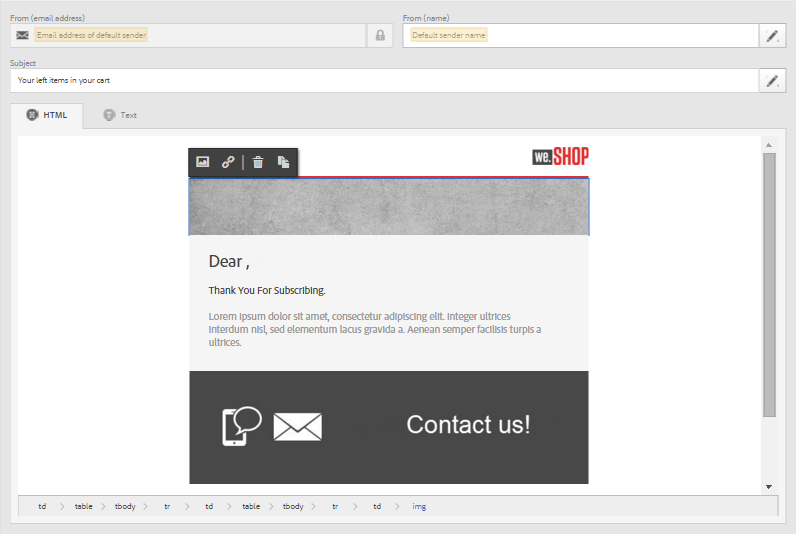
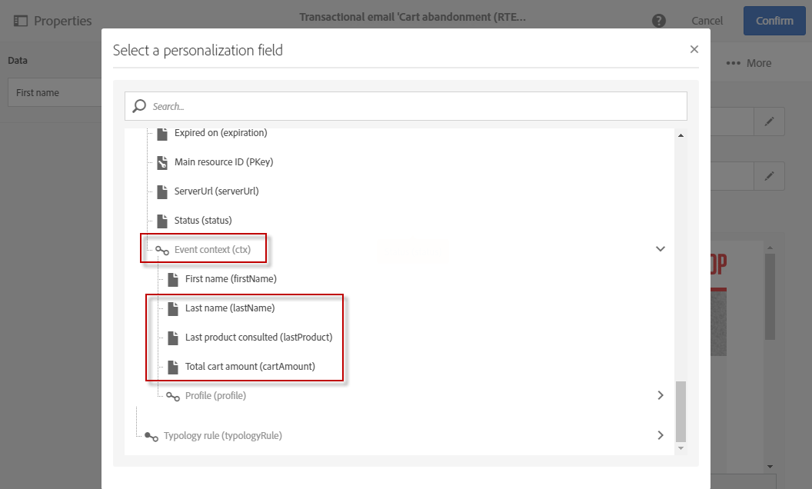

# 이벤트 트랜잭션 메시지{#event-transactional-messages}

이벤트를 타겟팅하는 이벤트 트랜잭션 메시지를 보낼 수 있습니다. 이 유형의 트랜잭션 메시지에 프로필 정보가 포함되어 있지 않습니다. 게재 대상은 이벤트 자체에 포함된 데이터로 정의됩니다.

이벤트를 만들고 게시하면( [이 섹션](../../channels/using/about-transactional-messaging.md#transactional-messaging-operating-principle)에 설명된 장바구니 포기) 해당 트랜잭션 메시지가 자동으로 만들어집니다.

구성 단계는 [트랜잭션 메시지 전송을 위한 이벤트 구성](../../administration/using/configuring-transactional-messaging.md#use-case--configuring-an-event-to-send-a-transactional-message) 섹션에 나와 있습니다.

이벤트가 트랜잭션 메시지 전송을 트리거하려면 메시지를 개인화한 다음 테스트하여 게시해야 합니다.

>[!NOTE]
>
>트랜잭션 메시지에 액세스하려면 **[!UICONTROL Administrators (all units)]** 보안 그룹의 일부여야 합니다.
>
>트랜잭션 메시지에 프로필 정보가 포함되어 있지 않으므로 피로 규칙과 호환되지 않습니다(프로필 정보가 보강된 경우도 포함). [피로 규칙](../../sending/using/fatigue-rules.md#choosing-the-channel)을 참조하십시오.

## 트랜잭션 메시지에서 테스트 프로필 정의 {#defining-a-test-profile-in-a-transactional-message}

메시지를 미리 보고 증명을 전송하여 확인할 수 있는 수정된 테스트 프로필을 정의합니다.

### 트랜잭션 메시지 내에 테스트 프로필 만들기 {#creating-a-test-profile-within-the-transactional-----------message}

1. 만든 메시지에 액세스하려면 왼쪽 상단 모서리에서 **[!UICONTROL Adobe Campaign]** 로고를 클릭한 다음 **[!UICONTROL Marketing plans]** > **[!UICONTROL Transactional messages]** > **[!UICONTROL Transactional messages]**&#x200B;을 선택합니다.

   

1. 이벤트에 연결할 테스트 프로필을 만듭니다.

   

1. **[!UICONTROL Event data used for personalization]** 섹션에서 JSON 형식으로 전송할 정보를 지정합니다. 메시지를 미리 볼 때와 테스트 프로필에서 증명를 받을 때 사용할 콘텐츠입니다.

   

   >[!NOTE]
   >
   >프로필 테이블과 관련된 정보를 입력할 수도 있습니다. [트랜잭션 메시지 콘텐츠 보강](../../administration/using/configuring-transactional-messaging.md#enriching-the-transactional-message-content)을 참조하십시오.

1. 만들어진 후에는 트랜잭션 메시지에 테스트 프로필이 미리 지정됩니다. 메시지의 **[!UICONTROL Test profiles]** 블록을 클릭하여 증명의 대상을 확인합니다.

   

### 트랜잭션 메시지 외부에 테스트 프로필 만들기 {#creating-a-test-profile-outside-the-transactional-----------message}

새 테스트 프로필을 만들거나 **[!UICONTROL Test profiles]** 메뉴에 이미 있는 테스트 프로필을 사용할 수도 있습니다.

1. 왼쪽 상단 모서리에서 **[!UICONTROL Adobe Campaign]** 로고를 클릭한 다음 **[!UICONTROL Profiles & audiences]** > **[!UICONTROL Test profiles]**&#x200B;을 선택합니다.
1. 선택한 테스트 프로필 페이지의 **[!UICONTROL Event]** 섹션에서 방금 만든 이벤트를 선택합니다. 예제에서는 &quot;장바구니 포기(EVTcartAbandonment)&quot;를 선택합니다.
1. **[!UICONTROL Event data]** 텍스트 상자에 JSON 형식으로 전송할 정보를 지정합니다.

   

1. 변경 내용을 저장합니다.

이제 만든 메시지에 액세스하고 업데이트된 테스트 프로필을 선택할 수 있습니다.

**관련 항목:**

* [테스트 프로필 관리](../../audiences/using/managing-test-profiles.md)
* [대상자 정의](../../audiences/using/creating-audiences.md)

## 트랜잭션 메시지 개인화 {#personalizing-a-transactional-message}

트랜잭션 메시지에서 개인화를 설정하려면 아래 단계를 따르십시오.

1. 메시지 제목과 콘텐츠를 수정하려면 **[!UICONTROL Content]** 블록을 클릭합니다. 예제에서는 이미지와 텍스트가 포함된 템플릿을 선택합니다. 전자 메일 콘텐츠 템플릿에 대한 자세한 내용은 [템플릿을 사용하여 디자인](../../designing/using/using-reusable-content.md#designing-templates)을 참조하십시오.

   

1. 제목을 추가하고 필요에 따라 메시지 콘텐츠를 편집합니다.

   >[참고]
   >
   >포기한 장바구니에 대한 링크는 사용자를 장바구니에 리디렉션하는 외부 URL에 대한 링크입니다. 이 매개 변수는 Adobe Campaign에서 관리되지 않습니다.

1. 예제에서는 [이벤트를 만들 때](../../administration/using/configuring-transactional-messaging.md#use-case--configuring-an-event-to-send-a-transactional-message) 정의한 이름, 마지막 제품 상담, 총 장바구니 금액의 세 가지 필드를 추가하려고 합니다. 이렇게 하려면 메시지 콘텐츠에 [개인화 필드 삽입](../../designing/using/personalization.md#inserting-a-personalization-field)을 하십시오.

1. **[!UICONTROL Context]** > **[!UICONTROL Real-time event]** > **[!UICONTROL Event context]**&#x200B;을(를) 통해 해당 필드를 찾아봅니다.

   

1. 메시지의 내용을 보강하려면 이벤트를 연결한 표에서 필드를 선택하여 필드를 추가합니다. 예제에서는 **[!UICONTROL Context]** > **[!UICONTROL Real-time event]** > **[!UICONTROL Event context]**&#x200B;을(를) 통해 **[!UICONTROL Profile]** 테이블의 **[!UICONTROL Title (salutation)]** 필드를 선택합니다.

   

1. 필요한 모든 필드를 삽입합니다.

   

1. 이 이벤트에 대해 정의한 프로필을 선택하여 메시지를 미리 봅니다.

   메시지 미리 보기 단계는 [메시지 미리 보기](../../sending/using/previewing-messages.md) 섹션에 자세히 설명되어 있습니다.

   

   개인화 필드가 테스트 프로필에 입력한 정보와 일치하는지 확인할 수 있습니다. 자세한 내용은 [트랜잭션 메시지에서 테스트 프로필 정의](#defining-a-test-profile-in-a-transactional-message)를 참조하십시오.

## 트랜잭션 메시지에서 제품 목록 사용 {#using-product-listings-in-a-transactional-message}

트랜잭션 전자 메일의 콘텐츠에서 하나 이상의 데이터 컬렉션을 참조하는 제품 목록을 만들 수 있습니다. 예를 들어 장바구니 포기 전자 메일에는 사용자가 웹 사이트를 떠날 때 사용자의 카트에 들어 있던 모든 제품 목록과 이미지, 가격 및 각 제품에 대한 링크를 포함할 수 있습니다.

>[!IMPORTANT]
>
>제품 목록은 [전자 메일 디자이너](../../designing/using/designing-content-in-adobe-campaign.md#email-designer-interface) 인터페이스를 통해 트랜잭션 전자 메일 메시지를 편집할 때만 사용할 수 있습니다.

트랜잭션 메시지에 포기된 제품 목록을 추가하려면 아래 단계를 따르십시오.

트랜잭션 전자 메일에서 제품 목록을 구성하는 데 필요한 단계를 설명하는 비디오 세트를 볼 수도 있습니다. 자세한 내용은 [이 페이지](https://docs.adobe.com/content/help/en/campaign-learn/campaign-standard-tutorials/designing-content/product-listings-in-transactional-email.html)를 참조하십시오.

>[!NOTE]
>
>Adobe Campaign은 중첩된 제품 목록을 지원하지 않습니다. 즉, 다른 제품 목록 내에 제품 목록을 포함할 수 없습니다.

### 제품 목록 정의 {#defining-a-product-listing}

트랜잭션 메시지에서 제품 목록을 사용하려면 이벤트 수준에서 표시하려는 목록의 각 제품에 대한 제품 목록과 필드를 정의해야 합니다. 자세한 내용은 [데이터 컬렉션 정의](../../administration/using/configuring-transactional-messaging.md#defining-data-collections)를 참조하십시오.

1. 트랜잭션 메시지에서 **[!UICONTROL Content]** 블록을 클릭하여 전자 메일 콘텐츠를 수정합니다.
1. 구조 구성 요소를 작업 영역으로 끌어다 놓습니다. 자세한 내용은 [전자 메일 구조 편집](../../designing/using/designing-from-scratch.md#defining-the-email-structure)을 참조하십시오.

   예를 들어 하나의 열 구조 구성 요소를 선택하고 텍스트 구성 요소, 이미지 구성 요소 및 단추 구성 요소를 추가합니다. 자세한 내용은 [조각 및 구성 요소 추가](../../designing/using/designing-from-scratch.md#defining-the-email-structure)를 참조하십시오.

1. 방금 만든 구조 구성 요소를 선택하고 상황별 도구 모음에서 **[!UICONTROL Enable product listing]** 아이콘을 클릭합니다.

   

   구조 구성 요소는 주황색 프레임으로 강조 표시되고 **[!UICONTROL Product listing]** 설정이 왼쪽 팔레트에 표시됩니다.

   

1. 다음과 같은 컬렉션의 요소가 표시되는 방식을 선택합니다.

   * **[!UICONTROL Row]**: 가로 즉, 다른 행 아래에 있는 각 요소를 의미합니다.
   * **[!UICONTROL Column]**: 세로 즉, 같은 행의 다른 요소 옆에 있는 각 요소를 의미합니다.
   >[!NOTE]
   >
   >**[!UICONTROL Column]** 옵션은 다중 열 구조 구성 요소( **[!UICONTROL 2:2 column]**, **[!UICONTROL 3:3 column]** 및 **[!UICONTROL 4:4 column]** )를 사용하는 경우에만 사용할 수 있습니다. 제품 목록을 편집할 때는 다른 열은 고려하지 않고 첫 번째 열만 채웁니다. 구조 구성 요소 선택에 대한 자세한 내용은 [전자 메일 구조 편집](../../designing/using/designing-from-scratch.md#defining-the-email-structure)을 참조하십시오.

1. 트랜잭션 메시지와 관련된 이벤트를 구성할 때 만든 데이터 컬렉션을 선택합니다. **[!UICONTROL Context]** > **[!UICONTROL Real-time event]** > **[!UICONTROL Event context]** 노드 아래에서 찾을 수 있습니다.

   

   이벤트 구성에 대한 자세한 내용은 [데이터 컬렉션 정의](../../administration/using/configuring-transactional-messaging.md#defining-data-collections)를 참조하십시오.

1. 전자 메일에 표시된 목록을 시작할 요소를 선택하려면 **[!UICONTROL First item]** 드롭다운 목록을 사용합니다.

   예를 들어 2를 선택하면 컬렉션의 첫 번째 항목이 전자 메일에 표시되지 않습니다. 제품 목록은 두 번째 항목에서 시작됩니다.

1. 목록에 표시할 최대 항목 수를 선택합니다.

   >[!NOTE]
   >
   >목록의 요소를 세로( **[!UICONTROL Column]** )로 표시하려면 선택한 구조 구성 요소(2, 3 또는 4열)에 따라 최대 항목 수가 제한됩니다. 구조 구성 요소 선택에 대한 자세한 내용은 [전자 메일 구조 편집](../../designing/using/designing-from-scratch.md#defining-the-email-structure)을 참조하십시오.

### 제품 목록 채우기 {#populating-the-product-listing}

트랜잭션 전자 메일에 연결된 이벤트에서 오는 제품 목록을 표시하려면 아래 단계를 따르십시오.

이벤트 구성 시 컬렉션 및 관련 필드 만들기에 대한 자세한 내용은 [데이터 컬렉션 정의](../../administration/using/configuring-transactional-messaging.md#defining-data-collections)를 참조하십시오.

1. 삽입한 이미지 구성 요소를 선택하고 설정 창에서 **[!UICONTROL Enable personalization]**&#x200B;을(를) 선택한 다음 연필을 클릭합니다.

   

1. 열려 있는 **[!UICONTROL Image source URL]** 창에서 **[!UICONTROL Add personalization field]**&#x200B;을 선택합니다.

   **[!UICONTROL Context]** > **[!UICONTROL Real-time event]** > **[!UICONTROL Event context]** 노드에서 만든 컬렉션에 해당하는 노드(여기서는 **[!UICONTROL Product list]**)를 열고 정의한 이미지 필드(여기서는 **[!UICONTROL Product image]** )를 선택합니다. **[!UICONTROL Save]**&#x200B;을(를) 클릭합니다.

   

   선택한 개인화 필드가 이제 설정 창에 표시됩니다.

1. 원하는 위치에서 상황별 도구 모음의 **[!UICONTROL Insert personalization field]**&#x200B;을(를) 선택합니다.

   

1. **[!UICONTROL Context]** > **[!UICONTROL Real-time event]** > **[!UICONTROL Event context]** 노드에서 만든 컬렉션에 해당하는 노드(여기서는 **[!UICONTROL Product list]**)를 열고 만든 필드(여기서는 **[!UICONTROL Product name]**)를 선택합니다. **[!UICONTROL Confirm]**&#x200B;을(를) 클릭합니다.

   

   선택한 개인화 필드가 이제 전자 메일 콘텐츠의 원하는 위치에 표시됩니다.

1. 가격을 삽입하려면 유사하게 진행합니다..
1. 텍스트를 선택하고 상황별 도구 모음에서 **[!UICONTROL Insert link]**&#x200B;를 선택합니다.

   

1. 열려 있는 **[!UICONTROL Insert link]** 창에서 **[!UICONTROL Add personalization field]**&#x200B;을(를) 선택합니다.

   **[!UICONTROL Context]** > **[!UICONTROL Real-time event]** > **[!UICONTROL Event context]** 노드에서 만든 컬렉션에 해당하는 노드(여기서는 **[!UICONTROL Product list]**)를 열고 만든 URL 필드(여기서는 **[!UICONTROL Product URL]**)를 선택합니다. **[!UICONTROL Save]**&#x200B;을(를) 클릭합니다.

   >[!IMPORTANT]
   >
   >보안상의 이유로 적합한 정적 도메인 이름으로 시작하는 링크 내에 개인화 필드를 삽입해야 합니다.

   

   선택한 개인화 필드가 이제 설정 창에 표시됩니다.

1. 제품 목록이 적용되는 구조 구성 요소를 선택하고 기본 콘텐츠를 정의하려면 **[!UICONTROL Show fallback]**&#x200B;을(를) 선택합니다.

   

1. 하나 이상의 콘텐츠 구성 요소를 끌어서 필요에 따라 편집합니다.

   

   예를 들어 고객이 장바구니에 아무것도 없는 경우, 이벤트가 트리거될 때 컬렉션이 비어 있으면 대체 콘텐츠가 표시됩니다.

1. 설정 창에서 제품 목록의 스타일을 편집합니다. 자세한 내용은 [전자 메일 스타일 편집](../../designing/using/styles.md)을 참조하십시오.
1. 관련 트랜잭션 이벤트에 연결된 컬렉션 데이터를 정의한 테스트 프로필을 사용하여 전자 메일을 미리 봅니다. 예를 들어, 사용할 테스트 프로필의 **[!UICONTROL Event data]** 섹션에 다음 정보를 추가합니다.

   

   트랜잭션 메시지에서 테스트 프로필을 정의하는 방법에 대한 자세한 내용은 [이 섹션](#defining-a-test-profile-in-a-transactional-message)을 참조하십시오.

## 트랜잭션 메시지 테스트 {#testing-a-transactional-message}

트랜잭션 메시지를 저장한 후에는 테스트하기 위한 증명을 보낼 수 있습니다.

증명 전송 단계는 [증명 전송](../../sending/using/sending-proofs.md) 섹션에 자세히 설명되어 있습니다.

## 트랜잭션 메시지 게시 {#publishing-a-transactional-message}

트랜잭션 메시지를 확인하고 나면 게시할 수 있습니다.

이제 &quot;장바구니 포기&quot; 이벤트가 트리거되는 경우, 수신자의 제목과 성, 장바구니 URL, 제품 목록이 정의되어 있다면 마지막으로 상담한 제품 또는 제품 목록, 그리고 보낼 총 장바구니 금액이 포함된 메시지를 자동으로 표시합니다.

트랜잭션 메시지에 대한 보고서에 액세스하려면 **[!UICONTROL Reports]** 버튼을 사용하십시오. [보고서](../../reporting/using/about-dynamic-reports.md)를 참조하십시오.

## 트랜잭션 메시지 게시 일시 중단 {#suspending-a-transactional-message-publication}

예를 들어 메시지에 포함된 데이터를 수정하기 위해 **[!UICONTROL Pause]** 버튼을 사용하여 트랜잭션 메시지 게시를 일시 중단할 수 있습니다. 그러면 이벤트는 더 이상 처리되지 않고 대신 Adobe Campaign 데이터베이스의 큐에 보관됩니다.

큐 이벤트는 REST API에 정의된 기간( [REST API 설명서](../../api/using/get-started-apis.md)참조) 동안이나 트리거 핵심 서비스를 사용하는 경우에는 트리거 이벤트([캠페인 및 Experience Cloud 트리거로 작업](../../integrating/using/about-adobe-experience-cloud-triggers.md) 참조) 동안 보관됩니다.

**[!UICONTROL Resume]**&#x200B;을(를) 클릭하면 큐에 있는 모든 이벤트(만료되지 않은 경우)가 처리됩니다. 템플릿 게시가 일시 중단된 동안 수행된 모든 수정 사항이 포함되어 있습니다.

## 트랜잭션 메시지 게시 취소 {#unpublishing-a-transactional-message}

**[!UICONTROL Unpublish]**&#x200B;을(를) 클릭하면 트랜잭션 메시지 게시를 취소할 수 있고 이전에 만든 이벤트에 해당하는 리소스를 REST API에서 삭제하는 해당 이벤트의 게시도 취소할 수 있습니다.

이제 웹 사이트를 통해 이벤트가 트리거되더라도 해당 메시지는 더 이상 전송되지 않고 데이터베이스에 저장되지 않습니다.

>[!NOTE]
>
>메시지를 다시 게시하려면 해당 이벤트 구성으로 돌아가 게시한 다음 메시지를 게시해야 합니다. 자세한 내용은 [트랜잭션 메시지 게시](#publishing-a-transactional-message)를 참조하십시오.

일시 중지된 트랜잭션 메시지의 게시를 취소하는 경우 다시 게시하기 전에 최대 24시간까지 기다려야 할 수 있습니다. **[!UICONTROL Database cleanup]** 워크플로우가 대기열로 전송된 모든 이벤트를 지우기 위해서 입니다.

메시지 일시 중지 단계는 [트랜잭션 메시지 게시 일시 중단](#suspending-a-transactional-message-publication) 섹션에 자세히 설명되어 있습니다.

매일 오전 4시에 실행되는 **[!UICONTROL Database cleanup]** 워크플로우는 **[!UICONTROL Administration]** > **[!UICONTROL Application settings]** > **[!UICONTROL Workflows]**&#x200B;을(를) 통해 액세스할 수 있습니다.

## 트랜잭션 메시지 삭제 {#deleting-a-transactional-message}

트랜잭션 메시지 게시가 취소되었거나 트랜잭션 메시지가 아직 게시되지 않았으면 트랜잭션 메시지 목록에서 삭제할 수 있습니다. 삭제 방법:

1. 왼쪽 상단 모서리에서 **[!UICONTROL Adobe Campaign]** 로고를 클릭한 다음 **[!UICONTROL Marketing plans]** > **[!UICONTROL Transactional messages]** > **[!UICONTROL Transactional messages]**&#x200B;을(를) 선택합니다.
1. 마우스를 원하는 메시지 위로 가져갑니다.
1. **[!UICONTROL Delete element]** 버튼을 클릭합니다.

하지만 트랜잭션 메시지를 삭제하는 것은 특정 조건에서만 수행할 수 있습니다.

* 트랜잭션 메시지에 **[!UICONTROL Draft]** 상태가 있는지 확인해야 합니다. 없다면 메시지를 삭제할 수 없습니다. **[!UICONTROL Draft]** 상태는 아직 게시되지 않았거나 [게시 취소](#unpublishing-a-transactional-message)([일시 중지](#suspending-a-transactional-message-publication)가 아님)된 메시지에적용됩니다.

* **트랜잭션 메시지**: 다른 트랜잭션 메시지가 해당 이벤트에 연결되어 있지 않는 한, 트랜잭션 메시지의 게시를 취소하는 경우, 트랜잭션 메시지를 성공적으로 삭제하려면 이벤트 구성도 게시 취소해야 합니다. 자세한 내용은 [이벤트 게시 취소](../../administration/using/configuring-transactional-messaging.md#unpublishing-an-event)를 참조하십시오.

   >[!IMPORTANT]
   >
   >이미 알림을 보낸 트랜잭션 메시지를 삭제하면 전송 및 추적 로그도 삭제됩니다.

* **기본 제공 이벤트 템플릿의 트랜잭션 메시지(내부 트랜잭션 메시지)**: 내부 트랜잭션 메시지가 해당 내부 이벤트와 연결된 유일한 메시지인 경우 삭제할 수 없습니다. 먼저 복제하거나 **[!UICONTROL Resources]** > **[!UICONTROL Templates]** > **[!UICONTROL Transactional message templates]** 메뉴를 통해 다른 트랜잭션 메시지를 만들어야 합니다.

## 트랜잭션 메시지 다시 시도 프로세스 {#transactional-message-retry-process}

일시적으로 게재되지 않는 트랜잭션 메시지는 게재가 만료될 때까지 수행되는 자동 다시 시도의 적용을 받습니다. 게재 기간에 대한 자세한 내용은 [유효 기간 매개 변수](../../administration/using/configuring-email-channel.md#validity-period-parameters)를 참조하십시오.

트랜잭션 메시지가 전송되지 않을 때, 두 개의 재시도 시스템이 있습니다.

* 트랜잭션 메시지 수준에서, 이벤트를 실행 배달에 할당하기 전에 트랜잭션 메시지가 실패할 수 있는데, 이는 이벤트 수신과 게재 준비 사이를 의미합니다. [이벤트 처리 다시 시도 프로세스](#event-processing-retry-process)를 참조하십시오.
* 전송 프로세스 수준에서 이벤트가 실행 게재로 할당되면 임시 오류로 인해 트랜잭션 메시지가 실패할 수 있습니다. [메시지 전송 다시 시도 프로세스](#message-sending-retry-process)를 참조하십시오.

### 이벤트 처리 다시 시도 프로세스 {#event-processing-retry-process}

이벤트를 실행 게재에 할당할 수 없는 경우 이벤트 처리가 연기됩니다. 그런 다음 새 실행 게재에 할당될 때까지 다시 시도가 수행됩니다.

>[!NOTE]
>
>지연된 이벤트는 아직 실행 게재에 할당되지 않았기 때문에 트랜잭션 메시지 전송 로그에 나타나지 않습니다.

예를 들어, 콘텐츠가 올바르지 않거나, 액세스 권한 또는 브랜딩에 문제가 있거나, 유형 분류 규칙 등을 적용하는 경우, 오류 발견 등으로 이벤트를 실행 게재에 할당할 수 없습니다. 이 경우 메시지를 일시 중지하고 편집하여 문제를 해결하고 다시 게시할 수 있습니다. 그러면 다시 시도 시스템이 새 실행 게재에 할당합니다.

### 메시지 전송 다시 시도 프로세스 {#message-sending-retry-process}

이벤트가 실행 게재에 할당되었다면, 예를 들어 수신자의 사서함이 가득 찬 경우에 임시 오류로 인해 트랜잭션 메시지가 실패할 수 있습니다. 자세한 내용은 [일시적 게재 실패 후 다시 시도를 참조하십시오](../../sending/using/understanding-delivery-failures.md#retries-after-a-delivery-temporary-failure).

>[!NOTE]
>
>이벤트가 실행 게재에 할당되면 오직 해당 실행 게재의 전송 로그에만 나타납니다. 실패한 게재는 트랜잭션 메시지의 **[!UICONTROL Execution list]** 탭에 표시됩니다.

### 제한 사항 {#limitations}

**로그 업데이트 전송**

다시 시도 프로세스에서는 새 실행 게재의 전송 로그가 즉시 업데이트되지 않습니다(업데이트는 예약된 워크플로우를 통해 수행됩니다). 즉, 트랜잭션 이벤트가 새 실행 게재에서 처리된 경우에도 메시지는 **[!UICONTROL Pending]** 상태일 수 있습니다.

**실행 게재 실패**

실행 게재를 중단할 수 없습니다. 하지만 현재 실행 게재가 실패할 경우 새 이벤트가 수신되는 즉시 새 이벤트가 만들어지고 모든 새 이벤트가 이 새 실행 게재로 처리됩니다. 실패한 실행 게재로 새 이벤트가 처리되지 않습니다.

이미 실행 게재에 지정된 일부 이벤트가 연기된 경우, 해당 실행 게재에 실패하면 다시 시도 시스템은 연기된 이벤트를 새 실행 게재에 할당하지 않습니다. 즉, 해당 이벤트가 손실됩니다.
