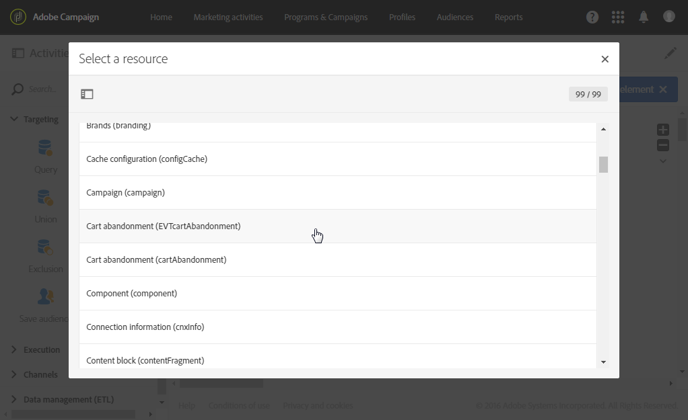

# 후속 메시지 {#follow-up-messages}

후속 메시지는 특정 트랜잭션 메시지의 받는 사람에게 다른 통신을 보내는 워크플로우에 사용할 수 있는 사전 정의된 마케팅 전달 템플릿입니다.

[트랜잭션 메시징 운영 원칙](../../channels/using/getting-started-with-transactional-msg.md#transactional-messaging-operating-principle) 섹션에 설명된 예제를 재사용하겠습니다.장바구니 포기 이메일은 장바구니에 제품을 추가했지만 해당 구매는 진행하지 않고 사이트를 떠난 웹 사이트 사용자에게 전송됩니다.

장바구니 포기 알림을 받았으나 3일 후 열지 않은 모든 고객에게 친근한 알림 메시지를 전송하려고 합니다. 첫 번째 이메일에 사용된 것과 동일한 데이터를 기반으로 후속 메시지를 받게 됩니다.

## 후속 메시지 {#configuring-an-event-to-send-a-follow-up-message}를 전송하기 위한 이벤트 구성

후속 메시지를 보내려면 먼저 이미 받은 트랜잭션 메시지에 해당하는 이벤트를 적절히 구성해야 합니다.

1. 이벤트 트랜잭션 메시지를 보내기 위해 만든 것과 동일한 이벤트 구성을 사용합니다. [트랜잭션 이벤트](../../channels/using/configuring-transactional-event.md) 구성을 참조하십시오.
1. 이벤트를 구성할 때 이벤트를 게시하기 전에 **[!UICONTROL Create follow-up delivery template for this event]** 상자를 선택합니다.

   

1. [이벤트를 미리 보고 게시합니다](../../channels/using/publishing-transactional-event.md#previewing-and-publishing-the-event).

이벤트가 게시되면 새 이벤트에 연결된 트랜잭션 메시지와 후속 전달 템플릿이 자동으로 만들어집니다. 후속 메시지를 보내는 단계는 [이 섹션](#sending-a-follow-up-message)에 자세히 설명되어 있습니다.

## 후속 메시지 액세스 {#accessing-the-follow-up-messages}

워크플로우에서 이벤트를 처리하려면 배달 템플릿이 필요합니다. 그러나 이벤트를 게시할 때는 만들어진 [트랜잭션 메시지](../../channels/using/editing-transactional-message.md)를 템플릿으로 사용할 수 없습니다. 따라서 이 이벤트 유형을 지원하고 워크플로우에서 템플릿으로 사용하도록 설계된 특정 후속 전달 템플릿을 만들어야 합니다.

이 템플릿에 액세스하려면:

1. 왼쪽 상단 모서리의 **[!UICONTROL Adobe Campaign]** 로고를 클릭합니다.
1. **[!UICONTROL Resources]** > **[!UICONTROL Templates]** > **[!UICONTROL Delivery templates]**&#x200B;를 선택합니다.
1. 왼쪽 창에서 **[!UICONTROL Follow-up messages]** 상자를 선택합니다.

   

후속 메시지만 표시됩니다.

>[!NOTE]
>
>트랜잭션 메시지에 액세스하려면 **[!UICONTROL Administrators (all units)]** 보안 그룹의 일부여야 합니다.

## 후속 메시지 전송 {#sending-a-follow-up-message}

후속 전달 템플릿을 만들면 워크플로우에서 이를 사용하여 후속 메시지를 보낼 수 있습니다.

(이미 받은 트랜잭션 메시지에 해당하는 이벤트를 대상으로 하는 워크플로우를 설정해야 합니다.)

1. 마케팅 활동 목록에 액세스하고 새 워크플로우를 만듭니다.

   [워크플로우 구축](../../automating/using/building-a-workflow.md#creating-a-workflow)을 참조하십시오.

1. **[!UICONTROL Scheduler]** 활동을 워크플로우로 드래그하여 놓고 엽니다. 실행 빈도를 하루에 한 번 설정합니다.

   스케줄러 활동은 [스케줄러](../../automating/using/scheduler.md) 섹션에 표시됩니다.

1. **[!UICONTROL Query]** 활동을 워크플로우로 드래그하여 놓고 엽니다.

   쿼리 활동은 [쿼리](../../automating/using/query.md) 섹션에 표시됩니다.

1. 프로필 리소스 이외의 리소스에서 쿼리를 실행하려면 활동의 **[!UICONTROL Properties]** 탭으로 이동하여 **[!UICONTROL Resource]** 드롭다운 목록을 클릭합니다.

   

   >[!NOTE]
   >
   >이 활동은 기본적으로 프로필을 검색하도록 사전 구성되어 있습니다.

1. 이 이벤트의 데이터만 액세스할 수 있도록 타깃팅할 이벤트를 선택합니다.

   

1. 활동의 **[!UICONTROL Target]** 탭으로 이동한 후 팔레트에서 **[!UICONTROL Delivery logs (logs)]** 요소를 작업 공간으로 드래그하여 놓습니다.

   

   **[!UICONTROL Exists]**&#x200B;을 선택하여 이메일을 받은 모든 고객을 타깃팅합니다.

   

1. 팔레트에서 작업 영역으로 **[!UICONTROL Tracking logs (tracking)]** 요소를 이동하고 **[!UICONTROL Does not exist]**&#x200B;을 선택하여 이메일을 열지 않은 모든 고객을 타깃팅합니다.

   

1. 타깃팅하는 이벤트(**이 예제의 장바구니 포기**)를 팔레트에서 작업 공간으로 드래그하여 놓습니다. 그런 다음 3일 전에 전송된 모든 메시지를 대상으로 하는 규칙을 정의합니다.

   

   즉, 워크플로우 실행 3일 전에 트랜잭션 메시지를 수신했지만 아직 열지 않은 모든 수신자가 타깃팅됩니다.

   **[!UICONTROL Confirm]**&#x200B;을 클릭하여 쿼리를 저장합니다.

1. **이메일 배달** 활동을 워크플로우로 드래그하여 놓습니다.

   이메일 배달 활동은 [이메일 배달](../../automating/using/email-delivery.md) 섹션에 표시됩니다.

   

   [SMS 배달](../../automating/using/sms-delivery.md) 또는 [푸시 알림 배달](../../automating/using/push-notification-delivery.md) 활동을 사용할 수도 있습니다. 이 경우 이벤트 구성을 만들 때 **[!UICONTROL Mobile (SMS)]** 또는 **[!UICONTROL Mobile application]** 채널을 선택해야 합니다. [이벤트 만들기](../../channels/using/configuring-transactional-event.md#creating-an-event)를 참조하십시오.

1. **이메일 배달** 활동을 엽니다. 만들기 마법사에서 **[!UICONTROL Follow-up messages]** 상자를 선택하고 이벤트를 게시한 후에 생성된 후속 전달 템플릿을 선택합니다.

   

1. 후속 메시지 내용에서 개인화 필드를 추가하여 이벤트의 콘텐츠를 활용할 수 있습니다.

   

1. **[!UICONTROL Context]** > **[!UICONTROL Real-time event]** > **[!UICONTROL Event context]**&#x200B;를 선택하여 이벤트를 만들 때 정의한 필드를 찾습니다. [트랜잭션 메시지 개인화](../../channels/using/editing-transactional-message.md#personalizing-a-transactional-message)를 참조하십시오.

   

   즉, 이벤트를 처음 보낼 때 사용한 농축된 데이터를 비롯하여 동일한 컨텐츠를 활용하여 개인화된 친숙한 미리 알림을 만들 수 있습니다.

1. 활동을 저장하고 워크플로우를 시작합니다.

워크플로우가 시작되면 3일 전에 장바구니 포기 알림을 받았지만 열지 않은 모든 고객은 동일한 데이터를 기반으로 후속 메시지를 받게 됩니다.

>[!NOTE]
>
>이벤트 구성을 만들 때 **[!UICONTROL Profile]** 타깃팅 차원을 선택한 경우 후속 메시지도 Adobe Campaign 마케팅 데이터베이스를 활용합니다. [프로필 트랜잭션 메시지](../../channels/using/editing-transactional-message.md#profile-transactional-message-specificities)를 참조하십시오.
