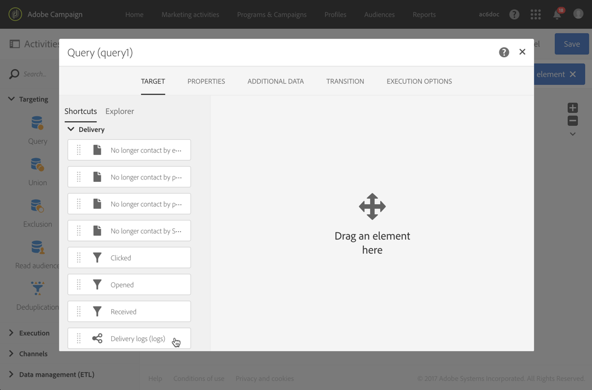

# 후속 메시지{#follow-up-messages}

특정 트랜잭션 메시지를 받은 고객에게 후속 메시지를 보낼 수 있습니다. 이렇게 하려면 해당 이벤트를 타깃팅하는 워크플로우를 설정해야 합니다.

트랜잭션 메시징 운영 원칙  섹션에 설명된 예제를 재사용해 보겠습니다.장바구니 포기 이메일은 장바구니에 제품을 추가했지만 구매한 항목을 진행하지 않고 사이트를 떠난 웹 사이트 사용자에게 전송됩니다.

장바구니 포기 알림을 받았으나 3일 후 열지 않은 모든 고객에게 친근한 알림 메시지를 전송하려고 합니다.

그런 다음, 관련된 각 고객은 첫 번째 이메일에 사용된 것과 동일한 데이터를 기반으로 후속 메시지를 받게 됩니다.

## 후속 메시지 액세스 {#accessing-the-follow-up-messages}

이벤트를 만들고 게시하면(위의 [예제에](../../channels/using/about-transactional-messaging.md#transactional-messaging-operating-principle) 따라 장바구니 포기) 해당 트랜잭션 메시지와 후속 메시지가 자동으로 생성됩니다.

구성 단계는 후속 메시지를 [보낼 이벤트 구성](../../administration/using/configuring-transactional-messaging.md#use-case--configuring-an-event-to-send-a-transactional-message) 섹션에 나와 있습니다.

워크플로우에서 이벤트를 처리하려면 배달 템플릿이 필요합니다. 그러나 이벤트를 게시할 때는 만들어진 [트랜잭션 메시지를](../../channels/using/event-transactional-messages.md) 템플릿으로 사용할 수 없습니다. 따라서 이 이벤트 유형을 지원하고 워크플로우에서 템플릿으로 사용하기 위해 고안된 특정 후속 전달 템플릿을 만들어야 합니다.

이 템플릿에 액세스하려면:

1. 왼쪽 상단 모서리에서 로고를 클릭합니다. **[!UICONTROL Adobe Campaign]**
1. &gt; **[!UICONTROL Resources]** &gt; **[!UICONTROL Templates]** &gt; **[!UICONTROL Delivery templates]**&#x200B;을 선택합니다.
1. 왼쪽 창에 있는 **[!UICONTROL Follow-up messages]** 상자를 선택합니다.

   

후속 메시지만 표시됩니다.

>[!NOTE]
>
>트랜잭션 메시지에 액세스하려면 **[!UICONTROL Administrators (all units)]** 보안 그룹의 일부여야 합니다.

## 후속 메시지 보내기 {#sending-a-follow-up-message}

후속 전달 템플릿을 만들면 워크플로우에서 이를 사용하여 후속 메시지를 보낼 수 있습니다.

1. 마케팅 활동 목록에 액세스하고 새 워크플로우를 만듭니다.

   워크플로우 [만들기를 참조하십시오](../../automating/using/building-a-workflow.md#creating-a-workflow).

1. 워크플로우에 **[!UICONTROL Scheduler]** 활동을 드래그하여 놓고 엽니다. 실행 빈도를 하루에 한 번 설정합니다.

   스케줄러 활동은 스케줄러 [섹션에](../../automating/using/scheduler.md) 표시됩니다.

1. 워크플로우에 **[!UICONTROL Query]** 활동을 드래그하여 놓고 엽니다.

   쿼리 활동은 쿼리 [섹션에](../../automating/using/query.md) 표시됩니다.

1. 프로필 리소스 이외의 리소스에서 쿼리를 실행하려면 활동의 **[!UICONTROL Properties]** 탭으로 이동하여 **[!UICONTROL Resource]** 드롭다운 목록을 클릭합니다.

   

   >[!NOTE]
   >
   >기본적으로 활동이 프로파일을 검색하도록 미리 구성됩니다.

1. 이 이벤트의 데이터만 액세스할 수 있도록 타깃팅할 이벤트를 선택합니다.

   

1. 활동의 **[!UICONTROL Target]** 탭으로 이동한 다음 **[!UICONTROL Delivery logs (logs)]** 요소를 **[!UICONTROL Email]** 섹션의 작업 영역으로 드래그하여 놓습니다.

   

   이메일을 받은 모든 고객을 타깃팅하려면 **[!UICONTROL Exists]** 선택합니다.

   

1. 팔레트에서 작업 영역으로 **[!UICONTROL Tracking logs (tracking)]** 요소를 이동하고 이메일을 열지 않은 모든 고객을 대상으로 **[!UICONTROL Does not exist]** 선택합니다.

   

1. 타깃팅하는 이벤트(이 예제의&#x200B;**장바구니 포기** )를 **[!UICONTROL Email]** 섹션에서 작업 영역으로 드래그하여 놓습니다. 그런 다음 3일 전에 전송된 모든 메시지를 대상으로 하는 규칙을 정의합니다.

   

   즉, 워크플로가 실행되기 3일 전에 트랜잭션 메시지를 수신했지만 아직 열지 않은 모든 수신자가 타깃팅됩니다.

   쿼리를 **[!UICONTROL Confirm]** 저장하려면 을 클릭합니다.

1. 이메일 전달 **활동을 워크플로우로 드래그하여 놓을** 수 있습니다.

   이메일 배달 활동은 이메일 배달 [섹션에](../../automating/using/email-delivery.md) 표시됩니다.

   

   SMS 전달 [또는 모바일 앱 전달](../../automating/using/sms-delivery.md)[활동을 사용할 수도](../../automating/using/push-notification-delivery.md) 있습니다. 이 경우 이벤트 구성을 만들 때 **[!UICONTROL Mobile (SMS)]** 또는 **[!UICONTROL Mobile application]** 채널을 선택해야 합니다. 이벤트 [만들기를](../../administration/using/configuring-transactional-messaging.md#creating-an-event)참조하십시오.

1. 이메일 **배달** 활동을 엽니다. 만들기 마법사에서 **[!UICONTROL Follow-up messages]** 상자를 선택하고 이벤트를 게시한 후 만들어진 후속 배달 템플릿을 선택합니다.

   

1. 후속 메시지 내용에서 개인화 필드를 추가하여 이벤트의 콘텐츠를 활용할 수 있습니다.

   

1. &gt; **[!UICONTROL Context]** &gt; **[!UICONTROL Real-time event]** &gt;를 선택하여 이벤트를 만들 때 정의한 필드를 **[!UICONTROL Event context]**&#x200B;찾습니다. 트랜잭션 [메시지](../../channels/using/event-transactional-messages.md#personalizing-a-transactional-message)개인화를 참조하십시오.

   

   즉, 이벤트를 처음 보낼 때 사용된 풍부한 데이터를 비롯하여 동일한 컨텐츠를 활용하여 개인화된 미리 알림을 만들 수 있습니다.

1. 활동을 저장하고 워크플로우를 시작합니다.

워크플로우가 시작되면 3일 전에 장바구니 포기 알림을 받았으나 열지 않은 모든 고객은 동일한 데이터를 기반으로 후속 메시지를 받게 됩니다.

>[!NOTE]
>
>이벤트 구성을 만들 때 타깃팅 **[!UICONTROL Profile]** 차원을 선택한 경우 후속 메시지도 Adobe Campaign 마케팅 데이터베이스를 활용합니다. See [Profile transactional messages](../../channels/using/profile-transactional-messages.md).

