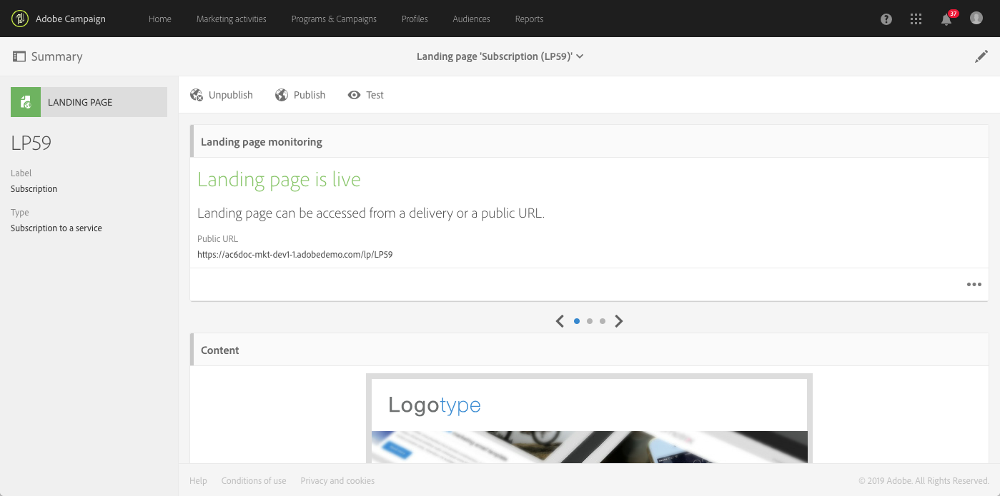

# 랜딩 페이지 시작 {#getting-started-with-landing-pages}

랜딩 페이지를 설정할 때의 주요 단계는 다음과 같습니다.

이 페이지에서는 이 단계 각각에 대한 정보를 확인할 수 있으며, 더 자세히 알아보기 위해 참조할 전용 설명서도 찾아 볼 수 있습니다.

**관련 항목:**

* [랜딩 페이지 만들기 자습서 비디오](https://docs.adobe.com/content/help/ko-KR/campaign-standard-learn/tutorials/communication-channels/landing-pages/landing-page-create-and-edit.html)
* [서비스 만들기](../../audiences/using/creating-a-service.md)
* [이중 옵트인 프로세스 설정](setting-up-a-double-opt-in-process.md)

## 랜딩 페이지 제한 사항{#landing-page-limitations}

아래 섹션에는 랜딩 페이지 설정을 시작하기 전에 알아야 하는 제한 사항 목록이 있습니다.

**데이터 쓰기 및 업데이트**

* 랜딩 페이지는 **[!UICONTROL Profile]** 및 **[!UICONTROL Subscription]** 리소스로만 제한됩니다. 레코드는 **[!UICONTROL Profile]**&#x200B;와(과) **[!UICONTROL Service]**에 대한 구독/구독 취소에서 저장 및 업데이트됩니다.
리소스 구성에 대한 자세한 내용은 [리소스의 데이터 구조 구성](../../developing/using/configuring-the-resource-s-data-structure.md)을 참조하십시오.

>[!CAUTION]
>
>랜딩 페이지는 **[!UICONTROL Profile]** 및 **[!UICONTROL Subscription]** 이외의 리소스의 데이터를 표시하거나 업데이트할 수 없습니다 .

**사전 로드**

* 랜딩 페이지는 자동으로 레코드 목록을 표시할 수 없으며 프로필이 이미 구독한 서비스를 나열할 수 없습니다. 서비스에 대한 자세한 내용은 이 [페이지](../../audiences/using/creating-a-service.md)를 참조하십시오.

* 미리 채워진 양식(데이터가 페이지에 사전 로드됨)이 있는 랜딩 페이지는 Adobe Campaign 이메일에서만 액세스할 수 있습니다. 웹사이트 페이지에서는 이러한 양식에 액세스할 수 없습니다.

**조정**

* 조정 동작은 일치가 발견되는 즉시 조정 프로세스를 중지합니다. 즉, 중복이 있는 경우 한 개의 프로필 레코드에서만 조정할 수 있으며, 여러 레코드에서는 조정할 수 없습니다.

예를 들어 다음 확보 랜딩 페이지를 프로필에 전송하여 프로필의 휴대전화 번호로 Campaign 데이터베이스를 업데이트하려고 합니다.

프로필 중 하나가 랜딩 페이지에 새로운 정보를 입력했지만 이미 중복된 프로필이 있는 경우, 일치하는 프로필 중 만든 날짜가 가장 이른 것이 업데이트됩니다. 프로필은 만든 날짜에 따라서만 우선 순위가 매겨지기 때문입니다.

여기서는 가장 오래된 항목이므로 첫 번째 프로필만 업데이트됩니다.

**랜딩 페이지 테스트**

* 랜딩 페이지는 프로필에서만 작동하며 테스트 프로필에 대해서는 작동하지 않습니다. 즉, 랜딩 페이지는 이메일 증명의 일부로 테스트할 수 없습니다.

## 1단계 - 랜딩 페이지 템플릿 구성 {#configure-the-landing-page-template}

랜딩 페이지를 설정하기에 앞서, 첫 번째 단계는 필요에 맞는 랜딩 페이지 템플릿을 구성하는 것입니다. 템플릿을 준비하고 나면 이를 기반으로 하는 모든 랜딩 페이지가 원하는 매개 변수로 사전 구성됩니다.

1. 고급 메뉴에서 Adobe Campaign 로고를 통해 **[!UICONTROL Resources]**/**[!UICONTROL Templates]**/**[!UICONTROL Landing page templates]**&#x200B;을(를) 선택한 다음 사용할 템플릿을 복제합니다.
1. 템플릿 속성에서 랜딩 페이지에 공통으로 포함해야 하는 매개 변수를 모두 지정합니다. 예를 들면 타겟팅 차원, 식별되거나 식별되지 않는 방문자에 대한 페이지 액세스 매개 변수, 방문자에 의한 양식 유효성 검사에 대한 특정 작업, 콘텐츠에 사용할 브랜드/로고 등이 있습니다. 랜딩 페이지 속성에 대한 자세한 정보는 [이 섹션](../../channels/using/configuring-landing-page.md)을 참조하십시오.
1. 수정 사항을 저장합니다.

랜딩 페이지 템플릿에 대한 자세한 정보는 [이 섹션](../../channels/using/getting-started-with-landing-pages.md)을 참조하십시오.

## 2단계 - 랜딩 페이지 만들기 및 구성 {#create-and-configure-the-landing-page}

앞의 단계에서 정의한 템플릿에서 프로그램 또는 캠페인에 새 랜딩 페이지를 만듭니다.

1. 원하는 템플릿을 기반으로 랜딩 페이지를 만듭니다.
1. 랜딩 페이지의 일반적인 매개 변수(레이블, 설명 등)를 입력합니다.
1. 그 다음 랜딩 페이지 대시보드에 액세스합니다. 필요한 경우 랜딩 페이지 속성을 편집합니다([랜딩 페이지 구성](../../channels/using/configuring-landing-page.md) 참조). 속성은 기본적으로 랜딩 페이지 템플릿에서 구성한 대로 설정되어 있습니다.
보안 및 플랫폼 성능을 위하여 랜딩 페이지 속성에 만료 날짜를 설정하기를 강력히 추천합니다. 이를 완료하면 선택한 날짜에 랜딩 페이지의 게시가 자동으로 취소됩니다. 유효성 매개 변수에 대한 자세한 정보는 [이 섹션](../../channels/using/testing-publishing-landing-page.md#setting-up-validity-parameters)을 참조하십시오.

   

>[!NOTE]
>
>수정 사항은 편집 중인 랜딩 페이지에만 적용됩니다. 이 수정 사항을 다른 랜딩 페이지에도 적용하려면 전용 템플릿에서 수정한 다음 해당 템플릿에서 다른 랜딩 페이지를 만들면 됩니다.

## 3단계 - 랜딩 페이지 디자인 {#design-the-landing-page}

이제 랜딩 페이지의 콘텐츠를 정의할 수 있습니다. 랜딩 페이지에는 기본적으로 메인 콘텐츠 페이지, 확인 페이지, 오류 페이지의 세 페이지가 포함되며, 스크롤 화살표를 통해 액세스할 수 있습니다. 

각 페이지에는 기본적으로 여러 필드가 구성되어 있습니다. 필요한 경우 속성 및 매핑을 편집할 수 있습니다.

또한 프로필이 클릭되면 확인 버튼이 작동하는 방식으로 구성하고 필요에 따라 콘텐츠(이미지, 개인화 필드 등)를 개인화할 수 있습니다. 예를 들어 등록에 대한 감사를 표하기 위해 랜딩 페이지의 확인 페이지에 프로필의 이름을 삽입할 수 있습니다.

랜딩 페이지 디자인에 대한 자세한 정보는 [이 섹션](../../channels/using/designing-a-landing-page.md)을 참조하십시오.

## 4단계 - 랜딩 페이지 테스트 {#test-the-landing-page}

랜딩 페이지를 정의하고 나면 해당 페이지를 온라인에서 사용할 수 있을 때의 실행 및 동작 방식을 시뮬레이션할 수 있습니다.

>[!CAUTION]
>
>랜딩 페이지 테스트는 프로필로만 수행할 수 있습니다. 테스트 프로필로는 수행할 수 없습니다. 양식이 제출되면 선택한 프로필의 데이터가 실제로 업데이트됩니다. 실제 프로필을 수정하지 않으려면 가짜 고객 프로필을 사용하십시오.

랜딩 페이지의 동작 방식이 마음에 들면 이를 게시하여 온라인으로 사용 가능하게 할 수 있습니다.

랜딩 페이지를 테스트하는 방법에 대한 자세한 내용은 [이 섹션](../../channels/using/testing-publishing-landing-page.md#testing-the-landing-page-)을 참조하십시오.

## 5단계 - 랜딩 페이지 게시 {#publish-the-landing-page}

테스트가 성공하면 대시보드의 작업 표시줄에 있는 **[!UICONTROL Publish]** 버튼을 사용하여 랜딩 페이지를 게시할 수 있습니다. 모니터링 블록에 게시의 진행 상황과 상태가 표시됩니다.

랜딩 페이지를 게시하면 온라인에서 액세스할 수 있습니다. 게시 후 언제든지 업데이트할 수 있습니다. 매번 수정할 때마다 다시 게시해야 합니다. 언제든지 랜딩 페이지를 게시 취소하여 더 이상 사용할 수 없도록 만들 수도 있습니다.

게시되면 랜딩 페이지를 사용할 수 있습니다. 그런 다음에는 데이터베이스에서 새로운 프로필을 획득하거나 기존 프로필에 대한 추가 정보를 얻기 위해 액세스할 수 있는 다양한 매커니즘을 배치할 수도 있습니다.

랜딩 페이지 게시에 대한 자세한 정보는 [이 섹션](../../channels/using/testing-publishing-landing-page.md#publishing-a-landing-page)을 참조하십시오.
