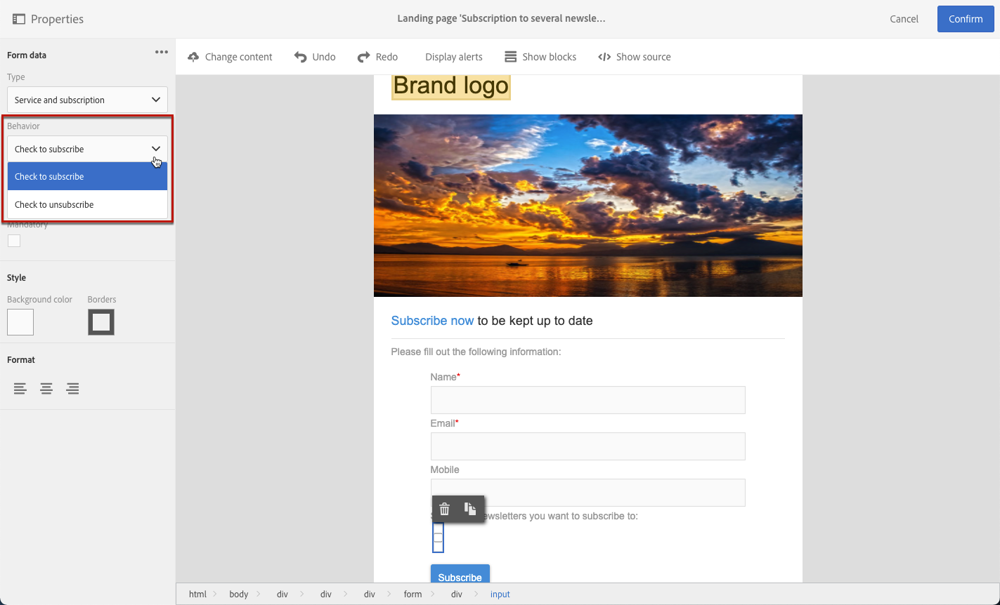

# 랜딩 페이지 양식 데이터 관리{#managing-landing-page-form-data}

랜딩 페이지 콘텐츠에서 입력 필드는 Campaign 데이터베이스의 데이터를 저장하거나 업데이트하는 데 사용됩니다.

이렇게 하려면 이러한 필드를 데이터베이스 필드에 매핑해야 합니다.

다음을 통해 매핑을 정의하고 관리할 수 있습니다. **[!UICONTROL Form data]** 왼쪽 팔레트에 있는 섹션입니다.

## 양식 필드 매핑 {#mapping-form-fields}

필요에 따라 Campaign 데이터베이스를 업데이트하려면 관련 데이터베이스 필드를 랜딩 페이지의 입력 영역, 라디오 버튼 또는 확인란 유형 블록에 연결합니다.

이렇게 하려면 아래 단계를 수행합니다:

1. 랜딩 페이지 콘텐츠에서 블록을 선택합니다.

   >[!NOTE]
   >
   >기본 제공 랜딩 페이지의 기본 필드는 사전 구성되어 있습니다. 필요에 따라 수정할 수 있습니다.

1. 액세스 **[!UICONTROL Form data]** 왼쪽 팔레트에 있는 섹션입니다.

1. 필드 유형을 변경하려면 **[!UICONTROL HTML type of the field]** 드롭다운 목록입니다.

   

   >[!NOTE]
   >
   >랜딩 페이지에서 확인란 유형을 사용하는 방법에 대한 자세한 내용은 [여러 서비스 구독 업데이트](#multiple-subscriptions) 및 [계약 확인란](#agreement-checkbox) 섹션.

1. 에서 현재 선택한 데이터베이스 필드와 호환되지 않는 필드 유형을 선택한 경우 **[!UICONTROL Field]** 영역에 경고 메시지가 표시됩니다. 최적의 매핑을 위해 적절한 값을 선택합니다.

   

1. 사용 **[!UICONTROL Field]** 양식 필드에 연결할 데이터베이스 필드를 선택할 영역입니다.

   

   >[!NOTE]
   >
   >랜딩 페이지는 **[!UICONTROL Profiles]** 또는 **[!UICONTROL Service]** 리소스.

   이 예에서는 를 매핑합니다 **이름** 랜딩 페이지의 필드 **[!UICONTROL Last name]** 필드 **[!UICONTROL Profiles]** 리소스.

   

1. 필요한 경우 **[!UICONTROL Mandatory]** 옵션을 선택합니다. 이 경우 랜딩 페이지는 사용자가 이 필드를 입력한 경우에만 제출할 수 있습니다.

   

   필수 필드를 입력하지 않으면 사용자가 페이지를 제출할 때 오류 메시지가 표시됩니다.

1. 클릭 **[!UICONTROL Confirm]** 변경 사항을 저장합니다.

<!--If you choose a mandatory **[!UICONTROL Checkbox]**, make sure that it is of **[!UICONTROL Field]** type.-->

## 데이터 저장 및 조정{#data-storage-and-reconciliation}

데이터 조정 매개 변수를 사용하면 사용자가 데이터를 제출한 후 랜딩 페이지에 입력된 데이터를 관리하는 방식을 정의할 수 있습니다.

방법은 다음과 같습니다.

1. 랜딩 페이지 대시보드의  아이콘을 통해 액세스되는 랜딩 페이지 속성을 편집하고 **[!UICONTROL Job]** 매개 변수를 표시합니다.

   

1. 다음 항목 선택 **[!UICONTROL Reconciliation key]**: 이 데이터베이스 필드는 방문자의 프로필이 이미 Adobe Campaign 데이터베이스에 있는지 여부를 확인하는 데 사용됩니다. 예를 들어 이메일, 이름, 성이 될 수 있습니다. 조정 키를 사용하면 다음 내용에 따라 프로필을 업데이트하거나 만들 수 있습니다. **[!UICONTROL Update strategy]** 아래에 정의된 매개 변수입니다.

1. **[!UICONTROL Form parameter mapping]**&#x200B;을(를) 정의합니다. 이 섹션에서는 랜딩 페이지 필드 매개 변수와 조정 키에 사용되는 매개 변수를 매핑할 수 있습니다.

1. 다음 항목 선택 **[!UICONTROL Update strategy]**: 조정 키가 기존 데이터베이스 프로필을 복구하는 경우, 양식에 입력한 데이터로 해당 프로필을 업데이트하거나 업데이트하지 못하도록 선택할 수 있습니다.

   

## 여러 서비스 구독 {#multiple-subscriptions}

단일 랜딩 페이지에서 여러 확인란을 사용하여 사용자가 여러 서비스를 구독하거나 구독 취소할 수 있습니다.

이렇게 하려면 아래 단계를 수행합니다:

1. 랜딩 페이지를 디자인할 때:

   * 블록을 선택하고 **[!UICONTROL Form data]** 섹션, 선택 **[!UICONTROL Checkbox]** 을(를) 필드 유형으로 사용하십시오.

      

   * HTML에 익숙한 경우 **[!UICONTROL Show source]** 단추를 클릭합니다.

      

      이렇게 하면 페이지에서 편리한 위치에 확인란을 삽입할 수 있습니다.

      

1. 콘텐츠에서 확인란이 선택되어 있는지 확인합니다. 다음 **[!UICONTROL Type]** 드롭다운 목록이에 표시됩니다. **[!UICONTROL Form data]** 왼쪽 팔레트의 섹션입니다. 선택 **[!UICONTROL Service and subscription]** 목록에서 삭제할 수 있습니다.

   

1. 다음에서 옵션을 선택합니다. **[!UICONTROL Behavior]** 드롭다운 목록입니다.

   

1. 선택 [서비스](../../audiences/using/creating-a-service.md) 을 클릭합니다.

   

1. 다음을 확인합니다. **[!UICONTROL Mandatory]** 이 옵션은 선택 취소되어 있습니다. 그렇지 않으면 사용자는 선택할 수 없습니다.

   

1. 다른 서비스에 가입할 수 있는 확인란을 더 추가하려면 위의 단계를 필요한 횟수만큼 반복하십시오.

   

랜딩 페이지가 게시되면 사용자는 여러 확인란을 선택하여 동일한 페이지에서 여러 뉴스레터를 구독할 수 있습니다.

## 계약 확인란 {#agreement-checkbox}

랜딩 페이지를 제출하기 전에 프로필에서 확인해야 하는 확인란을 추가할 수 있습니다.

예를 들어 양식을 제출하기 전에 개인정보 처리방침에 대한 사용자의 동의를 요청하거나 약관에 동의하도록 할 수 있습니다.

>[!IMPORTANT]
>
>이 확인란은 사용자가 선택해야 합니다. 선택하지 않으면 랜딩 페이지를 제출할 수 없습니다.

이 확인란을 삽입하고 구성하려면 다음 작업을 수행하십시오.

1. 랜딩 페이지를 디자인할 때:

   * 블록을 선택하고 **[!UICONTROL Form data]** 섹션, 선택 **[!UICONTROL Checkbox]** 을(를) 필드 유형으로 사용하십시오.

      

   * HTML에 익숙한 경우 **[!UICONTROL Show source]** 단추를 클릭합니다.

      

      <!--Manually insert a checkbox, such as in the example below:

      <!--Click **[!UICONTROL Hide source]**.-->

1. 확인란을 선택해야 합니다.

   

1. 다음 **[!UICONTROL Type]** 드롭다운 목록이에 표시됩니다. **[!UICONTROL Form data]** 왼쪽 팔레트의 섹션입니다. 선택 **[!UICONTROL Agreement]** 목록에서 삭제할 수 있습니다.

   

   >[!NOTE]
   >
   >다음 **[!UICONTROL Agreement]** 요소가 Campaign 데이터베이스의 필드에 매핑되지 않았습니다.

1. 다음을 클릭합니다.  아이콘 옆에 있음 **[!UICONTROL Form data]** 확인란의 고급 속성에 액세스합니다.

1. 필요한 경우 메시지를 편집할 수 있습니다.

   

   사용자가 양식을 제출하기 전에 확인란을 선택하지 않으면 이 텍스트가 경고로 표시됩니다.

   >[!NOTE]
   >
   >이 작업은 기본적으로 필수이며 변경할 수 없습니다.

1. **[!UICONTROL Confirm]**&#x200B;를 클릭합니다.

이제 랜딩 페이지가 표시될 때마다 양식을 제출하기 전에 이 확인란을 선택해야 합니다. 이 확인란을 활성화하지 않으면 경고가 표시되고 사용자가 양식을 제출할 수 없습니다.