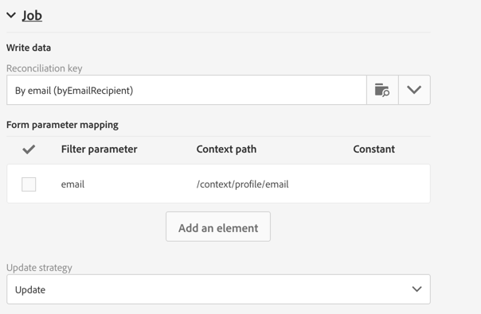

# 랜딩 페이지 양식 데이터 관리{#managing-landing-page-form-data}

## 랜딩 페이지 양식 데이터 속성 변경{#changing-a-landing-page-form-data-properties}

데이터베이스 필드를 입력 영역, 라디오 버튼 또는 체크박스 유형 블록에 연결할 수 있습니다. 이렇게 하려면 블록을 선택하고 팔레트에 **[!UICONTROL Form data]**&#x200B;을(를) 입력합니다.

* **필드** 입력 영역을 사용하면 양식 필드에 연결할 데이터베이스 필드를 선택할 수 있습니다.
* **필수** 옵션을 사용하면 사용자가 해당 필드를 입력한 경우에만 페이지의 제출을 승인하도록 할 수 있습니다. 필수 필드를 입력하지 않은 경우 오류 메시지가 표시됩니다.

## 양식 필드 매핑 {#mapping-form-fields}

입력 필드는 Campaign 데이터베이스에 데이터를 저장하거나 업데이트하는 데 사용됩니다. 이 경우 데이터베이스 필드를 입력 영역, 라디오 버튼 또는 체크박스 유형 블록과 연결해야 합니다. 방법은 다음과 같습니다.

1. 랜딩 페이지에서 블록을 선택합니다.
1. 팔레트의 **[!UICONTROL Form data]** 부분을 기입합니다.

   

1. **[!UICONTROL Field]** 선택 영역의 양식 필드에 연결할 데이터베이스 필드를 선택합니다. 랜딩 페이지는 **프로필**&#x200B;로만 매핑할 수 있습니다.

1. 필요한 경우 **[!UICONTROL Mandatory]** 옵션을 선택합니다. 사용자는 해당 필드를 기입해야 페이지를 제출할 수 있습니다. 필수 필드를 기입하지 않은 경우 사용자가 페이지의 유효성을 확인할 때 오류 메시지가 표시됩니다.

1. **[!UICONTROL HTML type of the field]** 선택 영역에서 **[!UICONTROL Text]**, **[!UICONTROL Number]** 또는 **[!UICONTROL Date]** 등을 선택하여 필드 유형을 정의합니다.
필수 **[!UICONTROL Checkbox]**&#x200B;을(를) 선택하는 경우, **[!UICONTROL Field]** 유형이 맞는지 확인합니다.

>[!NOTE]
>
>기본 제공 랜딩 페이지의 기본 필드는 사전 구성되어 있습니다. 필요에 따라 수정할 수 있습니다.

## 데이터 저장 및 조정{#data-storage-and-reconciliation}

데이터 조정 매개 변수를 사용하면 사용자가 데이터를 제출한 후 랜딩 페이지에 입력된 데이터를 관리하는 방식을 정의할 수 있습니다.

방법은 다음과 같습니다.

1. 랜딩 페이지 대시보드의  아이콘을 통해 액세스되는 랜딩 페이지 속성을 편집하고 **[!UICONTROL Job]** 매개 변수를 표시합니다.

   

1. **[!UICONTROL Reconciliation key]**&#x200B;을(를) 선택합니다. 이러한 데이터베이스 필드(예: 이메일, 이름, 성)는 방문자의 프로필이 이미 Adobe Campaign 데이터베이스에 있는지 여부를 확인하는 데 사용됩니다. 이를 통해 정의한 업데이트 전략 매개 변수에 따라 프로필을 업데이트하거나 만들 수 있습니다.
1. **[!UICONTROL Form parameter mapping]**&#x200B;을(를) 정의합니다. 이 섹션에서는 랜딩 페이지 필드 매개 변수와 조정 키에 사용되는 매개 변수를 매핑할 수 있습니다.
1. **[!UICONTROL Update strategy]**&#x200B;을(를) 선택합니다. 조정 키를 통해 기존 데이터베이스 프로필을 복구하는 경우, 양식에 입력한 데이터로 해당 프로필을 업데이트하거나 업데이트하지 못하도록 선택할 수 있습니다.
