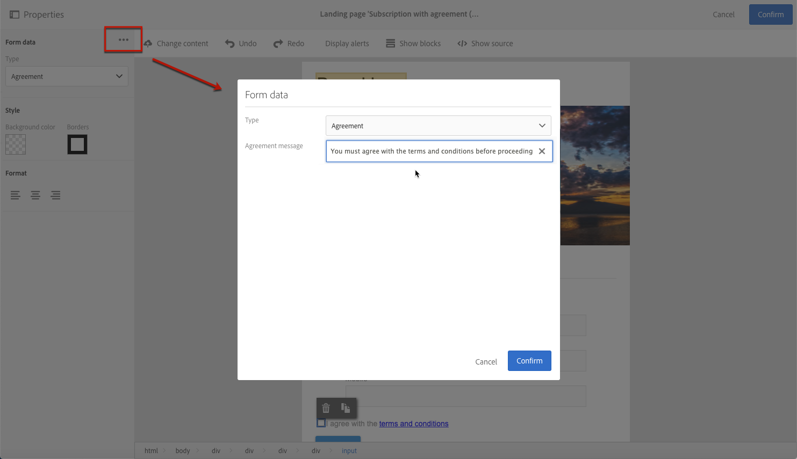

# 랜딩 페이지 양식 데이터 관리{#managing-landing-page-form-data}

## 랜딩 페이지 양식 데이터 속성 변경{#changing-a-landing-page-form-data-properties}

데이터베이스 필드를 입력 영역, 라디오 버튼 또는 체크박스 유형 블록에 연결할 수 있습니다. 이렇게 하려면 블록을 선택하고 팔레트에서 **[!UICONTROL Form data]**&#x200B;에 액세스합니다.

* **필드** 입력 영역을 사용하면 양식 필드에 연결할 데이터베이스 필드를 선택할 수 있습니다.
* **필수** 옵션을 사용하면 사용자가 해당 필드를 입력한 경우에만 페이지의 제출을 승인하도록 할 수 있습니다. 필수 필드를 입력하지 않은 경우 오류 메시지가 표시됩니다.

## 양식 필드 매핑 {#mapping-form-fields}

입력 필드는 Campaign 데이터베이스에 데이터를 저장하거나 업데이트하는 데 사용됩니다. 이 경우 데이터베이스 필드를 입력 영역, 라디오 버튼 또는 체크박스 유형 블록과 연결해야 합니다. 방법은 다음과 같습니다.

1. 랜딩 페이지에서 블록을 선택합니다.
1. 팔레트의 **[!UICONTROL Form data]** 부분을 기입합니다.

   

1. **[!UICONTROL Field]** 선택 영역의 양식 필드에 연결할 데이터베이스 필드를 선택합니다. 랜딩 페이지는 **프로필**&#x200B;로만 매핑할 수 있습니다.

1. 필요한 경우 **[!UICONTROL Mandatory]** 옵션을 선택합니다. 사용자는 해당 필드를 기입해야 페이지를 제출할 수 있습니다. 필수 필드를 기입하지 않은 경우 사용자가 페이지의 유효성을 확인할 때 오류 메시지가 표시됩니다.

1. **[!UICONTROL HTML type of the field]** 선택 영역에서 **[!UICONTROL Text]**, **[!UICONTROL Number]** 또는 **[!UICONTROL Date]** 등을 선택하여 필드 유형을 정의합니다.
필수 **[!UICONTROL Checkbox]**&#x200B;을(를) 선택하는 경우, **[!UICONTROL Field]** 유형이 맞는지 확인합니다.

>[!NOTE]
>
>기본 제공 랜딩 페이지의 기본 필드는 사전 구성되어 있습니다. 필요에 따라 수정할 수 있습니다.

## 데이터 저장 및 조정{#data-storage-and-reconciliation}

데이터 조정 매개 변수를 사용하면 사용자가 데이터를 제출한 후 랜딩 페이지에 입력된 데이터를 관리하는 방식을 정의할 수 있습니다.

방법은 다음과 같습니다.

1. 랜딩 페이지 대시보드의  아이콘을 통해 액세스되는 랜딩 페이지 속성을 편집하고 **[!UICONTROL Job]** 매개 변수를 표시합니다.

   

1. **[!UICONTROL Reconciliation key]**&#x200B;을(를) 선택합니다. 이러한 데이터베이스 필드(예: 이메일, 이름, 성)는 방문자의 프로필이 이미 Adobe Campaign 데이터베이스에 있는지 여부를 확인하는 데 사용됩니다. 이를 통해 정의한 업데이트 전략 매개 변수에 따라 프로필을 업데이트하거나 만들 수 있습니다.
1. **[!UICONTROL Form parameter mapping]**&#x200B;을(를) 정의합니다. 이 섹션에서는 랜딩 페이지 필드 매개 변수와 조정 키에 사용되는 매개 변수를 매핑할 수 있습니다.
1. **[!UICONTROL Update strategy]**&#x200B;을(를) 선택합니다. 조정 키를 통해 기존 데이터베이스 프로필을 복구하는 경우, 양식에 입력한 데이터로 해당 프로필을 업데이트하거나 업데이트하지 못하도록 선택할 수 있습니다.

## 계약 확인란 {#agreement-checkbox}

랜딩 페이지를 제출하기 전에 프로필에서 확인해야 하는 확인란을 추가할 수 있습니다.

예를 들어 양식을 제출하기 전에 사용자의 개인정보 보호정책에 대한 동의를 요청하거나 사용자 약관에 동의하도록 할 수 있습니다.

<!--This is particularly useful in the following case:

When a profile opens the landing page from an Outlook.com mailbox, Outlook checks whether the links on the landing page are suspicious. However, this Outlook security feature (called safelinks) has an unwanted effect: it automatically activates the buttons included on the landing page. Consequently, profiles are automatically subscribed or unsubscribed without confirmation when the landing page is displayed after clicking the email link, even if they do not submit the form.

To avoid this, Adobe recommends you always add to your landing page a checkbox which enables the profile to agree before proceeding with subscription or unsubscription.-->

>[!IMPORTANT]
>
>이 확인란을 선택하는 것은 사용자의 경우 필수입니다. 선택하지 않으면 랜딩 페이지를 제출할 수 없습니다.

이 확인란을 삽입 및 구성하려면 다음을 수행합니다.

1. 랜딩 페이지를 디자인할 때 **[!UICONTROL Show source]** 을 클릭합니다.

   

1. 아래 예와 같이 확인란을 수동으로 삽입합니다.

   

   <!--
   
<input type="checkbox" class="nl-dce-todo" data-nl-bindto="agreement" data-nl-agreementmsg="You must agree with the terms and conditions before proceeding" />I agree with the terms and conditions

   -->

1. **[!UICONTROL Hide source]**&#x200B;를 클릭합니다.

1. 새 확인란이 표시됩니다. 선택합니다.

   

1. 해당 드롭다운 목록이 팔레트의 **[!UICONTROL Form data]** 섹션에 표시됩니다. 목록에서 **[!UICONTROL Agreement]** 을 선택합니다.

   

   >[!NOTE]
   >
   >**[!UICONTROL Agreement]** 요소가 Campaign 데이터베이스의 필드에 매핑되지 않았습니다.

1. **[!UICONTROL Form data]** 옆의  아이콘을 클릭하여 확인란 고급 속성에 액세스합니다.

1. 필요한 경우 메시지를 편집할 수 있습니다.

   

   사용자가 양식을 제출하기 전에 확인란을 선택하지 않으면 이 텍스트가 경고로 표시됩니다.

   >[!NOTE]
   >
   >이 작업은 기본적으로 필수이며 변경할 수 없습니다.

1. **[!UICONTROL Confirm]**&#x200B;를 클릭합니다.

이제 랜딩 페이지가 표시될 때마다 사용자는 양식을 제출하기 전에 이 확인란을 선택해야 합니다. 그렇지 않으면 경고가 표시되고 확인란이 활성화될 때까지 사용자는 양식을 제출할 수 없습니다.