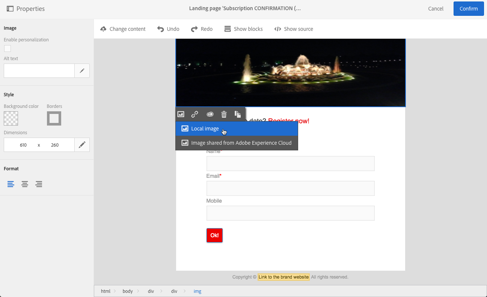

# 랜딩 페이지 구조 및 스타일 관리{#managing-landing-page-structure-and-style}

## 컨텐츠 편집기에서 블록 관리 {#managing-blocks-in-the-content-editor}

다른 HTML 컨텐츠 요소는 랜딩 페이지에 **&lt;div&gt;** **&lt;/div&gt;** 태그에 해당하는 블록으로 표시됩니다.

상호 작용할 블록을 선택합니다. 그러면 파란색 상자로 둘러싸일 것입니다.

블록을 선택하면 해당 HTML 요소의 상위 개체가 편집 영역의 아래쪽에 있는 탐색 표시에 표시됩니다.

마우스가 탐색 표시 요소 중 하나를 가리키면 관련 요소가 강조 표시됩니다. 따라서 서로 다른 블록 사이를 쉽게 이동하고 수정할 HTML 요소를 정확하게 선택할 수 있습니다.

팔레트 및 컨텍스트 도구 모음의 옵션을 사용하여 블록을 수정, 삭제 또는 복제할 수 있습니다.

텍스트가 포함된 블록의 경우 블록에서 다시 클릭하여 텍스트 편집 모드를 활성화합니다. 블록 주위의 프레임은 녹색으로 바뀝니다. 그런 다음 텍스트를 선택하거나 입력할 수 있습니다. 팔레트 및 컨텍스트 도구 모음의 옵션을 사용하여 링크를 추가하거나 텍스트 서식을 수정합니다.

블록의 요소에 대해 정의된 매개 변수(링크, 개인화 필드, 컨텐츠 블록 등) 팔레트에서 언제든지 수정할 수 있습니다.

## 컨텐츠 편집기에서 테두리 및 배경 추가 {#adding-a-border-and-a-background-in-the-content-editor}

차트에서 색상을 선택하여 **배경색을** 정의할 수도 있습니다. 이 색상은 선택한 블록에 적용됩니다.

선택한 블록에 **테두리를** 추가할 수 있습니다.

## 컨텐츠 편집기에서 텍스트 스타일 변경 {#changing-the-text-style-in-the-content-editor}

텍스트 스타일을 변경하려면 텍스트 블록 내부를 클릭해야 합니다.

텍스트 정렬을 변경하려면 왼쪽의 팔레트에서 다음 세 가지 아이콘 중 하나를 선택합니다.

* **왼쪽**&#x200B;정렬:선택한 블록의 왼쪽에 텍스트를 정렬합니다(style="text-align:left;").
* **가운데**:선택한 블록의 텍스트 가운데 맞춤(style="text-align 추가:center;").
* **오른쪽**&#x200B;정렬:선택한 블록의 오른쪽에 텍스트를 정렬합니다(style="text-align:right;").

도구 모음을 사용하여 글꼴 속성을 변경할 수도 있습니다.글꼴 크기를 조정하고, 텍스트를 굵게 또는 기울임꼴로 만들거나, 텍스트에 밑줄 또는 색상 변경을 적용할 수 있습니다. 이 [섹션을](../../channels/using/landing-page-content-editor-interface.md#landing-page-editor-toolbar)참조하십시오.

## 랜딩 페이지에 이미지 삽입 {#inserting-images-in-a-landing-page}

1. 랜딩 페이지 내용에서 이미지가 포함된 블록을 선택합니다.
1. 단추를 **[!UICONTROL Insert]** 선택합니다.

   

1. 상황에 맞는 툴바에서 **[!UICONTROL Local image]** 선택할 수 있습니다.

   

1. 파일을 선택합니다.

   

1. 필요에 따라 이미지 속성을 조정합니다.

   
