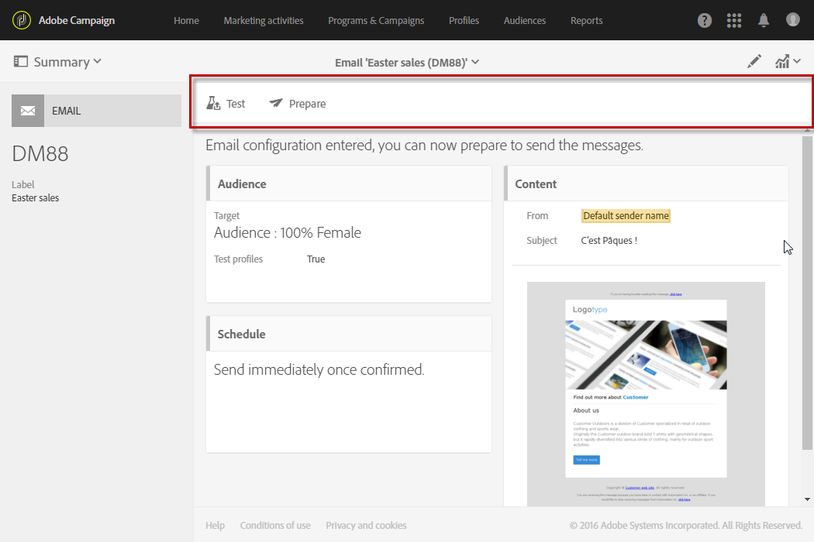

# 메시지 대시보드{#message-dashboard}

메시지 대시보드는 메시지의 매개 변수를 설정하고 전송할 수 있도록 작업 막대로 다시 그룹화된 다양한 기능 블록과 같은 여러 아이콘으로 구성된 작업 공간입니다. 이러한 요소는 향후 제공됩니다.

## 회색 막대 {#gray-bar}

회색 막대는 메시지에 연결된 다양한 아이콘을 다시 그룹화합니다.

* **[!UICONTROL Summary]**:메시지에 대한 기본 정보를 표시하거나 숨깁니다.
* **[!UICONTROL Edit properties]**:메시지의 [고급 매개 변수를](../../administration/using/configuring-email-channel.md#list-of-email-properties)편집할 수 있습니다.
* **[!UICONTROL Reports]**:는 메시지와 관련된 보고서에 대한 액세스 권한을 제공합니다.

**관련 항목:**

* [채널 구성](../../administration/using/about-channel-configuration.md)
* [보고서 액세스](../../reporting/using/about-dynamic-reports.md)

## 작업 표시줄 {#action-bar}

작업 표시줄에는 메시지와 상호 작용할 수 있는 다른 아이콘이 있습니다.

설정된 매개 변수와 진행 상태에 따라 특정 아이콘을 사용할 수 없습니다.

* **[!UICONTROL Show proofs]**:전송된 증명 목록이 있는 경우 표시/숨기기 이 단추는 교정본을 보낸 후에만 활성화됩니다.

   교정쇄에 대한 자세한 내용은 테스트 [프로파일 관리 및 증명](../../sending/using/managing-test-profiles-and-sending-proofs.md)전송을 참조하십시오.

* **[!UICONTROL Send a test]**:사용할 승인 모드를 선택할 수 있습니다.이메일에 **[!UICONTROL Email rendering]**&#x200B;대해 **[!UICONTROL Proof]** 또는 두 가지 모두를 제공합니다. 테스트 프로파일에 대한 자세한 내용은 증명 [보내기를](../../sending/using/managing-test-profiles-and-sending-proofs.md#sending-proofs)참조하십시오.

   이 단추는 테스트 프로필을 설정한 후에만 활성화됩니다.

   >[!NOTE]
   >
   >SMS 메시지의 경우 다른 방법이 없습니다.자동으로 **[!UICONTROL Proof]**&#x200B;표시됩니다.

* **[!UICONTROL Prepare send]**:전송을 준비하기 시작합니다. 블록이 나타나고 준비 결과가 표시됩니다 **[!UICONTROL Deployment]** . 이 단추는 타겟을 입력한 후에만 나타납니다. 해당 단추를 사용하여 언제든지 준비를 중지할 수 있습니다.

   메시지 준비에 대한 자세한 내용은 [전송을](../../sending/using/preparing-the-send.md)준비하십시오.

* **[!UICONTROL Confirm send]**:메시지 전송을 확인합니다. 전송 통계가 **[!UICONTROL Deployment]** 블록에 나타납니다. 이 단추는 전송을 준비한 후에만 나타납니다. 전송 중지 **및** **[!UICONTROL Pause]** 단추를 사용하여 언제든지 전송을 중지하거나 일시 중지할 수 있습니다.

   전송을 확인하는 방법에 대한 자세한 내용은 메시지 [전송을](../../sending/using/confirming-the-send.md)참조하십시오.

## 블록 {#blocks}

메인 스크린은 다른 블록으로 이루어져 있다. 블록 내부를 클릭하여 해당 매개 변수 화면에 액세스합니다.

* **[!UICONTROL Deployment]**:메시지 준비 또는 전송의 진행 상태를 추적할 수 있습니다. 이 블록의 오른쪽 아래에 있는 단추를 클릭하여 보내기 및 분석 로그에 액세스합니다. 이 블록은 전송을 준비한 경우에만 나타납니다. 자세한 내용 보내기 [확인을](../../sending/using/confirming-the-send.md)참조하십시오.
* **[!UICONTROL Audience]**:테스트 프로필뿐만 아니라 메시지의 주 대상을 설정할 수 있습니다. 대상자 [만들기를](../../audiences/using/creating-audiences.md)참조하십시오.
* **[!UICONTROL Schedule]**:메시지를 보낼 날짜를 지정할 수 있습니다. 예약을 [참조하십시오](../../sending/using/about-scheduling-messages.md).
* **[!UICONTROL Content]**:메시지의 컨텐츠를 정의하고 미리 볼 수 있습니다. See [Key steps to send a message](../../channels/using/key-steps-to-send-a-message.md).

