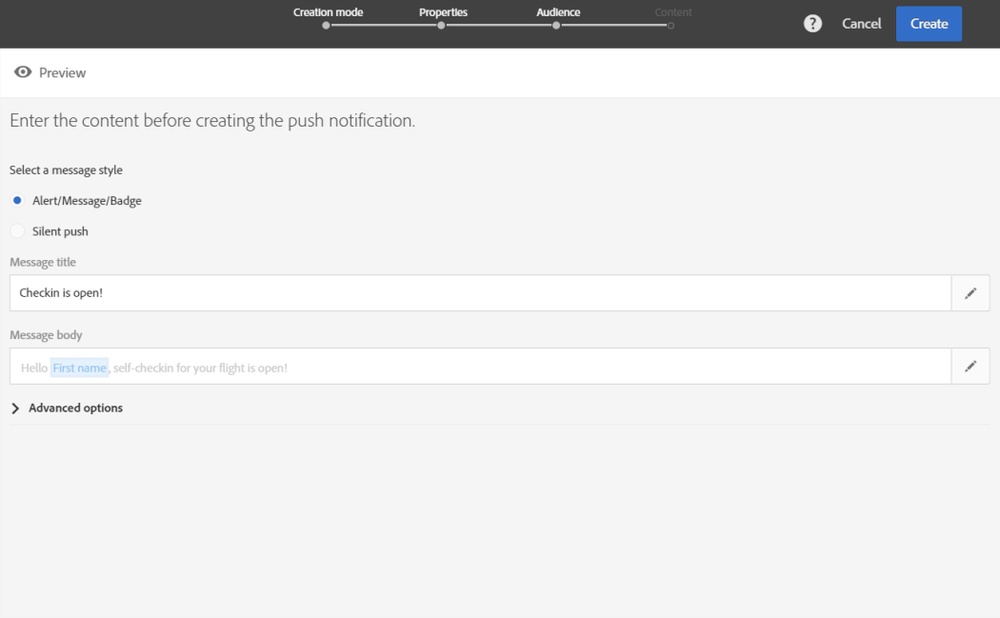
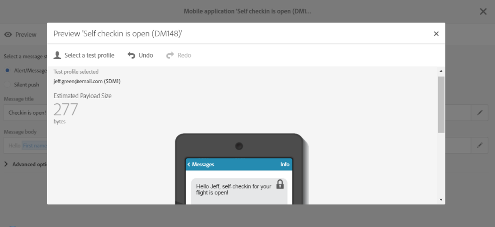
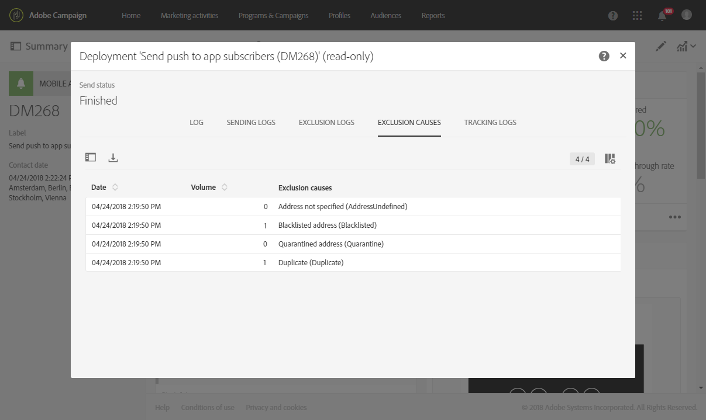

# 푸시 알림 준비 및 보내기{#preparing-and-sending-a-push-notification}

## 알림 준비 {#preparing-the-notification}

Adobe Campaign과 함께 푸시 알림을 만드는 단계는 다음과 같습니다.

1. 창에서 **[!UICONTROL Marketing activities]** 새 마케팅 활동 [을 만듭니다](../../start/using/marketing-activities.md#creating-a-marketing-activity).

   단일 푸시 알림은 [캠페인](../../start/using/marketing-activities.md#creating-a-marketing-activity) 또는 Adobe Campaign [홈 페이지에서도 만들 수 있습니다](../../start/using/interface-description.md#home-page).

   워크플로우에서 푸시 알림 배달 활동을 사용할 수도 있습니다. 이 활동은 [푸시 알림 배달](../../automating/using/push-notification-delivery.md) 섹션에 표시됩니다.

1. **[!UICONTROL Push notification]**&#x200B;을(를) 선택합니다.
1. 템플릿을 선택합니다.

   

   기본적으로 다음 두 템플릿 중 하나를 선택할 수 있습니다.

   * **[!UICONTROL Send push to Campaign profiles]**:이 템플릿을 사용하여 모바일 응용 프로그램에 가입했고 푸시 알림 수신을 선택한 Adobe Campaign CRM 프로필을 타깃팅합니다. 수신자의 이름과 같은 [개인화](../../designing/using/personalization.md#inserting-a-personalization-field) 필드를 푸시 알림에 삽입할 수 있습니다.
   * **[!UICONTROL Send push to app subscribers]**:이 템플릿을 사용하여 응용 프로그램에서 알림을 받도록 선택한 모든 알려진 및 익명 모바일 응용 프로그램 사용자에게 푸시 알림을 보냅니다. 모바일 애플리케이션에서 수집한 데이터로 이러한 메시지를 개인화할 수 있습니다.

   다국어 템플릿을 선택할 수도 있습니다. 자세한 내용은 다국어 푸시 알림 [만들기를 참조하십시오](../../channels/using/creating-a-multilingual-push-notification.md).

   For more on templates, refer to the [Managing templates](../../start/using/marketing-activity-templates.md) section.

1. Enter your push notification properties and select your mobile app in the **[!UICONTROL Associate a Mobile App to a delivery]** field.

   드롭다운에 SDK V4 및 Experience Platform SDK 애플리케이션이 모두 표시됩니다.

   

   푸시 알림을 캠페인에 연결할 수 있습니다. 이렇게 하려면 이미 만들어진 캠페인에서 선택합니다.

1. 다음 화면에서 대상을 지정할 수 있습니다. 예를 들어 특정 모바일 응용 프로그램에 가입한 모든 VIP 고객이 여기에 해당합니다. 자세한 내용은 대상 [만들기를 참조하십시오](../../audiences/using/creating-audiences.md).

   대상은 이전 단계에서 선택한 모바일 애플리케이션을 기반으로 자동으로 필터링됩니다.

   

1. 이제 푸시 알림을 사용자 지정할 수 있습니다. 먼저 메시지 스타일을 선택합니다. **[!UICONTROL Alert/Message/Badge]** 또는 **[!UICONTROL Silent push]**. 푸시 알림 유형은 푸시 알림 [정보 섹션에 설명되어](../../channels/using/about-push-notifications.md) 있습니다.

   푸시 알림의 내용을 편집하고 고급 옵션을 정의합니다. See [Customizing a push notification](../../channels/using/customizing-a-push-notification.md).

   

   여기에 구성된 푸시 알림 컨텐츠 및 옵션은 페이로드 형태로 모바일 앱으로 전달됩니다. 페이로드에 대한 자세한 구조는 ACS 푸시 알림 페이로드 구조 [이해 기술노트에](https://docs.adobe.com/content/help/ko-KR/campaign-standard/using/communication-channels/push-notifications/push-payload.html) 설명되어 있습니다.

1. **[!UICONTROL Create]**&#x200B;을(를) 클릭합니다.

   

1. 알림을 전송하기 전에 테스트 프로필로 테스트한 다음 배달을 보내기 전에 받는 사람이 보게 될 내용을 정확히 확인할 수 있습니다. 배달 요약 **[!UICONTROL Audiences]** 에서 을 선택하고 탭을 **[!UICONTROL Test profiles]** 클릭합니다.

   테스트 전송에 대한 자세한 내용은 프로필 [테스트를 참조하십시오](../../sending/using/sending-proofs.md).

1. 테스트 프로필을 선택하고 을 클릭하여 알림 **[!UICONTROL Preview]** 을 표시합니다.내용은 테스트 프로필 데이터를 통해 개인화됩니다.
1. 다양한 장치에서 푸시 알림 레이아웃을 확인합니다.렌더링을 미리 보려면 iPhone, Android 폰, iPad 또는 Android 태블릿을 선택합니다.

   

1. 이 **[!UICONTROL Estimated Payload Size]** 는 테스트 프로필 데이터를 기반으로 한 예측입니다. 실제 페이로드 크기는 다를 수 있습니다. 메시지 제한은 4KB입니다.

   >[!CAUTION]
   >
   >페이로드 크기가 4KB 한도를 초과하면 메시지가 배달되지 않습니다.

개인화 데이터는 메시지 크기에 영향을 줍니다.

## 알림 보내기 {#sending-the-notification}

대상 기준을 정의하여 Adobe Campaign에서 선택한 대상자에게 푸시 알림을 보낼 수 있습니다. 아래 예를 들어 선택한 대상은 4명의 타깃팅된 모바일 앱 구독자로 구성됩니다.

1. Click **[!UICONTROL Prepare]** to compute the target and generate the notifications.

   

1. Once the preparation has finished successfully, the **[!UICONTROL Deployment]** window presents the following KPIs: **[!UICONTROL Target]** and **[!UICONTROL To deliver]**. Note that the **[!UICONTROL To deliver]** count is lower than the **[!UICONTROL Targeted]** one due to exclusions which can be viewed by clicking  button at the bottom of the **[!UICONTROL Deployment]** window.

   

1. 탭에서 보낸 대상에서 제외된 모든 메시지 목록과 이 제외의 이유를 찾을 수 있습니다. **[!UICONTROL Exclusion logs]**

   여기에서 모바일 앱 구독자 중 한 명이 제외되는 것을 확인할 수 있습니다. 주소는차단 목록에 있고 다른 가입자는 프로필이 중복되었기 때문입니다.

   

1. 제외된 메시지 볼륨을 표시하려면 **[!UICONTROL Exclusion causes]** 탭을 클릭합니다.

   

1. 이제 아이콘을 클릭하여 푸시 알림 전송 **[!UICONTROL Confirm]** 을 시작할 수 있습니다.
1. 메시지 대시보드 및 로그를 통해 게재 상태를 확인합니다. 자세한 내용은 메시지 [전송](../../sending/using/confirming-the-send.md) 및 [배달 로그를](../../sending/using/monitoring-a-delivery.md#delivery-logs)참조하십시오.

   이 예에서 메시지 대시보드에는 Adobe Campaign이 두 개의 푸시 알림을 전송하려고 시도했다는 내용이 표시됩니다.이 중 하나가 장치에 성공적으로 배달되었으며 다른 하나가 실패했습니다. 배달 오류가 발생한 이유를 알려면 창 아래쪽에 있는  단추를 **[!UICONTROL Deployment]** 클릭합니다.

   

1. 창에서 **[!UICONTROL Deployment]** 탭을 클릭하여 보낸 푸시 알림 목록과 상태 **[!UICONTROL Sending logs]** 에 액세스합니다. 이 배달의 경우, 한 푸시 알림이 성공적으로 전송된 반면 다른 푸시 알림은 장치 토큰이 잘못되어 실패했습니다. 그러면 이 가입자는 이후 배달에서에 차단 목록 추가됩니다.

   >[!NOTE]
   >
   >이유들은 Adobe Campaign의 하류의 어떤 실패도 될 수 있다. apns, fcm과 같은 제공업체의 실패 사례에는 이러한 이유도 반영됩니다. 공급자 실패에 대한 자세한 내용은 [Apple](https://developer.apple.com/library/content/documentation/NetworkingInternet/Conceptual/RemoteNotificationsPG/CommunicatingwithAPNs.html) 및 [Android](https://firebase.google.com/docs/cloud-messaging/http-server-ref) 설명서를 참조하십시오.

   

이제 동적 보고서를 사용하여 푸시 알림 배달의 효과를 측정할 수 있습니다.

**관련 항목:**

* [푸시 알림 보고서](../../reporting/using/push-notification-report.md)
* [워크플로우 내에서 푸시 알림 보내기](../../automating/using/push-notification-delivery.md)
