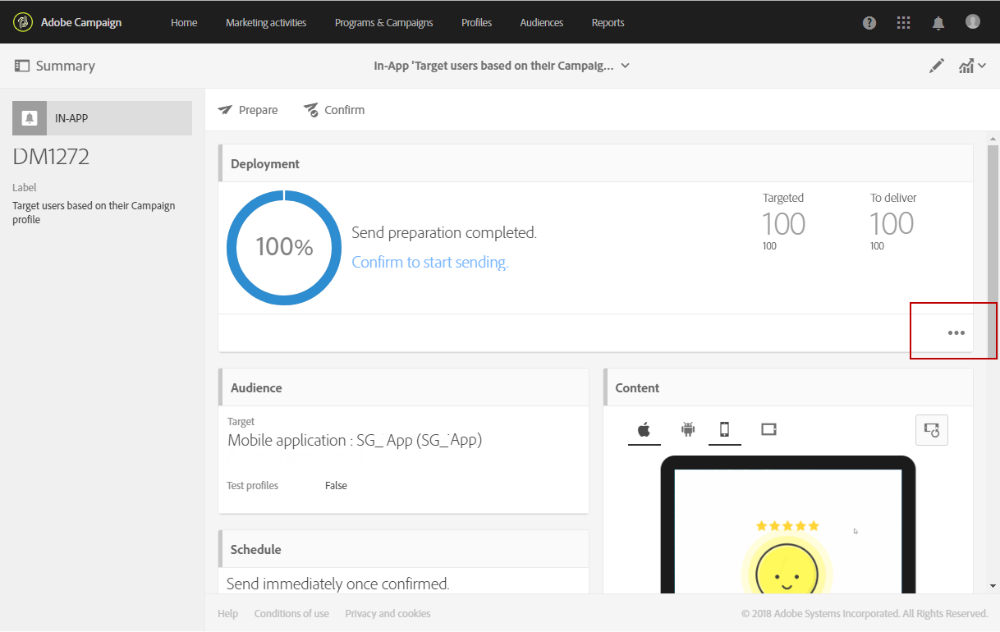

# 인앱 메시지 준비 및 보내기{#preparing-and-sending-an-in-app-message}

>[!NOTE]
>
>인앱 개인화는 일반적으로 CRM ID 및/또는 모바일 앱 로그인 ID인 연계 필드에 의존합니다. Adobe Campaign과 관련하여 사용할 경우 이 연계 필드의 보안을 유지하는 것은 전적으로 귀하의 책임입니다. 연계 필드를 안전하게 유지하지 않으면 개인화된 메시지가 취약할 수 있습니다. 안전한 연계 필드 구성, 관리 및 보호 방침을 따르지 않을 경우 Adobe는 무단 액세스 또는 프로필 데이터 사용으로 인해 발생하는 손해에 대해 책임을 지지 않습니다.

Adobe Campaign에서는 다음 세 가지 유형의 인앱 메시지를 사용할 수 있습니다.

* **[!UICONTROL Target users based on their Campaign profile (inAppProfile)]**: 이 메시지 유형을 사용하면 모바일 애플리케이션을 구독한 Adobe Campaign 프로필(CRM 프로필)을 타겟팅할 수 있습니다. 이 메시지 유형은 Adobe Campaign에서 사용 가능한 모든 프로필 속성을 사용하여 개인화할 수 있지만, 개인 및 민감한 정보가 포함된 메시지를 인증된 사용자만 사용할 수 있도록 하려면 Mobile SDK와 Campaign의 인앱 메시지 서비스 간의 안전한 핸드셰이크가 필요합니다.

   사용자의 디바이스에서 이 메시지 유형을 다운로드하려면 Mobile SDK가 모바일 프로필을 Adobe Campaign의 CRM 프로필에 연결하는 데 사용되는 연계 필드를 전송해야 합니다. 인앱 지원에 필요한 SDK API에 대한 자세한 내용은 이 [페이지](https://aep-sdks.gitbook.io/docs/using-mobile-extensions/adobe-campaign-standard/adobe-campaign-standard-api-reference)를 참조하십시오.

* **[!UICONTROL Target all users of a Mobile app (inAppBroadcast)]**: 이 메시지 유형을 사용하면 Adobe Campaign에 기존 프로필이 없더라도 모바일 애플리케이션의 모든 사용자(현재 또는 미래)에게 메시지를 보낼 수 있습니다. 따라서 사용자 프로필이 Adobe Campaign에 존재하지 않을 수 있으므로 메시지를 사용자 지정할 때는 개인화를 수행할 수 없습니다.
* **[!UICONTROL Target users based on their Mobile profile (inApp)]**: 이 메시지 유형을 사용하면 Adobe Campaign에 모바일 프로필이 있는 모바일 앱의 알려진 모든 사용자 또는 익명의 사용자를 타겟팅할 수 있습니다. 이 메시지 유형은 개인적이지 않고 민감하지 않은 속성만 사용하여 개인화할 수 있으며 Mobile SDK와 Adobe Campaign의 인앱 메시지 서비스 간에 안전한 핸드셰이크가 필요하지 않습니다.

   개인적이고 민감한 데이터를 처리하는 방법에 대한 자세한 내용은 [개인적이고 민감한 데이터를 사용하여 모바일 프로필 필드 처리](#handling-mobile-profile-fields-with-personal-and-sensitive-data)를 참조하십시오.

## 개인적이고 민감한 데이터를 사용하여 모바일 프로필 필드 처리 {#handling-mobile-profile-fields-with-personal-and-sensitive-data}

모바일 디바이스에서 전송한 모바일 프로필 속성 데이터는 Adobe Campaign의 **[!UICONTROL Subscriptions to an application (appSubscriptionRcp)]** 리소스에 저장됩니다. 이를 통해 애플리케이션 구독자로부터 수집하려는 데이터를 정의할 수 있습니다.

모바일 디바이스에서 Adobe Campaign으로 전송하려는 데이터를 수집하려면 이 리소스를 확장해야 합니다. 자세한 단계는 이 [페이지](../../developing/using/extending-the-subscriptions-to-an-application-resource.md)를 참조하십시오.

인앱 메시지를 보다 안전하게 개인화하려면 이 리소스의 모바일 프로필 필드를 그에 따라 구성해야 합니다. **[!UICONTROL Subscriptions to an application (appSubscriptionRcp)]**&#x200B;에서 새 모바일 프로필 필드를 만들 때 인앱 메시지 개인화 설정 중에 사용할 수 없도록 하려면 **[!UICONTROL Personal and Sensitive]**&#x200B;을(를) 선택합니다.

>[!NOTE]
>
>이 테이블에 사용자 지정 리소스 확장을 사용하는 기존 구현이 있는 경우 인앱 메시지를 개인화하기 위해 필드를 활용하기 전에 해당 필드에 적절하게 레이블을 지정하는 것이 좋습니다.

**[!UICONTROL Subscriptions to an application]** 사용자 지정 리소스가 구성 및 게시되면 **[!UICONTROL Target users based on their Mobile profile (inApp)]** 템플릿을 사용하여 인앱 게재 준비를 시작할 수 있습니다. 개인화를 위해 **[!UICONTROL Subscriptions to an application (appSubscriptionRcp)]** 리소스에서 개인적이지 않고 민감하지 않은 필드만 사용할 수 있습니다. 

**개인적이고 민감한** 필드를 사용하여 개인화해야 하는 경우, 사용자의 PII 데이터를 안전하게 유지하기 위해 추가적인 보안 메커니즘이 있는 **[!UICONTROL Target users based on their Campaign profile (inAppProfile)]** 템플릿을 사용하는 것이 좋습니다.

## 인앱 메시지 준비 {#preparing-your-in-app-message}

Adobe Campaign을 사용하여 독립형 인앱 메시지를 만드는 단계는 다음과 같습니다.

1. Adobe Campaign 홈페이지에서 **[!UICONTROL In-App messaging]** 카드를 클릭합니다.

   **마케팅 활동** 탭에서 **[!UICONTROL Create]** 버튼을 클릭하여 인앱을 만들 수도 있습니다.

   인앱 메시지는 캠페인이나 Adobe Campaign 홈페이지 또는 워크플로우에서도 만들 수 있습니다.

1. **인앱 메시지**&#x200B;를 선택합니다.

   

1. 대상자 타겟팅 요구에 따라 적절한 템플릿을 선택합니다.

   

   기본적으로 다음과 같은 세 가지 기본 템플릿 중 하나를 선택할 수 있습니다.

   * **[!UICONTROL Target users based on their Campaign CRM profile (inAppProfile)]**
   * **[!UICONTROL Target all users of a Mobile app (inAppBroadcast)]**
   * **[!UICONTROL Target users based on their Mobile profile (inApp)]**

1. 인앱 메시지 속성을 입력하고 **[!UICONTROL Associate a Mobile App to a delivery]** 필드에서 모바일 앱을 선택합니다. Adobe Campaign Standard를 통해 모바일 앱을 구성하지 않은 경우 목록에 표시되지 않습니다. 모바일 애플리케이션 구성에 대한 자세한 내용은 이 [페이지](https://helpx.adobe.com/kr/campaign/kb/configuring-app-sdk.html#ChannelspecificapplicationconfigurationinAdobeCampaign)를 참조하십시오.

   

1. 인앱 메시지에 대해 타겟팅할 대상자를 선택합니다. 대상자는 이 게재와 연결된 모바일 애플리케이션에 따라 미리 필터링됩니다.

   이 단계는 모바일 애플리케이션의 모든 사용자를 타겟팅하므로 **[!UICONTROL Broadcast an In-App message (inAppBroadcast)]**&#x200B;에는 필요하지 않습니다.

   

1. **[!UICONTROL Triggers]** 탭에서 메시지를 트리거할 이벤트를 끌어서 놓습니다. 트리거를 선택하여 사용자가 수행한 작업을 선택하여 인앱 메시지가 표시되도록 합니다.

   네 가지 이벤트 카테고리를 사용할 수 있습니다.

   * **[!UICONTROL Mobile Application events]**: 모바일 애플리케이션에서 구현된 사용자 지정 이벤트입니다.

      이벤트 생성에 대한 자세한 내용은 이 [페이지](https://helpx.adobe.com/kr/campaign/kb/configuring-app-sdk.html)를 참조하십시오.

   * **[!UICONTROL Life Cycle events]**: Adobe Mobile SDK에서 지원하는 기본 라이프 사이클 이벤트입니다.

      라이프 사이클 이벤트에 대한 자세한 내용은 이 [페이지](https://docs.adobe.com/content/help/en/mobile-services/android/metrics.html)를 참조하십시오.

   * **[!UICONTROL Analytics Events]**: 모바일 앱에서 구현된 항목에 따라 Adobe Analytics, 컨텍스트 데이터 또는 보기 상태의 세 가지 카테고리가 지원됩니다.

      이러한 이벤트는 Adobe Analytics 라이선스가 있는 경우에만 사용할 수 있습니다.

   * **[!UICONTROL Places]**: 위치 컨텍스트 데이터, 위치 사용자 지정 메타데이터 또는 위치 이벤트 유형의 세 가지 카테고리는 실시간 위치 데이터를 활용하여 컨텍스트에 맞는 모바일 경험을 제공합니다.

      Adobe Places에 대한 자세한 내용은 [위치 설명서](https://placesdocs.com/)를 참조하십시오.
   

1. **[!UICONTROL Analytics Events]**&#x200B;을(를) 사용하는 경우 Adobe Analytics 및 보기 상태 이벤트는 Adobe Experience Platform Launch의 Analytics 확장에 구성된 보고서 세트를 기반으로 자동으로 채워지는 반면, 컨텍스트 데이터 이벤트는 수동으로 추가해야 합니다.

   이러한 이벤트는 Adobe Analytics 라이선스가 있는 경우에만 사용할 수 있습니다.

   

1. **[!UICONTROL Places]** 트리거를 사용하는 경우 위치 컨텍스트 데이터, 위치 사용자 지정 메타데이터 또는 위치 이벤트 유형은 Adobe Places에서 만든 모든 라이브러리 및 해당 관심 포인트를 기반으로 자동으로 채워집니다. 

   이 트리거는 Experience Platform Launch의 위치 확장에서 선택한 라이브러리의 관심 포인트에 대해서만 디바이스에 적용됩니다. Places 확장 및 설치 방법에 대한 자세한 내용은 이 [설명서](https://docs.adobe.com/content/help/ko-KR/places/using/places-ext-aep-sdks/places-extension/places-extension.html)를 참조하십시오.

1. **[!UICONTROL Frequency & duration]** 탭에서 트리거 빈도, 시작 및 종료 날짜, 인앱 메시지가 활성화될 요일 및 시간을 선택합니다.

   

1. 메시지 내용을 편집하고 고급 옵션을 정의합니다. [인앱 메시지 사용자 지정](https://helpx.adobe.com/campaign/standard/channels/using/customizing-an-in-app-message.html)을 참조하십시오.

   

1. **[!UICONTROL Create]**&#x200B;을(를) 클릭합니다.

이제 인앱 메시지를 타겟팅된 대상자에게 보낼 준비가 되었습니다.

**관련 항목:**

* [인앱 메시지 사용자 지정](../../channels/using/customizing-an-in-app-message.md)
* [인앱 보고서](../../reporting/using/in-app-report.md)
* [워크플로우 내에서 인앱 메시지 보내기](../../automating/using/in-app-delivery.md)

## 인앱 메시지 보내기 {#sending-your-in-app-message}

게재 준비를 완료하고 승인 단계를 수행하면 메시지를 보낼 수 있습니다.

1. **[!UICONTROL Prepare]**&#x200B;을(를) 클릭하여 타겟을 계산하고 메시지를 생성합니다.

   

1. 준비가 완료되면, **배포** 창에 **타겟** 및 **게재 대상** KPI가 표시됩니다.

    버튼을 클릭하여 배포 창에서 게재의 잠재적인 제외 또는 오류에 대해 확인할 수 있습니다.

   

1. **[!UICONTROL Confirm]**&#x200B;을(를) 클릭하여 인앱 메시지 보내기를 시작합니다.

   

1. 메시지 대시보드 및 로그를 통해 게재 상태를 확인합니다. 자세한 정보는 이 [섹션](../../sending/using/monitoring-a-delivery.md)을 참조하십시오.

   **[!UICONTROL Delivered]** 및 **[!UICONTROL Sent]** KPI 수는 Campaign에서 Message 게재 서비스로 성공적으로 전송된 항목을 기반으로 합니다. 이러한 KPI는 Message 게재 서비스에서 메시지를 성공적으로 수신하거나 다운로드한 모바일 디바이스의 수를 나타내는 것이 아닙니다.

   

1. 게재 보고서를 통해 인앱 메시지가 미치는 영향을 측정합니다. 보고와 관련한 자세한 정보는 [이 섹션](../../reporting/using/in-app-report.md)을 참조하십시오.

**관련 항목:**

* [인앱 보고서](../../reporting/using/in-app-report.md)
* [워크플로우 내에서 인앱 메시지 보내기](../../automating/using/in-app-delivery.md)
