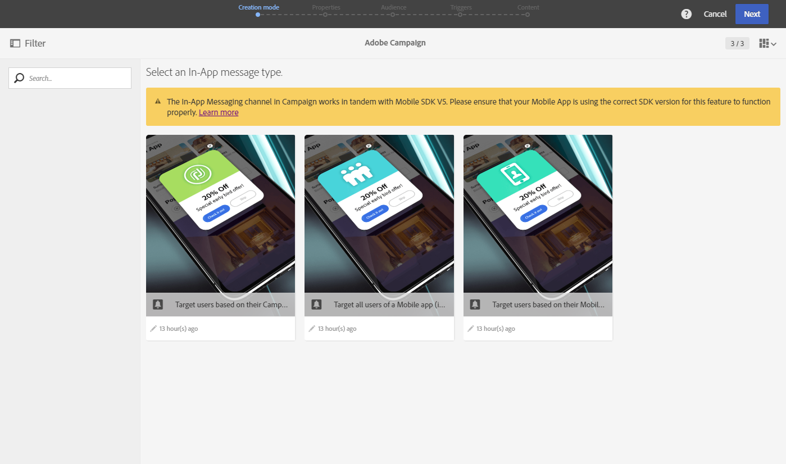

# 인앱 메시지 준비 및 보내기{#preparing-and-sending-an-in-app-message}

>[!NOTE]
>
>인앱 개인화는 일반적으로 CRM ID 및/또는 모바일 앱 로그인 ID인 링크 필드에 의존합니다. Adobe Campaign과 연계하여 사용하는 경우 이 링크 필드의 보안을 유지하는 것은 전적으로 귀하의 책임입니다. 링크 필드를 안전하게 유지하지 못하는 경우 개인화된 메시지가 취약할 수 있습니다. Adobe는 사용자가 안전한 링크 필드 구성, 관리 및 보호 방침을 따르지 않을 경우, 무단 액세스 또는 프로필 데이터 사용으로 인해 발생하는 손해에 대해 책임을 지지 않습니다.

Adobe Campaign에서 다음 세 가지 유형의 인앱 메시지를 사용할 수 있습니다.

* **[!UICONTROL Target users based on their Campaign profile (inAppProfile)]**:이 메시지 유형을 사용하면 모바일 애플리케이션에 가입한 Adobe Campaign 프로필(CRM 프로필)을 타깃팅할 수 있습니다. 이 메시지 유형은 Adobe Campaign에서 사용 가능한 모든 프로필 속성을 사용하여 개인화할 수 있지만, 개인 및 민감한 정보가 있는 메시지가 인증된 사용자만 사용할 수 있도록 하려면 Mobile SDK와 Campaign의 인앱 메시지 서비스 간의 안전한 핸드셰이크가 필요합니다.

   사용자의 장치에서 이 메시지 유형을 다운로드하려면 Mobile SDK가 모바일 프로필을 Adobe Campaign의 CRM 프로필에 연결하는 데 사용되는 링크 필드를 전송해야 합니다. 인앱 지원에 필요한 SDK API에 대한 자세한 내용은 이 [페이지를](https://aep-sdks.gitbook.io/docs/using-mobile-extensions/adobe-campaign-standard/adobe-campaign-standard-api-reference)참조하십시오.

* **[!UICONTROL Target all users of a Mobile app (inAppBroadcast)]**:이 메시지 유형을 사용하면 Adobe Campaign에 기존 프로필이 없더라도 모바일 애플리케이션의 모든 사용자(현재 또는 미래)에게 메시지를 보낼 수 있습니다. 따라서 사용자 프로필이 Adobe Campaign에 존재하지 않을 수 있으므로 메시지를 사용자 지정할 때는 개인화를 수행할 수 없습니다.
* **[!UICONTROL Target users based on their Mobile profile (inApp)]**:이 메시지 유형을 사용하면 Adobe Campaign에 모바일 프로필이 있는 모바일 앱의 알려진 사용자 또는 익명의 모든 사용자를 타깃팅할 수 있습니다. 이 메시지 유형은 비개인 및 비인식 특성만 사용하여 개인화할 수 있으며 Mobile SDK와 Adobe Campaign의 인앱 메시징 서비스 간의 안전한 핸드셰이크가 필요하지 않습니다.

   개인 및 민감한 데이터를 처리하는 방법에 대한 자세한 내용은 개인 및 [중요한 데이터를](#handling-mobile-profile-fields-with-personal-and-sensitive-data)사용하여 모바일 프로필 필드 처리를 참조하십시오.

## 개인 및 민감한 데이터를 사용하여 모바일 프로필 필드 처리 {#handling-mobile-profile-fields-with-personal-and-sensitive-data}

In Adobe Campaign, mobile profile attributes data sent from mobile device are stored in **[!UICONTROL Subscriptions to an application (appSubscriptionRcp)]** resource which allows you to define the data that you want to collect from your applications' subscribers.

모바일 장치에서 Adobe Campaign으로 전송하려는 데이터를 수집하려면 이 리소스를 확장해야 합니다. 이렇게 하려면 이 [페이지를](../../developing/using/extending-the-subscriptions-to-an-application-resource.md) 참조하십시오.

앱 내 메시지를 보다 안전하여 개인화하려면, 이 리소스의 모바일 프로필 필드를 그에 따라 구성해야 합니다. 새 모바일 프로필 필드를 만들 **[!UICONTROL Subscriptions to an application (appSubscriptionRcp)]**&#x200B;때 인앱 메시지 개인화 중에 사용할 수 없도록 **[!UICONTROL Personal and Sensitive]** 하려면 확인하십시오.

>[!NOTE]
>
>이 표에 사용자 지정 리소스 확장 기능이 있는 기존 구현이 있는 경우 In-App 메시지의 개인화를 위해 해당 필드를 활용하기 전에 해당 필드에 적절하게 레이블을 지정하는 것이 좋습니다.

사용자 **[!UICONTROL Subscriptions to an application]** 지정 리소스가 구성되고 게시되면 **[!UICONTROL Target users based on their Mobile profile (inApp)]** 템플릿을 사용하여 인앱 배달 준비를 시작할 수 있습니다. 개인화를 위해 **[!UICONTROL Subscriptions to an application (appSubscriptionRcp)]** 리소스에서 개인화되지 않은 필드와 개인화되지 않은 필드만 사용할 수 있습니다.

If you require personalization with **Personal and Sensitive** fields, we recommend using the **[!UICONTROL Target users based on their Campaign profile (inAppProfile)]** template which has additional security mechanism to ensure that your users' PII data remains secure.

## 인앱 메시지 준비 {#preparing-your-in-app-message}

Adobe Campaign을 사용하여 독립 실행형 인앱 메시지를 만드는 단계는 다음과 같습니다.

1. Adobe Campaign 홈 페이지에서 **[!UICONTROL In-App messaging]** 카드를 클릭합니다.

   마케팅 활동 **탭에서** **[!UICONTROL Create]** 단추를 클릭하여 인앱을 만들 수도 있습니다.

   인앱 메시지는 캠페인, Adobe Campaign 홈 페이지 또는 워크플로우에서 만들 수도 있습니다.

1. 인앱 **메시지를**&#x200B;선택합니다.

   

1. 고객 타깃팅 요구 사항에 따라 적절한 템플릿을 선택합니다.

   

   기본적으로 다음 3가지 기본 템플릿 중 하나를 선택할 수 있습니다.

   * **[!UICONTROL Target users based on their Campaign CRM profile (inAppProfile)]**
   * **[!UICONTROL Target all users of a Mobile app (inAppBroadcast)]**
   * **[!UICONTROL Target users based on their Mobile profile (inApp)]**

1. 인앱 메시지 속성을 입력하고 **[!UICONTROL Associate a Mobile App to a delivery]** 필드에서 모바일 앱을 선택합니다.

   

1. 인앱 메시지에 대해 타깃팅할 대상을 선택합니다. 대상은 이 게재와 연결된 모바일 애플리케이션에 따라 사전 필터링됩니다.

   이 단계는 모바일 응용 프로그램의 모든 사용자를 대상으로 **[!UICONTROL Broadcast an In-App message (inAppBroadcast)]** 하므로 이 단계와 함께 필요하지 않습니다.

   

1. 탭에서 메시지를 트리거할 이벤트를 드래그 앤 드롭합니다. **[!UICONTROL Triggers]** 트리거를 선택하면 In-App 메시지가 표시되는 사용자가 수행한 작업을 선택합니다.

   네 가지 이벤트 카테고리를 사용할 수 있습니다.

   * **[!UICONTROL Mobile Application events]**:모바일 애플리케이션에서 구현된 사용자 지정 이벤트.

      이벤트 생성에 대한 자세한 내용은 이 [페이지를](https://helpx.adobe.com/campaign/kb/configuring-app-sdk.html)참조하십시오.

   * **[!UICONTROL Life Cycle events]**:Adobe Mobile SDK 파섹

      라이프 사이클 이벤트에 대한 자세한 내용은 이 [페이지를](https://marketing.adobe.com/resources/help/en_US/mobile/android/metrics.html)참조하십시오.

   * **[!UICONTROL Analytics Events]**:모바일 앱에서 구현된 항목에 따라 다음 세 가지 카테고리가 지원됩니다.Adobe Analytics, 컨텍스트 데이터 또는 보기 상태.

      이러한 이벤트는 Adobe Analytics 라이선스가 있는 경우에만 사용할 수 있습니다.

   * **[!UICONTROL Places]**:다음 세 가지 범주는 실시간 위치 데이터를 활용하여 상황에 따라 연관성 있는 모바일 경험을 제공합니다.컨텍스트 데이터를 배치하고, 사용자 지정 메타데이터를 배치하거나, 이벤트 유형을 배치합니다.

      Adobe Places에 대한 자세한 내용은 장소 [설명서를](https://placesdocs.com/)참조하십시오.
   

1. Adobe Experience **[!UICONTROL Analytics Events]** Platform Launch의 Analytics 익스텐션에서 구성한 보고서 세트에 따라 Adobe Analytics 및 보기 상태 이벤트가 자동으로 채워지지만 컨텍스트 데이터 이벤트는 수동으로 추가해야 합니다.

   이러한 이벤트는 Adobe Analytics 라이선스가 있는 경우에만 사용할 수 있습니다.

   

1. 트리거를 사용하는 경우 **[!UICONTROL Places]** 배치 컨텍스트 데이터, 위치 사용자 지정 메타데이터 또는 위치 이벤트 유형은 Adobe Places에서 만든 모든 라이브러리 및 관심 영역을 기반으로 자동으로 채워집니다.

   이 트리거는 Experience Platform Launch의 위치 확장 기능에서 선택한 라이브러리의 관심 영역에만 적용됩니다. 위치 확장 프로그램 및 설치 방법에 대한 자세한 내용은 이 [설명서를](https://aep-sdks.gitbook.io/docs/using-mobile-extensions/places-extension-1/places-extension)참조하십시오.

1. 탭에서 트리거 빈도, 시작 및 종료 날짜, 요일 및 인앱 메시지가 활성화되는 시간을 선택합니다. **[!UICONTROL Frequency & duration]**

   

1. 메시지 내용을 편집하고 고급 옵션을 정의합니다. See [Customizing an In-App message](https://helpx.adobe.com/campaign/standard/channels/using/customizing-a-push-notification.html).

   

1. Click **[!UICONTROL Create]**.

이제 인앱 메시지를 타깃팅된 대상자에게 보낼 준비가 되었습니다.

**관련 항목:**

* [인앱 메시지 사용자 지정](../../channels/using/customizing-an-in-app-message.md)
* [인앱 보고서](../../reporting/using/in-app-report.md)
* [워크플로우 내에서 인앱 메시지 보내기](../../automating/using/in-app-delivery.md)

## 인앱 메시지 보내기 {#sending-your-in-app-message}

배달 준비를 완료하고 승인 단계를 완료하면 메시지를 보낼 수 있습니다.

1. 을 **[!UICONTROL Prepare]** 클릭하여 대상을 계산하고 메시지를 생성합니다.

   

1. 준비가 완료되면, **배포** 창에 **타겟** 및 **게재** KPI가 표시됩니다.

   배포 창에서 전달의 잠재적 제외나 오류에 대한  단추를 클릭하여 배포 창을 확인할 수 있습니다.

   

1. 인앱 메시지 전송을 **[!UICONTROL Confirm]** 시작하려면 클릭하십시오.

   

1. 메시지 대시보드 및 로그를 통해 배달 상태를 확인합니다. For more on this, refer to this [section](../../sending/using/monitoring-a-delivery.md).

   **[!UICONTROL Delivered]** 및 **[!UICONTROL Sent]** KPI 수는 Campaign에서 메시지 배달 서비스로 성공적으로 전송된 항목을 기반으로 합니다. 이러한 KPI는 메시지 배달 서비스에서 메시지를 성공적으로 수신하거나 다운로드한 모바일 장치의 수를 나타내는 것이 아닙니다.

   

1. 전달 보고서를 통해 인앱 메시지가 미치는 영향을 측정할 수 있습니다. For more on reporting, refer to [this section](../../reporting/using/in-app-report.md).

**관련 항목:**

* [인앱 보고서](../../reporting/using/in-app-report.md)
* [워크플로우 내에서 인앱 메시지 보내기](../../automating/using/in-app-delivery.md)

