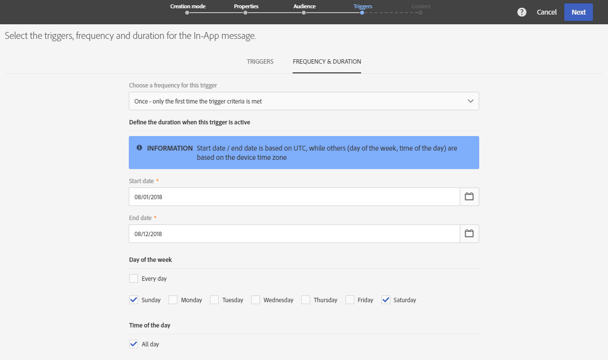

# Preparing and sending an In-App message{#preparing-and-sending-an-in-app-message}

>[!NOTE]
>
>인앱 개인화는 일반적으로 CRM ID 및/또는 모바일 앱 로그인 ID 인 링크 필드를 사용합니다. 귀하는 Adobe Campaign와 관련하여 사용할 때 이 링크 필드를 보호하는 전적인 책임을 집니다. 링크 필드를 안전하게 유지하지 못하는 경우 개인화된 메시지가 취약할 수 있습니다. Adobe는 귀하가 보안 링크 현장 구성, 관리 및 보호 방침을 따르지 않는 경우에 프로필 데이터의 무단 접속이나 사용으로 인해 발생하는 손해에 대해 책임을 지지 않습니다.

Adobe Campaign 에서는 다음 세 가지 유형의 인앱 메시지를 사용할 수 있습니다.

* **[!UICONTROL Target users based on their Campaign profile (inAppProfile)]**: 이 메시지 유형을 사용하면 모바일 애플리케이션을 구독한 Adobe Campaign 프로필 (CRM 프로파일) 를 타깃팅할 수 있습니다. 이 메시지 유형은 Adobe Campaign의 모든 사용 가능한 프로필 속성으로 개인화할 수 있지만, 개인 및 민감한 정보가 있는 메시지를 인증된 사용자만 사용할 수 있도록 Mobile SDK와 Campaign의 앱 내 메시징 서비스 간에 안전한 핸드셰이크가 필요합니다.

   사용자의 장치에서 이 메시지 유형을 다운로드하려면 Mobile SDK가 Adobe Campaign의 CRM 프로필과 모바일 프로필을 연결하는 데 사용된 링크 필드를 전송해야 합니다. For more information on SDK APIs required to support In-App, refer to this [page](https://aep-sdks.gitbook.io/docs/using-mobile-extensions/adobe-campaign-standard/adobe-campaign-standard-api-reference).

* **[!UICONTROL Target all users of a Mobile app (inAppBroadcast)]**: 이 메시지 유형을 사용하면 Adobe Campaign에 기존 프로필이 없는 경우에도 모바일 애플리케이션의 모든 사용자에게 메시지를 보낼 수 있습니다. 사용자 프로필로 메시지가 Adobe Campaign에 없을 수도 있으므로 개인화를 수행할 수 없습니다.
* **[!UICONTROL Target users based on their Mobile profile (inApp)]**: 이 메시지 유형을 사용하면 Adobe Campaign에서 모바일 프로필이 있는 모바일 앱의 모든 알려진 사용자 또는 익명 사용자를 타깃팅할 수 있습니다. 이 메시지 유형은 개인화되지 않은 특성과 중요하지 않은 특성만 사용하여 개인화할 수 있으며 Mobile SDK와 Adobe Campaign의 앱 내 메시징 서비스 간에 핸드셰이크가 필요하지 않습니다.

   For more information on how to handle personal and sensitive data, refer to [Handling mobile profile fields with personal and sensitive data](../../channels/using/preparing-and-sending-an-in-app-message.md#handling-mobile-profile-fields-with-personal-and-sensitive-data).

## Handling mobile profile fields with personal and sensitive data {#handling-mobile-profile-fields-with-personal-and-sensitive-data}

In Adobe Campaign, mobile profile attributes data sent from mobile device are stored in **[!UICONTROL Subscriptions to an application (appSubscriptionRcp)]** resource which allows you to define the data that you want to collect from your applications' subscribers.

모바일 장치에서 Adobe Campaign로 전송할 데이터를 수집하려면 이 리소스를 확장해야 합니다. To do so, refer to this [page](../../developing/using/extending-the-subscriptions-to-an-application-resource.md) for the detailed steps.

앱 내 메시지를 보다 안전하여 개인화하려면, 이 리소스의 모바일 프로필 필드를 그에 따라 구성해야 합니다. In your **[!UICONTROL Subscriptions to an application (appSubscriptionRcp)]**, when creating your new mobile profiles fields, check **[!UICONTROL Personal and Sensitive]** to make them unavailable during In-App messages personalization.

>[!NOTE]
>
>이 표에 사용자 정의 리소스 확장이 있는 기존 구현이 있는 경우, 인앱 메시지 개인화를 위해 해당 필드를 활용하기에 앞서 적절하게 레이블을 지정할 것을 권장합니다.

**[!UICONTROL Subscriptions to an application]** 사용자 정의 리소스가 구성되고 게시되면 **[!UICONTROL Target users based on their Mobile profile (inApp)]** 템플릿을 사용하여 인앱 제공을 준비할 수 있습니다. Only non-personal and non-sensitive fields will be available from **[!UICONTROL Subscriptions to an application (appSubscriptionRcp)]** resource for personalization.

**개인 및 민감한** 필드로 개인화가 필요한 경우, 사용자의 PII 데이터가 안전하게 유지되도록 추가 보안 메커니즘이 있는 **[!UICONTROL Target users based on their Campaign profile (inAppProfile)]** 템플릿을 사용하는 것이 좋습니다.

## Preparing your In-App message {#preparing-your-in-app-message}

Adobe Campaign를 사용하여 독립형 인앱 메시지를 만드는 단계는 다음과 같습니다.

1. From Adobe Campaign home page, click the **[!UICONTROL In-App messaging]** card.

   You can also create an In-App from the **Marketing activities** tab, by clicking the **[!UICONTROL Create]** button.

   인앱 메시지는 캠페인이나 Adobe Campaign 홈 페이지나 워크플로우에서 만들 수도 있습니다.

1. Select **In-App message**.

   

1. 대상 타깃팅 요구 사항에 따라 적절한 템플릿을 선택합니다.

   

   기본적으로 다음과 같은 세 가지 기본 템플릿 중 하나를 선택할 수 있습니다.

   * **[!UICONTROL Target users based on their Campaign CRM profile (inAppProfile)]**
   * **[!UICONTROL Target all users of a Mobile app (inAppBroadcast)]**
   * **[!UICONTROL Target users based on their Mobile profile (inApp)]**

1. Enter the In-App message properties and select your mobile app in the **[!UICONTROL Associate a Mobile App to a delivery]** field.

   

1. 인앱 메시지로 타깃팅할 대상자를 선택합니다. 대상은 이 게시에 연결된 모바일 애플리케이션에 따라 사전 필터링됩니다.

   Note that this step is not needed with the **[!UICONTROL Broadcast an In-App message (inAppBroadcast)]** since it targets all users of a mobile application.

   

1. **[!UICONTROL Triggers]** 탭에서 메시지를 트리거할 이벤트를 드래그하여 놓습니다. 트리거를 선택하면 인앱 메시지가 표시되도록 하는 사용자가 수행한 작업을 선택할 수 있습니다.

   네 가지 이벤트 카테고리를 사용할 수 있습니다.

   * **[!UICONTROL Mobile Application events]**: 모바일 애플리케이션에서 구현된 사용자 지정 이벤트.

      For more on events creations, refer to this [page](https://helpx.adobe.com/campaign/kb/configuring-app-sdk.html).

   * **[!UICONTROL Life Cycle events]**: Adobe Mobile SDK에서 지원하는 기본 라이프사이클 이벤트

      For more on life cycle events, refer to this [page](https://marketing.adobe.com/resources/help/en_US/mobile/android/metrics.html).

   * **[!UICONTROL Analytics Events]**: 모바일 앱에서 구현된 내용에 따라 다음 세 카테고리가 지원됩니다. Adobe Analytics, 컨텍스트 데이터 또는 보기 상태.

      이러한 이벤트는 Adobe Analytics 라이센스가 있는 경우에만 사용할 수 있습니다.

   * **[!UICONTROL Places]**: 다음 세 카테고리는 실시간 위치 데이터를 활용하여 상황에 맞는 모바일 경험을 전달합니다. 컨텍스트 데이터를 배치하고, 사용자 지정 메타데이터를 배치하거나, 이벤트 유형을 배치합니다.

      For more information on Adobe Places, refer to the [Places documentation](https://placesdocs.com/).
   

1. If you use an **[!UICONTROL Analytics Events]**, Adobe Analytics and View state events will be automatically populated based on the report suites configured in the Analytics extension in Adobe Experience Platform Launch whereas Context data events have to be manually added.

   이러한 이벤트는 Adobe Analytics 라이센스가 있는 경우에만 사용할 수 있습니다.

   

1. **[!UICONTROL Places]** 트리거를 사용하는 경우 컨텍스트 데이터를 배치하고, 사용자 지정 메타데이터 또는 위치 이벤트 유형을 모든 라이브러리 및 Adobe Places에서 만든 관심 영역에 따라 자동으로 채웁니다.

   이 트리거는 Experience Platform Launch의 Places Extension에서 선택한 라이브러리의 관심 영역에 대해서만 장치에 적용됩니다. For more information on the Places extension and how to install it, refer to this [documentation](https://aep-sdks.gitbook.io/docs/using-mobile-extensions/places-extension-1/places-extension).

1. **[!UICONTROL Frequency & duration]** 탭에서 트리거 빈도, 시작 및 종료 날짜, 인앱 메시지가 활성화될 요일 및 시간을 선택합니다.

   

1. 메시지의 내용을 편집하고 고급 옵션을 정의합니다. See [Customizing an In-App message](https://helpx.adobe.com/campaign/standard/channels/using/customizing-a-push-notification.html).

   

1. **[!UICONTROL Create]**&#x200B;을 클릭합니다.

이제 인앱 메시지를 대상 대상자에게 보낼 준비가 되었습니다.

**관련 항목:**

* [인앱 메시지 사용자 정의](../../channels/using/customizing-an-in-app-message.md)
* [인앱 보고서](../../reporting/using/in-app-report.md)
* [워크플로우 내에서 인앱 메시지 전송](../../automating/using/in-app-delivery.md)

## Sending your In-App message {#sending-your-in-app-message}

전달 준비를 완료하고 승인 단계가 완료되면 메시지를 보낼 수 있습니다.

1. Click **[!UICONTROL Prepare]** to compute the target and generate the messages.

   

1. 준비가 완료되면, **배포** 창에 **타겟** 및 **게재** KPI가 표시됩니다.

   You can check the Deployment window by clicking the  button for potential exclusions or errors in your delivery.

   

1. Click **[!UICONTROL Confirm]** to start sending your In-App message.

   

1. 메시지 대시보드 및 로그에서 배달 상태를 확인합니다. For more on this, refer to this [section](../../sending/using/monitoring-a-delivery.md).

   **[!UICONTROL Delivered]** 및 **[!UICONTROL Sent]** KPI는 캠페인에서 메시지 배달 서비스로 전송된 항목을 기반으로 계산됩니다. 이러한 KPI는 메시지 전달 서비스에서 메시지를 성공적으로 수신하거나 다운로드한 모바일 장치 수를 표시하는 것이 아닙니다.

   

1. 앱 내 메시지가 배달 보고서로 미치는 영향을 측정할 수 있습니다. For more on reporting, refer to [this section](../../reporting/using/in-app-report.md).

**관련 항목:**

* [인앱 보고서](../../reporting/using/in-app-report.md)
* [워크플로우 내에서 인앱 메시지 전송](../../automating/using/in-app-delivery.md)

