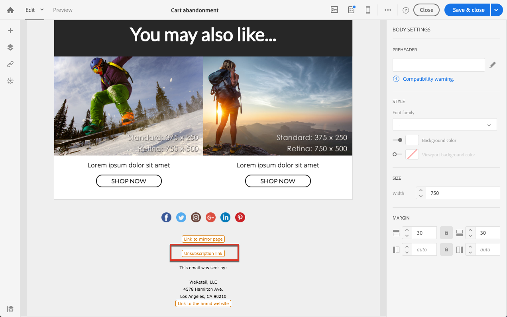

# 프로필 트랜잭션 메시지{#profile-transactional-messages}

고객 마케팅 프로필을 기반으로 트랜잭션 메시지를 보내면 다음과 같은 작업을 수행할 수 있습니다.

* **[!UICONTROL Address on denylist]** 또는 [피로도 규칙](../../sending/using/fatigue-rules.md) 등 마케팅 유형화 규칙을 적용합니다.
* 메시지에 구독 취소 링크를 포함합니다.
* 트랜잭션 메시지를 글로벌 게재 보고서에 추가합니다.
* 트랜잭션 메시지를 고객 여정에 활용합니다.

이벤트(위 [예제](../../channels/using/getting-started-with-transactional-msg.md#transactional-messaging-operating-principle)의 경우 장바구니 중단)를 만들어 게시하면 해당하는 트랜잭션 메시지가 자동으로 생성됩니다.

구성 단계는 [프로필 트랜잭션 메시지를 보내기 위한 이벤트 구성](../../administration/using/configuring-transactional-messaging.md#use-case--configuring-an-event-to-send-a-transactional-message) 섹션에 있습니다.

이벤트가 트랜잭션 메시지 전송을 트리거하려면 메시지를 개인화한 다음 테스트하여 게시해야 합니다.

>[!NOTE]
>
>트랜잭션 메시지에 액세스하려면 **[!UICONTROL Administrators (all units)]** 보안 그룹의 일부여야 합니다.
>
>프로필 트랜잭션 메시지의 경우 피로도 규칙이 적용됩니다. [피로도 규칙](../../sending/using/fatigue-rules.md)을 참조하십시오.

## 프로필 트랜잭션 메시지 보내기 {#sending-a-profile-transactional-message}

프로필 트랜잭션 메시지를 만들고, 개인화하고, 게시하는 단계는 이벤트 트랜잭션 메시지의 경우와 동일합니다. [이벤트 트랜잭션 메시지](../../channels/using/event-transactional-messages.md)를 참조하십시오.

차이점은 아래에 나와 있습니다.

1. 만든 트랜잭션 메시지로 이동하여 편집합니다.
1. 트랜잭션 메시지에서 **[!UICONTROL Content]** 섹션을 클릭합니다. 트랜잭션 템플릿 외에 이메일 템플릿 타겟팅 **[!UICONTROL Profile]**&#x200B;을(를) 선택할 수도 있습니다 .

   

1. 기본 이메일 템플릿을 선택합니다.

   모든 마케팅 이메일과 마찬가지로 구독 취소 링크가 포함되어 있습니다.

   

   또한 실시간 이벤트 기반 구성과 달리, 모든 프로필 정보에 직접 액세스하여 메시지를 개인화할 수 있습니다. [개인화 필드 삽입](../../designing/using/personalization.md#inserting-a-personalization-field)을 참조하십시오.

1. 변경 내용을 저장하고 메시지를 게시합니다. [트랜잭션 메시지 게시](../../channels/using/event-transactional-messages.md#publishing-a-transactional-message)를 참조하십시오.

## 프로필 트랜잭션 메시지 게재 모니터링 {#monitoring-a-profile-transactional-message-delivery}

메시지를 게시하고 사이트 통합이 완료되면 게재를 모니터링할 수 있습니다.

1. 메시지 게재 로그를 보려면 **[!UICONTROL Deployment]** 블록의 오른쪽 하단에 있는 아이콘을 클릭합니다.

   로그 액세스에 대한 자세한 내용은 [게재 모니터링](../../sending/using/monitoring-a-delivery.md)을 참조하십시오.

1. **[!UICONTROL Sending logs]** 탭을 선택합니다. **[!UICONTROL Status]** 열의 **[!UICONTROL Sent]**&#x200B;은(는) 프로필이 옵트인되었음을 나타냅니다.

   

1. Select the **[!UICONTROL Exclusions logs]** tab to view recipients who have been excluded from the message target, such as addresses on denylist.

   

**[!UICONTROL Address on denylist]** 유형화 규칙이 옵트아웃한 프로필의 수신자를 모두 제외합니다.

이 규칙은 **[!UICONTROL Profile]** 표를 기반으로 하는 모든 트랜잭션 메시지에 적용되는 특정 유형화 중 일부입니다.

**관련 항목**:

* [사이트 통합](../../administration/using/configuring-transactional-messaging.md#integrating-the-triggering-of-the-event-in-a-website)
* [유형화](../../sending/using/about-typology-rules.md)
