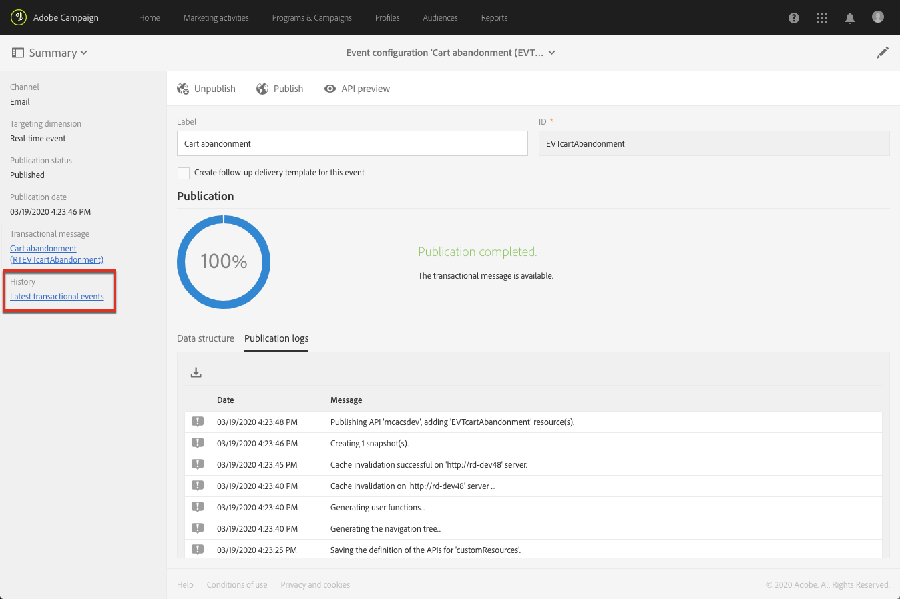

# 트랜잭션 이벤트 {#publishing-transactional-event} 게시

[configuration](../../channels/using/configuring-transactional-event.md)이 완료되면 이벤트를 게시할 준비가 됩니다. 이벤트를 미리 보고, 게시하고, 게시 취소하고, 삭제하는 단계는 아래에 설명되어 있습니다.

>[!IMPORTANT]
>
>이벤트 구성 및 게시는 [administrator](../../administration/using/users-management.md#functional-administrators)에서 수행해야 합니다.

게시 및 게시 취소 이벤트 구성을 포함하여 전체 트랜잭션 메시지 게시 프로세스를 보여주는 차트는 [이 섹션](../../channels/using/publishing-transactional-message.md)에서 사용할 수 있습니다.

게시 완료 후:
* 해당 트랜잭션 메시지가 자동으로 만들어집니다. [트랜잭션 메시지 편집](../../channels/using/editing-transactional-message.md)을 참조하십시오.
* 웹 사이트 개발자가 사용할 API가 배포되고 이제 트랜잭션 이벤트를 전송할 수 있습니다. 이벤트 트리거 통합(../../channels/using/getting-started-with-transactional-msg.md#integrate-event-trigger)을 참조하십시오.

## 이벤트 {#previewing-and-publishing-the-event} 미리 보기 및 게시

이벤트를 사용하기 전에 미리 보고 게시해야 합니다.

1. 웹 사이트 개발자가 게시하기 전에 사용할 REST API의 시뮬레이션을 보려면 **[!UICONTROL API preview]** 단추를 클릭하십시오.

   이벤트가 게시되면 제작 중인 API의 미리 보기도 가능합니다. 이벤트 트리거 통합(../../channels/using/getting-started-with-transactional-msg.md#integrate-event-trigger)을 참조하십시오.

   

   >[!NOTE]
   >
   >REST API는 선택한 채널과 선택한 타깃팅 차원에 따라 다릅니다. 다양한 구성에 대한 자세한 내용은 [트랜잭션 이벤트 특정 구성](../../channels/using/configuring-transactional-event.md#transactional-event-specific-configurations)을 참조하십시오.

1. **[!UICONTROL Publish]**&#x200B;을 클릭하여 게시를 시작합니다.

   

   웹 사이트 개발자가 사용할 API가 배포되고 이제 트랜잭션 이벤트를 전송할 수 있습니다.

1. 해당 탭에서 발행물 로그를 볼 수 있습니다.

   

   >[!IMPORTANT]
   >
   >이벤트를 수정할 때마다 웹 사이트 개발자가 사용할 업데이트된 REST API를 생성하려면 다시 **[!UICONTROL Publish]**&#x200B;을(를) 클릭해야 합니다.

   이벤트가 게시되면 새 이벤트에 연결된 [트랜잭션 메시지](../../channels/using/editing-transactional-message.md)가 자동으로 만들어집니다.

1. 왼쪽 영역에 있는 링크를 통해 이 트랜잭션 메시지에 직접 액세스할 수 있습니다.

   

   >[!NOTE]
   >
   >* 이벤트가 트랜잭션 메시지 전송을 트리거하려면 방금 만든 메시지를 수정하고 게시해야 합니다. [Editing](../../channels/using/editing-transactional-message.md) and [트랜잭션 메시지](../../channels/using/publishing-transactional-message.md) 섹션 게시를 참조하십시오.
      >
      >
   * 또한 이 트리거 이벤트](../../channels/using/getting-started-with-transactional-msg.md#integrate-event-trigger)를 웹 사이트에 통합해야 합니다.[

1. Adobe Campaign이 이 이벤트 구성과 관련된 이벤트 수신을 시작하면 **[!UICONTROL History]** 섹션 아래에 있는 **[!UICONTROL Latest transactional events]** 링크를 클릭하여 사용자의 타사 서비스가 전송하고 Adobe Campaign에서 처리하는 최신 이벤트에 액세스할 수 있습니다.

이벤트(JSON 형식)는 가장 최근 것부터 가장 오래된 것부터 가장 오래된 것까지 나열됩니다. 이 목록에서는 제어 및 디버깅 목적으로 컨텐츠나 이벤트 상태와 같은 데이터를 확인할 수 있습니다.

## 이벤트 {#unpublishing-an-event} 게시 취소

**[!UICONTROL Unpublish]** 단추를 사용하면 이벤트의 게시를 취소할 수 있습니다. 이렇게 하면 이전에 만든 이벤트에 해당하는 리소스가 REST API에서 삭제됩니다.

이제 웹 사이트를 통해 이벤트가 트리거되더라도 해당 메시지는 더 이상 전송되지 않고 데이터베이스에 저장되지 않습니다.

>[!NOTE]
>
>해당 트랜잭션 메시지를 이미 게시한 경우 트랜잭션 메시지 게시가 취소됩니다. [트랜잭션 메시지 게시 취소](../../channels/using/publishing-transactional-message.md#unpublishing-a-transactional-message)를 참조하십시오.

**[!UICONTROL Publish]** 단추를 클릭하여 새 REST API를 생성합니다.

<!--## Transactional messaging publication process {#transactional-messaging-pub-process}

The chart below illustrates the transactional messaging publication process.

For more on publishing, pausing and unpublishing a transactional message, see [this section](../../channels/using/publishing-transactional-message.md).-->

## 이벤트 {#deleting-an-event} 삭제

이벤트 게시가 취소되었거나 이벤트가 아직 게시되지 않았으면 이벤트 구성 목록에서 삭제할 수 있습니다. 삭제 방법:

1. 왼쪽 상단 모서리에서 **[!UICONTROL Adobe Campaign]** 로고를 클릭한 다음 **[!UICONTROL Marketing plans]** > **[!UICONTROL Transactional messages]** > **[!UICONTROL Event configuration]**&#x200B;을(를) 선택합니다.
1. 선택한 이벤트 구성 위에 마우스를 놓고 **[!UICONTROL Delete element]** 단추를 선택합니다.

   

   >[!NOTE]
   >
   >이벤트 구성에 **[!UICONTROL Draft]** 상태가 있는지 확인하십시오. 그렇지 않으면 삭제할 수 없습니다. **[!UICONTROL Draft]** 상태는 아직 게시되지 않았거나 [게시 취소된](#unpublishing-an-event)인 이벤트에 적용됩니다.

1. **[!UICONTROL Confirm]** 버튼을 클릭합니다.

   

>[!IMPORTANT]
>
>게시되고 이미 사용된 이벤트 구성을 삭제하면 해당 트랜잭션 메시지와 해당 전송 및 추적 로그도 삭제됩니다.
