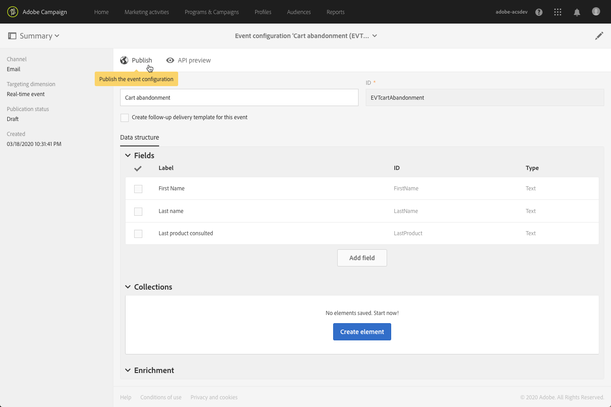

# 트랜잭션 이벤트 게시 {#publishing-transactional-event}

한 번 [구성](../../channels/using/configuring-transactional-event.md) 이(가) 완료되면 이벤트를 게시할 수 있습니다. 이벤트를 미리 보고, 게시하고, 게시 취소하고, 삭제하는 단계는 아래에 설명되어 있습니다.

>[!IMPORTANT]
>
>전용 [기능 관리자](../../administration/using/users-management.md#functional-administrators) <!--being part of the **[!UICONTROL All]** [organizational unit](../../administration/using/organizational-units.md) -->이벤트 구성을 게시할 적절한 권한이 있습니다.

게시 및 게시 취소 이벤트 구성을 포함한 전체 트랜잭션 메시지 게시 프로세스를 설명하는 차트는에서 사용할 수 있습니다. [이 섹션](../../channels/using/publishing-transactional-message.md).

게시가 완료되면:
* 해당 트랜잭션 메시지가 자동으로 만들어집니다. 다음을 참조하십시오 [트랜잭션 메시지 편집](../../channels/using/editing-transactional-message.md).
* 웹 사이트 개발자가 사용할 API가 배포되고 트랜잭션 이벤트를 이제 전송할 수 있습니다. 다음을 참조하십시오 [이벤트 트리거 통합](../../channels/using/getting-started-with-transactional-msg.md#integrate-event-trigger).

## 이벤트 미리 보기 및 게시 {#previewing-and-publishing-the-event}

이벤트를 사용하려면 먼저 미리 보고 게시해야 합니다.

1. 다음을 클릭합니다. **[!UICONTROL API preview]** 단추를 클릭하여 게시하기 전에 웹 사이트 개발자가 사용할 REST API의 시뮬레이션을 확인합니다.

   이벤트가 게시되면 이 버튼을 사용하여 프로덕션에서 API의 미리보기를 확인할 수도 있습니다. 다음을 참조하십시오 [이벤트 트리거 통합](../../channels/using/getting-started-with-transactional-msg.md#integrate-event-trigger).

   

   >[!NOTE]
   >
   >REST API는 선택한 채널 및 선택한 타겟팅 차원에 따라 달라집니다. 다양한 구성에 대한 자세한 내용은 을 참조하십시오. [이 섹션](../../channels/using/configuring-transactional-event.md#transactional-event-specific-configurations).

1. 클릭 **[!UICONTROL Publish]** 게시를 시작합니다.

   

   웹 사이트 개발자가 사용할 API가 배포되고 트랜잭션 이벤트를 이제 전송할 수 있습니다.

1. 해당 탭에서 게시 로그를 볼 수 있습니다.

   

   >[!IMPORTANT]
   >
   >이벤트를 수정할 때마다 **[!UICONTROL Publish]** 웹 사이트 개발자가 사용할 업데이트된 REST API를 다시 생성합니다.

   이벤트가 게시되면 [트랜잭션 메시지](../../channels/using/editing-transactional-message.md) 새 이벤트에 연결된 이(가) 자동으로 만들어집니다.

1. 왼쪽 영역에 있는 링크를 통해 이 트랜잭션 메시지에 직접 액세스할 수 있습니다.

   

   >[!NOTE]
   >
   >이벤트가 트랜잭션 메시지 전송을 트리거하려면 방금 만든 메시지를 수정하고 게시해야 합니다. 다음을 참조하십시오 [편집 중](../../channels/using/editing-transactional-message.md) 및 [트랜잭션 메시지 게시](../../channels/using/publishing-transactional-message.md) 섹션. 또한 다음을 수행해야 합니다 [이 트리거 이벤트 통합](../../channels/using/getting-started-with-transactional-msg.md#integrate-event-trigger) 을 방문하십시오.

1. Adobe Campaign에서 이 이벤트 구성과 관련된 이벤트를 받기 시작하면 **[!UICONTROL Latest transactional events]** 링크: **[!UICONTROL History]** 섹션 을 클릭하여 서드파티 서비스에서 전송하고 Adobe Campaign에서 처리한 최신 이벤트에 액세스할 수 있습니다.

이벤트(JSON 형식)는 가장 최근 항목부터 가장 오래된 항목까지 나열됩니다. 이 목록을 사용하면 제어 및 디버깅을 위해 콘텐츠 또는 이벤트 상태와 같은 데이터를 확인할 수 있습니다.

## 이벤트 게시 취소 {#unpublishing-an-event}

다음 **[!UICONTROL Unpublish]** 버튼을 사용하면 이전에 만든 이벤트에 해당하는 리소스를 REST API에서 삭제하는 이벤트 게시를 취소할 수 있습니다.

이제 웹 사이트를 통해 이벤트가 트리거되더라도 해당 메시지는 더 이상 전송되지 않고 데이터베이스에 저장되지 않습니다.

>[!NOTE]
>
>해당 트랜잭션 메시지를 이미 게시한 경우 트랜잭션 메시지 게시도 취소됩니다. 다음을 참조하십시오 [트랜잭션 메시지 게시 취소](../../channels/using/publishing-transactional-message.md#unpublishing-a-transactional-message).

다음을 클릭합니다. **[!UICONTROL Publish]** 버튼을 클릭하여 새 REST API를 생성합니다.

<!--## Transactional messaging publication process {#transactional-messaging-pub-process}

The chart below illustrates the transactional messaging publication process.

For more on publishing, pausing and unpublishing a transactional message, see [this section](../../channels/using/publishing-transactional-message.md).-->

## 이벤트 삭제 {#deleting-an-event}

이벤트 게시가 취소되었거나 이벤트가 아직 게시되지 않은 경우 이벤트 구성 목록에서 삭제할 수 있습니다. 방법은 다음과 같습니다.

1. 다음을 클릭합니다. **Adobe** 로고, 왼쪽 상단 모서리에서 **[!UICONTROL Marketing plans]** > **[!UICONTROL Transactional messages]** > **[!UICONTROL Event configuration]**.
1. 마우스를 원하는 이벤트 구성 위로 가져간 다음 **[!UICONTROL Delete element]** 단추를 클릭합니다.

   

   >[!NOTE]
   >
   >이벤트 구성에 **[!UICONTROL Draft]** 상태, 그렇지 않으면 삭제할 수 없습니다. 다음 **[!UICONTROL Draft]** 상태는 아직 게시되지 않았거나 게시된 이벤트에 적용됩니다. [게시 취소됨](#unpublishing-an-event).

1. **[!UICONTROL Confirm]** 버튼을 클릭합니다.

   

>[!IMPORTANT]
>
>게시되고 이미 사용된 이벤트 구성을 삭제하면 해당 트랜잭션 메시지와 해당 전송 및 추적 로그도 삭제됩니다.
