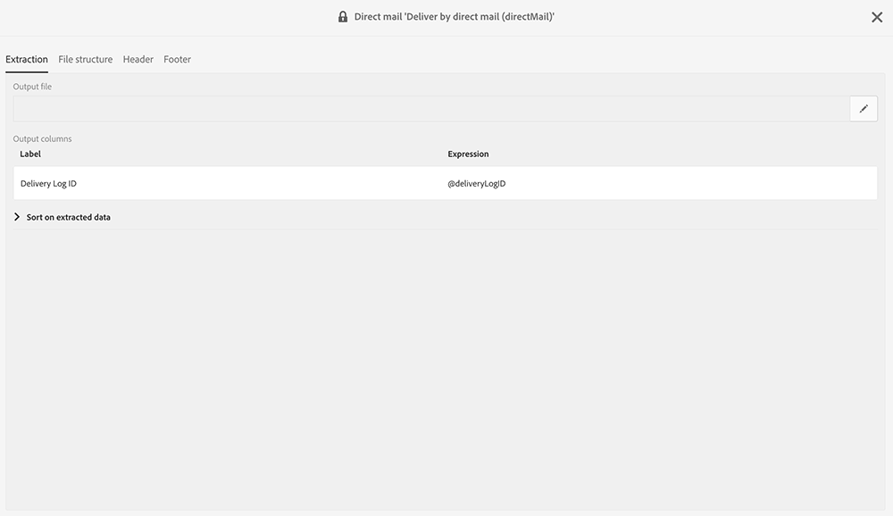
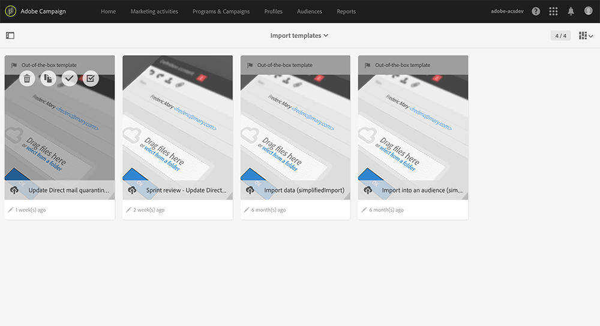

# 발신자에게 반송{#return-to-sender}

보낸 사람에게 돌아가기 정보가 포함된 DM 공급자와의 일반 파일 교환이 지원됩니다. 이를 통해 해당 우편 주소를 향후 통신에서 제외할 수 있습니다. 또한 잘못된 주소로 통지를 받고 다른 채널을 통해 고객과 교류하거나 우편 주소를 업데이트하도록 유도할 수 있습니다.

예를 들어 연락처가 새 위치로 이동되었으며 새 우편 주소를 제공하지 않았습니다. 공급자가 잘못된 주소 목록을 검색하여 잘못된 주소를 자동으로 차단 목록으로 표시하는 이 정보를 Adobe Campaign으로 보냅니다.

이 기능이 작동하기 위해, 다이렉트 메일 기본 배달 템플릿에는 배달 로그 ID가 포함되어 있습니다. 따라서, Adobe Campaign은 프로필 및 배달 데이터를 제공자가 반환하는 정보와 동기화할 수 있습니다.

가져오기 템플릿은 아래에서 사용할 수 있습니다 **[!UICONTROL Adobe Campaign > Resources > Templates > Import templates > Update Direct Mail quarantines and delivery logs]**. 이 템플릿을 복제하여 직접 만듭니다. 가져오기 템플릿 사용에 대한 자세한 내용은 가져오기 템플릿 [사용을 참조하십시오](../../automating/using/importing-data-with-import-templates.md#setting-up-import-templates).

가져오기가 완료되면 Adobe Campaign은 다음 작업을 자동으로 수행합니다.

* 프로필 수준차단 목록에 추가된에 잘못된 주소가 있습니다.
* 전달 기본 지표(KPI)가 업데이트되었습니다.
* 배달 로그가 업데이트되었습니다.

