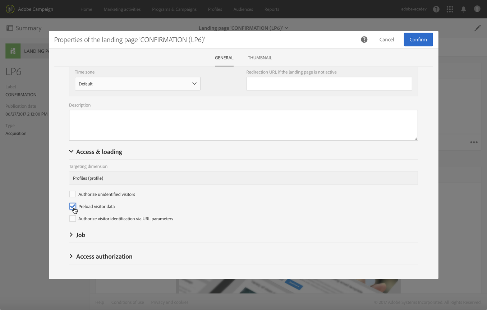

# 이중 옵트인 프로세스 설정{#setting-up-a-double-opt-in-process}

## 이중 옵트인 기본 정보 {#about-double-opt-in}

이중 옵트인 메커니즘은 이메일을 보낼 때 가장 좋은 방법입니다. 틀리거나 잘못된 이메일 주소, 스팸 메일로부터 플랫폼을 보호하고 스팸 불만 가능성을 방지합니다.

원칙은 Campaign 데이터베이스에 &#39;프로필&#39;로 저장하기 전에 이메일 전송을 통해 방문자의 동의를 확인하는 것입니다. 방문자는 온라인 랜딩 페이지를 작성한 후 이메일을 수신하고 확인 링크를 클릭하여 구독을 마무리해야 합니다.

이를 설정하려면 다음을 수행해야 합니다.

1. 방문자가 등록하고 구독할 수 있도록 랜딩 페이지를 만들고 게시합니다. 이 랜딩 페이지는 웹 사이트에서 사용할 수 있습니다. 이 랜딩 페이지를 채우고 제출한 방문자는 최종 유효성 검사 전에 통신을 받지 차단 목록 않도록 데이터베이스에 저장되지만에 추가됩니다(캠페인](../../audiences/using/about-opt-in-and-opt-out-in-campaign.md)의 [차단 목록 관리 참조).
1. 확인 링크가 포함된 옵트인 이메일을 자동으로 작성하여 전송합니다. 이 이메일은 랜딩 페이지를 제출한 모집단을 타겟팅합니다. 이는 &#39;옵트아웃&#39; 프로필을 타겟팅할 수 있는 이메일 템플릿을 기반으로 합니다.
1. 확인 랜딩 페이지로 리디렉션합니다. 이 최종 랜딩 페이지에는 확인 버튼이 표시됩니다. 방문자는 이 버튼을 클릭해야 합니다. 확인이 완료되면 전송할 환영 이메일을 디자인할 수 있으며, 예를 들어 새 수신자를 위해 이메일에 특별 오퍼를 추가할 수 있습니다.

이러한 단계는 모든 매개 변수를 올바르게 활성화하기 위해 Adobe Campaign에서 특정 순서에 따라 설정해야 합니다.

## 1단계: 확인 랜딩 페이지 만들기 {#step-1--create-the-confirmation-landing-page}

이중 옵트인 메커니즘을 설정하는 프로세스는 확인 랜딩 페이지 생성부터 시작합니다. 이 페이지는 방문자가 등록하기 위해 확인 이메일을 클릭하면 표시됩니다.

이 랜딩 페이지를 만들고 구성하려면 다음을 수행해야 합니다.

1. **[!UICONTROL Profile acquisition (acquisition)]** 템플릿을 기반으로 [새 랜딩 페이지](../../channels/using/getting-started-with-landing-pages.md)를 디자인합니다. &#39;**CONFIRMATION**&#39; 레이블을 입력합니다.

   [서비스](../../audiences/using/about-subscriptions.md)를 사용해야 하는 경우 **[!UICONTROL Subscription (sub)]** 템플릿을 사용할 수도 있습니다.

1. 랜딩 페이지 속성을 편집하고 **[!UICONTROL Access and loading]** 섹션 아래에서 **[!UICONTROL Authorize unidentified visitors]** 옵션을 선택 취소하고 **[!UICONTROL Preload visitor data]**&#x200B;를 선택(필수 아님)합니다.

   

1. **[!UICONTROL Job]** > **[!UICONTROL Additional data]** 섹션에서 **[!UICONTROL Add an element]**&#x200B;을(를) 클릭하고 다음의 컨텍스트 경로를 입력합니다.

   /context/profile/blackList

   값을 **false**&#x200B;로 설정하고 **[!UICONTROL Add]**&#x200B;을(를) 클릭합니다.

   

   이 컨텍스트에서는 이메일을 보낼 수 있도록 &#39;차단 목록&#39; 필드를 제거합니다. 확인되지 않은 프로필로 이메일을 보내는 것을 방지하기 위해 첫 번째 랜딩 페이지에서 이 필드를 **true**&#x200B;로 설정했음을 나중에 확인할 수 있습니다. 자세한 내용은 [3단계: 확보 랜딩 페이지 만들기](#step-3--create-the-acquisition-landing-page)를 참조하십시오.

1. 랜딩 페이지의 콘텐츠를 사용자 지정합니다. 예를 들어 개인화된 데이터를 표시하고 확인 버튼의 레이블을 &#39;여기를 클릭하여 내 구독 확인&#39;으로 변경할 수 있습니다.

   

1. 확인 페이지의 콘텐츠를 조정하여 구독자에게 이제 등록되었음을 알립니다.

   

1. 랜딩 페이지를 [테스트 및 게시](../../channels/using/testing-publishing-landing-page.md)합니다.

## 2단계: 확인 이메일 만들기 {#step-2--create-the-confirmation-email}

확인 랜딩 페이지가 생성되면 확인 이메일을 디자인할 수 있습니다. 이 이메일은 확보 랜딩 페이지의 유효성을 검사하는 모든 방문자에게 자동으로 전송됩니다. 이 유효성 검사는 이벤트로 간주되며 이메일은 옵트아웃 모집단을 타겟팅할 수 있는 특정 유형화 규칙에 연결된 트랜잭션 메시지입니다.

이러한 요소를 만드는 단계는 아래에 설명되어 있습니다. 이 이메일 템플릿이 참조되므로 확보 랜딩 페이지를 만들기 전에 이를 따라야 합니다.

### 이벤트 만들기 {#create-the-event}

확인 이메일은 양식의 유효성 검사라는 이벤트에 반응하는 [트랜잭션 메시지](../../channels/using/getting-started-with-transactional-msg.md)입니다. 먼저 이벤트를 만든 다음 트랜잭션 메시지의 템플릿을 만들어야 합니다.

1. Adobe Campaign 로고에서 액세스할 수 있는 **[!UICONTROL Marketing plans]** > **[!UICONTROL Transactional messages]** > **[!UICONTROL Event configuration]** 메뉴에서 이벤트를 만들고 &#39;**CONFIRM**&#39; 레이블을 입력합니다.
1. **[!UICONTROL Profile]** 타겟팅 차원을 선택하고 **[!UICONTROL Create]**&#x200B;을(를) 클릭합니다.

   

1. **[!UICONTROL Fields]** 섹션에서 **[!UICONTROL Create element]**&#x200B;을(를) 클릭하고 데이터 구조에 **[!UICONTROL email]**&#x200B;을(를) 추가하여 조정을 활성화합니다.
1. **[!UICONTROL Enrichment]** 섹션에서  **[!UICONTROL Create element]**&#x200B;을(를) 클릭하고 **[!UICONTROL Profile]** 타겟 리소스를 선택합니다. 그런 다음 필요에 따라 **[!UICONTROL email]** 섹션의 **[!UICONTROL Join definition]** 필드 또는 기타 복합 조정 키에 매핑할 수 있습니다.

   

   서비스를 사용해야 하는 경우 **[!UICONTROL Service]** 타겟 리소스를 추가하고 **[!UICONTROL serviceName]** 필드에 매핑합니다. 자세한 내용은 참조하십시오. 

1. 드롭다운 목록에서 **[!UICONTROL Profile]**&#x200B;을(를) **[!UICONTROL Targeting enrichment]**(으)로 선택합니다.
1. 이벤트를 게시하려면 **[!UICONTROL Publish]**&#x200B;을(를) 클릭합니다.

이벤트가 준비되었습니다. 이제 이메일 템플릿을 디자인할 수 있습니다. 이 템플릿에는 이전에 만든 **CONFIRMATION** 랜딩 페이지에 대한 링크가 포함되어야 합니다. 자세한 내용은 [확인 메시지 디자인](#design-the-confirmation-message)을 참조하십시오.

### 유형화 만들기 {#create-the-typology-rule}

즉시 사용 가능한 유형화를 복제하여 특별한 [유형화](../../sending/using/about-typology-rules.md)를 만들어야 합니다. 이러한 유형 분석을 통해 계약을 아직 확인하지 않았고 여전히 중인 프로파일에 메시지를 보낼 수 차단 목록 있습니다. 기본적으로 유형 분류는 옵트아웃(즉,차단 목록에서) 프로파일을 제외합니다. 이 유형화를 만들려면 다음 단계를 수행합니다.

1. Adobe Campaign 로고에서 **[!UICONTROL Administration]** > **[!UICONTROL Channels]** > **[!UICONTROL Typologies]**&#x200B;을(를) 선택하고 **[!UICONTROL Typologies]**&#x200B;을(를) 클릭합니다.
1. 즉시 사용 가능한 유형화 **[!UICONTROL Transactional message on profile (mcTypologyProfile)]**&#x200B;을(를) 복제합니다.
1. 복제를 확인한 후, 새 유형화를 편집하고 레이블 **TYPOLOGY_PROFILE**&#x200B;을 입력합니다.
1. **차단 목록** 규칙의 주소를 제거합니다.
1. **[!UICONTROL Save]**&#x200B;을(를) 클릭합니다.

이제 이러한 유형화를 확인 이메일과 연결할 수 있습니다.

### 확인 메시지 디자인 {#design-the-confirmation-message}

확인 이메일은 이전에 만든 이벤트를 기반으로 하는 트랜잭션 메시지입니다. 이 메시지를 생성하려면 아래 절차를 따릅니다.

1. Adobe Campaign 로고에서 **[!UICONTROL Marketing plans]** > **[!UICONTROL Transactional messages]**&#x200B;을(를) 선택하고 **[!UICONTROL Transactional messages]**&#x200B;을(를) 클릭합니다.
1. **CONFIRM** 이메일 템플릿을 편집하고 개인화합니다. 기존 콘텐츠를 업로드하거나 기본 제공 템플릿을 사용할 수 있습니다.
1. **CONFIRMATION** 랜딩 페이지에 링크를 추가하고 **[!UICONTROL Confirm]**&#x200B;을(를) 클릭하여 수정 내용을 저장합니다.

   

1. 이메일 템플릿 속성을 편집합니다. **[!UICONTROL Advanced parameters]** > **[!UICONTROL Preparation]** 섹션에서 이전에 만든 **TYPOLOGY_PROFILE** 유형화를 선택합니다.
1. 트랜잭션 메시지를 저장하고 게시합니다.

## 3단계: 확보 랜딩 페이지 만들기 {#step-3--create-the-acquisition-landing-page}

초기 확보 랜딩 페이지를 만들어야 합니다. 이 옵트인 양식은 웹 사이트에 게시됩니다.

이 랜딩 페이지를 만들고 구성하려면 다음을 수행해야 합니다.

1. **[!UICONTROL Profile acquisition (acquisition)]** 템플릿을 기반으로 [새 랜딩 페이지](../../channels/using/getting-started-with-landing-pages.md)를 디자인합니다. &#39;**ACQUISITION**&#39; 레이블을 입력합니다.
1. 랜딩 페이지 속성을 편집합니다. **[!UICONTROL Job]** > **[!UICONTROL Additional data]** 섹션에서 **[!UICONTROL Add an element]**&#x200B;을(를) 클릭하고 다음의 컨텍스트 경로를 입력합니다.

   /context/profile/blackList

   값을 **true**&#x200B;로 설정합니다.

   계약을 확인하지 않은 방문자에게 메시지를 차단 목록 보내지 않고,에 강제로 추가하고, 메시지를 보내지 않도록 하기 위해 필수입니다. CONFIRMATION 랜딩 페이지의 유효성 검사에서는 확인 후 이 필드를 **false**&#x200B;로 설정합니다. 자세한 내용은 [1단계: 확인 랜딩 페이지 만들기](#step-1--create-the-confirmation-landing-page)를 참조하십시오.

1. **[!UICONTROL Job]** > **[!UICONTROL Specific actions]** 섹션에서 **[!UICONTROL Start sending messages]** 옵션을 선택합니다.
1. 연결된 드롭다운 목록에서 생성한 **CONFIRM** 트랜잭션 메시지 템플릿을 선택합니다.

   

1. 브랜드 및 확보해야 하는 데이터에 따라 랜딩 페이지의 콘텐츠를 사용자 지정합니다. 예를 들어 개인화된 데이터를 표시하고 확인 버튼의 레이블을 **내 구독 확인**&#x200B;으로 변경할 수 있습니다.

   

1. 확인 페이지를 사용자 지정하여 새 구독자에게 자신의 구독 유효성을 검사해야 한다고 알립니다.

   

1. 랜딩 페이지를 [테스트 및 게시](../../channels/using/testing-publishing-landing-page.md)합니다.

이제 이중 옵트인 메커니즘이 구성되었습니다. **[!UICONTROL ACQUISITION]** 랜딩 페이지의 공개 URL부터 시작하여 이 절차를 처음부터 끝까지 실행하고 테스트할 수 있습니다. 이 URL은 랜딩 페이지 대시보드에 표시됩니다.
