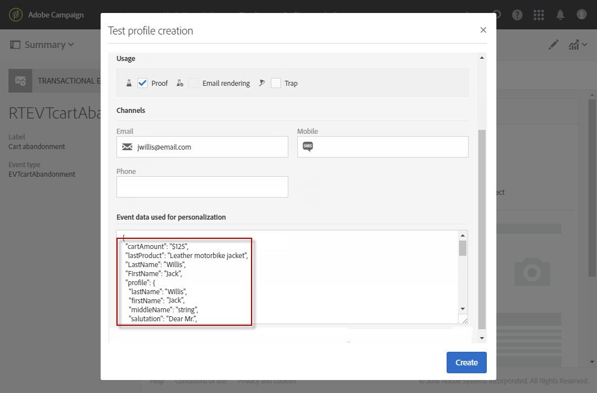

# 트랜잭션 메시지 테스트 {#testing-a-transactional-message}

트랜잭션 메시지를 게시하기 전에 메시지를 제대로 확인할 수 있는 특정 테스트 프로필을 만들 수 있습니다.

## 특정 테스트 프로필 {#defining-specific-test-profile} 정의

메시지를 미리 보고 관련 증거를 전송할 수 있는 이벤트에 연결할 테스트 프로필을 정의합니다.

1. [트랜잭션 메시지 대시보드](../../channels/using/editing-transactional-message.md#accessing-transactional-messages)에서 **[!UICONTROL Create test profile]** 단추를 클릭합니다.

   

1. **[!UICONTROL Event data used for personalization]** 섹션에서 JSON 형식으로 전송할 정보를 지정합니다. 메시지를 미리 볼 때와 테스트 프로필에서 증명를 받을 때 사용할 콘텐츠입니다.

   

   >[!NOTE]
   >
   >메시지를 증가시킨 경우 다른 테이블과 관련된 정보(예: **[!UICONTROL Profile]**)를 입력할 수도 있습니다. [이벤트](../../channels/using/configuring-transactional-event.md#enriching-the-transactional-message-content) 및 [트랜잭션 메시지 개인화](../../channels/using/editing-transactional-message.md#personalizing-a-transactional-message)를 참조하십시오.

1. 테스트 프로필이 만들어지면 트랜잭션 메시지에 미리 지정됩니다. 메시지의 **[!UICONTROL Test profiles]** 블록을 클릭하여 증명의 대상을 확인합니다.

   

새 테스트 프로필을 만들거나 **[!UICONTROL Test profiles]** 메뉴에 이미 있는 테스트 프로필을 사용할 수도 있습니다. 방법은 다음과 같습니다.

1. 왼쪽 상단 모서리에서 **[!UICONTROL Adobe Campaign]** 로고를 클릭한 다음 **[!UICONTROL Profiles & audiences]** > **[!UICONTROL Test profiles]**&#x200B;을 선택합니다.
1. **[!UICONTROL Event]** 섹션에서 방금 만든 이벤트를 선택합니다. 예제에서는 &quot;장바구니 포기(EVTcartAbandonment)&quot;를 선택합니다.
1. **[!UICONTROL Event data]** 텍스트 상자에 JSON 형식으로 전송할 정보를 지정합니다.

   

1. 변경 내용을 저장합니다.
1. [만든 ](../../channels/using/editing-transactional-message.md#accessing-transactional-messages) 메시지에 액세스하고 업데이트된 테스트 프로필을 선택합니다.

**관련 항목:**

* [테스트 프로필 관리](../../audiences/using/managing-test-profiles.md)
* [대상자 만들기](../../audiences/using/creating-audiences.md)

## 증명 {#sending-proof} 전송

하나 이상의 특정 테스트 프로필을 만들고 트랜잭션 메시지를 저장한 후에는 이를 테스트하기 위한 증거를 보낼 수 있습니다.

증명 전송 단계는 [증거 전송](../../sending/using/sending-proofs.md) 섹션에 자세히 설명되어 있습니다.
