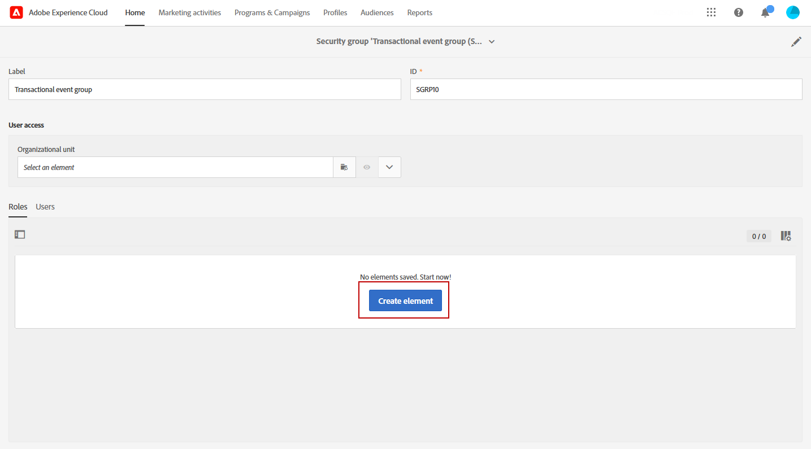
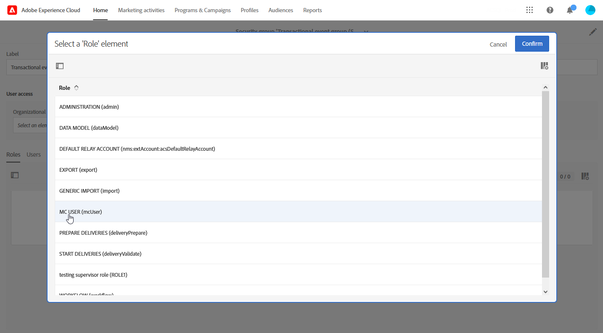

# 트랜잭션 이벤트 개선 사항 {#transactional-event-improvements}

>[!AVAILABILITY]
>
>이러한 기능은 현재 조직 집합(제한된 가용성)에서만 사용할 수 있습니다. 자세한 내용은 Adobe 담당자에게 문의하십시오.

현재 Adobe Campaign Standard에서 관리자 보안 그룹이 없는 사용자는 트랜잭션 이벤트에 액세스, 만들기 또는 게시할 수 없으므로 이벤트를 구성하고 게시해야 하지만 관리자 권한이 없는 비즈니스 사용자에게 문제가 발생합니다. 또한 트랜잭션 이벤트를 복제할 수 없습니다.

다음과 같은 트랜잭션 메시지 액세스 제어 개선 사항을 구현했습니다.

* 새 항목 **[!UICONTROL Role]**, 호출됨 **MC 사용자**&#x200B;관리자가 아닌 사용자가 트랜잭션 이벤트 구성을 관리할 수 있도록 가 추가되었습니다. 다음 **MC 사용자** 역할은 이러한 사용자에게 트랜잭션 이벤트 및 메시지에 액세스, 만들기, 게시 및 게시 취소 기능을 부여합니다.

* 이제 실행 게재(즉, 트랜잭션 메시지를 편집하고 다시 게시할 때마다 또는 기본적으로 한 달에 한 번 만들어지는 기술 메시지)가 **[!UICONTROL Organizational unit]** 로 제한되지 않고 이벤트를 생성하는 사용자가 속한 보안 그룹의 **[!UICONTROL Organizational unit]** / **메시지 센터 에이전트(mcExec)** 보안 그룹입니다.

* **관리자** 은(는) 이제 게시된 트랜잭션 이벤트와 을(를) 가진 사용자를 복제할 수 있습니다. **MC 사용자** 역할이 동일한 경우 해당 역할 **조직 단위** 계층 을 이벤트를 만든 사용자로 지정합니다.

## MC 사용자 역할 할당 {#assign-role}

을(를) 할당하려면 **MC 사용자** 보안 그룹에 대한 역할:

1. 새로 만들기 **[!UICONTROL Security group]** 또는 기존 항목을 업데이트합니다. [자세히 알아보기](../../administration/using/managing-groups-and-users.md)

1. 클릭 **[!UICONTROL Create element]** 보안 그룹에 역할을 할당합니다.

   

1. MC 사용자 선택 **[!UICONTROL Role]** 및 클릭 **[!UICONTROL Confirm]**.

   >[!IMPORTANT]
   >
   > 운영자에게 MC 사용자 역할을 할당하면 이벤트를 게시 취소할 수 있으므로 주의해서 진행하십시오.

   

1. 구성이 완료되면 다음을 클릭합니다. **[!UICONTROL Save]**.

이에 연결된 사용자 **[!UICONTROL Security group]** 이제 트랜잭션 이벤트 및 메시지에 액세스하고 메시지를 만들고 게시할 수 있습니다.

## MC 사용자 보안 그룹 할당 {#assign-group}

1. Admin Console에서 **제품** 탭.

1. 선택 **Adobe Campaign Standard** 그런 다음 인스턴스를 선택합니다.

1. 다음에서 **제품 프로필** 목록에서 **MC 사용자** 그룹입니다.

1. 클릭 **사용자 추가** 이 제품 프로필에 추가할 프로필의 이름, 사용자 그룹 또는 이메일 주소를 입력합니다.

1. 추가했으면 다음을 클릭합니다. **저장**.

이에 추가된 사용자 **[!UICONTROL Security group]** 이제 트랜잭션 이벤트 및 메시지에 액세스하고 메시지를 만들고 게시할 수 있습니다.

## 중복 트랜잭션 이벤트 {#duplicate-transactional-events}

을(를) 가진 사용자 **관리자** 보안 그룹<!--([Functional administrators](../../administration/using/users-management.md#functional-administrators)?)--> 이제 이벤트가 복제된 경우 이벤트 구성을 복제할 수 있습니다. **게시됨**.

또한 관리자가 아닌 사용자가 **MC 사용자** 이제 역할은 이벤트 구성에 액세스할 수 있지만 복제할 권한은 **조직 단위** 속해 있습니다. 현재 사용자와 이벤트를 만든 사용자가 동일한 조직 단위 계층에 속하는 경우 중복이 허용됩니다.

예를 들어 &#39;프랑스 판매&#39; 조직 단위에 속하는 사용자가 이벤트 구성을 만드는 경우:

* 조직 단위가 &#39;Paris Sales&#39;인 다른 사용자는 이 이벤트를 복제할 수 있습니다. &#39;Paris Sales&#39;는 &#39;France Sales&#39; 조직 단위의 일부이기 때문입니다.

* 단, 조직 단위가 &#39;샌프란시스코 영업&#39;인 사용자는 &#39;샌프란시스코 영업&#39;이 &#39;프랑스 영업&#39; 조직 단위와 별개인 &#39;미국 영업&#39; 조직 단위 아래에 있으므로 이 작업을 수행할 수 없습니다.

이벤트 구성을 복제하려면 아래 단계를 따르십시오.

1. 다음을 클릭합니다. **Adobe** 로고, 왼쪽 상단 모서리에서 **[!UICONTROL Marketing plans]** > **[!UICONTROL Transactional messages]** > **[!UICONTROL Event configuration]**.

1. 선택한 게시한 이벤트 구성 위에 마우스를 놓고 **[!UICONTROL Duplicate element]** 단추를 클릭합니다.

   

   >[!CAUTION]
   >
   >게시되지 않은 이벤트 구성은 복제할 수 없습니다. [자세히 알아보기](publishing-transactional-event.md)

1. 복제된 이벤트가 자동으로 표시됩니다. 여기에는 원래 이벤트에 대해 정의한 것과 동일한 구성이 포함되지만 **[!UICONTROL Draft]** 상태.

   

1. 해당 트랜잭션 메시지가 자동으로 만들어집니다. 액세스하려면 다음으로 이동 **[!UICONTROL Transactional messages]** > **[!UICONTROL Transactional messages]**.

   

1. 새로 복제된 메시지를 엽니다. 여기에는 원래 메시지에 대해 정의한 것과 동일한 디자인이 포함되어 있지만 **[!UICONTROL Draft]** 원본 트랜잭션 메시지가 게시된 경우에도 상태.

   

1. 이제 이 메시지를 편집하고 개인화할 수 있습니다. 다음을 참조하십시오 [트랜잭션 메시지 편집](../../channels/using/editing-transactional-message.md).

## 영향 {#impacts}

아래 표는 이러한 개선 사항의 영향을 간략하게 설명합니다.

| 오브젝트 | 이 변경 전 | 이 변경 후 |
|:-: | :--: | :-:|
| 트랜잭션 이벤트 | 다음 내의 사용자만 **관리자** 보안 그룹은 이벤트를 만들고 게시할 수 있습니다. | 다음 **MC 사용자** 사용자는 역할을 통해 이벤트를 만들고 게시할 수 있습니다. |
| 트랜잭션 메시지 | 트랜잭션 메시지는 **조직 단위** / **메시지 센터 에이전트(mcExec)** 보안 그룹입니다. | 트랜잭션 메시지는 **조직 단위** 트랜잭션 이벤트/메시지를 만드는 사용자가 속한 보안 그룹의 이름입니다. |
| 실행 게재 | 실행 게재가 로 설정됩니다. **조직 단위** / **메시지 센터 에이전트(mcExec)** 보안 그룹입니다. | 실행 게재가 로 설정됩니다. **조직 단위** 트랜잭션 이벤트/메시지를 만드는 사용자가 속한 보안 그룹의 이름입니다. |
| 게시된 트랜잭션 이벤트 | 어떤 사용자도 복제할 수 없습니다. | <ul><li>을(를) 가진 사용자 **관리자** 보안 그룹은 게시된 이벤트를 복제할 수 있습니다.</li> <li>을(를) 가진 사용자 **MC 사용자** 동일한 이벤트에 있는 경우 역할은 게시된 이벤트를 복제할 수 있습니다. **조직 단위** 계층 을 이벤트를 만든 사용자로 지정합니다.</li></ul> |

<!--Transactional Message Templates| Transactional Message templates are set to the Organizational unit **All**. | Transaction Message Template will be set to the **Organizational unit** of the security group to which the user creating the message template belongs.-->