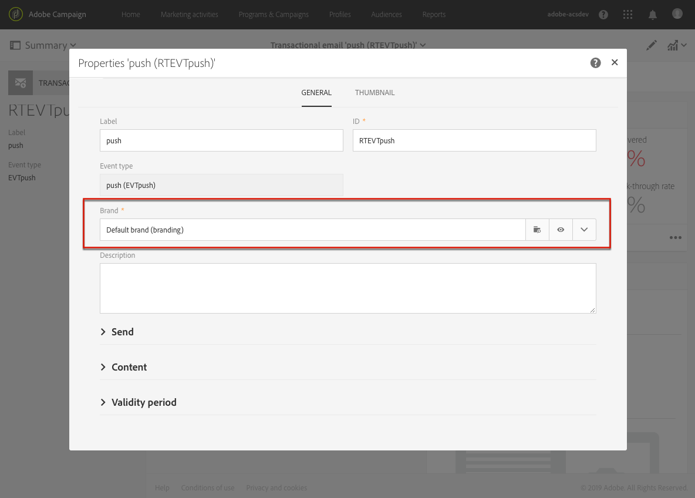

# 트랜잭션 메시징 모범 사례 및 제한 사항 {#transactional-messaging-limitations}

이 섹션에는 트랜잭션 메시지 작성을 시작하기 전에 알아야 할 우수 사례 및 제한 사항이 나열됩니다.

<!--For more on transactional messages, including on how to configure and create them, see [Getting started with transactional messaging](../../channels/using/getting-started-with-transactional-msg.md).-->

## 권한 {#permissions}

[관리](../../administration/using/users-management.md#functional-administrators) 역할을 가진 사용자만 트랜잭션 이벤트를 구성하고 트랜잭션 메시지에 액세스할 수 있습니다.

## 이벤트 구성 및 게시 {#design-and-publication}

트랜잭션 이벤트를 구성하고 게시할 때 수행해야 하는 일부 단계는 되돌릴 수 없습니다. 다음 제한 사항을 알아 두어야 합니다.

* 트랜잭션 메시징에 사용할 수 있는 채널은 다음과 같습니다.**[!UICONTROL Email]**, **[!UICONTROL Mobile (SMS)]** 및 **[!UICONTROL Push notification]**.
* 각 이벤트 구성에 대해 채널은 하나씩만 사용할 수 있습니다. [이벤트 만들기](../../channels/using/configuring-transactional-event.md#creating-an-event)를 참조하십시오.
* 이벤트를 만든 후에는 채널을 변경할 수 없습니다. 따라서 메시지가 성공적으로 보내지지 않는 경우 워크플로우를 사용하여 다른 채널에서 메시지를 보낼 수 있는 메커니즘을 설계해야 합니다. [워크플로우 데이터 및 프로세스](../../automating/using/get-started-workflows.md)를 참조하십시오.
* 이벤트를 만든 후에는 타겟팅 차원(**[!UICONTROL Real-time event]** 또는 **[!UICONTROL Profile]**)을 변경할 수 없습니다. [이벤트 만들기](../../channels/using/configuring-transactional-event.md#creating-an-event)를 참조하십시오.
* 게시를 롤백할 수는 없지만, 이벤트를 게시 취소할 수는 있습니다. 이 작업을 수행하면 해당 이벤트와 관련 트랜잭션 메시지가 액세스할 수 없는 상태가 됩니다. [이벤트 게시 취소](../../channels/using/publishing-transactional-event.md#unpublishing-an-event)를 참조하십시오.
* 이벤트를 게시할 때 자동으로 만들어지는 트랜잭션 메시지만 해당 이벤트와 연결할 수 있습니다. [이벤트 미리 보기 및 게시](../../channels/using/publishing-transactional-event.md#previewing-and-publishing-the-event)를 참조하십시오.

## 트랜잭션 메시지 수 {#transactional-message-number}

게시된 거래 메시지의 수는 플랫폼에 중요한 영향을 줄 수 있습니다. 최적의 성능을 위해 게시된 트랜잭션 메시지 수는 100개 미만이어야 합니다. 이를 위해 사용하지 않는 트랜잭션 메시지를 게시 취소하거나 삭제합니다. [트랜잭션 메시지 게시 취소](../../channels/using/publishing-transactional-message.md#unpublishing-a-transactional-message) 및 [트랜잭션 메시지 삭제](../../channels/using/publishing-transactional-message.md#deleting-a-transactional-message)를 참조하십시오.

최상의 성능을 위해 사용하지 않는 이벤트를 게시 취소하거나 삭제할 수도 있습니다. 또한 이벤트를 게시 취소하거나 삭제하는 것은 해당 트랜잭션 메시지와 해당 전송 및 추적 로그가 있는 경우 게시 취소 또는 삭제됩니다. [이벤트](../../channels/using/publishing-transactional-event.md#unpublishing-an-event) 게시 취소 및 [이벤트](../../channels/using/publishing-transactional-event.md#deleting-an-event) 삭제를 참조하십시오.

## 개인화 {#personalization}

메시지 콘텐츠를 개인화할 수 있는 방법은 트랜잭션 메시지의 유형에 따라 다릅니다. 다음은 특정 목록입니다.

### 이벤트 기반 트랜잭션 메시지

* 이벤트 자체에 포함된 데이터에서 개인화 정보를 가져옵니다. [이벤트 기반 트랜잭션 메시지 구성](../../channels/using/configuring-transactional-event.md#event-based-transactional-messages)을 참조하십시오.
* **이벤트 트랜잭션 메시지에서&#x200B;**[!UICONTROL Unsubscription link]**내용 블록을 사용할 수 없습니다.**
* 이벤트 기반 트랜잭션 메시지는 보낸 이벤트에 있는 데이터만 사용하여 수신자와 메시지 콘텐츠 개인화를 정의합니다. 그러나 Adobe Campaign 데이터베이스의 정보를 사용하여 트랜잭션 메시지의 콘텐츠를 보강할 수 있습니다. [이벤트 포함](../../channels/using/configuring-transactional-event.md#enriching-the-transactional-message-content) 및 [트랜잭션 메시지 개인화](../../channels/using/editing-transactional-message.md#personalizing-a-transactional-message)를 참조하십시오.
* 이벤트 트랜잭션 메시지에는 프로필 정보가 포함되어 있지 않기 때문에 피로도 규칙이 적용되지 않습니다. 프로필로 보강했을 경우에도 마찬가지입니다.

### 프로필 기반 트랜잭션 메시지

* 이벤트에 포함된 데이터나 조정된 프로필 레코드에서 개인화 정보를 가져올 수 있습니다. [프로필 기반 트랜잭션 메시지 구성](../../channels/using/configuring-transactional-event.md#profile-based-transactional-messages) 및 [프로필 기반 트랜잭션 메시지 지정](../../channels/using/editing-transactional-message.md#profile-transactional-message-specificities)을 참조하십시오.
* 프로필 트랜잭션 메시지의 **에서&#x200B;**[!UICONTROL Unsubscription link]**내용 블록을 사용할 수 있습니다.** [콘텐츠 블록 추가](../../designing/using/personalization.md#adding-a-content-block)를 참조하십시오.
* 프로필 트랜잭션 메시지의 경우 피로도 규칙이 적용됩니다. [피로도 규칙](../../sending/using/fatigue-rules.md)을 참조하십시오.

### 제품 목록

제품 목록은 트랜잭션 **이메일 메시지**&#x200B;에서만 사용할 수 있습니다. [트랜잭션 메시지에서 제품 목록 사용](../../channels/using/editing-transactional-message.md#using-product-listings-in-a-transactional-message)을 참조하십시오.

## 브랜딩 {#permissions-and-branding}

[브랜딩](../../administration/using/branding.md) 관리 측면에서 볼 때, 트랜잭션 메시지는 표준 메시지보다 유연성이 낮습니다. Adobe는 트랜잭션 메시지에 사용하는 모든 브랜드를 **[!UICONTROL All]** [ 조직 단위](../../administration/using/organizational-units.md)로 연결하는 것을 권장합니다. 자세한 내용은 아래 설명을 참조하십시오.

트랜잭션 메시지를 편집할 때 브랜드에 연결하여 브랜드 이름이나 브랜드 로고와 같은 일부 매개 변수를 자동으로 적용할 수 있습니다. 트랜잭션 메시지 속성에서 기본적으로 **[!UICONTROL Default brand]**&#x200B;이(가) 선택됩니다.

트랜잭션 메시지에 사용하는 모든 개체(브랜딩 포함)는 **[!UICONTROL Message Center]** 조직 단위에서 볼 수 있어야 합니다. 즉, 이 개체는 **[!UICONTROL Message Center]** 또는 **[!UICONTROL All]** 조직 단위로 표시되어야 합니다.

하지만 메시지 속성에서 선택한 브랜드가 **[!UICONTROL Message Center]**&#x200B;나 **[!UICONTROL All]**&#x200B;와(과) 다른 조직 단위에 연결되어 있는 경우 오류가 발생하여 트랜잭션 메시지를 보낼 수 없습니다.

따라서 트랜잭션 메시지의 컨텍스트에서 다중 브랜딩을 사용하려면 모든 브랜드를 **[!UICONTROL Message Center]** 조직 단위나 **[!UICONTROL All]** 조직 단위에 연결해야 합니다.

## 트랜잭션 메시지 내보내기 및 가져오기 {#exporting-and-importing-transactional-messages}

* 트랜잭션 메시지를 내보내려면 [패키지 내보내기 만들기](../../automating/using/managing-packages.md#creating-a-package) 시 해당 이벤트 구성을 포함해야 합니다.
* 트랜잭션 메시지를 [패키지로 가져오기](../../automating/using/managing-packages.md#importing-a-package)하면 트랜잭션 메시지 목록에 표시되지 않습니다. 연결된 트랜잭션 메시지를 사용할 수 있게 하려면 해당 이벤트 구성을 [게시](../../channels/using/publishing-transactional-event.md)해야 합니다.
