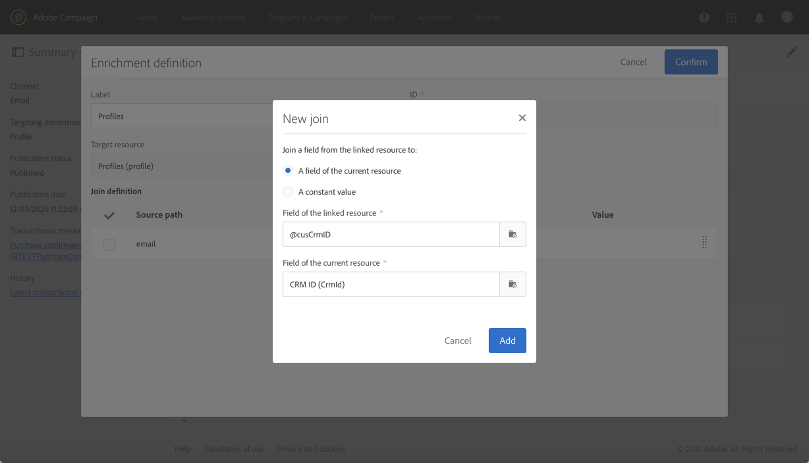

# 트랜잭션 메시지 사용 사례 {#transactional-messaging-use-case}

이 예에서는 Adobe Campaign 트랜잭션 메시지 기능을 사용하여 웹 사이트에서 각 구매 후 CRM ID를 통해 고객을 식별하는 확인 이메일을 보내려고 합니다.

전제 조건은 다음과 같습니다.

* **[!UICONTROL Profile]** 리소스가 CRM ID에 해당하는 새 필드로 확장되었는지 확인하십시오.

* 구매에 해당하는 사용자 지정 리소스를 만들어 게시하고 **[!UICONTROL Profile]** 리소스에 연결합니다. 이렇게 하면 이 리소스에서 정보를 검색하여 메시지 콘텐츠를 보강할 수 있습니다.

리소스 확장, 만들기 및 게시에 대한 자세한 내용은 [이 섹션](../../developing/using/key-steps-to-add-a-resource.md)을 참조하세요.

이 사용 사례를 구현하는 주요 단계는 아래에 나와 있습니다.

>[!NOTE]
>
>트랜잭션 메시지 일반 프로세스의 그래픽 표현을 보려면 [이 스키마](../../channels/using/getting-started-with-transactional-msg.md#key-steps)를 참조하십시오.

## 1단계 - 이벤트 구성 만들기 및 게시 {#create-event-configuration}

1. **[!UICONTROL Email]** 채널을 사용하여 새 이벤트를 만듭니다. [이벤트 만들기](../../channels/using/configuring-transactional-event.md#creating-an-event)를 참조하십시오.

1. **[!UICONTROL Profile]** 타겟팅 차원을 선택하여 [프로필 기반 트랜잭션 메시지를 만듭니다](../../channels/using/configuring-transactional-event.md#profile-based-transactional-messages).

1. 트랜잭션 메시지를 개인화하는 데 사용할 수 있는 특성을 정의합니다. 이 예에서는 &quot;CRM ID&quot; 및 &quot;제품 식별자&quot; 필드를 추가합니다. [이벤트 특성 정의](../../channels/using/configuring-transactional-event.md#defining-the-event-attributes)를 참조하세요.

   

1. 고객의 구매 관련 정보로 메시지 콘텐츠를 보강하려면 **[!UICONTROL Purchase]** 리소스를 타겟팅하는 데이터 보강 프로그램을 만드십시오. [이벤트 보강](../../channels/using/configuring-transactional-event.md#enriching-the-transactional-message-content)을 참조하세요.

   

1. 이전에 이벤트에 추가한 &quot;제품 식별자&quot; 필드와 **[!UICONTROL Purchase]** 리소스의 해당 필드 사이에 조인 조건을 만듭니다.

   

1. 프로필 기반 이벤트에는 필수이므로 **[!UICONTROL Profile]** 리소스를 타겟팅하는 데이터 보강 작업도 만들어야 합니다.

1. 이전에 메시지에 추가한 &quot;CRM ID&quot; 필드와 확장한 **[!UICONTROL Profile]** 리소스의 해당 필드 사이에 조인 조건을 만듭니다. <!--What's the purpose to have created a CRM ID for this event and to have the CRM ID as a join condition? could it be any other field provided you created it in the event?-->

   

1. **[!UICONTROL Targeting enrichment]** 섹션에서 게재 실행 중에 메시지 대상으로 사용될 **[!UICONTROL Profile]** 리소스에 대한 데이터 보강 기능을 선택합니다.

   

1. 이벤트를 미리 보고 게시합니다. [이벤트 미리 보기 및 게시](../../channels/using/publishing-transactional-event.md#previewing-and-publishing-the-event)를 참조하십시오.

## 2단계 - 트랜잭션 메시지 편집 및 게시 {#create-transactional-message}

1. 이벤트를 게시할 때 자동으로 생성된 트랜잭션 메시지로 이동합니다. [트랜잭션 메시지에 액세스](../../channels/using/editing-transactional-message.md#accessing-transactional-messages)를 참조하십시오.

1. 메시지를 편집하고 개인화합니다. [프로필 트랜잭션 메시지 편집](../../channels/using/editing-transactional-message.md#editing-profile-transactional-message)을 참조하세요.

1. **[!UICONTROL Profile]** 리소스에 추가한 &quot;CRM ID&quot; 필드와의 조정을 통해 메시지를 [개인화](../../designing/using/personalization.md#inserting-a-personalization-field)하기 위해 모든 프로필 정보에 직접 액세스할 수 있습니다.

   

1. &quot;제품 식별자&quot; 필드와의 조정을 통해 **[!UICONTROL Purchase]** 리소스의 필드를 추가하여 고객의 구매와 관련된 정보로 메시지 콘텐츠를 보강할 수 있습니다.

   

   이렇게 하려면 상황별 도구 모음에서 **[!UICONTROL Insert personalization field]**&#x200B;을(를) 선택합니다. **[!UICONTROL Context]** > **[!UICONTROL Transactional event]** > **[!UICONTROL Event context]** 노드에서 **[!UICONTROL Purchase]** 사용자 지정 리소스에 해당하는 노드를 열고 필드를 선택합니다.

1. 특정 테스트 프로필을 사용하여 메시지를 테스트할 수 있습니다. [트랜잭션 메시지 테스트](../../channels/using/testing-transactional-message.md#testing-a-transactional-message)를 참조하세요.

1. 콘텐츠가 준비되면 변경 사항을 저장하고 메시지를 게시합니다. [트랜잭션 메시지 게시](../../channels/using/publishing-transactional-message.md#publishing-a-transactional-message)를 참조하십시오.

## 3단계 - 이벤트 트리거 통합 {#integrate-event-trigger}

이벤트를 웹 사이트에 통합합니다. [이벤트 트리거 통합](../../channels/using/getting-started-with-transactional-msg.md#integrate-event-trigger)을(를) 참조하십시오.

## 4단계 - 메시지 게재 {#message-delivery}

이 단계를 모두 완료하면 고객이 웹 사이트에서 제품을 구입하는 즉시 구매에 대한 정보를 포함하는 개인화된 확인 이메일을 받게 됩니다.
