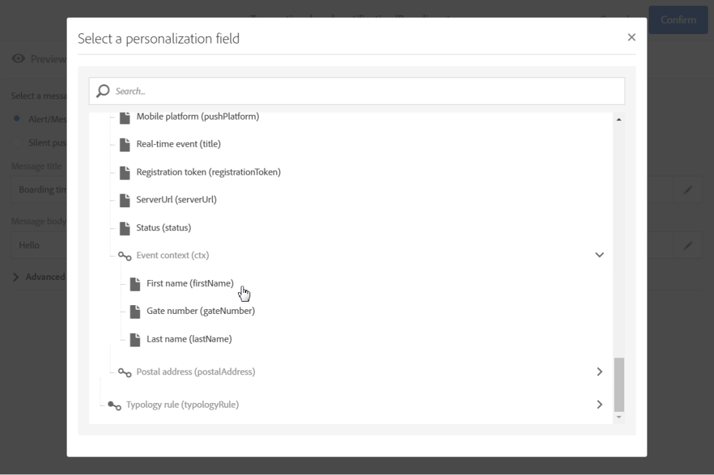

# 트랜잭션 푸시 알림{#transactional-push-notifications}

Adobe Campaign을 사용하여 iOS 및 Android 모바일 장치에서 트랜잭션 푸시 알림을 전송할 수 있습니다. 이러한 메시지는 Experience Cloud Mobile SDK를 활용하여 Adobe Campaign에서 설정한 모바일 애플리케이션에서 수신됩니다.

>[!NOTE]
>
>푸시 채널은 선택 사항입니다. 사용권 계약을 확인하십시오. 표준 푸시 알림에 대한 자세한 내용은 [푸시 알림 정보](../../channels/using/about-push-notifications.md)를 참조하십시오.

트랜잭션 푸시 알림을 전송하려면 이에 따라 Adobe Campaign을 구성해야 합니다. [모바일 응용 프로그램 구성](../../administration/using/configuring-a-mobile-application.md)을 참조하십시오.

두 가지 유형의 트랜잭션 푸시 알림을 전송할 수 있습니다.

* [이벤트를 타깃팅하는 트랜잭션 푸시 알림](#transactional-push-notifications-targeting-an-event)
* [Adobe Campaign 데이터베이스의 트랜잭션 푸시 알림 ](#transactional-push-notifications-targeting-a-profile) 프로필 타깃팅

## 이벤트 {#transactional-push-notifications-targeting-an-event}을(를) 대상으로 하는 트랜잭션 푸시 알림

Adobe Campaign을 사용하여 모바일 응용 프로그램에서 알림을 받도록 선택한 모든 사용자&#x200B;**에게**&#x200B;익명 트랜잭션 푸시 알림을 보낼 수 있습니다.

이 경우 이벤트 자체에 포함된 데이터만 배달 대상&#x200B;**을 정의하는 데 사용됩니다.** Adobe Campaign 통합 프로필 데이터베이스의 데이터는 활용되지 않습니다.

### 이벤트 기반 트랜잭션 푸시 알림 구성 {#configuring-event-based-transactional-push-notification}

모바일 응용 프로그램에서 알림을 수신하기로 선택한 모든 사용자에게 트랜잭션 푸시 알림을 전송하려면 먼저 이벤트 자체에 포함된 데이터를 타깃팅하는 이벤트를 만들고 구성해야 합니다.

>[!NOTE]
>
>[이벤트 특성](../../channels/using/configuring-transactional-event.md#defining-the-event-attributes)(이벤트의 데이터) 및 [이벤트 농축량](../../channels/using/configuring-transactional-event.md#enriching-the-transactional-message-content)(캠페인 데이터베이스의 데이터)을 사용하여 이벤트 기반 트랜잭션 푸시 알림의 컨텐츠를 개인화할 수 있습니다. [아래 예](#sending-event-based-transactional-push-notification)를 참조하십시오.

이벤트는 다음 세 가지 요소를 포함해야 합니다.

* 하나의 모바일 응용 프로그램 및 하나의 장치에 대한 사용자 ID인 **등록 토큰**&#x200B;입니다. Adobe Campaign 데이터베이스의 프로필에 해당되지 않을 수 있습니다.
* **모바일 응용 프로그램 이름**(모든 장치용 하나 - Android 및 iOS). 사용자의 장치에 대한 푸시 알림을 수신하는 데 사용될 Adobe Campaign에 구성된 모바일 응용 프로그램의 ID입니다. 자세한 내용은 [모바일 응용 프로그램 구성](../../administration/using/configuring-a-mobile-application.md)을 참조하십시오.
* **푸시 플랫폼**(Android의 경우 &quot;gcm&quot;, iOS의 경우 &quot;apns&quot;)입니다.

이벤트를 구성하려면 아래 단계를 수행하십시오.

1. 이벤트 구성을 만들 때 **[!UICONTROL Push notification]** 채널과 **[!UICONTROL Real-time event]** 타깃팅 차원을 선택합니다([이벤트 만들기](../../channels/using/configuring-transactional-event.md#creating-an-event) 참조).
1. 이벤트에 필드를 추가합니다. 이를 통해 트랜잭션 메시지를 개인화할 수 있습니다([이벤트 특성 정의](../../channels/using/configuring-transactional-event.md#defining-the-event-attributes) 참조). 이 예에서 &quot;gateNumber&quot;, &quot;lastname&quot; 및 &quot;firstname&quot; 필드를 정의합니다.
1. 또한 메시지의 내용을 강화할 수 있습니다. 이렇게 하려면 이벤트 구성에 연결된 테이블에서 필드를 추가합니다([이벤트 실행](../../channels/using/configuring-transactional-event.md#enriching-the-transactional-message-content) 참조).

   <!--Event-based transactional messaging is supposed to use only the data that are in the sent event to define the recipient and the message content personalization. However, you can enrich the content of your transactional message using information from the Adobe Campaign database.-->

1. [이벤트를 미리 보고 게시합니다](../../channels/using/publishing-transactional-event.md#previewing-and-publishing-the-event).

   이벤트를 미리 볼 때 REST API에는 배달을 대상으로 하는 데 사용할 &quot;registrationToken&quot;, &quot;application&quot; 및 &quot;pushPlatform&quot; 속성이 포함됩니다.

   

   이벤트가 게시되면 새 이벤트에 연결된 트랜잭션 푸시 알림이 자동으로 만들어집니다. 이제 방금 만든 메시지를 수정하고 게시할 수 있습니다([이 섹션](#sending-event-based-transactional-push-notification) 참조).

1. 이벤트를 웹 사이트에 통합합니다([이벤트를 트리거하는 이벤트 통합 참조).](../../channels/using/getting-started-with-transactional-msg.md#integrate-event-trigger)

### 이벤트 기반 트랜잭션 푸시 알림 전송 {#sending-event-based-transactional-push-notification}

예를 들어, 한 항공사 회사는 모바일 애플리케이션 사용자를 탑승을 위해 관련 게이트로 이동할 수 있도록 초대하려고 합니다.

이 회사는 하나의 모바일 애플리케이션을 사용하여 단일 디바이스를 통해 사용자당(등록 토큰으로 식별됨) 하나의 트랜잭션 푸시 알림을 전송합니다.

1. 만든 트랜잭션 메시지로 이동하여 편집합니다. [트랜잭션 메시지 액세스](../../channels/using/editing-transactional-message.md#accessing-transactional-messages)를 참조하십시오.

   

1. 메시지의 제목과 본문을 수정하려면 **[!UICONTROL Content]** 블록을 클릭합니다.

1. 이벤트를 만들 때 정의한 요소를 추가하기 위해 개인화 필드를 삽입할 수 있습니다([이벤트 특성 정의](../../channels/using/configuring-transactional-event.md#defining-the-event-attributes) 참조).

   

   이러한 필드를 찾으려면 항목 옆에 있는 연필을 클릭하고 **[!UICONTROL Insert personalization field]**&#x200B;을 클릭한 다음 **[!UICONTROL Context]** > **[!UICONTROL Real-time event]** > **[!UICONTROL Event context]**&#x200B;을 선택합니다.

   

   푸시 알림 컨텐츠 편집에 대한 자세한 내용은 [푸시 알림 준비 및 전송](../../channels/using/preparing-and-sending-a-push-notification.md)을 참조하십시오.

1. Adobe Campaign 데이터베이스의 추가 정보를 사용하려는 경우에도 트랜잭션 메시지 내용을 보완할 수 있습니다([이벤트 실행](../../channels/using/configuring-transactional-event.md#enriching-the-transactional-message-content) 참조).

1. 변경 내용을 저장하고 메시지를 게시합니다. [트랜잭션 메시지 게시](../../channels/using/publishing-transactional-message.md#publishing-a-transactional-message)를 참조하십시오.

1. Adobe Campaign Standard REST API를 사용하여, 보드 데이터가 포함된 이벤트를 Android(WeFlight)의 단일 모바일 응용 프로그램(WeFlight)을 사용하여 등록 토큰(ABCDEF123456789)에 전송합니다.

   ```
   {
     "registrationToken":"ABCDEF123456789",
     "application":"WeFlight",
     "pushPlatform":"gcm",
     "ctx":
     {
       "gateNumber":"Gate B18",
       "lastname":"Green",
       "firstname":"Jane"
     }
   }
   ```

   이벤트 트리거를 외부 시스템에 통합하는 방법에 대한 자세한 내용은 [이벤트 트리거 통합](../../channels/using/getting-started-with-transactional-msg.md#integrate-event-trigger)을 참조하십시오.

등록 토큰이 존재하는 경우 해당 사용자는 다음 내용이 포함된 트랜잭션 푸시 알림을 받습니다.

*&quot;안녕하세요, 제인 그린, 탑승이 막 시작되었습니다! 게이트 B18로 진행하십시오.&quot;*

## 프로파일 {#transactional-push-notifications-targeting-a-profile}을(를) 대상으로 하는 트랜잭션 푸시 알림

모바일 응용 프로그램&#x200B;**에 가입한 Adobe Campaign 프로필으로 트랜잭션 푸시 알림**&#x200B;을(를) 보낼 수 있습니다. 이 배달에는 받는 사람의 이름과 같은 [개인화 필드](../../designing/using/personalization.md#inserting-a-personalization-field)가 Adobe Campaign 데이터베이스에서 직접 검색될 수 있습니다.

이 경우 이벤트에는 일부 필드 **이(가) 포함되어야 하며, 이 필드는 Adobe Campaign 데이터베이스**&#x200B;의 프로필로 조정할 수 있습니다.

프로파일을 타깃팅할 때 모바일 애플리케이션 및 디바이스당 하나의 트랜잭션 푸시 알림이 전송됩니다. 예를 들어 Adobe Campaign 사용자가 두 개의 응용 프로그램에 가입한 경우 이 사용자는 두 개의 알림을 받게 됩니다. 사용자가 두 개의 다른 장치를 사용하는 동일한 응용 프로그램에 가입한 경우 이 사용자는 각 장치에 대한 알림을 받게 됩니다.

프로필에서 구독한 모바일 응용 프로그램이 이 프로필의 **[!UICONTROL Mobile App Subscriptions]** 탭에 나열됩니다. 이 탭에 액세스하려면 프로필을 선택하고 오른쪽의 **[!UICONTROL Edit profile properties]** 단추를 클릭합니다.


프로필 액세스 및 편집에 대한 자세한 내용은 [프로필 정보](../../audiences/using/about-profiles.md)를 참조하십시오.

### 프로필 기반 트랜잭션 푸시 알림 구성 {#configuring-profile-based-transactional-push-notification}

모바일 응용 프로그램을 구독한 Adobe Campaign 프로필으로 트랜잭션 푸시 알림을 전송하려면 먼저 Adobe Campaign 데이터베이스를 대상으로 하는 이벤트를 만들고 구성해야 합니다.

1. 이벤트 구성을 만들 때 **[!UICONTROL Push notification]** 채널과 **[!UICONTROL Profile]** 타깃팅 차원을 선택합니다([이벤트 만들기](../../channels/using/configuring-transactional-event.md#creating-an-event) 참조).

   기본적으로 트랜잭션 푸시 알림은 수신자가 가입한 모든 모바일 응용 프로그램으로 전송됩니다. 푸시 알림을 특정 모바일 애플리케이션으로 전송하려면 목록에서 선택합니다. 다른 모바일 응용 프로그램은 메시지의 대상이 되지만 전송에서 제외됩니다.

   

1. 트랜잭션 메시지를 개인화하려면 이벤트에 필드를 추가합니다([이벤트 특성 정의](../../channels/using/configuring-transactional-event.md#defining-the-event-attributes) 참조).

   >[!NOTE]
   >
   >농축하려면 필드를 하나 이상 추가해야 합니다. Adobe Campaign 데이터베이스의 개인화 필드를 사용할 수 있으므로 **이름** 및 **성**&#x200B;과 같은 다른 필드를 만들 필요가 없습니다.

1. 이벤트를 **[!UICONTROL Profile]** 리소스에 연결하고([이벤트 실행](../../channels/using/configuring-transactional-event.md#enriching-the-transactional-message-content) 참조) 이 농축물을 **[!UICONTROL Targeting enrichment]**&#x200B;으로 선택하려면 농축된 내용을 만드십시오.

   >[!IMPORTANT]
   >
   >이 단계는 프로필 기반 이벤트에 대해 필수입니다.

1. [이벤트를 미리 보고 게시합니다](../../channels/using/publishing-transactional-event.md#previewing-and-publishing-the-event).

   이벤트를 미리 볼 때 REST API에는 **[!UICONTROL Profile]** 리소스에서 검색할 것과 같이 등록 토큰, 응용 프로그램 이름 및 푸시 플랫폼을 지정하는 속성이 포함되어 있지 않습니다.

   이벤트가 게시되면 새 이벤트에 연결된 트랜잭션 푸시 알림이 자동으로 만들어집니다. 이제 방금 만든 메시지를 수정하고 게시할 수 있습니다([이 섹션](#sending-profile-based-transactional-push-notification) 참조).

1. 이벤트를 웹 사이트에 통합합니다([이벤트를 트리거하는 이벤트 통합 참조).](../../channels/using/getting-started-with-transactional-msg.md#integrate-event-trigger)

### 프로필 기반 트랜잭션 푸시 알림 전송 {#sending-profile-based-transactional-push-notification}

예를 들어, 한 항공사는 자사의 모바일 애플리케이션에 가입한 모든 Adobe Campaign 사용자에게 탑승을 위한 마지막 전화 통화를 보내려고 합니다.

1. 만든 트랜잭션 메시지로 이동하여 편집합니다. [트랜잭션 메시지 액세스](../../channels/using/editing-transactional-message.md#accessing-transactional-messages)를 참조하십시오.

1. 메시지의 제목과 본문을 수정하려면 **[!UICONTROL Content]** 블록을 클릭합니다.

   실시간 이벤트 기반의 구성과 달리 모든 프로필 정보에 직접 액세스하여 메시지를 개인화할 수 있습니다. [개인화 필드 삽입](../../designing/using/personalization.md#inserting-a-personalization-field)을 참조하십시오.

   푸시 알림 컨텐츠 편집에 대한 자세한 내용은 [푸시 알림 준비 및 전송](../../channels/using/preparing-and-sending-a-push-notification.md)을 참조하십시오.

1. 변경 내용을 저장하고 메시지를 게시합니다. [트랜잭션 메시지 게시](../../channels/using/publishing-transactional-message.md#publishing-a-transactional-message)를 참조하십시오.
1. Adobe Campaign Standard REST API를 사용하여 이벤트를 프로필에 보냅니다.

   ```
   {
     "ctx":
     {
       "email":"janegreen@email.com",
       "gateNumber":"D16",
     }
   }
   ```

이벤트 트리거를 외부 시스템에 통합하는 방법에 대한 자세한 내용은 [이벤트 트리거 통합](../../channels/using/getting-started-with-transactional-msg.md#integrate-event-trigger)을 참조하십시오.

해당 사용자는 Adobe Campaign 데이터베이스에서 검색된 모든 개인화 요소를 포함하는 트랜잭션 푸시 알림을 받습니다.

>[!NOTE]
>
>등록 토큰, 응용 프로그램 및 푸시 플랫폼 필드가 없습니다. 이 예에서는 이메일 필드를 사용하여 조정이 수행됩니다.
