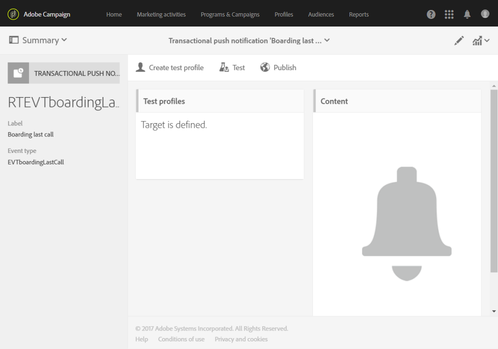

# 트랜잭션 푸시 알림{#transactional-push-notifications}

Adobe Campaign을 사용하여 iOS 및 Android 모바일 장치에서 트랜잭션 푸시 알림을 전송할 수 있습니다. 이러한 메시지는 Experience Cloud Mobile SDK를 활용하여 Adobe Campaign에서 설정한 모바일 애플리케이션에서 수신됩니다.

>[!NOTE]
>
>푸시 채널은 선택 사항입니다. 사용권 계약을 확인하십시오. 표준 푸시 알림에 대한 자세한 내용은 푸시 알림을 [참조하십시오](../../channels/using/about-push-notifications.md).

다음 두 가지 유형의 트랜잭션 푸시 알림을 전송할 수 있습니다.

* 이벤트를 타깃팅하는 트랜잭션 푸시 알림
* Adobe Campaign 데이터베이스의 트랜잭션 푸시 알림 타깃팅 프로필.

이벤트를 만들고 게시하면( [이 섹션에](../../channels/using/about-transactional-messaging.md#transactional-messaging-operating-principle)설명된 장바구니 포기) 해당 트랜잭션 푸시 알림이 자동으로 생성됩니다.

구성 단계는 트랜잭션 푸시 알림을 [전송하도록 이벤트 구성](../../administration/using/configuring-transactional-messaging.md#use-case--configuring-an-event-to-send-a-transactional-message) 섹션에 나와 있습니다.

이벤트가 트랜잭션 메시지 전송을 트리거하려면 메시지를 개인화한 다음 테스트하여 게시해야 합니다.

>[!NOTE]
>
>트랜잭션 메시지에 액세스하려면 **[!UICONTROL Administrators (all units)]** 보안 그룹의 일부여야 합니다.

## 이벤트를 타깃팅하는 트랜잭션 푸시 알림 {#transactional-push-notifications-targeting-an-event}

모바일 애플리케이션에서 알림을 수신하도록 선택한 모든 사용자에게 익명 트랜잭션 푸시 알림을 보낼 수 있습니다.

이 경우 이벤트 자체에 포함된 데이터만 배달 대상을 정의하는 데 사용됩니다. Adobe Campaign 통합 프로필 데이터베이스의 데이터는 활용되지 않습니다.

### 이벤트를 타깃팅하는 트랜잭션 푸시 알림 전송 {#sending-a-transactional-push-notification-targeting-an-----------event}

예를 들어, 한 항공사 회사는 모바일 애플리케이션 사용자를 탑승을 위해 관련 게이트로 이동하도록 초대하려고 합니다.

이 회사는 단일 장치를 통해 하나의 모바일 애플리케이션을 사용하여 사용자당 하나의 트랜잭션 푸시 알림(등록 토큰으로 식별됨)을 전송합니다.

1. 편집하기 위해 만든 트랜잭션 메시지로 이동합니다. See [Event transactional messages](../../channels/using/event-transactional-messages.md).

   

1. 메시지의 제목과 본문을 수정하려면 **[!UICONTROL Content]** 블록을 클릭합니다.

   개인화 필드를 삽입하여 이벤트를 만들 때 정의한 요소를 추가할 수 있습니다.

   

   이러한 필드를 찾으려면 항목 옆에 있는 연필을 클릭하고 **[!UICONTROL Insert personalization field]** 을 클릭한 다음 **[!UICONTROL Context]** &gt; **[!UICONTROL Real-time event]** &gt; **[!UICONTROL Event context]**&#x200B;를 선택합니다.

   

   푸시 알림 컨텐츠 편집에 대한 자세한 내용은 [푸시 알림](../../channels/using/preparing-and-sending-a-push-notification.md)만들기를 참조하십시오.

1. 변경 내용을 저장하고 메시지를 게시합니다. 트랜잭션 [메시지](../../channels/using/event-transactional-messages.md#publishing-a-transactional-message)게시를 참조하십시오.
1. Adobe Campaign Standard REST API를 사용하여, 보드 데이터가 포함된 Android(WeFlight)의 단일 모바일 애플리케이션(WeFlight)을 사용하여 등록 토큰(ABCDEF123456789)에 이벤트를 보냅니다.

   ```
   {
     "registrationToken":"ABCDEF123456789",
     "application":"WeFlight",
     "pushPlatform":"gcm",
     "ctx":
     {
       "gateNumber":"Gate B18",
       "lastname":"Green",
       "firstname":"Jane"
     }
   }
   ```

   이벤트 트리거를 외부 시스템에 통합하는 방법에 대한 자세한 내용은 사이트 [통합을](../../administration/using/configuring-transactional-messaging.md#integrating-the-triggering-of-the-event-in-a-website)참조하십시오.

등록 토큰이 있으면 해당 사용자는 다음 컨텐츠를 포함하는 거래 푸시 알림을 받습니다.

"안녕하세요, 제인 그린 씨, 탑승이 막 시작되었습니다! B18 게이트로 가십시오."

## 프로파일을 타깃팅하는 트랜잭션 푸시 알림 {#transactional-push-notifications-targeting-a-profile}

모바일 응용 프로그램에 가입한 Adobe Campaign 프로필로 트랜잭션 푸시 알림을 보낼 수 있습니다. 이 배달에는 받는 사람의 이름과 같은 [개인화](../../designing/using/personalization.md#inserting-a-personalization-field) 필드가 포함될 수 있습니다.

이 경우 이벤트에는 Adobe Campaign 데이터베이스의 프로필과 조정을 허용하는 일부 필드가 포함되어야 합니다.

프로파일을 타깃팅할 때 모바일 애플리케이션 및 디바이스당 하나의 트랜잭션 푸시 알림이 전송됩니다. 예를 들어 Adobe Campaign 사용자가 두 개의 응용 프로그램을 구독한 경우 이 사용자는 두 개의 알림을 받게 됩니다. 사용자가 두 개의 서로 다른 디바이스를 사용하여 동일한 애플리케이션을 구독하면 각 디바이스에 대한 알림을 받게 됩니다.

프로파일이 구독한 모바일 응용 프로그램이 이 프로필의 **[!UICONTROL Mobile App Subscriptions]** 탭에 나열됩니다. 이 탭에 액세스하려면 프로필을 선택하고 오른쪽의 **[!UICONTROL Edit profile properties]** 단추를 클릭합니다.


프로필 액세스 및 편집에 대한 자세한 내용은 프로필을 [참조하십시오](../../audiences/using/creating-profiles.md).

### 프로파일을 타깃팅하는 트랜잭션 푸시 알림 전송 {#sending-a-transactional-push-notification-targeting-a-----------profile}

예를 들어, 한 항공사 회사는 모바일 애플리케이션에 가입한 모든 Adobe Campaign 사용자에게 탑승에 대한 마지막 전화를 발송하려고 합니다.

1. 편집하기 위해 만든 트랜잭션 메시지로 이동합니다. See [Event transactional messages](../../channels/using/event-transactional-messages.md).

   <!---->

1. 메시지의 제목과 본문을 수정하려면 **[!UICONTROL Content]** 블록을 클릭합니다.

   실시간 이벤트를 기반으로 하는 구성과 달리 모든 프로필 정보에 직접 액세스하여 메시지를 개인화할 수 있습니다. 개인화 [필드](../../designing/using/personalization.md#inserting-a-personalization-field)삽입을 참조하십시오.

   <!---->

   푸시 알림 컨텐츠 편집에 대한 자세한 내용을 살펴보십시오. 푸시 [알림](../../channels/using/preparing-and-sending-a-push-notification.md)만들기를 참조하십시오.

1. 변경 내용을 저장하고 메시지를 게시합니다. 트랜잭션 [메시지](../../channels/using/event-transactional-messages.md#publishing-a-transactional-message)게시를 참조하십시오.
1. Adobe Campaign Standard REST API 파섹

   ```
   {
     "ctx":
     {
       "email":"janegreen@email.com",
       "gateNumber":"D16",
     }
   }
   ```

   이벤트 트리거를 외부 시스템에 통합하는 방법에 대한 자세한 내용은 사이트 [통합을](../../administration/using/configuring-transactional-messaging.md#integrating-the-triggering-of-the-event-in-a-website)참조하십시오.

   >[!NOTE]
   >
   >등록 토큰, 응용 프로그램 및 푸시 플랫폼 필드가 없습니다. 이 예에서는 이메일 필드를 사용하여 조정이 수행됩니다.

