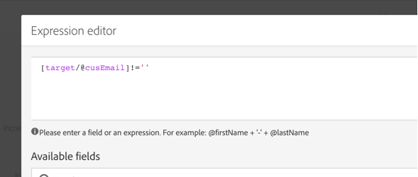

# 모바일 애플리케이션 데이터를 기반으로 프로필 정보 만들고 업데이트하기

## 개요

이 페이지에서는 Mobile Application이 PII 데이터 수집을 예약별로 보낸 후 프로필 데이터를 생성/업데이트하는 워크플로우를 개발하는 단계에 대해 설명합니다.

* **PII** 는 &quot;개인 식별 정보&quot;를 의미합니다. 모바일 [관심 영역](../../integrating/using/about-campaign-points-of-interest-data-integration.md)과 같이 캠페인 데이터베이스의 프로필 테이블에 표시되지 않는 정보를 포함하여 모든 데이터가 될 수 있습니다. PII는 일반적으로 마케터와 함께 모바일 앱 개발자가 정의합니다.
* **수집** PII는 모바일 앱에서 Adobe Campaign Standard의 Rest API에 대한 HTTP POST 작업입니다.

이 사용 사례의 목표는 모바일 응용 프로그램에서 반환되는 PII 데이터에 프로필 관련 데이터가 포함된 경우 Campaign Standard 프로파일을 만들거나 업데이트하는 것입니다.

## 사전 요구 사항

모바일 앱 구독 데이터를 기반으로 프로파일을 만들거나 업데이트하기 전에 Campaign Standard에서 푸시 알림을 활성화하기 위해 따라야 할 구성 단계는 다음과 같습니다.

1. [모바일 애플리케이션 만들기](../../administration/using/configuring-a-mobile-application.md)
1. [Adobe Mobile SDK를 모바일 애플리케이션과 통합할 수 있습니다](https://helpx.adobe.com/kr/campaign/kb/integrate-mobile-sdk.html).
1. [푸시 알림을 전송하도록 Adobe Campaign을 구성합니다](https://helpx.adobe.com/kr/campaign/kb/configuring-app-sdkv4.html).

## 1단계 - 푸시 알림/구독에 대한 프로필 리소스 확장

PII 데이터로 프로필 리소스를 만들거나 업데이트하려면 먼저 원하는 필드로 프로필 리소스를 확장해야 합니다. 방법은 다음과 같습니다.

* 모바일 응용 프로그램에서 보낸 PII 필드를 식별합니다.
* PII 데이터를 프로필 데이터와 연결하기 위해 조정에 사용할 필드를 식별합니다.

이 예에서 **[!UICONTROL Fields]** 섹션은 모바일 응용 프로그램에서 보낸 PII 데이터를 반영합니다. **[!UICONTROL Link to profiles]** 섹션은 PII를 프로필 데이터와 연결하는 데 사용되는 필드를 나타냅니다. 여기서 **cusEmail**&#x200B;은 **@email**&#x200B;에 매핑됩니다.

**[!UICONTROL Subscriptions to an Application]** 리소스를 확장하는 동안 프로필 데이터에 대한 매핑이 읽기 전용입니다. 이것은 화해를 위해 사용된다. 프로파일을 PII 데이터와 조정하기 위해 필요한 데이터와 함께 프로파일을 시스템에 입력해야 합니다. Adobe의 경우, 조정을 수행하려면 프로필의 이메일 주소가 수집 PII의 이메일과 일치해야 합니다.

* Collect PII는 모바일 앱에서 사용자의 이름이 &quot;Jane, Last Name is &quot;Doe&quot; 이고 이메일 주소는 janedoe@doe.com인 사용자를 위해 수신됩니다.
* 별도로 프로필 데이터가 있어야 합니다(예: 데이터를 수동으로 입력하거나 다른 리소스에서 이미 입력해야 함). 여기서 프로필의 이메일 주소는 janedoe@doe.com입니다.

**관련 항목:**

* [구독을 확장해 애플리케이션 리소스로 만들기](../../developing/using/extending-the-subscriptions-to-an-application-resource.md).
* [기존 리소스](../../developing/using/key-steps-to-add-a-resource.md) 만들기 또는 확장

## 2단계 - 워크플로우 만들기

관리자는 Campaign Standard의 Workflow를 사용하여 AppSubscription(가입자) 데이터와 프로필 또는 수신자 데이터 간의 데이터를 고유하게 식별하고 동기화할 수 있습니다. 워크플로우 기반 업데이트는 실시간으로 프로필 데이터를 동기화하지 않지만, 과도한 데이터베이스 잠금이나 오버헤드를 발생시키지 않아야 합니다.

워크플로우를 작성하는 주요 단계는 다음과 같습니다.

1. 최신 구독 목록을 가져오려면 **[!UICONTROL Query]** 또는 **[!UICONTROL Incremental query]** 활동을 사용하십시오.
1. **[!UICONTROL Reconciliation]** 활동을 사용하여 PII 데이터를 프로필에 매핑합니다.
1. 확인 프로세스를 추가합니다.
1. **[!UICONTROL Update data]**&#x200B;을 사용하여 PII 데이터로 프로파일을 업데이트하거나 만듭니다.

이 워크플로우에서는 다음 요구 사항을 가정합니다.

* 확장된 모든/모든 필드를 사용하여 프로필 테이블을 만들거나 업데이트할 수 있어야 합니다.
* 프로필 테이블은 기본적으로 지원되지 않는 필드(예: 티셔츠 크기)를 지원하도록 확장할 수 있습니다.
* 비어 있는 AppSubscription 테이블의 필드는 프로필 테이블에서 업데이트할 수 없습니다.
* AppSubscription 테이블에서 업데이트된 모든 레코드는 Workflow의 다음 실행에 포함되어야 합니다.

워크플로우를 빌드하려면 다음 활동을 작업 공간으로 드래그하여 놓고 함께 연결합니다.**[!UICONTROL Start]**, **[!UICONTROL Scheduler]**, **[!UICONTROL Incremental query]**, **[!UICONTROL Update data]**.

그런 다음 아래 절차에 따라 각 활동을 구성합니다.

### **[!UICONTROL Scheduler]** 활동 구성

**[!UICONTROL General]** 탭에서 **[!UICONTROL Execution frequency]**(예: &quot;Daily&quot;), **[!UICONTROL Time]**(예: &quot;1:00:00 AM&quot;) 및 **[!UICONTROL Start]**(예: 오늘 날짜)을 설정합니다.

### **[!UICONTROL Incremental query]** 활동을 구성합니다.

1. **[!UICONTROL Properties]** 탭에서 **[!UICONTROL Resource]** 필드의 **[!UICONTROL Select an element]** 아이콘을 클릭한 다음 **[!UICONTROL Subscriptions to an application (nms:appSubscriptionRcp:appSubscriptionRcpDetail)]** 요소를 선택합니다.

   

1. **[!UICONTROL Target]** 탭에서 **[!UICONTROL Mobile application]** 필터를 드래그한 다음 모바일 응용 프로그램 이름을 선택합니다.

   

1. **[!UICONTROL Processed data]** 탭에서 **[!UICONTROL Use a date field]**&#x200B;을 선택한 다음 **[!UICONTROL Last modified (lastModified)]** 필드를 **[!UICONTROL Path to the date field]**&#x200B;으로 추가합니다.

   

### **[!UICONTROL Update data]** 활동을 구성합니다.

1. **[!UICONTROL Identification]** 탭에서 **[!UICONTROL Dimension to update]** 필드가 &quot;프로필(프로필)&quot;으로 설정되어 있는지 확인한 다음 **[!UICONTROL Create element]** 단추를 클릭하여 필드를 조정 기준으로 추가합니다.

   

1. **[!UICONTROL Source]** 필드에서 appSubscriptionRcp 테이블의 필드를 조정 필드로 선택합니다. 프로필의 이메일, crmId, marketingCloudId 등이 될 수 있습니다. 이 경우 &quot;이메일(cusEmail)&quot; 필드를 사용합니다.

1. **[!UICONTROL Destination]** 필드의 appSubscriptionRcp 테이블에서 데이터를 조정하기 위한 프로필 테이블에서 필드를 선택합니다. 프로필의 이메일이나 crmId, marketingCloudId 등의 확장 필드일 수 있습니다. 이 예에서 &quot;이메일(이메일)&quot; 필드를 선택하여 appSubscriptionRcp 테이블의 &quot;이메일(cusEmail)&quot; 필드에 매핑해야 합니다.

   

1. **[!UICONTROL Fields to update]** 탭에서 **[!UICONTROL Create element]** 단추를 클릭한 다음 appSubscriptionRcp 표(**[!UICONTROL Source]** 필드)에서 오는 필드를 프로필 테이블(**[!UICONTROL Destination]** 필드)에서 업데이트할 필드로 매핑합니다.

1. **[!UICONTROL Enabled if]** 필드에서 표현식을 추가하여 소스 필드에 값이 들어 있는 경우에만 프로필 테이블의 해당 필드가 업데이트되도록 합니다. 이렇게 하려면 목록에서 필드를 선택한 다음 &quot;!=&quot;&quot;&quot; 표현식(표현식 편집기의 소스 필드가 `[target/@cusEmail]`이면 `[target/@cusEmail] != ''"` 입력 필요)

   

>[!NOTE]
>
>이 경우 Workflow는 UPSERT를 수행하지만 **[!UICONTROL Incremental query]** 데이터를 기반으로 하기 때문에 삽입됩니다. 쿼리를 변경하면 삽입되거나 업데이트되는 데이터에 영향을 줄 수 있습니다.
>또한 업데이트할 필드 탭의 설정에 따라 특정 조건에서 삽입되거나 업데이트되는 필드가 결정됩니다. 이러한 설정은 각 응용 프로그램 또는 고객에 대해 고유해야 합니다.
>appSubscriptionRcp 데이터를 기반으로 프로필의 레코드를 업데이트할 때 유효성 검사 없이 사용자의 개인 정보를 변경할 수 있으므로 의도하지 않은 결과가 발생할 수 있으므로 이러한 설정을 구성할 때 주의하십시오.

프로필에 삽입/업데이트할 모든 필드가 추가된 경우 **[!UICONTROL Confirm]**&#x200B;을(를) 클릭합니다.

워크플로우를 저장한 다음 **[!UICONTROL Start]**&#x200B;을 클릭하여 워크플로우를 실행합니다.

