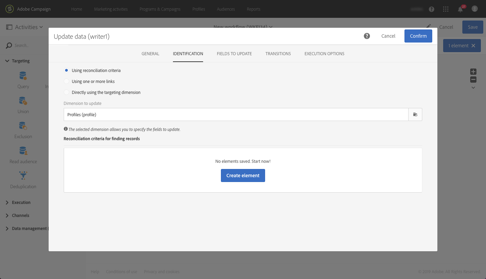

# 모바일 애플리케이션 데이터를 기반으로 프로파일 정보 생성 및 업데이트

## 개요

이 페이지에서는 모바일 애플리케이션이 예약된 일정에 따라 PII 데이터를 수집한 후에 프로필 데이터를 만들거나 업데이트하는 워크플로우를 개발하기 위한 단계를 설명합니다.

* **PII** 는 "개인 식별 정보" 를 의미합니다. 예를 들어, 모바일 [관심 영역에 대한 Analytics와 같이 캠페인 데이터베이스의 프로필 테이블에 나타나지 않는 정보를 비롯한 모든 데이터일](../../integrating/using/about-campaign-points-of-interest-data-integration.md)수 있습니다. PII는 보통 마케터가 있는 모바일 앱 개발자에 의해 정의됩니다.
* **PII** 수집은 모바일 앱에서 Adobe Campaign Standard의 REST API에 대한 HTTP-POST 작업입니다.

이 사용 사례는 모바일 애플리케이션에 의해 반환된 PII 데이터에 프로필 관련 데이터가 포함되어 있는 경우 캠페인 표준 프로필을 만들거나 업데이트하는 것입니다.

## 전제 조건

모바일 앱 구독 데이터를 기반으로 프로필을 만들거나 업데이트하려면 먼저 캠페인 Standard에서 푸시 알림을 활성화하기 위해 따라야 할 구성 단계가 몇 가지 있습니다.

1. [모바일 애플리케이션 제작](../../administration/using/configuring-a-mobile-application.md)
1. [모바일 애플리케이션과](https://helpx.adobe.com/campaign/kb/integrate-mobile-sdk.html)Adobe Mobile SDK 통합
1. [푸시 알림을 보내도록 Adobe Campaign를 구성합니다](https://helpx.adobe.com/campaign/kb/configuring-app-sdkv4.html).

## 1 단계 - 푸시 알림/가입 시 프로필 리소스 확장

PII 데이터를 사용하여 프로필 리소스를 만들거나 업데이트하려면 우선 원하는 필드로 프로필 리소스를 확장해야 합니다. 이렇게 하려면:

* 모바일 애플리케이션에서 보내는 PII 필드를 식별합니다.
* PII 데이터를 프로필 데이터와 연결하기 위해 조정 작업에 사용할 필드를 식별합니다.

이 예에서 **[!UICONTROL Fields]** , 섹션은 모바일 애플리케이션에서 보낸 PII 데이터를 반영합니다. **[!UICONTROL Link to profiles]** 섹션은 쿠키를 프로필 데이터와 연결하는 데 사용되는 필드를 나타내며, 여기서 **Cusemail** 는 **@ 이메일에**&#x200B;매핑됩니다.

리소스를 확장하는 동안 프로필 데이터에 대한 **[!UICONTROL Subscriptions to an Application]** 매핑은 읽기 전용입니다. 조정을 위해 사용됩니다. 프로파일은 PII 데이터와 프로파일을 조정하기 위해 필요한 데이터가 있는 시스템에 입력해야 합니다. 이 경우, 조정이 이루어지도록 하려면 프로필에 대한 이메일 주소가 PII 수집의 이메일에 일치해야 합니다.

* 모바일 앱에서 PII 수집은 사용자의 첫 번째 이름이 «Jane» 이고, 성 주소가 «Doe» 이며 이메일 주소가 janedoe@doe.com 입니다.
* 프로필 데이터가 janedoe@doe.com 인 경우 프로필 데이터가 존재해야 합니다 (예: 데이터를 수동으로 입력해야 하거나 다른 리소스에서 이미 가져와야 함).

**관련 항목:**

* [응용 프로그램 리소스에 대한 구독 확장](../../developing/using/extending-the-subscriptions-to-an-application-resource.md).
* [기존 리소스 만들기 또는 확장](../../developing/using/key-steps-to-add-a-resource.md).

## 단계 2 - 워크플로우 만들기

관리자는 Campaign Standard의 워크플로우를 사용하여 appsubscription (구독자) 데이터와 프로필 또는 수신자 데이터 간에 데이터를 고유하게 식별하고 동기화할 수 있습니다. 워크플로우 기반의 업데이트는 실시간으로 프로필 데이터를 동기화할 수 없지만 과도한 데이터베이스 잠금 또는 간접비를 초래하지 않습니다.

워크플로우를 빌드하는 주요 단계는 다음과 같습니다.

1. **[!UICONTROL Query]** OR **[!UICONTROL Incremental query]** 활동을 사용하여 최신 구독 목록을 가져옵니다.
1. **[!UICONTROL Reconciliation]** 활동을 사용하여 PII 데이터를 프로필에 매핑합니다.
1. 유효성 검사 프로세스를 추가합니다.
1. 를 사용하여 **[!UICONTROL Update data]** PII 데이터를 사용하여 프로필을 업데이트하거나 만듭니다.

다음 요구 사항이 이 워크플로우에서 가정됩니다.

* 프로필 테이블을 만들거나 업데이트하려면 확장된 모든 필드를 사용할 수 있어야 합니다.
* 기본적으로 지원되지 않는 필드 (예: T 셔츠 크기) 를 지원하도록 프로필 테이블을 확장할 수 있습니다.
* Appsubscription 테이블의 비어 있는 모든 필드는 프로필 테이블에서 업데이트할 수 없습니다.
* Appsubscription 테이블에서 업데이트된 모든 레코드는 워크플로우의 다음 실행에 포함되어야 합니다.

워크플로우를 빌드하려면 아래 단계를 따르십시오.

1. 다음 활동을 작업 공간으로 드래그하여 놓고 함께 연결하십시오.
   1. **[!UICONTROL Start]**
   1. **[!UICONTROL Scheduler]**
   1. **[!UICONTROL Incremental query]**
   1. **[!UICONTROL Update data]**
   

1. **[!UICONTROL Scheduler]** 활동을 구성합니다. **[!UICONTROL General]** 탭에서 ( **[!UICONTROL Execution frequency]** 예: "일별") 와 ( **[!UICONTROL Time]** 예: "1:00:00 AM") 및을 **[!UICONTROL Start]** 설정합니다 (예: 오늘 날짜).

   

1. **[!UICONTROL Incremental query]** 활동을 구성합니다.
   1. **[!UICONTROL Properties]** 탭에서 필드의 **[!UICONTROL Select an element]** 아이콘을 클릭한 **[!UICONTROL Resource]** 다음 **[!UICONTROL Subscriptions to an application (nms:appSubscriptionRcp:appSubscriptionRcpDetail)]** 요소를 선택합니다.

      

   1. **[!UICONTROL Target]** 탭에서 **[!UICONTROL Mobile application]** 필터를 끈 다음 모바일 애플리케이션 이름을 선택합니다.

      

   1. **[!UICONTROL Processed data]** 탭에서를 **[!UICONTROL Use a date field]**&#x200B;선택하고 **[!UICONTROL Last modified (lastModified)]** 필드를 다른 이름으로 **[!UICONTROL Path to the date field]**&#x200B;추가합니다.

      

1. **[!UICONTROL Update data]** 활동을 구성합니다.
   1. **[!UICONTROL Identification]** 탭에서 **[!UICONTROL Dimension to update]** 필드가 "프로필 (프로필)" 로 설정되어 있는지 확인하고 **[!UICONTROL Create element]** 단추를 클릭하여 조정 조건으로 필드를 추가합니다.

      

   1. **[!UICONTROL Source]** 필드에서 Appsubscrsiptionrcp 테이블의 필드를 조정 필드로 선택합니다. 프로필의 email, crmid, marketingcloudid 등이 될 수 있습니다. 이 예에서는 "이메일 (Cusemail)" 필드를 사용합니다.
   1. **[!UICONTROL Destination]** 필드에서 프로필 테이블의 필드를 선택하여 Appsubscriptionrcp 테이블의 데이터를 조정합니다. 프로필의 이메일 또는 crmid, marketingcloudid 등의 확장된 필드일 수 있습니다. 이 예에서는 Appsubscriptionrcp 테이블의 "email (cusemail)" 필드와 매핑할 "email (email)" 필드를 선택해야 합니다.

      

   1. **[!UICONTROL Fields to update]** 탭에서 **[!UICONTROL Create element]** 단추를 클릭한 다음 Appsubscriptionrcp 표 (**[!UICONTROL Source]** 필드) 에서 가져올 필드를 프로필 테이블 (**[!UICONTROL Destination]** 필드) 에서 업데이트할 필드로 매핑합니다.
   1. **[!UICONTROL Enabled if]** 필드에서 [소스] 필드에 값이 포함된 경우에만 프로필 테이블의 해당 필드가 업데이트되도록 표현식을 추가합니다. 이렇게 하려면 목록에서 필드를 선택한 다음 "!= "" 표현식 (소스 필드가 표현식 편집기에서 있는 `[target/@cusEmail]` 경우 입력 `[target/@cusEmail] != ''"`).

      

      >[!NOTE]
      >
      >이 경우 워크플로우에서는 upsert를 수행하지만 증분 쿼리 데이터를 기반으로 하므로 이 워크플로우는 삽입됩니다. 쿼리를 변경하면 삽입되거나 업데이트된 데이터에 영향을 줄 수 있습니다.
      >또한 업데이트할 필드 필드의 설정은 특정 조건에서 삽입되거나 업데이트된 필드를 결정합니다. 이러한 설정은 각 애플리케이션이나 고객에 대해 고유할 수 있습니다. Appsubscriptionrcp 데이터를 기반으로 프로필에서 레코드를 업데이트하면 사용자가 유효성 검사 없이 개인 정보를 변경할 수 있으므로 의도하지 않은 결과가 발생할 수 있으므로 이러한 설정을 구성할 때 주의해야 합니다.

   1. 프로필에 삽입/업데이트할 필드를 모두 추가한 다음을 클릭합니다 **[!UICONTROL Confirm]**.

      

1. 워크플로우를 저장한 다음 시작을 클릭하여 워크플로우 프로세스를 시작합니다.

   
