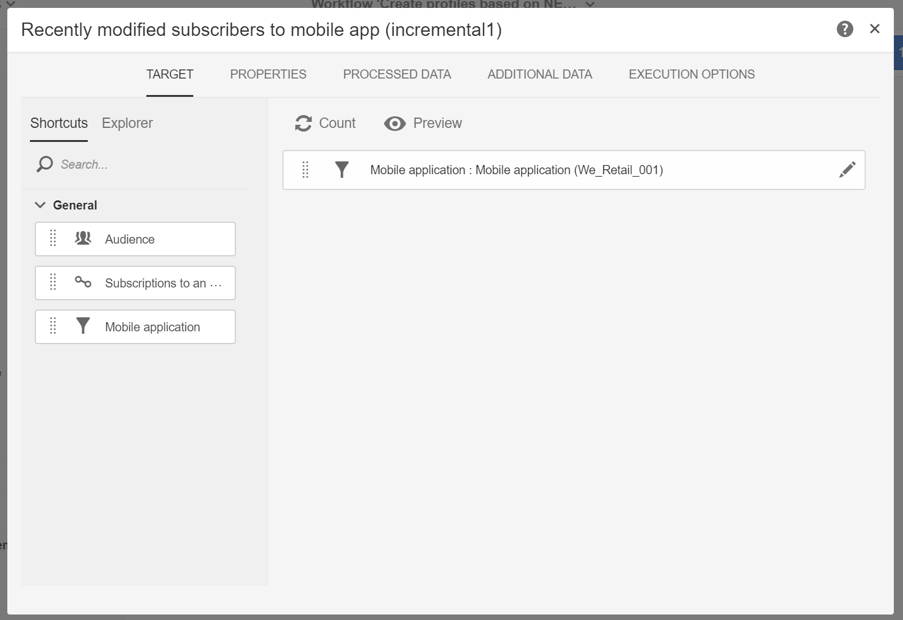

# 모바일 애플리케이션 데이터를 기반으로 프로필 정보 만들고 업데이트하기

## 개요

이 페이지에서는 모바일 애플리케이션이 일정에 따라 수집 PII 데이터를 보낸 후 프로필 데이터를 생성/업데이트하는 워크플로우를 개발하는 단계를 설명합니다.

* **PII** 는 &quot;개인 식별 정보&quot;를 나타냅니다. Campaign 데이터베이스의 프로필 테이블에 표시되지 않는 정보(예: Analytics for Mobile)를 비롯한 모든 데이터일 수 있습니다 [관심 영역](../../integrating/using/about-campaign-points-of-interest-data-integration.md). PII는 모바일 앱 개발자에 의해 정의되며, 일반적으로 마케터와 함께 합니다.
* **PII 수집** 는 모바일 앱에서 Adobe Campaign Standard의 Rest API에 대한 HTTP POST 작업입니다.

이 사용 사례의 목표는 모바일 애플리케이션에서 반환된 PII 데이터에 프로필 관련 데이터가 포함된 경우 Campaign Standard 프로필을 만들거나 업데이트하는 것입니다.

## 필수 구성 요소

모바일 앱 구독 데이터를 기반으로 프로필을 만들거나 업데이트하기 전에 Campaign Standard에서 푸시 알림을 활성화하기 위해 따라야 할 몇 가지 구성 단계가 있습니다.

1. [모바일 애플리케이션 만들기](../../administration/using/configuring-a-mobile-application.md)
1. [Adobe Mobile SDK를 모바일 애플리케이션과 통합](../../administration/using/supported-mobile-use-cases.md).
1. [푸시 알림을 전송하도록 Adobe Campaign 구성](../../administration/using/configuring-a-mobile-application.md).

## 1단계 - 푸시 알림/구독에 대한 프로필 리소스 확장

PII 데이터로 프로필 리소스를 만들거나 업데이트하려면 먼저 원하는 필드로 프로필 리소스를 확장해야 합니다. 방법은 다음과 같습니다.

* 모바일 애플리케이션에서 전송하는 PII 필드를 식별합니다.
* 조정에 사용할 필드를 식별하여 PII 데이터를 프로필 데이터와 연결합니다.

이 예에서는 **[!UICONTROL Fields]** 섹션은 모바일 애플리케이션에서 보낸 PII 데이터를 반영합니다. 다음 **[!UICONTROL Link to profiles]** 섹션은 PII를 프로필 데이터와 연결하는 데 사용되는 필드를 나타냅니다. 여기서 **cusEmail** 다음에 매핑 **@email**.

를 확장하는 동안 프로필 데이터에 대한 매핑 **[!UICONTROL Subscriptions to an Application]** 리소스는 읽기 전용입니다. 조정에 사용됩니다. 프로파일을 PII 데이터로 대사하려면 필요한 데이터가 있는 프로파일을 시스템에 입력해야 합니다. 이 경우 조정이 수행되도록 하려면 프로필의 이메일 주소가 Collect PII의 이메일과 일치해야 합니다.

* 수집 PII는 모바일 앱에서 사용자의 이름이 &quot;Jane&quot;이고 성이 &quot;Doe&quot;이며 이메일 주소가 janedoe@doe.com인 사용자에 대해 수신됩니다.
* 별도로 프로필 이메일 주소가 janedoe@doe.com인 프로필 데이터가 있어야 합니다(예: 데이터를 수동으로 입력하거나 이미 다른 리소스에서 가져와야 함).

**관련 항목:**

* [구독을 확장해 애플리케이션 리소스로 만들기](../../developing/using/extending-the-subscriptions-to-an-application-resource.md).
* [기존 리소스 만들기 또는 확장](../../developing/using/key-steps-to-add-a-resource.md).

## 2단계 - 워크플로우 만들기

Campaign Standard에서 워크플로우를 사용하면 관리자가 AppSubscription(구독자) 데이터와 프로필 또는 수신자 데이터 간의 데이터를 고유하게 식별하고 동기화할 수 있습니다. 워크플로우 기반 업데이트는 프로필 데이터를 실시간으로 동기화하지 않지만 과도한 데이터베이스 잠금 또는 오버헤드를 발생시키지 않아야 합니다.

워크플로우를 빌드하는 주요 단계는 다음과 같습니다.

1. 사용 **[!UICONTROL Query]** 또는 **[!UICONTROL Incremental query]** 활동은 최신 구독 목록을 가져옵니다.
1. 사용 **[!UICONTROL Reconciliation]** 활동은 PII 데이터를 프로필과 매핑합니다.
1. 몇 가지 확인 프로세스를 추가합니다.
1. 사용 **[!UICONTROL Update data]** 를 클릭하여 PII 데이터로 프로필을 업데이트하거나 만듭니다.

이 워크플로에서는 다음 요구 사항이 가정됩니다.

* 확장된 모든/모든 필드를 사용하여 프로파일 테이블을 생성/업데이트할 수 있습니다.
* 기본적으로 지원되지 않는 필드(예: 티셔츠 크기)를 지원하도록 프로필 테이블을 확장할 수 있습니다.
* 비어 있는 AppSubscription 테이블의 모든 필드는 프로필 테이블에서 업데이트해서는 안 됩니다.
* AppSubscription 테이블에서 업데이트된 모든 레코드는 워크플로우의 다음 실행에 포함되어야 합니다.

워크플로우를 빌드하려면 다음 활동을 작업 공간으로 끌어다 놓고 함께 연결합니다. **[!UICONTROL Start]**, **[!UICONTROL Scheduler]**, **[!UICONTROL Incremental query]**, **[!UICONTROL Update data]**.

그런 다음 아래 단계에 따라 각 활동을 구성합니다.

### 구성 **[!UICONTROL Scheduler]** 활동

다음에서 **[!UICONTROL General]** 탭에서 다음을 설정합니다. **[!UICONTROL Execution frequency]** (예: &quot;일별&quot;), **[!UICONTROL Time]** (예: &quot;1:00:00 AM&quot;) 및 **[!UICONTROL Start]** (예: 오늘 날짜)

### 구성 **[!UICONTROL Incremental query]** 활동.

1. 다음에서 **[!UICONTROL Properties]** 탭을 클릭하고 **[!UICONTROL Select an element]** 아이콘 **[!UICONTROL Resource]** 필드를 선택한 다음 **[!UICONTROL Subscriptions to an application (`nms:appSubscriptionRcp:appSubscriptionRcpDetail`)]** 요소를 생성하지 않습니다.

   

1. 다음에서 **[!UICONTROL Target]** 탭에서 을(를) **[!UICONTROL Mobile application]** 을 필터링한 다음 모바일 애플리케이션 이름을 선택합니다.

   

1. 다음에서 **[!UICONTROL Processed data]** 탭, 선택 **[!UICONTROL Use a date field]**&#x200B;을(를) 만든 다음 **[!UICONTROL Last modified (lastModified)]**  다음으로 필드 **[!UICONTROL Path to the date field]**.

   

### 구성 **[!UICONTROL Update data]** 활동.

1. 다음에서 **[!UICONTROL Identification]** 탭에서 다음을 확인합니다. **[!UICONTROL Dimension to update]** 필드가 &quot;프로필(프로필)&quot;로 설정된 다음 **[!UICONTROL Create element]** 버튼을 클릭하여 필드를 조정 기준으로 추가합니다.

   

1. 다음에서 **[!UICONTROL Source]** 필드에서 appSubscritionRcp 테이블의 필드를 조정 필드로 선택합니다. 프로필의 이메일, crmId, marketingCloudId 등일 수 있습니다. 이 예제에서는 &quot;Email (cusEmail)&quot; 필드를 사용합니다.

1. 다음에서 **[!UICONTROL Destination]** 필드에서 프로필 테이블에서 필드를 선택하여 appSubscriptionRcp 테이블의 데이터를 조정합니다. 프로필의 이메일일 수도 있고 crmId, marketingCloudId 등과 같은 확장된 필드일 수도 있습니다. 이 예제에서는 appSubscriptionRcp 테이블의 &quot;Email (cusEmail)&quot; 필드와 매핑할 &quot;Email (email)&quot; 필드를 선택해야 합니다.

   

1. 다음에서 **[!UICONTROL Fields to update]** 탭을 클릭하고 **[!UICONTROL Create element]** 단추를 누른 다음 appSubscriptionRcp 테이블에서 제공되는 필드를 매핑합니다(**[!UICONTROL Source]** 필드)를 프로필 표(**[!UICONTROL Destination]** field).

1. 다음에서 **[!UICONTROL Enabled if]** 소스 필드에 값이 포함된 경우에만 프로필 테이블의 해당 필드가 업데이트되도록 표현식을 추가합니다. 이렇게 하려면 목록에서 필드를 선택한 다음 &quot;!=&#39;&#39;&#39;&quot; 표현식(소스 필드가 `[target/@cusEmail]` 표현식 편집기에서 다음을 입력합니다 `[target/@cusEmail] != ''"`).

   

>[!NOTE]
>
>이 경우 워크플로는 업데이트를 수행하지만 은(는) **[!UICONTROL Incremental query]** 데이터만 삽입됩니다. 쿼리를 변경하면 삽입되거나 업데이트되는 데이터에 영향을 줄 수 있습니다.
>또한 업데이트할 필드 탭의 설정은 특정 조건에서 삽입하거나 업데이트할 필드를 결정합니다. 이러한 설정은 각 애플리케이션 또는 고객에 대해 고유할 수 있습니다.
>appSubscriptionRcp 데이터를 기반으로 프로필에서 레코드를 업데이트하면 유효성 검사 없이 사용자의 개인 정보가 변경될 수 있으므로 이러한 설정을 구성할 때 의도하지 않은 결과가 발생할 수 있으므로 주의하십시오.

프로필에 삽입/업데이트할 필드를 모두 추가했으면 다음을 클릭하십시오. **[!UICONTROL Confirm]**.

워크플로우를 저장한 다음 를 클릭합니다. **[!UICONTROL Start]** 워크플로우를 실행합니다.

