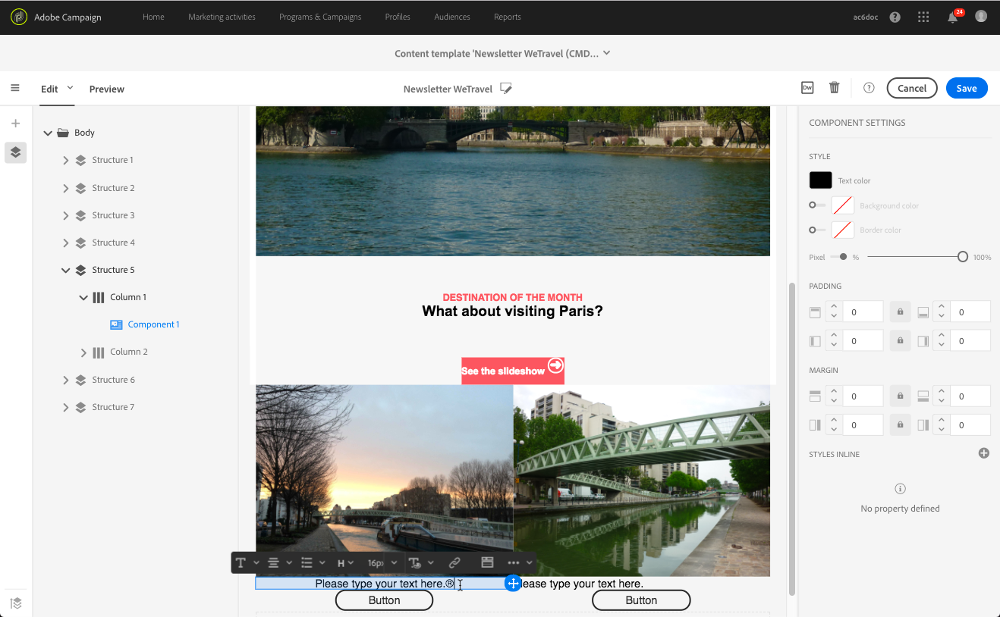

# About email content design{#about-email-content-design}

이메일 디자이너 드래그 앤 드롭 인터페이스를 사용하여 Adobe Campaign에서 이메일 컨텐츠를 만들고 수정합니다.

이 섹션에서는 이메일 디자이너의 특성에 대해 설명합니다.

* [이메일 디자이너 정보](../../designing/using/about-email-content-design.md#about-the-email-designer)
* [이메일 구조 정의](../../designing/using/defining-the-email-structure.md)
* [이메일 스타일 편집](../../designing/using/editing-email-styles.md)

하나 이상의 마케팅 활동에 공통되는 작업에 대해 자세히 알아보려면 다음 섹션을 참조하십시오.

* For more on personalizing an email content, see [Inserting a personalization field](../../designing/using/inserting-a-personalization-field.md) and [Adding a content block](../../designing/using/adding-a-content-block.md).
* For more on importing another email content, see [Selecting an existing content](../../designing/using/selecting-an-existing-content.md).
* For more on defining dynamic content in an email, see [Defining dynamic content in an email](../../designing/using/defining-dynamic-content-in-an-email.md).
* For more on inserting links in an email, see [Inserting a link](../../designing/using/inserting-a-link.md).
* For more on inserting images in an email, see [Inserting images](../../designing/using/inserting-images.md).

Also check the [general best practices for content design](../../designing/using/content-design-best-practices.md).

## About the Email Designer {#about-the-email-designer}

이메일 디자이너는 이메일 컨텐츠 및 이메일 콘텐츠 템플릿을 만들 수 있습니다. 이 이메일은 간단한 이메일, 거래 이메일, A/B 테스트 이메일, 다국어 이메일 및 반복 이메일과 호환됩니다.

To get started with the Email Designer, watch this [set of videos](https://helpx.adobe.com/campaign/kt/acs/using/acs-email-designer-tutorial.html#GettingStarted) that explain the general functionality of the Email Designer and how to design an email from scratch or using templates.

### Email Designer home page {#email-designer-home-page}

When [creating an email](../../channels/using/creating-an-email.md), the **[!UICONTROL Email Designer]** home page automatically displays upon selecting the email content.


**[!UICONTROL Properties]** 탭에서는 레이블, 보낸 사람의 주소, 이름 또는 이메일 제목과 같은 이메일 세부 사항을 편집할 수 있습니다. 화면 상단의 이메일 레이블을 클릭하여 이 탭에 액세스할 수도 있습니다.


**[!UICONTROL Templates]** 이 탭에서 즉시 사용 가능한 HTML 콘텐츠 또는 이미 만든 템플릿 중에서 선택하여 이메일을 빠르게 디자인할 수 있습니다. [콘텐츠 템플릿을 참조하십시오](../../start/using/about-templates.md#content-templates).


**[!UICONTROL Learn & support]** 탭에서는 관련 설명서 및 자습서를 쉽게 이용할 수 있습니다.


템플릿을 선택하지 않으면 이메일 디자이너 홈 페이지를 사용하여 컨텐츠 디자인을 시작할 방법을 선택할 수도 있습니다.

* Click the **[!UICONTROL Create]** button to start a new content from scratch. See [Designing an email content from scratch](../../designing/using/about-email-content-design.md#designing-an-email-content-from-scratch).
* Click the **[!UICONTROL Upload]** button to upload a file from your computer. See [Importing content from a file](../../designing/using/importing-content-from-a-file.md).
* **[!UICONTROL Import from URL]** 단추를 클릭하여 기존 콘텐트를 URL로 가져옵니다. See [Importing content from a URL](../../designing/using/importing-content-from-a-url.md).

### Email Designer interface {#email-designer-interface}

이메일 디자이너는 컨텐츠의 모든 면을 작성, 편집 및 사용자 지정할 수 있는 다양한 옵션을 제공합니다.

인터페이스는 다양한 기능을 제공하는 여러 영역으로 구성됩니다.


**팔레트** (1) 에서 사용할 수 있는 요소에서 구조 구성 요소 및 컨텐츠 조각을 기본 **작업 영역** (2) 로 드래그하여 놓습니다. **작업 영역에서 구성 요소 또는 요소를 선택하고** (2) **설정** 창 (3) 의 기본 스타일 및 표시 특성을 사용자 지정합니다.

Access more general options and settings from the main **Toolbar** (4).

>[!NOTE]
>
>**설정** 창은 화면 해상도에 따라 왼쪽으로 이동할 수 있습니다.


The **Contextual toolbar** of the editor interface offers various functionalities depending on the zone selected. 여기에는 텍스트 스타일을 변경할 수 있는 작업 단추와 단추가 포함되어 있습니다. 수행된 수정 사항은 선택한 영역에 항상 적용됩니다.

### General recommendations for using the Email Designer {#general-recommendations-for-using-the-email-designer}

이메일 디자이너를 적절하게 사용하고 가장 적합한 이메일을 최대한 작성하려면 다음 원칙을 적용하는 것이 좋습니다.

* HTML의 &lt; head &gt; 섹션에서 별도의 CSS 및 CSS가 아닌 인라인 스타일을 사용합니다. 인라인 스타일을 사용하여 컨텐츠 조각을 저장하고 재사용할 수 있습니다.

   See [Adding inline styling attributes](../../designing/using/editing-email-styles.md#adding-inline-styling-attributes).

* 콘텐츠 조각을 만들어 재사용하여 마케팅 캠페인에서 일관성을 유지할 수 있으므로 브랜딩을 손쉽게 해결할 수 있습니다.

   See [Creating a content fragment](../../designing/using/defining-the-email-structure.md#creating-a-content-fragment).

Also check the [general best practices for content design](../../designing/using/content-design-best-practices.md).

### Email Designer compatibility mode {#email-designer-compatibility-mode}

콘텐츠를 업로드할 때, 이메일 디자이너의 WYSIWYG 편집자와 완전히 호환되고 편집 가능한 특정 태그가 포함되어야 합니다.

업로드된 HTML의 전체 또는 일부가 예상 태그 지정을 준수하지 않을 경우, 컨텐츠는'호환성 모드'로 로드되어 UI를 통해 에디션 가능성을 제한합니다.

컨텐츠가 호환성 모드에서 로드되어도 여전히 인터페이스를 통해 다음 수정 작업을 수행할 수 있습니다 (사용할 수 없는 작업은 숨겨짐).

* 텍스트 변경 또는 이미지 변경
* 링크 및 개인화 필드 삽입
* 선택한 HTML 블록에서 일부 스타일 지정 옵션 편집
* 조건부 컨텐츠 정의


이메일 또는 고급 스타일에 새 섹션을 추가하는 것과 같은 다른 수정 사항은 HTML 모드를 통해 이메일의 소스 코드에서 직접 수행해야 합니다.

For more on converting an existing email into an Email Designer-compatible email, see [this section](../../designing/using/about-email-content-design.md#designing-an-email-using-existing-contents).

### Email Designer limitations {#email-designer-limitations}

* 세그먼트에서 개인화 필드를 사용할 수 없습니다. For more on fragments, see [this section](../../designing/using/defining-the-email-structure.md#about-fragments).
* 이메일 디자이너 내에서 편집하는 이메일의 일부 컨텐츠로 직접 저장할 수는 없습니다. 해당 컨텐츠에 해당하는 HTML를 새 조각에 복사하여 붙여 넣어야 합니다. For more on this, see [Saving content as a fragment](../../designing/using/defining-the-email-structure.md#saving-content-as-a-fragment).
* 스타일을 편집할 때 대부분의 이메일 클라이언트에서 공식적으로 지원되는 웹 글꼴만 사용할 수 있습니다.
* 스타일은 나중에 재사용하기 위해 테마로 저장할 수 없습니다. 그러나 CSS 스타일은 컨텐츠 템플릿이나 이메일에 저장할 수 있습니다. For more on styles, see [this section](../../designing/using/editing-email-styles.md).

### Email Designer updates {#email-designer-updates}

이메일 디자이너가 지속적으로 개선되었습니다. 처음부터 이메일 컨텐츠를 만들거나, 기본 템플릿을 사용하거나, 조각을 만든 경우 다음 번에 컨텐츠를 열 때 다음 업데이트 메시지가 표시될 수 있습니다.


CSS 충돌 문제와 같은 문제를 방지하려면 컨텐츠를 최신 버전으로 업데이트하는 것이 좋습니다. **[!UICONTROL Update now]**&#x200B;을 클릭합니다.

컨텐츠 업데이트 중에 오류가 발생하면 HTML를 확인하고 이 업데이트를 다시 실행하기 전에 수정합니다.

조각에 대해서는 다음에 유의하십시오.

* 새 이메일 또는 템플릿에 조각을 추가하고 이 메시지가 표시되면 먼저 이 조각을 업데이트해야 합니다.

* 여러 조각이 있는 경우 이메일 컨텐츠에 사용할 각 조각을 업데이트해야 합니다.

* 현재 이메일 메시지가 준비 단계에 있거나 변경을 원하지 않는 특정 캠페인에서 현재 이메일 메시지에 영향을 주지 않도록 하려면 일부 조각을 업데이트하지 않도록 선택할 수 있습니다.

* 아직 업데이트되지 않은 조각이 이미 사용되고 있지만 해당 조각은 편집할 수 없는 이메일을 보낼 수 있습니다.

## Designing an email content from scratch {#designing-an-email-content-from-scratch}

다음은 이메일 디자이너를 사용하여 처음부터 이메일 콘텐츠를 만들고 디자인하는 기본 단계입니다.

1. 이메일을 만들고 해당 콘텐트를 엽니다.
1. 구조 구성 요소를 추가하여 이메일을 작성합니다. See [Editing the email structure](../../designing/using/defining-the-email-structure.md#editing-the-email-structure).
1. 구조 구성 요소에 컨텐츠 구성 요소 및 조각을 삽입합니다. See [Adding fragments and content components](../../designing/using/defining-the-email-structure.md#adding-fragments-and-content-components).
1. 이미지를 추가하고 이메일의 텍스트를 편집합니다. See [Inserting images](../../designing/using/inserting-images.md).
1. 개인화 필드, 링크 등을 추가하여 이메일을 개인화합니다. See [Inserting a personalization field](../../designing/using/inserting-a-personalization-field.md), [Inserting a link](../../designing/using/inserting-a-link.md) and [Defining dynamic content in an email](../../designing/using/defining-dynamic-content-in-an-email.md).
1. 이메일의 제목 줄을 정의합니다. See [Personalizing the subject line of an email](../../designing/using/personalizing-the-subject-line-of-an-email.md).
1. 이메일 미리 보기
1. 컨텐츠를 저장하고, 대상자를 정의하고 전송을 제대로 예약한 후 메시지를 계속 진행합니다.

You can also check out this [introduction video](https://video.tv.adobe.com/v/22771/?autoplay=true&hidetitle=true&captions=kor).

>[!NOTE]
>
>처음부터 이메일 콘텐츠를 디자인하지 않도록 바로 사용 가능한 콘텐츠 템플릿을 사용할 수 있습니다. For more on this, see [Content templates](../../start/using/about-templates.md#content-templates).

**관련 항목**:

* [이메일 만들기](../../channels/using/creating-an-email.md)
* [기존 컨텐츠 선택](../../designing/using/selecting-an-existing-content.md)
* [메시지에서 대상 선택](../../audiences/using/selecting-an-audience-in-a-message.md)
* [예약 메시지](../../sending/using/about-scheduling-messages.md)
* [메시지 미리 보기](../../sending/using/previewing-messages.md)
* [이메일 렌더링](../../sending/using/email-rendering.md)

## Designing an email using existing contents {#designing-an-email-using-existing-contents}

이 섹션에서는 기존 이메일을 이메일 디자이너 호환 이메일로 변환하는 방법을 설명합니다.

By default, if you just upload any HTML (see [Importing content from a file](../../designing/using/importing-content-from-a-file.md)), the content is loaded in '[compatibility mode](../../designing/using/about-email-content-design.md#email-designer-compatibility-mode)', which limits the edition possibilities through the UI (only in-place edition, no drag-and-drop).

그러나 여러 이메일에서 재사용하기 위해 결합할 수 있는 모듈형 템플릿과 조각 프레임워크를 구축하려는 경우 이메일 HTML를 이메일 디자이너 템플릿으로 변환하는 것을 고려해야 합니다.

이메일 디자이너로 컨텐츠를 디자인할 때 세 가지 옵션이 있습니다.

* [기본 템플릿에서 컨텐츠 작성](../../designing/using/about-email-content-design.md#building-content-from-an-out-of-the-box-template)
* [조각 및 구성](../../designing/using/about-email-content-design.md#using-fragments-and-components)요소를 사용하여 처음부터 시작하여 HTML 디자인 다시 만들기
* [HTML 컨텐츠](../../designing/using/about-email-content-design.md#converting-an-html-content) 이메일을 모듈식 이메일 디자이너 컨텐츠로 변환

### Building content from an out-of-the-box template {#building-content-from-an-out-of-the-box-template}

1. 이메일을 만들고 해당 콘텐트를 엽니다. For more on this, see [Creating an email](../../channels/using/creating-an-email.md).
1. Click the home icon to access the **[!UICONTROL Email Designer]** home page.
1. **[!UICONTROL Templates]** 탭을 클릭합니다.
1. 즉시 사용할 수 있는 HTML 템플릿을 선택할 수 있습니다.

   다른 템플릿에는 여러 가지 요소 유형의 조합이 다양하게 포함되어 있습니다. 예를 들어'페더'템플릿에는 여백이 있지만'Astro'템플릿에는 여백이 없습니다. For more on this, see [Content templates](../../start/using/about-templates.md#content-templates).

1. 이러한 요소를 결합하여 다양한 이메일 변형을 만들 수 있습니다. For example, you can duplicate an email section by selecting a structure component and clicking **[!UICONTROL Duplicate]** from the contextual toolbar.
1. 왼쪽의 파란색 화살표를 사용하여 요소를 이동하면 구조 구성 요소를 다른 구성 요소와 아래로 드래그할 수 있습니다. For more on this, see [Editing the email structure](../../designing/using/defining-the-email-structure.md#editing-the-email-structure).
1. 구성 요소를 주위로 이동하여 각 구조 요소의 구성을 변경할 수도 있습니다. For more on this, see [Adding fragments and components](../../designing/using/defining-the-email-structure.md#adding-fragments-and-content-components).
1. 필요에 따라 각 요소의 컨텐츠를 수정합니다. 이미지, 텍스트, 링크.
1. 필요한 경우 컨텐츠에 스타일 옵션을 적용할 수 있습니다. For more on this, see [Editing email styles](../../designing/using/editing-email-styles.md).

### Using fragments and components {#using-fragments-and-components}

이메일 디자이너와 외부 컨텐츠를 간단하게 만들려면 처음부터 메시지를 만들어 기존 이메일의 컨텐츠를 조각 및 구성 요소로 복사하는 것이 좋습니다.

When you have a content that cannot be recreated, you can copy-paste the HTML code from the original email using the **[!UICONTROL Html]** content component. 계속하기 전에 HTML에 익숙한지 확인합니다.

전체 예가 아래에 나와 있습니다.

>[!NOTE]
>
>새 컨텐츠는 원본 이메일의 정확한 사본이 아닙니다. 하지만 아래 절차는 가능한 한 가깝게 만드는 메시지를 작성해 줍니다.

Adobe Campaign 외부에서 만든 기존 뉴스레터를 사용하려는 경우

Adobe Campaign와 함께 보낼 모든 이메일에서 동일한 머리글과 바닥글이 있어야 합니다. 이메일의 본문은 각 뉴스레터에 표시할 컨텐츠에 따라 변경됩니다.

**전제 조건**

1. 원본 이메일에서 전송할 각 이메일에 고유한 섹션에서 재사용 가능한 섹션을 식별합니다.
1. 사용하려는 모든 이미지와 에셋을 저장합니다.
1. HTML에 익숙한 경우 원본 HTML 콘텐츠를 다른 부분으로 분할합니다.

**재사용 가능한 컨텐츠에 대한 조각 만들기**

이메일 디자이너를 사용하여 재사용 가능한 각 섹션에 대한 조각을 만듭니다. 이 예에서는 다음 두 개의 조각을 만듭니다. 하나는 머리글이고 하나는 바닥글입니다. 그런 다음 기존 컨텐츠에서 관련 부분을 이러한 조각으로 복사할 수 있습니다.

이렇게 하려면 아래 단계를 따르십시오.

1. In Adobe Campaign, go to **[!UICONTROL Resources]** &gt; **[!UICONTROL Content templates & fragments]** and create a fragment for your header. For more on this, see [Creating a content fragment](../../designing/using/defining-the-email-structure.md#creating-a-content-fragment).
1. 조각에 필요한 만큼 구조 구성 요소를 추가합니다.

   

1. 구조에 이미지 및 텍스트 구성 요소를 삽입합니다.

   

1. 해당 이미지를 업로드하고 텍스트를 입력한 다음 설정을 조정합니다.

   For more on managing style settings and inline attributes, see [Editing email styles](../../designing/using/editing-email-styles.md).

   

1. 조각을 저장합니다.
1. 유사하게 진행하여 바닥글을 만들고 저장합니다.

   

   If you are familiar with HTML, you can copy-paste the HTML code from the original footer using the **[!UICONTROL Html]** content component. For more on this, see [About content components](../../designing/using/defining-the-email-structure.md#about-content-components).

   

이제 조각을 템플릿에서 사용할 준비가 되었습니다.

**템플릿에 조각 및 구성 요소 삽입**

이제 이메일 디자이너로 이메일 템플릿을 만들 수 있습니다. 컨텐츠 구성 요소를 사용하여 이메일의 다른 섹션을 반영하고 설정을 조정하여 원래 뉴스레터에 최대한 가깝게 만듭니다. 마지막으로 방금 만든 조각을 삽입합니다.

1. 이메일 디자이너를 사용하여 템플릿을 만듭니다. For more on this, see [Content templates](../../start/using/about-templates.md#content-templates).
1. 이메일의 머리글, 바닥글 및 본문에 해당하는 여러 구조 구성 요소를 템플릿에 삽입합니다. For more on adding structure components, see [Editing the email structure with the Email Designer](../../designing/using/defining-the-email-structure.md#editing-the-email-structure).
1. 필요에 따라 컨텐츠 구성 요소를 삽입하여 뉴스레터 본문을 만듭니다. 매달 업데이트할 이메일의 편집 가능한 컨텐츠입니다.

   

   If you are familiar with HTML code, Adobe recommends leveraging **[!UICONTROL Html]** components where you can copy-paste the more complex elements of the original email. Use other components such as **[!UICONTROL Button]**, **[!UICONTROL Image]** or **[!UICONTROL Text]** for the rest of the content. For more on this, see [About content components](../../designing/using/defining-the-email-structure.md#about-content-components).

   >[!NOTE]
   >
   >**[!UICONTROL Html]** 구성 요소를 사용하면 제한된 옵션으로 편집할 수 있는 구성 요소를 만들 수 있습니다. 이 구성 요소를 선택하기 전에 HTML 코드를 처리하는 방법을 알고 있어야 합니다.

1. 원본 이메일에 맞게 컨텐츠 구성 요소를 조정할 수 있습니다.

   

   For more on managing style settings and inline attributes, see [Editing email styles](../../designing/using/editing-email-styles.md).

1. 앞서 만든 두 개의 조각 (머리글 및 바닥글) 를 원하는 구조 구성 요소로 삽입합니다.

   

1. 템플릿을 저장합니다.

이제 이메일 디자이너에서 이 템플릿을 완전히 관리하여 매달 보낼 뉴스레터를 만들어 받는 사람에게 업데이트할 수 있습니다.

이를 사용하려면 이메일을 만들고 방금 만든 콘텐츠 템플릿을 선택합니다.

**관련 항목**:

* [이메일 만들기](../../channels/using/creating-an-email.md)
* [이메일 디자이너에게 소개 비디오 소개](https://video.tv.adobe.com/v/22771/?autoplay=true&hidetitle=true&captions=kor)
* [처음부터 이메일 컨텐츠 디자인](../../designing/using/about-email-content-design.md#designing-an-email-content-from-scratch)

### Converting an HTML content {#converting-an-html-content}

이 사용 사례를 사용하면 HTML 이메일을 이메일 디자이너 구성 요소로 신속하게 변환할 수 있습니다.

>[!CAUTION]
>
>이 섹션은 HTML 코드에 익숙한 고급 사용자를 위한 것입니다.

>[!NOTE]
>
>호환성 모드와 마찬가지로 HTML 구성 요소는 제한된 옵션을 사용하여 편집할 수 있습니다. 즉석 에디션만 수행할 수 있습니다.

이메일 디자이너의 외부에서 원본 HTML 이 재사용 가능한 섹션으로 나뉘어 있는지 확인합니다.

그렇지 않은 경우 HTML에서 다른 블록을 잘라냅니다. 예를 들면 다음과 같습니다.

```
<!-- 3 COLUMN w/CTA (SCALED) -->
<table width="100%" align="center" cellspacing="0" cellpadding="0" border="0" role="presentation" style="max-width:680px;">
<tbody>
<tr>
<td class="padh10" align="center" valign="top" style="padding:0 5px 20px 5px;">
<table width="100%" cellspacing="0" cellpadding="0" border="0" role="presentation">
<tbody>
<tr>
...
</tr>
</tbody>
</table>
</td>
</tr>
</tbody>
</table>
<!-- //3 COLUMN w/CTA (SCALED) -->
```

모든 블록을 식별했으면 이메일 디자이너에서 기존 이메일의 각 섹션에 대해 다음 절차를 반복합니다.

1. 이메일 디자이너를 열어 빈 이메일 콘텐츠를 만듭니다.
1. 본문 수준 특성을 설정합니다. 배경색, 폭 등 For more on this, see [Editing email styles](../../designing/using/editing-email-styles.md).
1. 구조 구성 요소를 추가합니다. For more on this, see [Editing the email structure](../../designing/using/defining-the-email-structure.md#editing-the-email-structure).
1. HTML 구성 요소를 추가합니다. For more on this, see [Adding fragments and components](../../designing/using/defining-the-email-structure.md#adding-fragments-and-content-components).
1. HTML를 복사하여 해당 구성 요소에 붙여넣습니다.
1. 모바일 보기로 전환합니다. For more on this, see [this section](../../designing/using/about-email-content-design.md#switching-to-mobile-view).

   CSS가 누락되어 응답형 보기가 끊어집니다.

1. 이 문제를 해결하려면 소스 코드 모드로 전환한 다음 스타일 섹션을 새로운 스타일 섹션에 복사하여 붙여넣습니다. 예를 들면 다음과 같습니다.

   ```
   <style type="text/css">
   a {text-decoration:none;}
   body {min-width:100% !important; margin:0 auto !important; padding:0 !important;}
   img {line-height:100%; text-decoration:none; -ms-interpolation-mode:bicubic;}
   ...
   </style>
   ```

   >[!NOTE]
   >
   >Do not modify the CSS generated by the Email Designer: `<style acrite-template-css="true">` and `<style acrite-custom-styles="" type="text/css">`. 이후에 스타일을 추가해야 합니다.

1. 모바일 보기로 돌아가 콘텐츠가 올바르게 표시되는지 확인하고 변경 내용을 저장합니다.

## Switching to mobile view {#switching-to-mobile-view}

모바일 디스플레이에 대한 모든 스타일 옵션을 별도로 편집하여 이메일의 반응형 디자인을 세밀하게 조정할 수 있습니다. 예를 들어, 여백 및 패딩을 조정하고, 더 작게 또는 더 큰 글꼴 크기를 사용하거나, 단추를 변경하거나, 이메일의 모바일 버전에 따라 다른 다른 배경색을 적용할 수 있습니다.

모든 스타일 옵션은 모바일 보기에서 사용할 수 있습니다. The Email Designer style settings are presented in the [Editing email styles](../../designing/using/editing-email-styles.md) section.

1. 이메일을 만들고 콘텐츠 편집을 시작합니다. For more on this, see [Designing an email content from scratch](../../designing/using/about-email-content-design.md#designing-an-email-content-from-scratch).
1. To access the dedicated mobile view, select the **[!UICONTROL Switch to mobile view]** button.

   

   모바일 버전의 이메일이 표시됩니다. 여기에는 데스크톱 보기에 정의된 모든 구성 요소 및 스타일이 포함되어 있습니다.

1. 배경색, 정렬, 패딩, 여백, 글꼴 모음, 텍스트 색상 등과 같은 모든 스타일 설정을 독립적으로 편집할 수 있습니다.

   

1. 모바일 보기에서 스타일 설정을 편집할 때 수정된 내용은 모바일 디스플레이에만 적용됩니다.

   예를 들어, 이미지 크기를 줄이고, 녹색 배경을 추가하고, 모바일 보기에서 패딩을 변경할 수 있습니다.

   

1. 모바일 장치에 표시될 때 구성 요소를 숨길 수 있습니다. To do this, select **[!UICONTROL Show only on desktop devices]** from the **[!UICONTROL Display options]**.
데스크톱 장치에서 이 구성 요소를 숨기도록 선택할 수도 있습니다. 즉, 모바일 장치에서는 해당 구성 요소가 표시됩니다. To do this, select **[!UICONTROL Show only on mobile devices]**.
예를 들어, 이 옵션을 사용하면 모바일 장치에서 특정 이미지를 표시하고 데스크톱 장치에서 다른 이미지를 표시할 수 있습니다.
모바일 또는 데스크탑 보기에서 이 옵션을 설정할 수 있습니다.

   

1. **[!UICONTROL Switch to mobile view]** 단추를 다시 클릭하면 표준 데스크탑 보기로 돌아갑니다. 방금 변경한 스타일은 반영되지 않습니다.

   

   >[!NOTE]
   >
   >The only exception is the **[!UICONTROL Style inline]** settings. 모든 스타일 인라인 설정 변경은 표준 데스크탑 보기에도 적용됩니다.

1. 텍스트 편집, 새 이미지 업로드, 새 구성 요소 추가 등 이메일 또는 이메일 컨텐츠에 대한 기타 변경 사항 표준 보기에도 적용됩니다.

   예를 들어 다시 모바일 뷰로 전환하고 텍스트를 편집하고 이미지를 교체합니다.

   

   **[!UICONTROL Switch to mobile view]** 단추를 다시 클릭하면 표준 데스크탑 보기로 돌아갑니다. 변경 사항이 반영됩니다.

   

1. 모바일 보기에서 스타일을 제거하면 데스크탑 모드에서 적용된 스타일로 돌아갑니다.

   예를 들어 모바일 보기에서 단추에 녹색 배경색을 적용합니다.

   

1. 데스크톱 보기로 전환하고 회색 배경을 동일한 단추에 적용합니다.

   

1. Switch again to mobile view, and now disable the **[!UICONTROL Background color]** setting.

   

   이제 데스크톱 보기에서 정의된 배경색이 적용됩니다. 회색으로 바뀝니다 (비어 있지 않음).

   The only exception is the **[!UICONTROL Border color]** setting. 모바일 보기에서 비활성화하면 테두리 색상이 데스크톱 보기에 정의되어 있어도 더 이상 테두리가 적용되지 않습니다.

## Plain text and HTML modes {#plain-text-and-html-modes}

### Generating a text version of the email {#generating-a-text-version-of-the-email}

By default, the **[!UICONTROL Plain text]** version of your email is automatically generated and synchronized with the **[!UICONTROL Edit]** version.

HTML 버전에 추가된 개인화 필드 및 컨텐츠 블록은 일반 텍스트 버전과 동기화됩니다.

>[!NOTE]
>
>일반 텍스트 버전에서 컨텐츠 블록을 사용하려면 HTML 코드가 포함되지 않도록 해야 합니다.

To have a plain text version different from the HTML version, you can disable this synchronization by clicking the **[!UICONTROL Sync with HTML]** switch from the **[!UICONTROL Plain text]** view of your email.


그런 다음 일반 텍스트 버전을 원하는 대로 편집할 수 있습니다.

>[!NOTE]
>
>If you edit the **[!UICONTROL Plain text]** version while synchronization is disabled, the next time you enable the **[!UICONTROL Sync with HTML]** option, all the changes you made in the plain text version will be replaced with the HTML version. **[!UICONTROL Plain text]** 보기에서 변경한 내용은 **[!UICONTROL HTML]** 보기에 반영할 수 없습니다.

### Editing an email content source in HTML {#editing-an-email-content-source-in-html}

고급 사용자 및 디버그를 위해 HTML에서 직접 이메일 컨텐츠를 보고 편집할 수 있습니다.

다음 두 가지 방법으로 HTML 버전의 이메일을 편집할 수 있습니다.

* **[!UICONTROL Edit]** 전체 **[!UICONTROL HTML]** 이메일의 HTML 버전을 열려면 &gt;를 선택합니다.

   

* From the WYSIWYG interface, select an element and click the **[!UICONTROL Source code]** icon.

   선택한 요소의 소스만 표시됩니다. You can edit the source code if the selected element is a **[!UICONTROL HTML]** content component. 다른 구성 요소는 읽기 전용 모드이지만 전체 HTML 버전의 이메일에서 편집할 수 있습니다.

   

HTML를 수정하는 경우 이메일의 응답성이 손상될 수 있습니다. **[!UICONTROL Preview]** 단추를 사용하여 테스트해 보십시오. See [Previewing messages](../../sending/using/previewing-messages.md).

## Design through Adobe Campaign integrations {#design-through-adobe-campaign-integrations}

### Editing content in Dreamweaver {#editing-content-in-dreamweaver}

Dreamweaver와 Adobe Campaign Standard 통합을 통해 Dreamweaver 인터페이스에서 이메일 컨텐츠를 편집할 수 있습니다. Dreamweaver의 강력한 인터페이스에 액세스하여 반응형 이메일 컨텐츠를 디자인하고 개발할 수 있습니다.

* **양방향 동기화**

   한 제품에서 편집할 때마다 다른 제품에 실시간으로 업데이트됩니다. Dreamweaver에서 텍스트 색상을 변경하려는 경우 편집하더라도 캠페인에서 텍스트 색상이 활성화됩니다. 또한 Dreamweaver 또는 Campaign에서 코드를 선택할 때 행 번호가 동일하기 때문에 선택 사항이 두 제품 간에 유지되므로 코드에서 특정 항목을 찾을 때 매우 유용합니다.

* **Dreamweaver를 통해 로컬 이미지를 AC로 업로드**

   Dreamweaver 내에서 이메일을 만들거나 편집할 때 데스크탑 또는 로컬 컴퓨터에서 이미지를 선택하면 됩니다. Dreamweaver는 Dreamweaver와 캠페인이 연결되어 있을 때 항상 이를 허용하지만 로컬 파일은 즉시 Adobe Campaign 서버에 업로드됩니다. 컨텐츠가 변경될 때 수동으로 이미지를 업로드할 필요가 없습니다. 또한 최신 이미지는 항상 Campaign에 라이브됩니다.

* **Dreamweaver에서 캠페인 개인화 추가**

   For the email developer there is no longer a need to add text like [[FIRSTNAME_PLACEHOLDER]] nor to look up the syntax of your data model’s tables. Dreamweaver의 캠페인 도구 모음은 캠페인 인스턴스의 데이터 모델에 직접 연결됩니다. 즉, 개인화를 위해 개인화하려는 데이터를 원하는 이름으로 가져올 수 있습니다. 캠페인 내에 콘텐츠 블록을 만든 경우 Dreamweaver로 직접 가져올 수도 있습니다.

This capability is detailed in the Dreamweaver Documentation accessible [here](https://helpx.adobe.com/dreamweaver/using/working-with-dreamweaver-and-campaign.html). A demonstration [video](https://helpx.adobe.com/campaign/kt/acs/using/acs-dreamweaver-integration-feature-video-use.html) is also available.

### Editing content in Experience Manager {#editing-content-in-experience-manager}

이메일 컨텐츠는 Experience Manager에서 편집한 다음 Adobe Campaign Standard에서 하나 또는 여러 개의 이메일 메시지에 사용할 수 있습니다. Refer to [this document](../../integrating/using/integrating-with-experience-manager.md).

### Email design options comparison {#email-design-options-comparison}

Adobe Campaign 에서는 다양한 이메일 작성 옵션을 제공합니다. 아래 표에는 각 제품에 대한 주요 가능성, 이점 및 제한 사항이 나와 있습니다.

<table> 
 <thead> 
  <tr> 
   <th> </th> 
   <th> Email Designer<br /> </th> 
   <th> Experience Manager<br /> </th> 
   <th> Dreamweaver<br /> </th> 
  </tr> 
 </thead> 
 <tbody> 
  <tr> 
   <td> <strong>빈 이메일 시작</strong><br /> </td> 
   <td> Supported<br /> </td> 
   <td> Supported<br /> </td> 
   <td> Supported<br /> </td> 
  </tr> 
  <tr> 
   <td> <strong>HTML 작성</strong><br /> </td> 
   <td> Supported<br /> </td> 
   <td> Not supported<br /> </td> 
   <td> Supported<br /> </td> 
  </tr> 
  <tr> 
   <td> <strong>HTML 업데이트</strong><br /> </td> 
   <td> Only inside an HTML component<br /> </td> 
   <td> Not supported<br /> </td> 
   <td> Supported<br /> </td> 
  </tr> 
  <tr> 
   <td> <strong>기본 개인화</strong><br /> </td> 
   <td> Supported<br /> </td> 
   <td> Supported<br /> </td> 
   <td> Supported<br /> </td> 
  </tr> 
  <tr> 
   <td> <strong>고급 개인화</strong><br /> </td> 
   <td> Supported<br /> </td> 
   <td> Not supported<br /> </td> 
   <td> Not supported<br /> </td> 
  </tr> 
  <tr> 
   <td> <strong>증명/미리 보기</strong><br /> </td> 
   <td> Supported<br /> </td> 
   <td> Preview in AEM<br /> Proof in Campaign<br /> </td> 
   <td> Preview and proof in Campaign<br /> </td> 
  </tr> 
  <tr> 
   <td> <strong>제품 목록</strong><br /> </td> 
   <td> Supported in email transactional messages<br /> </td> 
   <td> Not supported<br /> </td> 
   <td> Not supported<br /> </td> 
  </tr> 
  <tr> 
   <td> <strong>이점</strong><br /> </td> 
   <td> 
     - Easy email building through drag-and-drop experience<br/>
     - Functionalities similar to legacy content editor<br/>
     - Reusable content with fragments
  </td> 
   <td> 
     - Reusing assets from website in emails<br/>
     - Leveraging the power of Experience Manager in email contents
    </td> 
   <td> 
    - Capability for a developer to directly code an email<br/>
    - Bi-directional synchronization<br/>
    - Editing offline in Dreamweaver and synchronizing later<br/>
    - Uploading images to Adobe Campaign through Dreamweaver
  </td> 
  </tr> 
  <tr> 
   <td> <strong>제한 사항</strong><br /> </td> 
   <td> 
     - No conditional content within fragments<br/>
     - Using Experience Manager fragments not possible
  </td> 
   <td> 
     - Advanced personalization difficult to implement<br/>
     - Need to send tests in Adobe Campaign
  </td> 
   <td> Dynamic content not supported<br /> </td> 
  </tr> 
  <tr> 
   <td> <strong>대상</strong><br /> </td> 
   <td> Marketers who want to keep the flexibility to use HTML components in combination with drag-and-drop features<br /> </td> 
   <td> Marketers already using Experience Manager who want to use standard email templates with little personalization<br /> </td> 
   <td> Developers who want to code email contents and integrate directly with Adobe Campaign<br /> </td> 
  </tr> 
  <tr> 
   <td> <strong>자세한 내용</strong><br /> </td> 
   <td> See <a href="../../designing/using/about-email-content-design.md#about-the-email-designer">About the Email Designer</a><br /> </td> 
   <td> See <a href="../../integrating/using/integrating-with-experience-manager.md">Integrating with Experience Manager</a><br /> </td> 
   <td> <a href="https://helpx.adobe.com/dreamweaver/using/working-with-dreamweaver-and-campaign.html">Dreamweaver 및 Campaign</a> 를 참조하고 이 <a href="https://helpx.adobe.com/campaign/kt/acs/using/acs-dreamweaver-integration-feature-video-use.html">비디오를 시청하십시오.</a><br /> </td> 
  </tr> 
 </tbody> 
</table>

