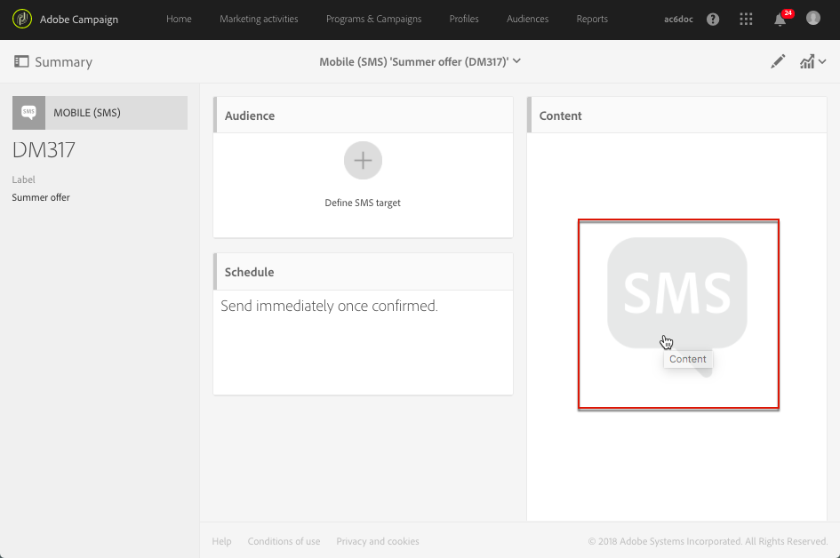

# About SMS and push content design{#about-sms-and-push-content-design}

컨텐츠 편집기를 사용하여 Adobe Campaign에서 SMS 메시지와 푸시 알림을 정의하고 수정하고 개인화할 수 있습니다.

This section describes the specificities of the SMS and push content editor, including the [SMS and push content editor interface](../../designing/using/sms-and-push-content-editor-interface.md).

하나 이상의 마케팅 활동에 공통인 작업은 다음 섹션에 있습니다.

* For more on personalizing an SMS or push notification content, see [Inserting a personalization field](../../designing/using/inserting-a-personalization-field.md) and [Adding a content block](../../designing/using/adding-a-content-block.md).
* For more on defining conditional text in an SMS message or push notification, see [Defining dynamic text](../../designing/using/defining-dynamic-text.md).

SMS 및 푸시 컨텐츠 편집기를 이용하려면 다음을 수행하십시오.

* Click the **[!UICONTROL Content]** block in an SMS dashboard.

   

* Click the pencil next to the **[!UICONTROL Message body]** field in a push notification dashboard.

   

**관련 항목:**

* [SMS 메시지 만들기](../../channels/using/creating-an-sms-message.md)
* [푸시 알림 만들기 및 보내기](../../channels/using/preparing-and-sending-a-push-notification.md)

