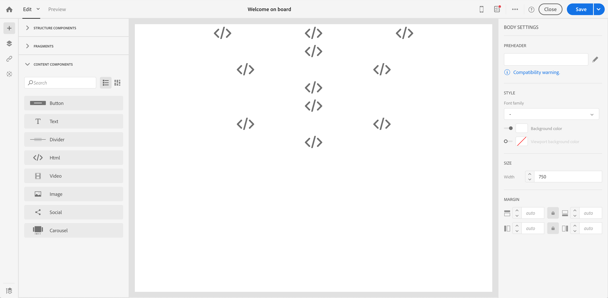

# 이전 편집기 이메일 컨텐츠 변환 {#converting-an-html-content}

이메일 디자이너와 함께 작업을 시작하고 기존 편집기에서 만든 이메일 HTML에서 재사용 가능한 템플릿과 단편을 만들 수 있습니다.

이 사용 사례에서는 HTML 이메일을 사용하여 이메일 디자이너 템플릿을 만들고 이메일 디자이너의 HTML 구성 요소로 나눌 수 있습니다.

>[!CAUTION]
>
>이 섹션은 HTML 코드에 익숙한 고급 사용자를 위한 것입니다.

>[!NOTE]
>
>호환성 모드와 마찬가지로 HTML 구성 요소는 제한된 옵션을 사용하여 편집할 수 있습니다.즉석 에디션만 수행할 수 있습니다.

## 이메일 컨텐츠 준비

1. HTML 이메일을 선택합니다.
1. HTML 이메일을 나눌 섹션을 식별합니다.
1. HTML에서 다른 블록을 잘라냅니다.

## 이메일 구조 만들기

1. 을 **[!UICONTROL Email Designer]** 열어 빈 이메일 컨텐츠를 만듭니다.
1. 본문 수준 속성을 설정합니다.배경색, 폭 등 자세한 내용은 이메일 [스타일](../../designing/using/styles.md)편집을 참조하십시오.
1. 섹션이 있는 만큼 구조 구성 요소를 추가합니다. 자세한 내용은 이메일 [구조](../../designing/using/designing-from-scratch.md#defining-the-email-structure)편집을 참조하십시오.

## HTML 컨텐츠 추가

1. 각 구조 구성 요소에 HTML 구성 요소를 추가합니다. 자세한 내용은 조각 및 [구성 요소](../../designing/using/designing-from-scratch.md#defining-the-email-structure)추가를 참조하십시오.
1. 모든 구성 요소에 HTML을 복사하여 붙여 넣습니다.

## 이메일 스타일 관리 {#manage-the-style-of-your-email}

1. 로 **[!UICONTROL Mobile view]**&#x200B;전환합니다. 자세한 내용은 [이 섹션을](../../designing/using/plain-text-html-modes.md#switching-to-mobile-view)참조하십시오.

1. 이 문제를 해결하려면 소스 코드 모드로 전환하고 스타일 섹션을 새 스타일 섹션에 복사하여 붙여 넣습니다. 예:

   ```
   <style type="text/css">
   a {text-decoration:none;}
   body {min-width:100% !important; margin:0 auto !important; padding:0 !important;}
   img {line-height:100%; text-decoration:none; -ms-interpolation-mode:bicubic;}
   ...
   </style>
   ```

   >[!NOTE]
   >
   >이 스타일 뒤에 다른 사용자 지정 스타일 태그에 스타일을 추가해야 합니다.
   >
   >이메일 디자이너가 생성한 CSS는 수정하지 마십시오.
   >
   >* `<style data-name="default" type="text/css">(##)</style>`
   >* `<style data-name="supportIOS10" type="text/css">(##)</style>`
   >* `<style data-name="mediaIOS8" type="text/css">(##)</style>`
   >* `<style data-name="media-default-max-width-500px" type="text/css">(##)</style>`
   >* `<style data-name="media-default--webkit-min-device-pixel-ratio-0" type="text/css">(##)</style>`


1. 모바일 보기로 돌아가 콘텐츠가 올바르게 표시되는지 확인하고 변경 내용을 저장합니다.

## 사용 사례

기존 편집기에서 만든 이 이메일을 **[!UICONTROL Email Designer]** 템플릿으로 변환해 보겠습니다.

## 이메일 섹션 식별

이 이메일에서 11개의 섹션을 식별할 수 있습니다.


HTML의 어느 섹션을 식별할 수 있도록 요소를 선택할 수 있습니다.


이메일의 HTML 버전을 보려면 을 클릭합니다 **[!UICONTROL Show source]**.

### 이메일 템플릿 및 해당 구조 만들기

1. 이메일의 레이아웃을 **[!UICONTROL Structure Components]** 반영하여 드래그하여 놓습니다.

우리는 11개의 구조 구성 요소를 만들어야 합니다.


### HTML 컨텐츠 구성 요소 삽입

1. 각 **[!UICONTROL HTML component]** 에 를 **[!UICONTROL structure component]** 삽입합니다.



1. 각 섹션에 대해 을 클릭합니다 **[!UICONTROL Show source code]** .


1. HTML 섹션을 삽입합니다.

1. 클릭 **[!UICONTROL Save]**.

이제 이메일의 렌더링을 확인할 수 있습니다.


### 모바일 보기에 맞게 스타일 관리

CSS 요소를 삽입하여 이메일이 모바일 보기에 적합한지 확인합니다.

1. 소스 코드로 전환하고 스타일 섹션을 새로운 스타일 섹션에 복사하여 붙여넣을 수 있습니다.

자세한 내용은 이메일 [스타일 관리를 참조하십시오](#manage-the-style-of-your-email).

이제 이메일 디자이너에서 기존 이메일을 사용할 수 있습니다.