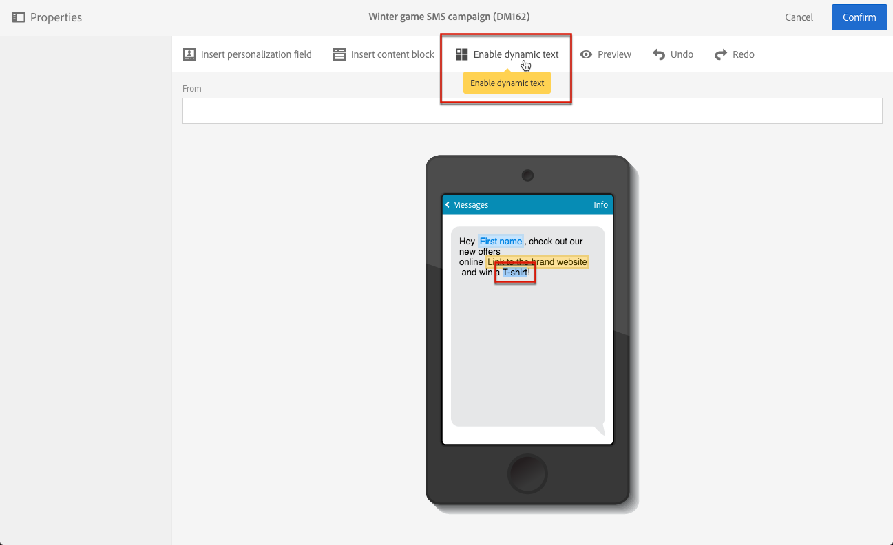
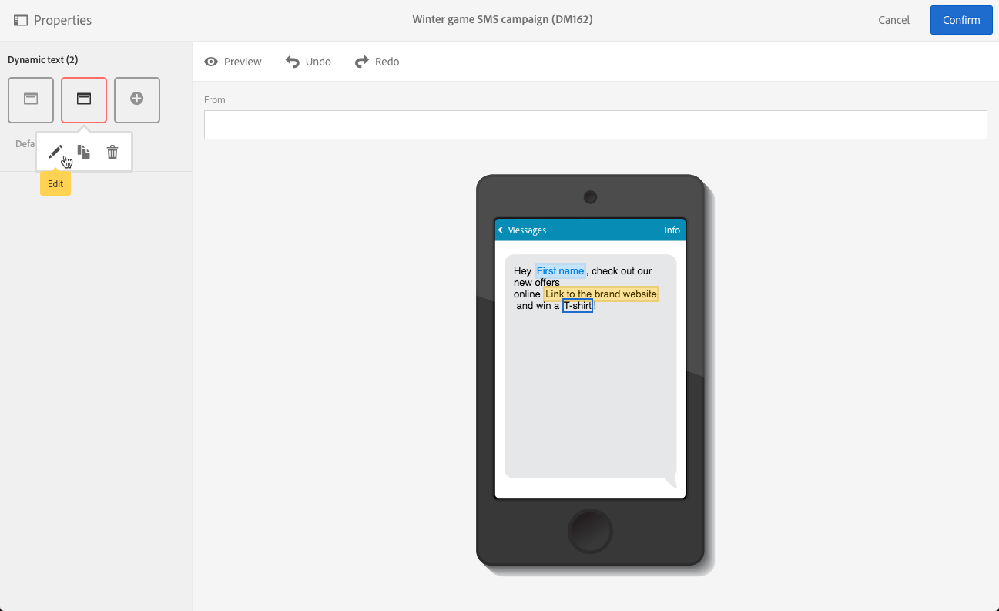
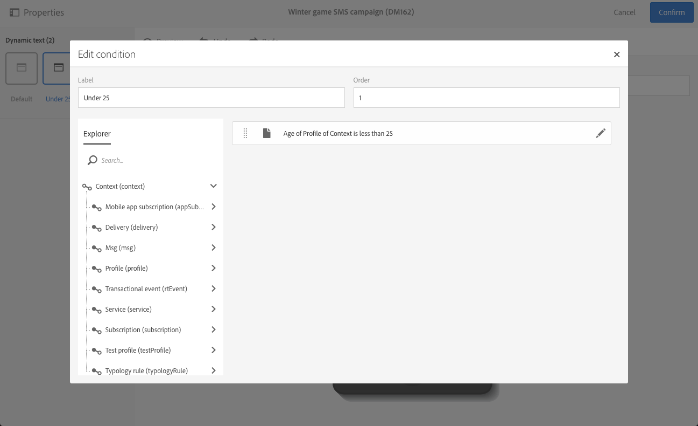

# Defining dynamic text{#defining-dynamic-text}

동적 텍스트는 동적 컨텐츠와 동일한 방식으로 정의됩니다. [Definig 동적 콘텐츠](../../designing/using/defining-dynamic-content-in-an-email.md) 섹션을 참조하십시오.

>[!NOTE]
>
>SMS와 푸시를 위해 동적 텍스트만 정의할 수 있습니다. 랜딩 페이지에 동적 콘텐츠와 텍스트를 모두 정의할 수 있습니다. [이메일 디자이너가](../../designing/using/about-email-content-design.md#about-the-email-designer)있는 동적 텍스트를 정의하려면 이메일에서 동적 컨텐츠 [정의를 참조하십시오](../../designing/using/defining-dynamic-content-in-an-email.md).

아래 예제는 SMS 메시지에서 동적 텍스트를 정의하는 방법을 보여줍니다.

1. 메시지 또는 랜딩 페이지의 본문에서 텍스트를 선택합니다.
1. **[!UICONTROL Enable dynamic text]**&#x200B;을 클릭합니다.

   

   The **[!UICONTROL Dynamic text]** option displays in the palette. 동적 컨텐츠와 동일한 방식으로 구성됩니다.

1. 변형을 선택합니다.

   

1. 이 변형에 대한 조건을 정의합니다.

   

하나 이상의 변형에 대해 조건을 정의하면 동적 텍스트 주위에 자주색 프레임이 표시됩니다.

