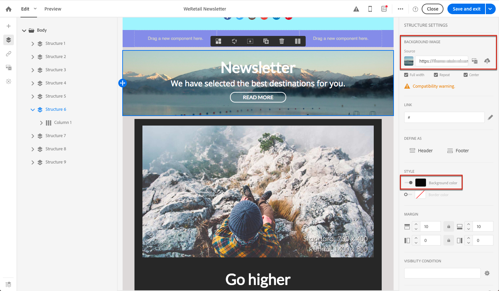

# Editing email styles{#editing-email-styles}

## Editing an element {#editing-an-element}

In the Email Designer, when selecting an element, several options specific to the type of content selected are displayed in the **[!UICONTROL Settings]** pane. 이러한 옵션을 사용하여 이메일 스타일을 손쉽게 변경할 수 있습니다.

### Selecting an element {#selecting-an-element}

이메일 디자이너 인터페이스에서 요소를 선택하려면 다음 중 하나를 수행할 수 있습니다.

* 이메일에서 직접 클릭합니다.
* or browse the structure tree available from the options located in the left **Palette**.

구조 트리를 탐색하면 보다 정확하게 선택할 수 있습니다. 다음 중 하나를 선택할 수 있습니다.

* 전체 구조 구성 요소,
* 구조 구성 요소를 구성하는 열 중 하나,
* 또는 열 안에 있는 구성 요소만.

열을 선택하려면 다음을 수행할 수도 있습니다.

1. Select a structure component (directly in the email or using the structure tree available from the left **Palette**).
1. **컨텍스트 도구 모음에서**&#x200B;를 클릭하여 **[!UICONTROL Select a column]** 원하는 열을 선택합니다.

See an example in [this section](../../designing/using/editing-email-styles.md#example--adjusting-vertical-alignment-and-padding).

### Adjusting style settings {#adjusting-style-settings}

1. 이메일에서 요소를 선택합니다. For more on this, see [Selecting an element](../../designing/using/editing-email-styles.md#selecting-an-element).
1. 필요에 따라 설정을 조정합니다. 선택한 각 요소는 다른 설정 세트를 제공합니다.

   You can insert backgrounds, change sizes, modify horizontal or vertical alignment, manage colors, add [padding or margin](../../designing/using/editing-email-styles.md#about-padding-and-margin), and so on.

   To do this, use the options displayed in the **[!UICONTROL Settings]** pane or [add inline styling attributes](../../designing/using/editing-email-styles.md#adding-inline-styling-attributes).

   

1. 콘텐츠 저장

### About padding and margin {#about-padding-and-margin}

이메일 디자이너 인터페이스를 사용하면 패딩 및 여백 설정을 신속하게 조정할 수 있습니다.

**[!UICONTROL Padding]**: 이 설정을 사용하면 요소 테두리 내에 있는 공간을 관리할 수 있습니다.

예를 들면 다음과 같습니다.

* 패딩을 사용하여 이미지의 왼쪽과 오른쪽에 여백을 설정할 수 있습니다.
* Use top and bottom padding to add more spacing to a **[!UICONTROL Text]** or a **[!UICONTROL Divider]** component.
* 구조 요소 내의 열 사이에 테두리를 설정하려면 각 열에 대한 패딩을 정의합니다.

**[!UICONTROL Margin]**: 이 설정을 사용하면 요소의 테두리 및 다음 요소 사이의 공간을 관리할 수 있습니다.

>[!NOTE]
>
>선택 항목 (구조 구성 요소, 열 또는 컨텐츠 구성 요소) 에 따라 결과가 동일하지 않습니다. Adobe recommends setting the **[!UICONTROL Padding]** and **[!UICONTROL Margin]** parameters at the column level.

**[!UICONTROL Padding]** And **[!UICONTROL Margin]**&#x200B;에서 잠금 아이콘을 클릭하여 위쪽 및 아래쪽 또는 오른쪽 및 왼쪽 매개 변수 간의 동기화를 끊습니다. 이렇게 하면 각 매개 변수를 별도로 조정할 수 있습니다.

### About alignment {#about-alignment}

* **텍스트 정렬**: 마우스 커서를 일부 텍스트에 놓고 상황에 맞는 툴바를 사용하여 정렬할 수 있습니다.

   

* **현재** **[!UICONTROL Divider]** 및 **[!UICONTROL Social]** 구성 요소가 아닌 텍스트, 이미지 및 버튼에 가로 정렬을 적용할 수 있습니다.

   

* **수직 정렬을**&#x200B;설정하려면 구조 구성 요소 내부의 열을 선택하고 설정 창에서 옵션을 선택합니다.

   

### About backgrounds {#about-backgrounds}

이메일 디자이너와 배경을 설정하는 측면에서 Adobe는 다음 사항을 권장합니다.

1. 디자인에 필요한 경우 이메일의 본문에 배경색을 적용합니다.
1. 대부분의 경우 열 수준에서 배경색을 설정합니다.
1. 관리하기 어려운 이미지나 텍스트 구성 요소에 배경색을 사용하지 마십시오.

다음은 사용할 수 있는 사용 가능한 배경 설정입니다.

* Set a **[!UICONTROL Background color]** for the whole email. 왼쪽 팔레트에서 액세스할 수 있는 탐색 트리에서 Body 설정을 선택해야 합니다.

   

* Set the same background color for all structure components by selecting **[!UICONTROL Viewport background color]**. 이 옵션을 사용하면 배경색에서 다른 설정을 선택할 수 있습니다.

   

* 각 구조 구성 요소에 대해 다른 배경색을 설정합니다. 왼쪽 팔레트에서 액세스할 수 있는 탐색 트리에서 구조를 선택하여 해당 구조에 대해서만 특정 배경색을 적용합니다.

   

   뷰포트 배경색을 설정하지 마십시오.

* Set a **[!UICONTROL Background image]** for the content of a structure component.

   

   >[!NOTE]
   >
   >일부 이메일 프로그램은 배경 이미지를 지원하지 않습니다. 이미지를 표시할 수 없는 경우 적절한 대체 배경색을 선택해야 합니다.

* 열 수준에서 배경색을 설정합니다.

   

   >[!NOTE]
   >
   >가장 일반적인 사용 사례입니다. 열 수준에서 배경색을 설정하는 것이 좋습니다. 이 경우 전체 이메일 내용을 편집할 때 더 유연하게 사용할 수 있습니다.

   열 수준에서 배경 이미지를 설정할 수도 있지만 이것은 거의 사용되지 않습니다.

### Example: adjusting vertical alignment and padding {#example--adjusting-vertical-alignment-and-padding}

세 개의 열로 구성된 구조 구성 요소 내에서 패딩 및 수직 정렬을 조정하려는 경우 이렇게 하려면 아래 단계를 따르십시오.

1. Select the structure component directly in the email or using the structure tree available from the left **Palette**.
1. **컨텍스트 도구 모음에서**&#x200B;를 클릭하고 **[!UICONTROL Select a column]** 편집할 도구를 선택합니다. 구조 트리에서 선택할 수도 있습니다.

   

   The editable parameters for that column are displayed in the **[!UICONTROL Settings]** pane on the right.

1. Under **[!UICONTROL Vertical alignment]**, select **[!UICONTROL Up]**.

   

   컨텐츠 구성 요소는 열 맨 위에 표시됩니다.

1. Under **[!UICONTROL Padding]**, define the top padding inside the column. 잠금 아이콘을 클릭하여 아래쪽 패딩 동기화를 중단합니다.

   해당 열에 대한 왼쪽 및 오른쪽 패딩을 정의합니다.

   

1. 유사하게 진행하여 다른 열의 정렬 및 패딩을 조정할 수 있습니다.

   

1. 변경 내용을 저장합니다.

## Adding inline styling attributes {#adding-inline-styling-attributes}

이메일 디자이너 인터페이스에서 요소를 선택하고 사이드 패널에 해당 설정을 표시할 때 해당 특정 요소에 대한 인라인 속성과 해당 값을 사용자 지정할 수 있습니다.

1. 내용에서 요소를 선택합니다.
1. On the side panel, look for the **[!UICONTROL Styles Inline]** settings.

   

1. Modify the values of the existing attributes, or add new ones using the **+** button. CSS와 호환되는 속성과 값을 추가할 수 있습니다.

스타일이 선택된 요소에 적용됩니다. 하위 요소에 특정 스타일 속성이 정의되어 있지 않으면 상위 요소의 스타일이 상속됩니다.
