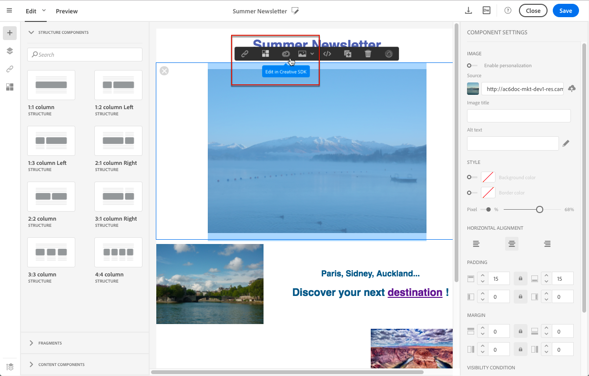

# {#images} 이미지 작업

## 이미지 삽입{#inserting-images}

이메일 및 랜딩 페이지에 이미지를 삽입할 수 있습니다.

구성에 따라 다음 유형의 이미지를 사용할 수 있습니다.

* 로컬 이미지
* Adobe Experience Cloud에서 공유되는 이미지 - [캠페인 및 자산 핵심 서비스 작업](../../integrating/using/working-with-campaign-and-assets-core-service.md) / Assets On Demand를 참조하십시오.
* Adobe Target의 동적 이미지 - [캠페인 및 Target 작업](../../integrating/using/about-campaign-target-integration.md)을 참조하십시오.

>[!CAUTION]
>
>HTML 버전의 이메일을 편집하여 이미지를 직접 추가하도록 선택한 경우 HTML 페이지의 &lt;script> 태그&#x200B;**에 있는**&#x200B;외부 파일을 호출하면 안 됩니다. 이러한 파일은 Adobe Campaign 서버로 가져오지 않습니다.

### 이메일 {#inserting-images-in-an-email}에 이미지 삽입

1. 구조 구성 요소를 추가합니다. 자세한 내용은 [전자 메일 구조 편집](../../designing/using/designing-from-scratch.md#defining-the-email-structure)을 참조하십시오.
1. 이 구조 구성 요소 내에서 **[!UICONTROL Image]** 컨텐츠 구성 요소를 추가합니다.

   

1. **[!UICONTROL Browse]**&#x200B;을(를) 클릭합니다. 이미지를 드래그하여 놓거나 클릭하여 컴퓨터에서 파일을 선택합니다.

   

1. 방금 추가한 컨텐츠 구성 요소를 선택합니다.
1. 이미지 속성을 확인하고 필요한 경우 조정합니다.

   

## 이미지 속성 설정{#setting-up-image-properties}

이미지가 포함된 블록을 선택하면 팔레트에 다음 속성이 제공됩니다.

* **개인화** 를 활성화하면 이미지 소스를 사용자 정의할 수 있습니다. [이미지 소스 개인화](../../designing/using/personalization.md#personalizing-an-image-source)를 참조하십시오.
* **이미지** 제목이미지의 제목을 정의합니다.
* **대체 텍스트** (이메일) 또는  **캡션** ( **** 랜딩 페이지)을 사용하면 이미지에 연결된 캡션을 정의할 수 있습니다(altHTML 속성에 해당합니다).
* 이메일을 편집할 때 **스타일**&#x200B;을 사용하면 이미지 크기, 배경 및 테두리를 지정할 수 있습니다.
* 랜딩 페이지를 편집할 때 **Dimension**&#x200B;에서는 이미지 크기를 픽셀 단위로 지정할 수 있습니다.

편집기에서는 **모든 이미지 유형**&#x200B;의 형식으로 브라우저 호환 작업을 수행할 수 있습니다. 편집기와 호환되도록 **&quot;Flash&quot; 유형 애니메이션**&#x200B;을 다음과 같이 HTML 페이지에 삽입해야 합니다.

```
<object type="application/x-shockwave-flash" data="http://www.mydomain.com/flash/your_animation.swf" width="200" height="400">
 <param name="movie" value="http://www.mydomain.com/flash/your_animation.swf" />
 <param name="quality" value="high" />
 <param name="play" value="true"/>
 <param name="loop" value="true"/> 
</object>
```

<!--
## Modifying images with the Adobe Creative SDK{#modifying-images-with-the-adobe-creative-sdk}

You can edit images and use a complete set of features powered by the Adobe Creative SDK to enhance your images directly in the content editor when editing emails or landing pages.

The image editor offers a powerful, full-featured image editing UI component that allows you to edit images and apply effects and frames, original high-quality stickers, beautiful overlays, fun features like tilt shift and color splash, pro-level adjustments and more.

To modify an image with the Adobe Creative SDK:

1. Select the image.
1. In the toolbar, click the Creative Cloud icon.

   

1. Select the tool you want to use through the icons on the top of the window to modify the image.

   

1. Click **[!UICONTROL Save]** when modifications are done. The updated image is saved on Adobe Campaign server and ready to be used.

>[!NOTE]
>
>Tools offered in the image editor cannot be customized.
-->