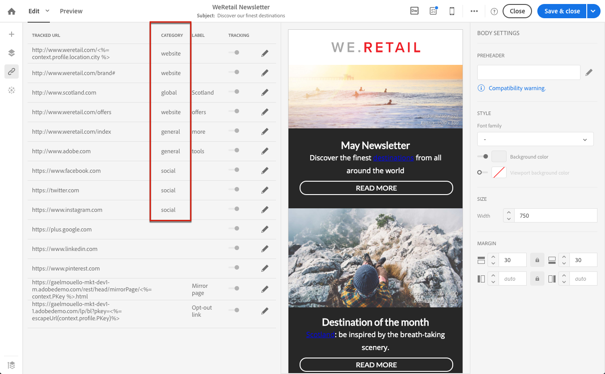

# 링크 {#links} 추가

## 링크 {#inserting-a-link} 삽입

편집기를 사용하면 HTML 컨텐츠 요소에 링크를 삽입하여 이메일 또는 랜딩 페이지를 개인화할 수 있습니다.

링크를 페이지 요소에 삽입할 수 있습니다.이미지, 단어, 단어 그룹, 텍스트 블록 등

>[!NOTE]
>
>아래 이미지는 이메일에 [이메일 디자이너](../../designing/using/designing-content-in-adobe-campaign.md)를 사용하여 링크를 삽입하는 방법을 보여줍니다.

1. 요소를 선택하고 컨텍스트 도구 모음에서 **[!UICONTROL Insert link]**&#x200B;을 클릭합니다.

   

1. 만들 링크 유형을 선택합니다.

   * **외부 링크**:외부 URL에 대한 링크를 삽입합니다.

      URL에 대한 개인화를 정의할 수 있습니다. [URL 개인화](../../designing/using/using-reusable-content.md#creating-a-content-fragment)를 참조하십시오.

   * **랜딩 페이지**:adobe campaign 랜딩 페이지에 대한 액세스 권한을 제공합니다.
   * **구독 링크**:adobe campaign 서비스에 가입할 수 있는 링크를 삽입합니다.
   * **구독 취소 링크**:adobe campaign 서비스 가입 해지를 위한 링크를 삽입합니다.
   * **동작을 정의하는 링크**:랜딩 페이지의 요소를 클릭할 때 작업을 정의합니다.

      >[!NOTE]
      >
      >이 유형의 링크는 랜딩 페이지에만 사용할 수 있습니다.

1. 수신자에게 표시되는 텍스트를 수정할 수 있습니다.
1. 사용자가 링크를 클릭할 때(예: 새 창 열기) 브라우저 동작을 설정할 수 있습니다.

   >[!NOTE]
   >
   >브라우저 비헤이비어를 정의하는 것은 랜딩 페이지에만 적용됩니다.

1. 변경 내용을 저장합니다.

링크가 만들어져도 설정 창에서 수정할 수 있습니다. 연필 아이콘을 클릭하여 매개 변수를 편집합니다.

[이메일 디자이너](../../designing/using/designing-content-in-adobe-campaign.md)로 이메일을 편집할 때 이메일에 포함된 모든 URL을 나열하는 표에서 만든 링크에 쉽게 액세스하고 수정할 수 있습니다. 이 목록을 사용하면 중앙에서 보기를 보고 이메일 컨텐츠에서 각 URL을 찾을 수 있습니다. 액세스하려면 [추적된 URL 정보](#about-tracked-urls)를 참조하십시오.

>[!NOTE]
>
>**페이지 URL** 또는 **구독 취소** 링크와 같은 개인화된 URL은 이 목록에서 수정할 수 없습니다. 다른 모든 링크는 편집할 수 있습니다.

**관련 항목**:

* [개인화 필드 삽입](../../designing/using/personalization.md#inserting-a-personalization-field)
* [콘텐츠 블록 추가](../../designing/using/personalization.md#adding-a-content-block)
* [동적 컨텐츠 정의](../../designing/using/personalization.md#defining-dynamic-content-in-an-email)

## 추적된 URL {#about-tracked-urls} 정보

Adobe Campaign을 사용하면 수신자가 이메일에 포함된 URL을 클릭할 때 받는 사람의 동작을 추적할 수 있습니다. 추적에 대한 자세한 내용은 [이 섹션](../../sending/using/tracking-messages.md#about-tracking)을 참조하십시오.

작업 표시줄의 **[!UICONTROL Links]** 아이콘은 추적할 컨텐츠의 모든 URL 목록을 자동으로 표시합니다.

>[!NOTE]
>
>추적은 기본적으로 활성화됩니다. 이 기능은 Adobe Campaign에서 추적이 활성화된 경우 이메일에만 사용할 수 있습니다. 추적 매개 변수에 대한 자세한 내용은 [이 섹션](../../administration/using/configuring-email-channel.md#tracking-parameters)을 참조하십시오.

각 링크의 URL, 카테고리, 레이블 및 추적 유형은 이 목록에서 수정할 수 있습니다. 링크를 편집하려면 해당 연필 아이콘을 클릭합니다.

추적된 각 URL에 대해 추적 모드를 다음 값 중 하나로 설정할 수 있습니다.

* **추적됨**:이 URL에 대한 추적을 활성화합니다.
* **미러 페이지**:이 URL이 미러 페이지 URL인 것으로 간주합니다.
* **안 함**:이 URL의 추적을 활성화하지 않습니다. 이 정보는 저장됩니다.URL이 향후 메시지에 다시 나타날 경우 추적 기능이 자동으로 비활성화됩니다.
* **옵트아웃**:이 URL을 옵트아웃 또는 구독 취소 URL로 간주합니다.

각 URL에 대한 추적을 비활성화하거나 활성화할 수도 있습니다.

>[!NOTE]
>
>기본적으로 Adobe Campaign에서는 **미러 페이지 URL** 및 **구독 취소** 링크를 제외한 모든 컨텐츠 URL이 추적됩니다.

메시지에 사용된 URL에 따라 **[!UICONTROL Category]** 필드를 편집하여 URL을 다시 그룹화할 수 있습니다. 이러한 카테고리는 예를 들어 [URL에서 보고서로 표시하고 streams](../../reporting/using/urls-and-click-streams.md)를 클릭할 수 있습니다.

보고서를 작성할 때 **[!UICONTROL Components]** 탭에서 **[!UICONTROL Dimension]**&#x200B;을 선택하고 목록을 아래로 스크롤하여 추적 구성 요소에 액세스합니다. 예를 들어, **[!UICONTROL Tracking URL Category]**&#x200B;을 작업 영역으로 드래그하여 놓으면 클릭한 각 URL의 추적 카테고리에 따라 결과가 표시됩니다.

사용자 지정된 보고서 작성에 대한 자세한 내용은 [이 섹션](../../reporting/using/about-dynamic-reports.md)을 참조하십시오.
