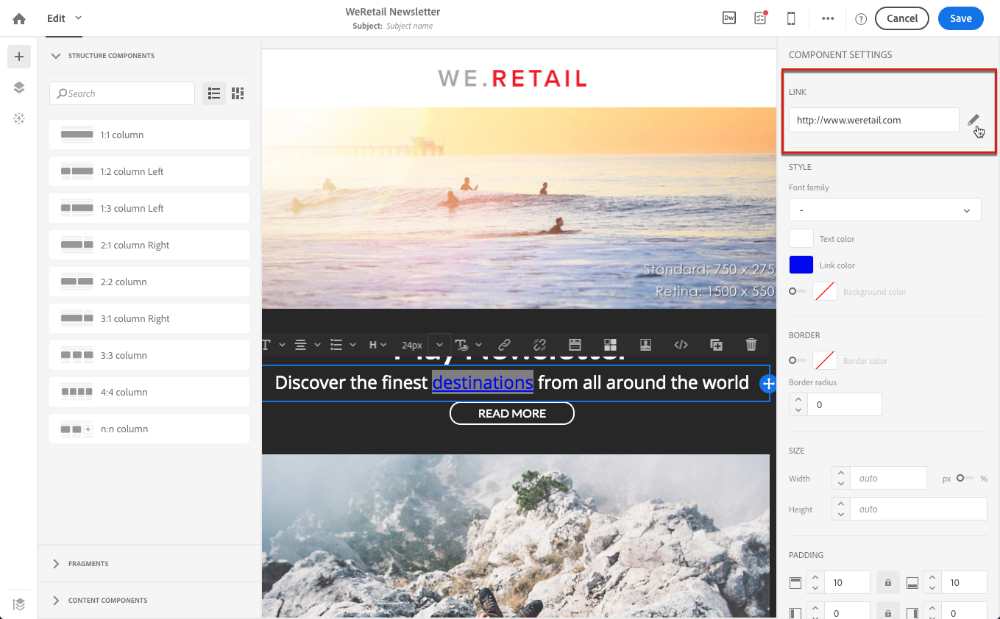

# 링크 추가 {#links}

## 링크 삽입 {#inserting-a-link}

편집기를 사용하면 HTML 컨텐츠 요소에 링크를 삽입하여 이메일 또는 랜딩 페이지를 개인화할 수 있습니다.

링크를 페이지 요소에 삽입할 수 있습니다.이미지, 단어, 단어 그룹, 텍스트 블록 등

>[!NOTE]
>
>아래 이미지는 이메일에 이메일 디자이너를 사용하여 링크를 삽입하는 [방법을](../../designing/using/designing-content-in-adobe-campaign.md) 보여줍니다.

1. 요소를 선택하고 컨텍스트 도구 모음에서 **[!UICONTROL Insert link]**을 클릭합니다.

   

1. 만들 링크의 유형을 선택합니다.

   * **외부 링크**:외부 URL에 대한 링크를 삽입합니다.

      URL에 대한 개인화를 정의할 수 있습니다. URL [개인화를 참조하십시오](../../designing/using/using-reusable-content.md#creating-a-content-fragment).

   * **랜딩 페이지**:adobe Campaign 랜딩 페이지에 액세스할 수 있습니다.
   * **구독 링크**:adobe Campaign 서비스에 가입하는 링크를 삽입합니다.
   * **구독 취소 링크**:adobe Campaign 서비스의 가입 해지를 위한 링크를 삽입합니다.
   * **작업을**&#x200B;정의하는 링크:랜딩 페이지의 요소를 클릭할 때 작업을 정의합니다.

      >[!NOTE]
      >
      >이 유형의 링크는 랜딩 페이지에만 사용할 수 있습니다.

1. 수신자에게 표시되는 텍스트를 수정할 수 있습니다.
1. 사용자가 링크를 클릭할 때(예: 새 창 열기) 브라우저 동작을 설정할 수 있습니다.

   >[!NOTE]
   >
   >브라우저 비헤이비어 정의는 랜딩 페이지에만 적용됩니다.

1. 변경 내용을 저장합니다.

링크가 만들어져도 설정 창에서 수정할 수 있습니다. 연필 아이콘을 클릭하여 매개 변수를 편집합니다.

이메일 디자이너와 함께 이메일을 편집할 [때](../../designing/using/designing-content-in-adobe-campaign.md)이메일에 포함된 모든 URL을 나열하는 표에서 만든 링크에 쉽게 액세스하고 수정할 수 있습니다. 이 목록을 사용하면 중앙에서 보고 이메일 컨텐츠의 각 URL을 찾을 수 있습니다. 액세스하려면 추적된 [URL 정보를 참조하십시오](#about-tracked-urls).

>[!NOTE]
>
>미러 페이지 URL 또는 **구독 취소** 링크와 같은 **개인화된 URL은** 이 목록에서 수정할 수 없습니다. 다른 모든 링크는 편집할 수 있습니다.

**관련 항목**:

* [개인화 필드 삽입](../../designing/using/personalization.md#inserting-a-personalization-field)
* [콘텐츠 블록 추가](../../designing/using/personalization.md#adding-a-content-block)
* [동적 컨텐츠 정의](../../designing/using/personalization.md#defining-dynamic-content-in-an-email)

## 추적된 URL 정보 {#about-tracked-urls}

Adobe Campaign을 사용하면 수신자가 이메일에 포함된 URL을 클릭할 때 받는 사람의 동작을 추적할 수 있습니다. 추적에 대한 자세한 내용은 [이 섹션을](../../sending/using/tracking-messages.md#about-tracking)참조하십시오.

작업 표시줄의 **[!UICONTROL Links]**아이콘은 추적할 컨텐츠의 모든 URL 목록을 자동으로 표시합니다.

>[!NOTE]
>
>기본적으로 추적이 활성화됩니다. 이 기능은 Adobe Campaign에서 추적이 활성화된 경우에만 이메일에 사용할 수 있습니다. 추적 매개 변수에 대한 자세한 내용은 [이 섹션을](../../administration/using/configuring-email-channel.md#tracking-parameters)참조하십시오.

이 목록에서 각 링크의 URL, 카테고리, 레이블 및 추적 유형을 수정할 수 있습니다. 링크를 편집하려면 해당 연필 아이콘을 클릭합니다.

추적된 각 URL에 대해 추적 모드를 다음 값 중 하나로 설정할 수 있습니다.

* **추적됨**:이 URL에 대한 추적을 활성화합니다.
* **미러 페이지**:이 URL이 미러 페이지 URL로 간주합니다.
* **사용 안 함**:이 URL의 추적을 활성화하지 않습니다. 이 정보는 다음과 같이 저장됩니다.url이 향후 메시지에 다시 나타나면 추적이 자동으로 비활성화됩니다.
* **옵트아웃**:이 URL을 옵트아웃 또는 구독 취소 URL로 간주합니다.

각 URL에 대한 추적을 비활성화하거나 활성화할 수도 있습니다.

>[!NOTE]
>
>기본적으로 Adobe Campaign에서 미러 페이지 URL 및 가입 **취소** 링크를 제외한 모든 컨텐츠 URL이 **추적됩니다** .

메시지에 사용된 URL에 따라 **[!UICONTROL Category]**필드를 편집하여 URL을 다시 그룹화할 수 있습니다. 이러한 카테고리는 URL 및 클릭 스트림과 같이[보고서를](../../reporting/using/urls-and-click-streams.md)표시할 수 있습니다.

보고서를 작성할 때, **[!UICONTROL Components]**탭에서 목록을 선택하고**[!UICONTROL Dimension]** 아래로 스크롤하여 추적 구성 요소에 액세스합니다. 예를 들어 작업 **[!UICONTROL Tracking URL Category]**영역으로 드래그하여 놓으면 클릭한 각 URL의 추적 범주에 따라 결과가 표시됩니다.

사용자 지정된 보고서 작성에 대한 자세한 내용은 [이 섹션을](../../reporting/using/about-dynamic-reports.md)참조하십시오.
