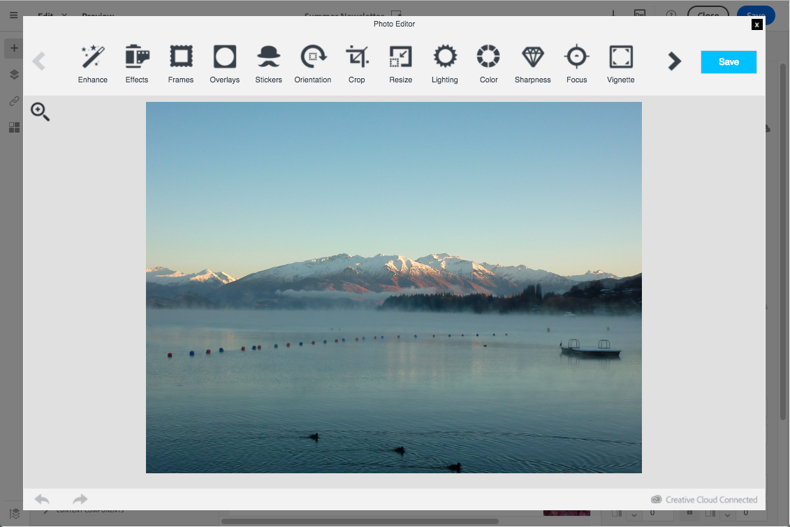

# Modifying images with the Adobe Creative SDK{#modifying-images-with-the-adobe-creative-sdk}

Adobe Creative SDK에서 제공하는 이미지 및 전체 기능을 사용하여 이메일 또는 랜딩 페이지를 편집할 때 컨텐츠 편집기에서 바로 이미지를 향상시킬 수 있습니다.

이미지 편집기는 이미지를 편집하고 효과 및 프레임, 원본 고화질의 스티커, 멋진 오버레이, 기울기 이동 및 색상 Splash와 같은 재미있는 기능, 전문가 수준의 조정 등을 적용할 수 있는 강력한 모든 기능을 갖춘 이미지 편집 UI 구성 요소를 제공합니다.

Adobe Creative SDK를 사용하여 이미지를 수정하려면:

1. 이미지를 선택합니다.
1. 도구 모음에서 Creative Cloud 아이콘을 클릭합니다.

   

1. 창 상단에 있는 아이콘을 통해 사용할 도구를 선택하여 이미지를 수정합니다.

   

1. Click **[!UICONTROL Save]** when modifications are done. 업데이트된 이미지가 Adobe Campaign 서버에 저장되고 사용할 준비가 됩니다.

>[!NOTE]
>
>이미지 편집기에서 제공되는 도구는 사용자 정의할 수 없습니다.

