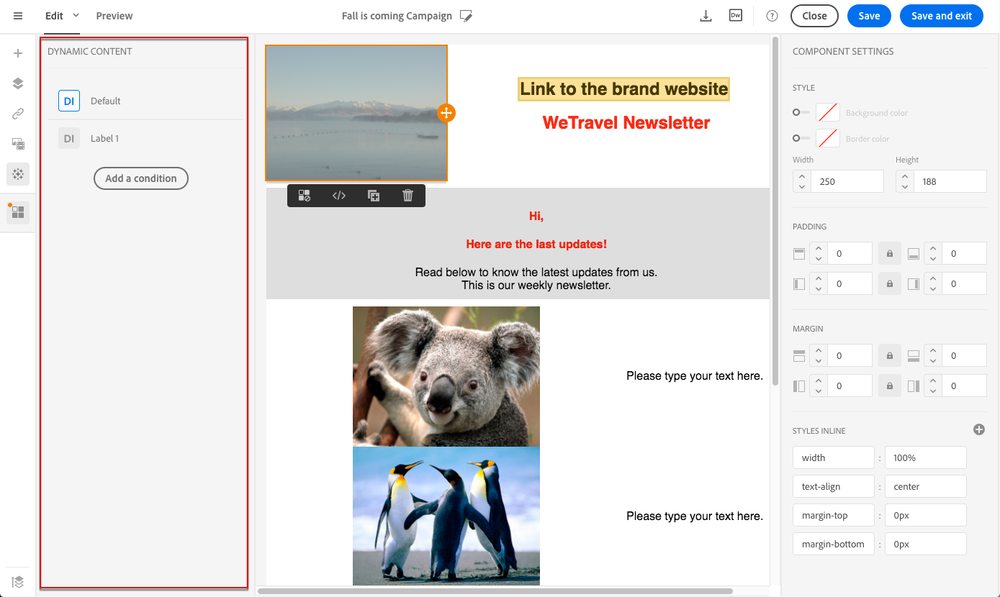
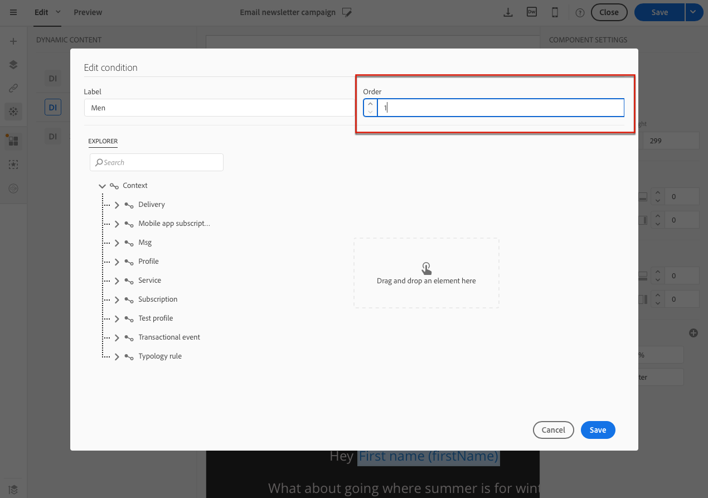

# 이메일 콘텐츠 개인화 {#personalization}

Adobe Campaign에서 제공하는 컨텐츠 및 메시지 표시는 여러 가지 방법으로 개인화할 수 있습니다. 이러한 방법은 프로파일에 따라 기준에 따라 결합할 수 있습니다. 일반적으로 Adobe Campaign을 사용하면 다음 작업을 수행할 수 있습니다.

* 동적 개인화 필드를 삽입합니다. 개인화 [필드](#inserting-a-personalization-field)삽입을 참조하십시오.
* 사전 정의된 개인화 블록을 삽입합니다. 컨텐츠 [블록](#adding-a-content-block)추가를 참조하십시오.
* 이메일 보낸 사람을 개인화합니다. 발신자 [개인화를](#personalizing-the-sender)참조하십시오.
* 이메일 제목을 개인화합니다. See [Personalizing the subject line of an email](../../designing/using/subject-line.md#subject-line).
* 조건부 컨텐츠 만들기 이메일에서 [동적 컨텐츠 정의를 참조하십시오](#defining-dynamic-content-in-an-email).

## 발신자 개인화 {#personalizing-the-sender}

보낸 메시지 헤더에 표시될 보낸 사람의 이름을 정의하려면, 이메일 디자이너 홈 페이지(홈 아이콘을 통해 액세스 가능)의 **[!UICONTROL Properties]** 탭으로 이동합니다. 자세한 내용은 [이메일](../../designing/using/subject-line.md#email-sender)보낸 사람 정의를 참조하십시오.

발신자 이름 **** 블록을 클릭하여 발신자 이름을 변경할 수 있습니다. 그런 다음 필드를 편집할 수 있으며 사용할 이름을 입력할 수 있습니다.

이 필드는 개인화할 수 있습니다. 이렇게 하려면 발신자 이름 아래의 아이콘을 클릭하여 개인화 필드, 콘텐츠 블록 및 동적 컨텐츠를 추가할 수 있습니다.

>[!NOTE]
>
>헤더 매개 변수는 비워 둘 수 없습니다. 보낸 사람의 주소는 RFC 표준(Email to Send)을 허용해야 합니다. Adobe Campaign은 입력한 이메일 주소 구문을 확인합니다.

## URL 개인화{#personalizing-urls}

Adobe Campaign을 사용하면 개인화 필드, 콘텐츠 블록 또는 동적 컨텐츠를 추가하여 메시지에 하나 또는 여러 URL을 개인화할 수 있습니다. 이렇게 하려면:

1. 외부 URL을 삽입하고 매개 변수를 지정합니다. 링크 [삽입을](../../designing/using/links.md#inserting-a-link)참조하십시오.
1. 표시되지 않으면 설정 창에서 선택한 URL 옆에 있는 연필 을 클릭하여 개인화 옵션에 액세스합니다.
1. 사용하려는 개인화 필드, 콘텐츠 블록 및 동적 콘텐츠를 추가합니다.

   

1. 변경 내용을 저장합니다.

>[!NOTE]
>
>URL의 맞춤화는 도메인 이름 또는 URL 확장명에 적용할 수 없습니다. 개인화가 잘못된 경우 메시지 분석 중에 오류 메시지가 표시됩니다. 컨텐츠 블록을 선택할 때 페이지를 **미러링할 링크와 같은 요소를 선택할**&#x200B;수 없습니다. 이러한 유형의 블록은 링크 내에서 금지됩니다.

## 개인화 필드 삽입{#inserting-a-personalization-field}

Adobe Campaign을 사용하면 데이터베이스의 필드를 프로필의 이름과 같은 페이지에 삽입할 수 있습니다.

>[!NOTE]
>
>아래 이미지는 이메일에 대해 이메일 디자이너를 사용하여 개인화 [필드를](../../designing/using/designing-content-in-adobe-campaign.md) 삽입하는 방법을 보여줍니다.

컨텐츠에 개인화 필드를 추가하려면:

1. 텍스트 블록 내부를 클릭하고 컨텍스트 도구 모음에서 **[!UICONTROL Personalize]** 아이콘을 클릭한 다음 **[!UICONTROL Insert personalization field]**&#x200B;선택합니다. 이메일 디자이너 인터페이스에 대한 자세한 내용은 [이 섹션을](../../designing/using/designing-content-in-adobe-campaign.md#email-designer-interface)참조하십시오.

   

1. 페이지 컨텐츠에 삽입할 필드를 선택합니다.

   

1. 클릭 **[!UICONTROL Confirm]**.

필드 이름이 편집기에 나타나고 강조 표시됩니다.

예를 들어 이메일을 미리 보고 준비할 때 개인화가 생성되면 이 필드는 타깃팅된 프로필에 해당하는 값으로 대체됩니다.

>[!NOTE]
>
>워크플로우에서 이메일을 만든 경우, 워크플로우에서 계산된 추가 데이터를 개인화 필드에서도 사용할 수 있습니다. 워크플로우에서 추가 데이터를 추가하는 방법에 대한 자세한 내용은 데이터  수집 섹션을 참조하십시오.

## 콘텐츠 블록 추가{#adding-a-content-block}

Adobe Campaign은 사전 구성된 콘텐츠 블록 목록을 제공합니다. 이러한 컨텐츠 블록은 다이내믹하고 개인적이며 특정 렌더링을 갖습니다. 예를 들어 미러 페이지에 인사말 또는 링크를 추가할 수 있습니다.

>[!NOTE]
>
>아래 이미지는 이메일에 이메일 디자이너를 사용하여 컨텐츠 블록을 삽입하는 [방법을](../../designing/using/designing-content-in-adobe-campaign.md) 보여줍니다.

컨텐츠 블록을 추가하려면:

1. 텍스트 블록 내부를 클릭하고 컨텍스트 도구 모음에서 **[!UICONTROL Personalize]** 아이콘을 클릭한 다음 **[!UICONTROL Insert content block]**&#x200B;선택합니다. 이메일 디자이너 인터페이스에 대한 자세한 내용은 [이 섹션을](../../designing/using/designing-content-in-adobe-campaign.md#email-designer-interface)참조하십시오.

   

1. 삽입할 콘텐츠 블록을 선택합니다. 사용 가능한 블록은 컨텍스트(이메일 또는 랜딩 페이지)에 따라 다릅니다.

   

1. 클릭 **[!UICONTROL Save]**.

컨텐츠 블록의 이름이 편집기에 나타나고 노란색으로 강조 표시됩니다. 개인화가 생성되면 프로필에 자동으로 적용됩니다.

즉시 사용 가능한 컨텐츠 블록은 다음과 같습니다.

즉시 사용 가능한 컨텐츠 블록은 다음과 같습니다.

* **[!UICONTROL Database URL in emails (EmailUrlBase)]**:이 컨텐츠 블록은 **배달에만 사용할 수 있습니다**.
* **[!UICONTROL Mirror page URL (MirrorPageUrl)]**:이 컨텐츠 블록은 **배달에만 사용할 수 있습니다**.
* **[!UICONTROL Link to mirror page (MirrorPage)]**:이 컨텐츠 블록은 **배달에만 사용할 수 있습니다**.
* **[!UICONTROL Greetings (Greetings)]**
* **[!UICONTROL Unsubscription link (UnsubscriptionLink)]**:이 컨텐츠 블록은 **배달에만 사용할 수 있습니다**.
* **[!UICONTROL Social network sharing links (LandingPageViralLinks)]**:이 컨텐츠 블록은 **랜딩 페이지에서만**&#x200B;사용할 수 있습니다.
* **[!UICONTROL Default sender name (DefaultSenderName)]**:이 컨텐츠 블록은 **배달에만 사용할 수 있습니다**.
* **[!UICONTROL Name of default reply-to email address (DefaultReplyName)]**:이 컨텐츠 블록은 **배달에만 사용할 수 있습니다**.
* **[!UICONTROL Email address of default sender (DefaultSenderAddress)]**:이 컨텐츠 블록은 **배달에만 사용할 수 있습니다**.
* **[!UICONTROL Default error email address (DefaultErrorAddress)]**:이 컨텐츠 블록은 **배달에만 사용할 수 있습니다**.
* **[!UICONTROL Default reply-to email address (DefaultReplyAddress)]**:이 컨텐츠 블록은 **배달에만 사용할 수 있습니다**.
* **[!UICONTROL Brand name (BrandingUsualName)]**
* **[!UICONTROL Link to the brand website (BrandingWebSiteLink)]**
* **[!UICONTROL Brand logo (BrandingLogo)]**
* **[!UICONTROL Notification style (notificationStyle)]**

### 사용자 정의 컨텐츠 블록 만들기 {#creating-custom-content-blocks}

메시지 또는 랜딩 페이지에 삽입할 새 컨텐츠 블록을 정의할 수 있습니다.

컨텐츠 블록을 만들려면 다음 단계를 수행합니다.

1. 고급 **[!UICONTROL Resources > Content blocks]** 메뉴에서 을 클릭하여 컨텐츠 블록 목록에 액세스합니다.
1. 단추를 **[!UICONTROL Create]** 클릭하거나 기존 컨텐츠 블록을 복제합니다.

   

1. 레이블을 입력합니다.
1. 블록의 목록을 **[!UICONTROL Content type]**&#x200B;선택합니다. 다음 세 가지 옵션을 사용할 수 있습니다.

   * **[!UICONTROL Shared]**:컨텐츠 블록은 배달 또는 랜딩 페이지에서 사용할 수 있습니다.
   * **[!UICONTROL Delivery]**:컨텐츠 블록은 전달에만 사용할 수 있습니다.
   * **[!UICONTROL Landing page]**:컨텐츠 블록은 랜딩 페이지에서만 사용할 수 있습니다.
   

1. 을 선택할 수 **[!UICONTROL Targeting dimension]**&#x200B;있습니다. 자세한 내용은 타깃팅 [차원](#about-targeting-dimension)정보를 참조하십시오.

   

1. 옵션을 선택하여 두 개의 서로 다른 블록을 정의할 수 **[!UICONTROL Depends on format]** 있습니다.HTML 이메일용 및 텍스트 형식의 이메일용 그런 다음 두 개의 탭이 편집기(HTML 및 텍스트)에 표시되어 해당 컨텐츠를 정의합니다.

   

1. 컨텐츠 블록의 컨텐츠를 입력하고 **[!UICONTROL Create]** 단추를 클릭합니다.

이제 메시지 또는 랜딩 페이지의 컨텐츠 편집기에서 컨텐츠 블록을 사용할 수 있습니다.

>[!CAUTION]
>
>블록의 컨텐츠를 편집할 때 *if* 문의 시작과 끝 사이에 공백이 없어야 합니다. HTML에서 공백은 화면에 표시되므로 컨텐츠 레이아웃에 영향을 줍니다.

### 타깃팅 차원 정보 {#about-targeting-dimension}

타깃팅 차원을 사용하면 컨텐츠 블록을 사용할 수 있는 메시지 유형을 정의할 수 있습니다. 이는 오류로 이어질 수 있는 메시지에서 부적절한 블록을 사용하지 않도록 하기 위한 것입니다.

실제로 메시지를 편집할 때 해당 메시지의 타깃팅 차원과 호환되는 타깃팅 차원이 있는 컨텐츠 블록만 선택할 수 있습니다.

예를 들어 블록의 타깃팅 차원은 **[!UICONTROL Unsubscription link]** 리소스와 관련된 개인화 필드를 포함하기 **[!UICONTROL Profiles]** **[!UICONTROL Profiles]** 때문입니다. 따라서 해당 메시지 유형의 타깃팅 차원은 **[!UICONTROL Unsubscription link]** 이기 때문에 [이벤트 거래 메시지에서](../../channels/using/event-transactional-messages.md)**[!UICONTROL Real-time events]**&#x200B;블록을 사용할 수 없습니다. 하지만 **프로필 트랜잭션 메시지에서** 구독 취소 링크 [블록을 사용할 수 있습니다. 해당 유형의 메시지의 타깃팅 차원은 프로필이기 때문입니다](../../channels/using/profile-transactional-messages.md)****. 마지막으로, 블록에 타깃팅 차원이 없으므로 **[!UICONTROL Link to mirror page]** 어떤 메시지에서도 사용할 수 있습니다.

이 필드를 비워 두면 타깃팅 차원이 무엇이든 상관없이 컨텐츠 블록은 모든 메시지와 호환됩니다. 타깃팅 차원을 설정하면 해당 블록은 동일한 타깃팅 차원이 있는 메시지와 호환됩니다.

자세한 내용은 [차원 및 리소스](../../automating/using/query.md#targeting-dimensions-and-resources)타깃팅을 참조하십시오.

**관련 항목:**

* [개인화 필드 삽입](#inserting-a-personalization-field)
* [콘텐츠 블록 추가](#adding-a-content-block)
* [이메일에서 동적 컨텐츠 정의](#defining-dynamic-content-in-an-email)

## 이미지 소스 개인화{#personalizing-an-image-source}

Adobe Campaign을 사용하면 특정 기준에 따라 메시지의 이미지를 하나 또는 여러 개 개인화하거나 추적을 사용할 수 있습니다. 개인화 필드, 컨텐츠 블록 또는 동적 컨텐츠를 이미지 소스에 삽입하여 수행할 수 있습니다. 이렇게 하려면:

1. 메시지 내용에 이미지를 삽입하거나 이미 있는 이미지를 선택합니다.
1. 이미지 속성 팔레트에서 **[!UICONTROL Enable personalization]** 옵션을 선택합니다.

   

   필드가 **[!UICONTROL Source]** 표시되고 선택한 이미지가 편집기에 **개인화된** 것으로 표시됩니다.

1. 개인화 옵션에 액세스하려면 **[!UICONTROL Source]** 필드 단추 옆에 있는 연필을 클릭합니다.
1. 이미지 소스를 추가한 후 개인화 필드, 콘텐츠 블록 및 원하는 동적 콘텐츠를 추가합니다.

   

   >[!NOTE]
   >
   >도메인 이름(http://mydomain.com)을 개인화할 수 없으므로 수동으로 입력해야 합니다. 나머지 URL은 개인화할 수 있습니다. 예:http://mydomain.com/`[Gender]`.jpg

1. 변경 사항을 확인합니다.

## 조건부 컨텐츠 {#conditional-content}

### 가시성 조건 정의{#defining-a-visibility-condition}

모든 요소에 가시성 조건을 지정할 수 있습니다. 조건이 존중되는 경우에만 표시됩니다.

가시성 조건을 추가하려면 블록을 선택하고 설정 **[!UICONTROL Visibility condition]** 필드에 유지할 조건을 입력합니다.

이 옵션은 다음 요소에만 사용할 수 있습니다.주소, BLOCKQUOTE, DIR, DIV, DL, FIELDSET, FORM, H1, H2, H3, H4, H5, H6, NOSCRIPT, OL, P, PRE, UL, TR, TD.

표현식 편집기는 고급 표현식 [편집](../../automating/using/editing-queries.md#about-query-editor) 섹션에 표시됩니다.

이러한 조건은 XTK 표현식 구문(예: **context.profile.email !=&quot;** 또는 **context.profile.status=&#39;0&#39;**). 기본적으로 모든 필드가 표시됩니다.

>[!NOTE]
>
>동적 컨텐츠가 있는 하위 요소가 이미 포함된 블록이나 동적 컨텐츠를 이미 구성한 블록에 대해 조건을 정의할 수 없습니다. 드롭다운 목록과 같이 보이지 않는 동적 블록은 편집할 수 없습니다.

### 이메일에서 동적 컨텐츠 정의{#defining-dynamic-content-in-an-email}

이메일에서 표현식 편집기를 통해 정의된 조건에 따라 수신자에게 동적으로 표시되는 서로 다른 컨텐츠를 정의할 수 있습니다. 예를 들어 동일한 이메일에서 각 프로필에 연령 범위에 따라 다른 메시지가 표시되는지 확인할 수 있습니다.

동적 컨텐츠를 정의하는 것은 가시성 조건을 [정의하는 것과](#defining-a-visibility-condition)다릅니다.

1. 조각, 구성 요소 또는 요소를 선택합니다. 이 예에서는 이미지를 선택합니다.
1. 컨텍스트 도구 모음에서 **[!UICONTROL Dynamic content]** 아이콘을 클릭합니다.

   

   왼쪽 팔레트에 섹션이 나타납니다 **[!UICONTROL Dynamic content]** .

   

   기본적으로 이 섹션에는 두 가지 요소가 포함되어 있습니다.기본 변형 및 새 변형

   >[!NOTE]
   >
   >컨텐츠에는 항상 기본 변형이 있어야 합니다. 삭제할 수 없습니다.

1. 단추를 클릭하여 첫 번째 대체 변형의 표시 조건을 정의합니다. **[!UICONTROL Edit]**

   

1. 레이블을 지정하고 조건으로 설정할 필드를 선택합니다. 예를 들어, **[!UICONTROL General]** 노드에서 **[!UICONTROL Age]** 필드를 선택합니다

   

1. 필터링 조건을 설정합니다. 예를 들어 18세에서 25세 사이의 사람들에게 다른 컨텐츠를 표시하고자 합니다.

   

1. 모든 조건이 설정되면 조건이 적용되는 우선 순위 순서를 정의하고 변경 내용을 저장합니다.

   

   컨텐츠는 위쪽에서 아래쪽으로 순서대로 팔레트에 표시됩니다. For more on priorities, refer to [this section](#defining-dynamic-content-in-an-email).

1. 방금 정의한 변형에 대한 새 이미지를 업로드합니다.

   

   18세에서 25세 사이의 수신자들은 새로운 이미지를 보게 될 것입니다.

   

1. 아이콘을 **[!UICONTROL Add a condition]** 클릭하여 새 컨텐츠와 연결된 규칙을 추가합니다.

   

   예를 들어 26세에서 35세 사이의 사용자에게 표시할 다른 이미지를 추가할 수 있습니다.

1. 동적으로 표시하려는 이메일의 다른 모든 요소에 대해서도 비슷하게 진행하십시오. 텍스트, 단추, 조각 등이 될 수 있습니다. 변경 내용을 저장합니다.

>[!CAUTION]
>
>메시지를 준비하고 전송하기 전에 증빙 자료를 사용하여 테스트합니다. 이렇게 하지 않으면 일부 오류가 감지되지 않고 이메일이 전송되지 않을 수 있습니다.

**관련 항목:**

* [교정본 보내기](../../sending/using/sending-proofs.md)
* [고급 표현식 편집](../../automating/using/editing-queries.md#about-query-editor)

### 우선 순위 순서 {#order-of-priority}

표현식 편집기에서 동적 컨텐츠를 정의할 때 우선 순위 순서는 다음과 같습니다.

1. 다음과 같이 **두 가지 다른 조건으로**&#x200B;두 가지 서로 다른 동적 컨텐츠를 정의합니다.

   **조건 1:** 프로필의 성별은 남성적이고

   **조건 2:** 프로파일은 20세에서 30세 사이입니다.

   

   데이터베이스의 일부 프로필은 두 조건에 해당되지만 동적 컨텐츠가 한 개인 이메일만 보낼 수 있습니다.

1. 따라서 동적 컨텐츠의 우선 순위를 정의해야 합니다. 우선 순위가 **1** 순위인 조건(및 해당 동적 컨텐츠)은 우선 순위가 **2** 또는 **3** 인 다른 조건도 이 프로필에서충족되더라도 프로필로 전송됩니다.

   

동적 컨텐츠당 우선 순위 순서를 하나만 정의할 수 있습니다.

## 예:이메일 개인화{#example-email-personalization}

이 예에서는 마케팅 서비스 팀 구성원이 일부 고객에게 특별 오퍼가 있음을 알리는 이메일을 작성했습니다. 팀원은 고객의 연령에 따라 이메일을 개인화하기로 결정했다. 1827세 고객에게는 27세 이상의 고객이 받을 수 있는 이미지와 슬로건이 담긴 이메일을 받게 된다.

이메일은 다음과 같이 만들어집니다.

* 동적 컨텐츠는 이미지에 적용되고 이러한 동적 컨텐츠는 연령 범위에 따라 구성됩니다.

   

   동적 컨텐츠 추가 및 구성은 이메일  섹션의 동적 컨텐츠 정의에 자세히 설명되어 있습니다.

* 개인화 필드와 동적 컨텐츠가 텍스트에 적용됩니다. 프로필의 연령 범위에 따라 이메일은 프로필의 이름 또는 프로필의 제목과 성으로 시작됩니다.

   

   개인화 필드 추가 및 구성은 개인화 필드 [삽입](#inserting-a-personalization-field) 섹션에서 자세히 설명합니다.

### 이미지 구성 {#configuring-images}

이 예에서는 이미지에 적용된 동적 컨텐츠가 다음과 같이 구성됩니다.

**18-27세 학생을 타깃으로 하려면:**

1. 팔레트에서 동적 컨텐츠를 **[!UICONTROL Properties]** 선택하고 **[!UICONTROL Edit]** 단추를 클릭합니다.

   

1. 레이블을 편집한 다음 **[!UICONTROL Age]** 노드에서 **[!UICONTROL Profile]** 필드를 선택합니다.

   

1. 보다 **크거나 같음** 연산자를 선택한 다음 **18** 을 입력하여 **이전** 표현식을 만듭니다.

   

1. 새 **[!UICONTROL Age]** 조건을 추가합니다.

   값 **필드에서 보다 작거나 같음** 연산자, 27을 차례로 선택하여 27 **보다 작은 표현식을 만듭니다** .

   

1. 변경 사항을 확인합니다.

**27세 이상의 사용자를 대상으로 하는 프로파일은 다음과 같습니다.**

1. 팔레트에서 동적 컨텐츠를 선택하고 편집합니다.
1. 레이블을 편집한 다음 **[!UICONTROL Age]** 노드에서 **[!UICONTROL Profile]** 필드를 선택합니다.
1. 27 **보다** 긴 표현식을 만들려면 값 필드에 Greater than 연산자 다음에 27을 **** 추가합니다.

   

1. 변경 사항을 확인합니다.

동적 컨텐츠가 올바르게 구성됩니다.

### 텍스트 구성 {#configuring-text}

이 예에서는 텍스트에 적용된 동적 컨텐츠가 다음과 같이 구성됩니다.

**18-27 사이의 프로파일을 타깃팅하려면**

1. 원하는 구조 구성 요소를 선택하고 동적 컨텐츠를 추가합니다.
1. 동적 컨텐츠를 편집하고 타깃팅 표현식을 구성합니다. 이미지 [구성을](#configuring-images)참조하십시오.
1. 구조 구성 요소의 원하는 위치에서 컨텍스트 도구 모음에서 **[!UICONTROL Personalize]** 아이콘을 클릭하고 **[!UICONTROL Insert personalization field]**&#x200B;선택합니다.

   

1. 표시되는 목록에서 필드를 선택하고 **[!UICONTROL First name]** 확인합니다.

   

1. 그러면 개인화 필드가 선택한 동적 컨텐츠에 완벽하게 삽입됩니다.

**27세 이상의 사용자를 대상으로 하는 프로파일은 다음과 같습니다.**

1. 원하는 구조 구성 요소를 선택하고 동적 컨텐츠를 추가합니다.
1. 동적 컨텐츠를 편집하고 타깃팅 표현식을 구성합니다. 이미지 [구성을](#configuring-images)참조하십시오.
1. 구조 구성 요소의 원하는 위치에서 컨텍스트 도구 모음에서 **[!UICONTROL Personalize]** 아이콘을 클릭하고 **[!UICONTROL Insert personalization field]**&#x200B;선택합니다.
1. 드롭다운 **[!UICONTROL Title]** 목록에서 선택합니다.
1. 마찬가지로 **[!UICONTROL Last name]** 필드를 추가합니다.

   

이제 개인화 필드를 선택한 동적 컨텐츠에 완벽하게 삽입해야 합니다.

### 이메일 미리 보기 {#previewing-emails}

미리 보기를 사용하면 개인화 필드와 동적 컨텐츠가 전송하기 전에 올바르게 구성되어 있는지 확인할 수 **[!UICONTROL Proofs]**&#x200B;있습니다. 미리 보기 중에 이메일 대상에 해당하는 다른 테스트 프로필을 선택할 수 있습니다.

테스트 프로필이 없으면 기본적으로 표시되는 이메일은 다음과 같습니다.

이메일에는 슬로건에 개인화 필드가 없으며 기본 이미지가 사용됩니다.

첫 번째 테스트 프로필은 18세에서 27세 사이의 클라이언트에 해당합니다. 이 프로필을 선택하면 다음 이메일이 나타납니다.

18-27년 된 표현식(특히 프로필의 이름)에 해당하는 개인화 필드가 올바르게 구성되었으며 이미지도 프로필에 따라 변경되었습니다.

두 번째 프로필은 27세 이상인 클라이언트에 해당하며 다음 이메일을 생성합니다.

동적 콘텐츠 덕분에 이미지가 달라졌고, 슬로건은 이 타깃팅된 대중들에게 더 공식적인 슬로건입니다.

**관련 항목:**

* [대상자 만들기](../../audiences/using/creating-audiences.md)
* [보내기 준비](../../sending/using/preparing-the-send.md)

