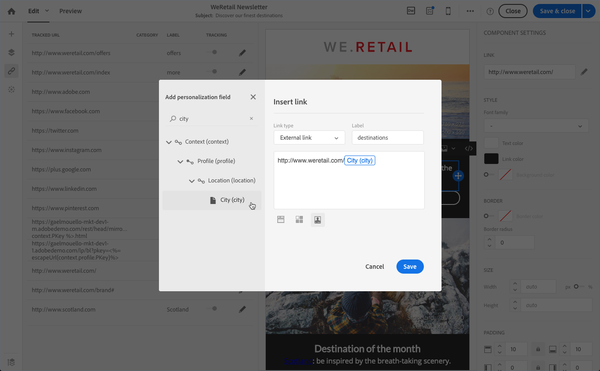

# 이메일 콘텐츠 개인화 {#personalization}

Adobe Campaign에서 제공하는 메시지의 콘텐츠와 표시는 여러 가지 방법으로 개인화할 수 있습니다. 이러한 방법은 프로필에 따라 기준에 따라 결합할 수 있습니다. 일반적으로 Adobe Campaign을 통해 다음을 수행할 수 있습니다.

* 동적 개인화 필드를 삽입합니다. [개인화 필드 삽입](#inserting-a-personalization-field)을 참조하십시오.
* 사전 정의된 개인화 블록을 삽입합니다. [콘텐츠 블록 추가](#adding-a-content-block)를 참조하십시오.
* 이메일 발신자 개인화 [보낸 사람 개인화](#personalizing-the-sender)를 참조하세요.
* 이메일 제목을 개인화합니다. [전자 메일의 제목 줄 개인화](../../designing/using/subject-line.md#subject-line)를 참조하십시오.
* 조건부 콘텐츠 만들기 [전자 메일에 동적 콘텐츠 정의](#defining-dynamic-content-in-an-email)를 참조하세요.

## 보낸 사람 개인화 {#personalizing-the-sender}

보낸 메시지의 헤더에 표시할 보낸 사람의 이름을 정의하려면 [이메일 Designer] 홈 페이지의 **[!UICONTROL Properties]** 탭(홈 아이콘을 통해 액세스 가능)으로 이동합니다. 자세한 내용은 [전자 메일 보낸 사람 정의](../../designing/using/subject-line.md#email-sender)를 참조하세요.

**보낸 사람 이름** 블록을 클릭하여 보낸 사람 이름을 변경할 수 있습니다. 그러면 필드를 편집할 수 있고 사용할 이름을 입력할 수 있습니다.

이 필드는 개인화할 수 있습니다. 이렇게 하려면 보낸 사람 이름 아래의 아이콘을 클릭하여 개인화 필드, 콘텐츠 블록 및 다이내믹 콘텐츠를 추가할 수 있습니다.

>[!NOTE]
>
>헤더 매개 변수는 비워 둘 수 없습니다. 이메일을 보낼 수 있도록 하려면 발신자 주소가 필요합니다(RFC 표준). Adobe Campaign은 입력한 이메일 주소의 구문을 확인합니다.

## URL 개인화 {#personalizing-urls}

Adobe Campaign을 사용하면 개인화 필드, 콘텐츠 블록 또는 다이내믹 콘텐츠를 추가하여 메시지에서 하나 또는 여러 URL을 개인화할 수 있습니다. 방법은 다음과 같습니다.

1. 외부 URL을 삽입하고 해당 매개 변수를 지정합니다. [링크 삽입](../../designing/using/links.md#inserting-a-link)을 참조하세요.
1. 표시되지 않으면 설정 창에서 선택한 URL 옆에 있는 연필을 클릭하여 개인화 옵션에 액세스합니다.
1. 사용하려는 개인화 필드, 콘텐츠 블록 및 다이내믹 콘텐츠를 추가합니다.

   

1. 변경 내용을 저장합니다.

>[!NOTE]
>
>링크 추적을 위한 URL 서명 메커니즘이 비활성화되면 URL 개인화를 도메인 이름이나 URL 확장에 적용할 수 없습니다. 개인화가 잘못된 경우 메시지 분석 중에 오류 메시지가 표시됩니다.
>
>콘텐츠 블록을 선택할 때 **미러 페이지에 연결**&#x200B;과 같은 요소를 선택할 수 없습니다. 이러한 유형의 블록은 링크 내에서 사용할 수 없습니다.

## 개인화 필드 삽입{#inserting-a-personalization-field}

Adobe Campaign을 사용하면 데이터베이스의 필드를 프로필의 이름과 같은 페이지에 삽입할 수 있습니다.

>[!NOTE]
>
>아래 이미지는 전자 메일에 대해 [전자 메일 Designer](../../designing/using/designing-content-in-adobe-campaign.md)을(를) 사용하여 개인화 필드를 삽입하는 방법을 보여 줍니다.

콘텐츠에 개인화 필드를 추가하려면:

1. 텍스트 블록 내부를 클릭하고 상황별 도구 모음에서 **[!UICONTROL Personalize]** 아이콘을 클릭한 다음 **[!UICONTROL Insert personalization field]**&#x200B;을(를) 선택합니다. 전자 메일 Designer 인터페이스에 대한 자세한 내용은 [이 섹션](../../designing/using/designing-content-in-adobe-campaign.md#email-designer-interface)을 참조하세요.

   

1. 페이지 콘텐츠에 삽입할 필드를 선택합니다.

   

1. **[!UICONTROL Confirm]**&#x200B;를 클릭합니다.

필드 이름이 편집기에 나타나고 강조 표시됩니다.

개인화가 생성되면(예: 이메일을 미리 보고 준비할 때) 이 필드는 타겟팅된 프로필에 해당하는 값으로 대체됩니다.

>[!NOTE]
>
>워크플로우에서 이메일을 만드는 경우 워크플로우에서 계산된 추가 데이터를 개인화 필드에서도 사용할 수 있습니다. 워크플로우에서 데이터를 추가하는 방법에 대한 자세한 내용은 [데이터 보강](../../automating/using/about-targeting-activities.md#enriching-data) 섹션을 참조하십시오.

## 콘텐츠 블록 추가 {#adding-a-content-block}

Adobe Campaign은 사전 구성된 콘텐츠 블록 목록을 제공합니다. 이러한 콘텐츠 블록은 동적이고 개인화된 블록이며 특정 렌더링을 가집니다. 예를 들어 미러 페이지에 인사말 또는 링크를 추가할 수 있습니다.

>[!NOTE]
>
>아래 이미지는 전자 메일에 대해 [전자 메일 Designer](../../designing/using/designing-content-in-adobe-campaign.md)을(를) 사용하여 콘텐츠 블록을 삽입하는 방법을 보여 줍니다.

콘텐츠 블록을 추가하려면:

1. 텍스트 블록 내부를 클릭하고 상황별 도구 모음에서 **[!UICONTROL Personalize]** 아이콘을 클릭한 다음 **[!UICONTROL Insert content block]**&#x200B;을(를) 선택합니다. 전자 메일 Designer 인터페이스에 대한 자세한 내용은 [이 섹션](../../designing/using/designing-content-in-adobe-campaign.md#email-designer-interface)을 참조하세요.

   

1. 삽입할 콘텐츠 블록을 선택합니다. 사용 가능한 블록은 컨텍스트(이메일 또는 랜딩 페이지)에 따라 다릅니다.

   

1. **[!UICONTROL Save]**&#x200B;를 클릭합니다.

콘텐츠 블록의 이름이 편집기에 나타나고 노란색으로 강조 표시됩니다. 개인화가 생성되면 프로필에 자동으로 적응됩니다.

기본 제공 콘텐츠 블록은 다음과 같습니다.

* **[!UICONTROL Database URL in emails (EmailUrlBase)]**: 이 콘텐츠 블록은 **게재**&#x200B;에서만 사용할 수 있습니다.
* **[!UICONTROL Mirror page URL (MirrorPageUrl)]**: 이 콘텐츠 블록은 **게재**&#x200B;에서만 사용할 수 있습니다.
* **[!UICONTROL Link to mirror page (MirrorPage)]**: 이 콘텐츠 블록은 **게재**&#x200B;에서만 사용할 수 있습니다.
* **[!UICONTROL Greetings (Greetings)]**
* **[!UICONTROL Unsubscription link (UnsubscriptionLink)]**: 이 콘텐츠 블록은 **게재**&#x200B;에서만 사용할 수 있습니다.
* **[!UICONTROL Social network sharing links (LandingPageViralLinks)]**: 이 콘텐츠 블록은 **랜딩 페이지**&#x200B;에서만 사용할 수 있습니다.
* **[!UICONTROL Default sender name (DefaultSenderName)]**: 이 콘텐츠 블록은 **게재**&#x200B;에서만 사용할 수 있습니다.
* **[!UICONTROL Name of default reply-to email address (DefaultReplyName)]**: 이 콘텐츠 블록은 **게재**&#x200B;에서만 사용할 수 있습니다.
* **[!UICONTROL Email address of default sender (DefaultSenderAddress)]**: 이 콘텐츠 블록은 **게재**&#x200B;에서만 사용할 수 있습니다.
* **[!UICONTROL Default error email address (DefaultErrorAddress)]**: 이 콘텐츠 블록은 **게재**&#x200B;에서만 사용할 수 있습니다.
* **[!UICONTROL Default reply-to email address (DefaultReplyAddress)]**: 이 콘텐츠 블록은 **게재**&#x200B;에서만 사용할 수 있습니다.
* **[!UICONTROL Brand name (BrandingUsualName)]**
* **[!UICONTROL Link to the brand website (BrandingWebSiteLink)]**
* **[!UICONTROL Brand logo (BrandingLogo)]**
* **[!UICONTROL Notification style (notificationStyle)]**

### 사용자 지정 콘텐츠 블록 만들기 {#creating-custom-content-blocks}

메시지 또는 랜딩 페이지에 삽입할 새 콘텐츠 블록을 정의할 수 있습니다.

콘텐츠 블록을 만들려면 다음 단계를 수행합니다.

1. 콘텐츠 블록 목록에 액세스하려면 고급 메뉴에서 **[!UICONTROL Resources > Content blocks]**&#x200B;을(를) 클릭하십시오.
1. **[!UICONTROL Create]** 단추를 클릭하거나 기존 콘텐츠 블록을 복제합니다.

   

1. 레이블을 입력합니다.
1. 블록의 **[!UICONTROL Content type]** 선택. 다음 세 가지 옵션을 사용할 수 있습니다.

   * **[!UICONTROL Shared]**: 콘텐츠 블록은 게재 또는 랜딩 페이지에서 사용할 수 있습니다.
   * **[!UICONTROL Delivery]**: 콘텐츠 블록은 게재에서만 사용할 수 있습니다.
   * **[!UICONTROL Landing page]**: 콘텐츠 블록은 랜딩 페이지에서만 사용할 수 있습니다.

   

1. **[!UICONTROL Targeting dimension]**&#x200B;을(를) 선택할 수 있습니다. 자세한 내용은 [타겟팅 차원 정보](#about-targeting-dimension)를 참조하세요.

   

1. **[!UICONTROL Depends on format]** 옵션을 선택하여 두 개의 서로 다른 블록을 정의할 수 있습니다. 하나는 HTML 이메일용이고 다른 하나는 텍스트 형식의 이메일입니다. 그러면 편집기(HTML 및 텍스트)에 해당 콘텐츠를 정의할 수 있는 두 개의 탭이 표시됩니다.

   

1. 콘텐츠 블록의 콘텐츠를 입력하고 **[!UICONTROL Create]** 단추를 클릭합니다.

이제 콘텐츠 블록을 메시지 또는 랜딩 페이지의 콘텐츠 편집기에서 사용할 수 있습니다.

>[!CAUTION]
>
>블록의 내용을 편집할 때 *if* 문의 시작과 끝 사이에 추가 공백이 없는지 확인하십시오. HTML에서 공백은 화면에 표시되므로 컨텐츠 레이아웃에 영향을 미칩니다.

### 타겟팅 차원 기본 정보 {#about-targeting-dimension}

타겟팅 차원을 사용하면 콘텐츠 블록을 사용할 수 있는 메시지 유형을 정의할 수 있습니다. 이는 메시지에서 오류가 발생할 수 있는 부적절한 블록을 사용하는 것을 방지하기 위한 것입니다.

실제로 메시지를 편집할 때 해당 메시지의 타겟팅 차원과 호환되는 타겟팅 차원이 있는 콘텐츠 블록만 선택할 수 있습니다.

예를 들어 **[!UICONTROL Unsubscription link]** 블록의 타깃팅 차원은 **[!UICONTROL Profiles]** 리소스와 관련된 개인화 필드가 포함되어 있으므로 **[!UICONTROL Profiles]**&#x200B;입니다. 따라서 [이벤트 트랜잭션 메시지](../../channels/using/getting-started-with-transactional-msg.md#transactional-message-types)에 **[!UICONTROL Unsubscription link]** 블록을 사용할 수 없습니다. 해당 유형의 메시지 타겟팅 차원이 **[!UICONTROL Real-time events]**&#x200B;이기 때문입니다. 하지만 [프로필 트랜잭션 메시지](../../channels/using/getting-started-with-transactional-msg.md#transactional-message-types)에서 **구독 취소 링크** 블록을 사용할 수 있습니다. 해당 유형의 메시지 타겟팅 차원이 **프로필**&#x200B;이기 때문입니다. 마지막으로 **[!UICONTROL Link to mirror page]** 블록에는 타겟팅 차원이 없으므로 모든 메시지에서 사용할 수 있습니다.

이 필드를 비워 두면 콘텐츠 블록은 타겟팅 차원이 무엇이든 관계없이 모든 메시지와 호환됩니다. 타겟팅 차원을 설정하면 해당 블록은 타겟팅 차원이 동일한 메시지와만 호환됩니다.

자세한 내용은 [차원 및 리소스 타겟팅](../../automating/using/query.md#targeting-dimensions-and-resources)을 참조하십시오.

**관련 항목:**

* [개인화 필드 삽입](#inserting-a-personalization-field)
* [콘텐츠 블록 추가](#adding-a-content-block)
* [이메일에서 다이내믹 콘텐츠 정의](#defining-dynamic-content-in-an-email)

## 이미지 소스 개인화{#personalizing-an-image-source}

Adobe Campaign을 사용하면 특정 기준에 따라 또는 추적을 사용하여 메시지에 하나 또는 여러 이미지를 개인화할 수 있습니다. 이 작업은 개인화 필드, 콘텐츠 블록 또는 동적 콘텐츠를 이미지 소스에 삽입하여 수행됩니다. 방법은 다음과 같습니다.

1. 메시지 콘텐츠에 이미지를 삽입하거나 이미 있는 이미지를 선택합니다.
1. 이미지 속성 팔레트에서 **[!UICONTROL Enable personalization]** 옵션을 선택합니다.

   

   **[!UICONTROL Source]** 필드가 표시되고 선택한 이미지가 편집기에 **개인화됨**(으)로 표시됩니다.

1. 개인화 옵션에 액세스하려면 **[!UICONTROL Source]** 필드 단추 옆에 있는 연필을 클릭하십시오.
1. 이미지 소스를 추가한 후 원하는 개인화 필드, 콘텐츠 블록 및 동적 콘텐츠를 추가합니다.

   

   >[!NOTE]
   >
   >도메인 이름(http://mydomain.com)은 개인화할 수 없으며 수동으로 입력해야 합니다. URL의 나머지 부분은 개인화할 수 있습니다. 예: http://mydomain.com/ `[Gender]` .jpg

1. 변경 사항을 확인합니다.

## 조건부 콘텐츠 {#conditional-content}

### 가시성 조건 정의{#defining-a-visibility-condition}

모든 요소에 가시성 조건을 지정할 수 있습니다. 조건이 준수되는 경우에만 표시됩니다.

가시성 조건을 추가하려면 블록을 선택하고 해당 설정의 **[!UICONTROL Visibility condition]** 필드에 준수할 조건을 입력하십시오.

이 옵션은 ADDRESS, BLOCKQUOTE, CENTER, DIR, DIV, DL, FIELDSET, FORM, H1, H2, H3, H4, H5, H6, NOSCRIPT, OL, P, PRE, UL, TR, TD 요소에만 사용할 수 있습니다.

식 편집기는 [고급 식 편집](../../automating/using/editing-queries.md#about-query-editor) 섹션에 표시됩니다.

이러한 조건은 XTK 표현식 구문(예: **context.profile.email !=&#39;&#39;** 또는 **context.profile.status=&#39;0&#39;**). 기본적으로 모든 필드가 표시됩니다.

>[!NOTE]
>
>이미 다이내믹 컨텐츠가 있는 하위 요소를 포함하는 블록이나 이미 다이내믹 컨텐츠를 구성하는 블록에 대해서는 조건을 정의할 수 없습니다. 드롭다운 목록과 같은 표시되지 않는 동적 블록은 편집할 수 없습니다.

### 이메일에서 다이내믹 콘텐츠 정의{#defining-dynamic-content-in-an-email}

>[!CONTEXTUALHELP]
>id="ac_dynamic_content"
>title="다이내믹 콘텐츠 정의"
>abstract="정의하는 조건에 따라서만 일부 프로필에 표시될 다양한 콘텐츠를 정의합니다."

이메일에서 표현식 편집기를 통해 정의된 조건에 따라 수신자에게 동적으로 표시되는 다양한 콘텐츠를 정의할 수 있습니다. 예를 들어 동일한 이메일에서 각 프로필이 나이 범위에 따라 다른 메시지를 수신하는지 확인할 수 있습니다.

동적 콘텐츠를 정의하는 것은 [가시성 조건을 정의하는 것](#defining-a-visibility-condition)과 다릅니다.

1. 조각, 구성 요소 또는 요소를 선택합니다. 이 예에서 이미지를 선택합니다.
1. 상황별 도구 모음에서 **[!UICONTROL Dynamic content]** 아이콘을 클릭합니다.

   

   **[!UICONTROL Dynamic content]** 섹션이 왼쪽의 팔레트에 나타납니다.

   

   기본적으로 이 섹션에는 기본 변형과 새 변형이라는 두 가지 요소가 포함됩니다.

   >[!NOTE]
   >
   >컨텐츠에 항상 기본 변형이 있어야 합니다. 삭제할 수 없습니다.

1. **[!UICONTROL Edit]** 단추를 클릭하여 첫 번째 대체 변형에 대한 표시 조건을 정의합니다.

   

1. 레이블을 지정하고 조건으로 설정할 필드를 선택합니다. 예를 들어 **[!UICONTROL General]** 노드에서 **[!UICONTROL Age]** 필드를 선택합니다

   

1. 필터링 조건을 설정합니다. 예를 들어 18세에서 25세 사이의 사람들에게 다른 콘텐츠를 표시하려고 합니다.

   

1. 모든 조건이 설정되면 조건이 적용될 우선 순위 순서를 정의하고 변경 사항을 저장합니다.

   

   콘텐츠는 위에서 아래로 우선 순위 순서대로 팔레트에 표시됩니다. 우선 순위에 대한 자세한 내용은 [이 섹션](#defining-dynamic-content-in-an-email)을 참조하세요.

1. 방금 정의한 변형에 대한 새 이미지를 업로드합니다.

   

   18세에서 25세 사이의 청소년들은 새로운 이미지를 보게 될 것이다.

   

1. **[!UICONTROL Add a condition]**&#x200B;을(를) 클릭하여 새 콘텐츠와 연결된 규칙을 추가합니다.

   

   예를 들어 26세에서 35세 사이의 사람들에게 표시할 다른 이미지를 추가할 수 있습니다.

1. 동적으로 표시하려는 이메일의 다른 요소에 대해서도 유사하게 진행합니다. 텍스트, 버튼, 조각 등이 될 수 있습니다. 변경 내용을 저장합니다.

>[!CAUTION]
>
>메시지를 준비한 후 보내기 전에 증명을 사용하여 테스트합니다. 이렇게 하지 않으면 일부 오류가 감지되지 않고 이메일이 전송되지 않을 수 있습니다.

**관련 항목:**

* [교정쇄 보내기](../../sending/using/sending-proofs.md)
* [고급 표현식 편집](../../automating/using/editing-queries.md#about-query-editor)

### 우선 순위 {#order-of-priority}

표현식 편집기에서 다이내믹 콘텐츠를 정의할 때 우선순위의 순서는 다음과 같습니다.

1. 다음과 같이 **다른 두 조건**&#x200B;을 사용하여 두 개의 다른 동적 콘텐츠를 정의합니다.

   **조건 1:** 프로필의 성별은 남성입니다.

   **조건 2:** 프로필의 나이는 20세에서 30세 사이입니다.

   

   데이터베이스의 일부 프로필은 두 조건에 해당되지만 하나의 다이내믹 콘텐츠가 포함된 하나의 이메일만 보낼 수 있습니다.

1. 따라서 동적 콘텐츠의 우선 순위를 정의해야 합니다. 우선 순위가 **1**&#x200B;인 조건(및 해당 동적 콘텐츠)은 우선 순위가 **2** 또는 **3**&#x200B;인 다른 조건이 이 프로필에서 충족되는 경우에도 프로필로 전송됩니다.

   

다이내믹 콘텐츠당 하나의 우선 순위만 정의할 수 있습니다.

## 예: 이메일 개인화{#example-email-personalization}

이 예에서는 마케팅 서비스 팀의 한 멤버가 일부 클라이언트에게 자신만을 위한 특별 오퍼가 있음을 알리는 이메일을 만들었습니다. 팀원은 고객의 연령에 따라 이메일을 개인화하기로 결정했습니다. 만 18세에서 27세 사이의 고객은 만 27세 이상의 고객에게 제공하는 이미지와 슬로건이 다른 이메일을 받게 됩니다.

이메일은 다음과 같이 만들어집니다.

* 상기 이미지에는 동적 콘텐츠가 적용되고 이러한 동적 콘텐츠는 연령대에 따라 구성된다.

  

  동적 콘텐츠 추가 및 구성에 대해서는 [전자 메일에서 동적 콘텐츠 정의](#defining-dynamic-content-in-an-email) 섹션에 자세히 설명되어 있습니다.

* 개인화 필드 및 동적 콘텐츠가 텍스트에 적용됩니다. 프로필의 연령 범위에 따라 이메일은 프로필 이름 또는 프로필 제목과 성으로 시작합니다.

  

  개인화 필드 추가 및 구성에 대해서는 [개인화 필드 삽입](#inserting-a-personalization-field) 섹션에 자세히 설명되어 있습니다.

### 이미지 구성 {#configuring-images}

>[!CONTEXTUALHELP]
>id="ac_dynamic_image"
>title="동적 이미지 관리"
>abstract="정의하는 조건에 따라 동적 이미지로 이메일을 개인화합니다."

이 예에서 이미지에 적용된 동적 콘텐츠는 다음과 같이 구성됩니다.

**18~27세 대상:**

1. **[!UICONTROL Properties]** 팔레트에서 동적 콘텐츠를 선택하고 **[!UICONTROL Edit]** 단추를 클릭합니다.

   

1. 레이블을 편집한 다음 **[!UICONTROL Profile]** 노드에서 **[!UICONTROL Age]** 필드를 선택합니다.

   

1. **다음보다 크거나 같음** 연산자를 선택한 다음 **18**&#x200B;을(를) 입력하여 **18**&#x200B;보다 오래된 식을 만듭니다.

   

1. 새 **[!UICONTROL Age]** 조건을 추가합니다.

   값 필드에서 **작거나 같음** 연산자와 27을 차례로 선택하여 **27**&#x200B;보다 작은 표현식을 만듭니다.

   

1. 변경 사항을 확인합니다.

**27세 이상 프로필을 타겟팅하려면:**

1. 팔레트에서 동적 콘텐츠를 선택하고 편집합니다.
1. 레이블을 편집한 다음 **[!UICONTROL Profile]** 노드에서 **[!UICONTROL Age]** 필드를 선택합니다.
1. 값 필드에 **보다 큼** 연산자 뒤에 27을 추가하여 **27**&#x200B;보다 오래된 표현식을 만듭니다.

   

1. 변경 사항을 확인합니다.

동적 콘텐츠가 올바르게 구성되었습니다.

### 텍스트 구성 {#configuring-text}

이 예제에서 텍스트에 적용된 동적 내용은 다음과 같이 구성됩니다.

**18~27세 사이의 프로필을 타겟팅하려면:**

1. 원하는 구조 구성 요소를 선택하고 다이내믹 콘텐츠를 추가합니다.
1. 다이내믹 콘텐츠를 편집하고 타깃팅 표현식을 구성합니다. [이미지 구성](#configuring-images)을 참조하세요.
1. 구조 구성 요소의 원하는 위치에서 상황별 도구 모음에서 **[!UICONTROL Personalize]** 아이콘을 클릭하고 **[!UICONTROL Insert personalization field]**&#x200B;을(를) 선택합니다.

   

1. 표시되는 목록에서 **[!UICONTROL First name]** 필드를 선택하고 확인합니다.

   

1. 그런 다음 선택한 다이내믹 컨텐츠에 개인화 필드가 완벽하게 삽입됩니다.

**27세 이상 프로필을 타겟팅하려면:**

1. 원하는 구조 구성 요소를 선택하고 다이내믹 콘텐츠를 추가합니다.
1. 다이내믹 콘텐츠를 편집하고 타깃팅 표현식을 구성합니다. [이미지 구성](#configuring-images)을 참조하세요.
1. 구조 구성 요소의 원하는 위치에서 상황별 도구 모음에서 **[!UICONTROL Personalize]** 아이콘을 클릭하고 **[!UICONTROL Insert personalization field]**&#x200B;을(를) 선택합니다.
1. 드롭다운 목록에서 **[!UICONTROL Title]**&#x200B;을(를) 선택합니다.
1. **[!UICONTROL Last name]** 필드를 추가하려면 유사하게 진행하십시오.

   

이제 선택한 다이내믹 컨텐츠에 개인화 필드를 완벽하게 삽입해야 합니다.

### 이메일 미리 보기 {#previewing-emails}

미리 보기를 사용하면 **[!UICONTROL Proofs]**&#x200B;을(를) 보내기 전에 개인화 필드와 동적 콘텐츠가 올바르게 구성되어 있는지 확인할 수 있습니다. 미리 보기 중에 이메일 타겟에 해당하는 다른 테스트 프로필을 선택할 수 있습니다.

테스트 프로필이 없으면 기본적으로 표시되는 이메일은 다음과 같습니다.

이메일에는 슬로건에 개인화 필드가 없으며 기본 이미지가 사용됩니다.

제1 테스트 프로파일은 18 내지 27세의 클라이언트들에 대응한다. 이 프로필을 선택하면 다음 이메일이 표시됩니다.

18~27세 표현식, 특히 프로필 이름에 해당하는 개인화 필드가 올바르게 구성되며 이미지도 프로필에 따라 변경되었습니다.

두 번째 프로필은 27세 이상의 클라이언트에 해당하며 다음 이메일을 생성합니다.

다이내믹 콘텐츠 덕분에 이미지가 바뀌었는데, 등장하는 슬로건은 이 타겟 대중을 위해 규정된 보다 형식적인 슬로건이다.

**관련 항목:**

* [대상자 만들기](../../audiences/using/creating-audiences.md)
* [보내기 준비](../../sending/using/preparing-the-send.md)
