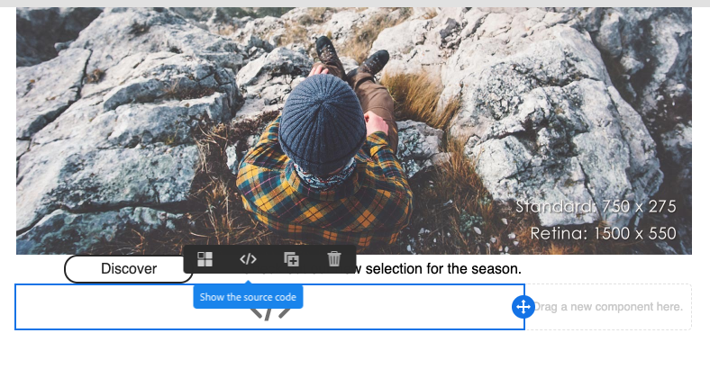

# 이메일 디자이너 시작 {#quick-start}

이메일 디자이너는 이메일을 만드는 네 가지 방법을 제공합니다.

이메일 디자이너에서 새로 [시작하는 이메일을 만들 수 있습니다](#without-existing-content).

1. 구조 및 컨텐츠 구성 요소를 손쉽게 추가하여 빈 캔버스에서 **이메일을** 만들고 컨텐츠를 개인화하여 신속하게 전달할 수 있습니다. 또한 스타일 요소를 완벽하게 관리할 수 있습니다. 자세한 내용을 [살펴보려면](#from-scratch-email) 빨리 [시작하거나](../../designing/using/designing-from-scratch.md#designing-an-email-content-from-scratch)전체 설명서를 참조하십시오.

1. 템플릿을 **선택하고 여기에서 새 이메일 컨텐츠를 작성하여 바로 사용할 수** 있는 템플릿에서 이메일을 만들 수 있습니다. [자세히 알아보기](#building-content-from-an-out-of-the-box-template)

기존 컨텐츠로 이메일 [을 만들 수도 있습니다](#with-existing-content).

1. 기존 HTML 컨텐츠 **(외부에서 또는 기존 편집기에서 작성)를** 변환할 수 있습니다. [자세히 알아보기](#converting-an-html-content)
1. 호환성 모드에서 기존 HTML 컨텐츠를 **** 바로 가져올 수 있습니다. [자세히 알아보기](#compatibility-mode)

| 컨텐츠 없음 | 컨텐츠 사용 |
|---|---|
| [처음부터 이메일 만들기](#from-scratch-email) | [기존 HTML 컨텐츠 변환](#converting-an-html-content) |
| [기본 템플릿에서 컨텐츠 작성](#building-content-from-an-out-of-the-box-template) | [기존 HTML 가져오기](#compatibility-mode) |

## 편집기로 이메일 디자인 {#without-existing-content}

>[!NOTE]
>
>두 작성 전략에서 이메일을 보내기 전에 제목 줄을 작성해야 합니다. 제목 줄 [을 추가하는 방법을 알아봅니다](#add-a-subject-line).

### 처음부터 이메일 만들기 {#from-scratch-email}

이메일을 손쉽게 작성하고 구성 요소를 추가하고 컨텐츠를 개인화하여 신속하게 전달할 수 있습니다. 필요한 경우 스타일링 옵션을 컨텐츠에 적용할 수 있습니다. 스타일 설정 및 인라인 속성 관리에 대한 자세한 내용은 이메일 스타일 [편집을 참조하십시오](../../designing/using/styles.md).

1. 이메일 만들기.
1. 홈 페이지를 닫습니다.

### 제목 줄 추가 {#add-a-subject-line}

이메일을 보낼 때는 제목이 필수입니다. 자세한 내용은 이메일 [의 제목 줄 정의를 참조하십시오](../../designing/using/subject-line.md).

1. 이메일 디자이너 홈 페이지(홈 아이콘을 통해 액세스 가능)의 **[!UICONTROL Properties]** 탭으로 이동하여 **[!UICONTROL Subject]** 섹션을 채웁니다.

### 구조 구성 요소 추가 {#add-structure-components}

구조 구성 요소는 이메일 레이아웃을 정의합니다. 자세한 내용은 이메일 [구조 정의를 참조하십시오](../../designing/using/designing-from-scratch.md#defining-the-email-structure).

구조 구성 요소에서 사용할 레이아웃의 구성 요소를 드래그하여 놓습니다.

>[!NOTE]
>
>이메일에 추가할 다양한 컨텐츠 레이아웃을 선택할 수 있습니다.

### 컨텐츠 구성 요소 추가 {#add-content-components}

이미지, 텍스트 및 버튼과 같은 여러 컨텐츠 구성 요소를 이메일에 추가할 수 있습니다. 자세한 내용은 [컨텐츠 구성 요소를 참조하십시오](../../designing/using/designing-from-scratch.md#about-content-components).

* **이미지**

   1. 컨텐츠 **구성**&#x200B;요소에서 이미지를 드래그하여 구조 구성 요소 중 하나에 놓습니다.
   1. 찾아보기를 **클릭합니다**.
   1. 컴퓨터에서 이미지 파일을 선택합니다.

   

* **개인화된 텍스트**

   1. 컨텐츠 **구성**&#x200B;요소에서 텍스트를 드래그하여 구조 구성 요소 중 하나로 드롭합니다.
   1. 구성 요소를 클릭하고 텍스트를 입력합니다.
   1. 개인화 필드를 추가하려면 도구 모음에서 **개인화 필드** 삽입을 클릭합니다.
   1. 필요한 필드(예: 이름)를 선택합니다.

   

* **HTML**

   1. 컨텐츠 구성 **요소에서** HTML을 드래그하여 구조 구성 요소 중 하나로 드롭합니다.
   1. 소스 **코드 표시를 클릭합니다**.
   1. HTML 콘텐츠를 입력합니다.
   1. **저장**&#x200B;을 클릭합니다.

   

   HTML에 익숙한 경우 컨텐츠 구성 요소를 사용하여 원래 바닥글의 HTML 코드를 복사하여 붙여넣을 수 **[!UICONTROL Html]** 있습니다. 자세한 내용은 콘텐츠 구성 요소 [정보를 참조하십시오](../../designing/using/designing-from-scratch.md#about-content-components).

   

### 이메일 구성 요소 스타일 지정

예를 들어 구성 요소의 패딩을 변경하여 이메일 스타일을 조정할 수 있습니다. 스타일 설정 및 인라인 속성 관리에 대한 자세한 내용은 이메일 스타일 [편집을 참조하십시오](../../designing/using/styles.md).

1. 텍스트 구성 요소를 **클릭합니다**.
1. 오른쪽의 팔레트에서 패딩으로 **이동합니다**.
1. 잠금 아이콘을 클릭하여 상단 및 하단 또는 오른쪽 및 왼쪽 매개 변수 간의 동기화를 중단합니다.
1. 필요에 따라 **패딩** 조정
1. **저장**&#x200B;을 클릭합니다.

이제 이메일을 저장하고 전송할 수 있습니다.

### 기본 템플릿에서 컨텐츠 작성 {#building-content-from-an-out-of-the-box-template}

고객 환영 메시지, 뉴스레터 및 재참여 이메일과 같은 즉시 사용 가능한 템플릿으로 이메일을 작성하고 개인화할 수 있습니다.

1. 이메일을 만들어 내용을 엽니다. For more on this, see [Creating an email](../../channels/using/creating-an-email.md).
1. 홈 아이콘을 클릭하여 **[!UICONTROL Email Designer]** 홈 페이지에 액세스합니다.
1. 탭을 **[!UICONTROL Templates]** 클릭합니다.
1. 기본 HTML 템플릿을 선택합니다.
다양한 템플릿은 여러 유형의 요소를 다양하게 조합합니다. 예를 들어 &#39;페더&#39; 템플릿에는 여백이 있지만 &#39;아스트로&#39; 템플릿에는 여백이 없습니다. 자세한 내용은 [컨텐츠 템플릿을 참조하십시오](../../designing/using/using-reusable-content.md#content-templates).
1. 이메일 디자이너 홈 페이지(홈 아이콘을 통해 액세스 가능)의 **[!UICONTROL Properties]** 탭으로 이동하여 **[!UICONTROL Subject]** 섹션을 채웁니다.
1. 이러한 요소를 결합하여 다양한 이메일 변형을 만들 수 있습니다. 예를 들어 구조 구성 요소를 선택하고 컨텍스트 도구 모음에서 을 클릭하여 이메일 섹션 **[!UICONTROL Duplicate]** 을 복제할 수 있습니다.
1. 왼쪽에 있는 파란색 화살표를 사용하여 요소를 이동하거나 구조 구성 요소를 다른 요소 아래 또는 위로 드래그할 수 있습니다. 자세한 내용은 [전자 메일 구조 편집](../../designing/using/designing-from-scratch.md#defining-the-email-structure)을 참조하십시오.
1. 각 구조 요소의 구성을 변경하기 위해 구성 요소를 이동할 수도 있습니다. 자세한 내용은 [조각 및 구성 요소 추가](../../designing/using/designing-from-scratch.md#defining-the-email-structure)를 참조하십시오.
1. 필요에 따라 각 요소의 컨텐츠를 수정합니다.이미지, 텍스트, 링크.
1. 필요한 경우 스타일링 옵션을 컨텐츠에 적용할 수 있습니다. 자세한 내용은 [전자 메일 스타일 편집](../../designing/using/styles.md)을 참조하십시오.

## 기존 이메일 컨텐츠 사용 {#with-existing-content}

여러 이메일에 재사용할 수 있도록 결합할 수 있는 모듈형 템플릿과 단편의 프레임워크를 구축하려면 이메일 HTML을 이메일 디자이너 템플릿으로 변환하는 것이 좋습니다.

### HTML 컨텐츠 변환 {#converting-an-html-content}

이 사용 사례에서는 HTML 이메일을 이메일 디자이너 구성 요소로 신속하게 변환하는 방법을 제공합니다. 이 항목에 대한 자세한 내용은 [HTML 콘텐츠 변환을 참조하십시오](../../designing/using/using-existing-content.md#converting-an-html-content).

>[!CAUTION]
>
>이 섹션은 HTML 코드에 익숙한 사용자를 위한 것입니다.

>[!NOTE]
>
>호환성 모드와 마찬가지로 HTML 구성 요소는 제한된 옵션을 사용하여 편집할 수 있습니다.즉석 에디션만 수행할 수 있습니다.

### HTML 이메일 가져오기 및 편집 {#compatibility-mode}

컨텐츠를 업로드할 때 이메일 디자이너의 WYSIWYG 편집기와 완벽하게 호환되고 편집할 수 있도록 특정 태깅을 포함해야 합니다.

기존 이메일을 이메일 디자이너와 호환되는 이메일로 변환하는 방법에 대한 자세한 내용은 [이 섹션을 참조하십시오](../../designing/using/using-existing-content.md#compatibility-mode).
