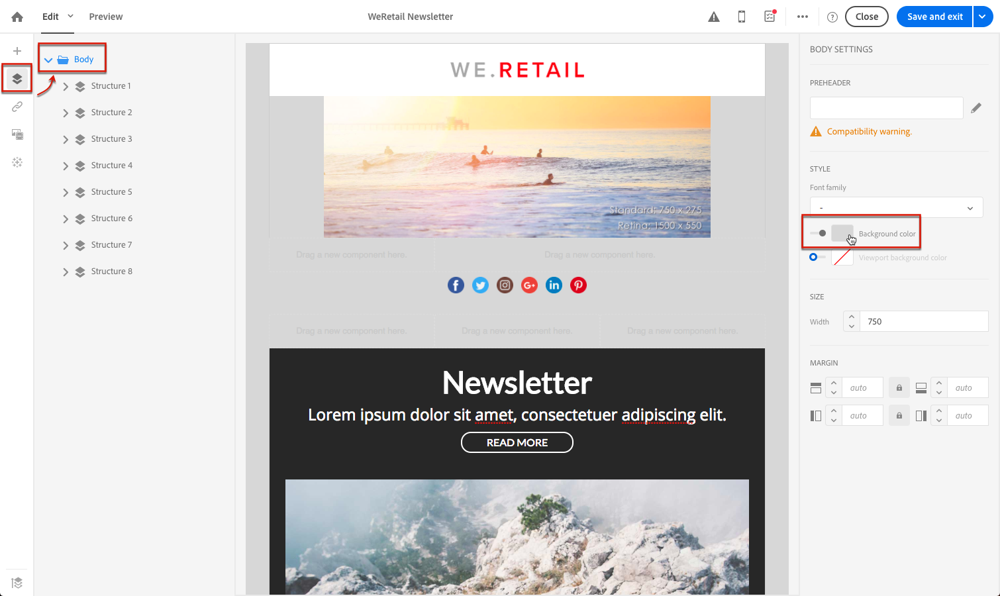
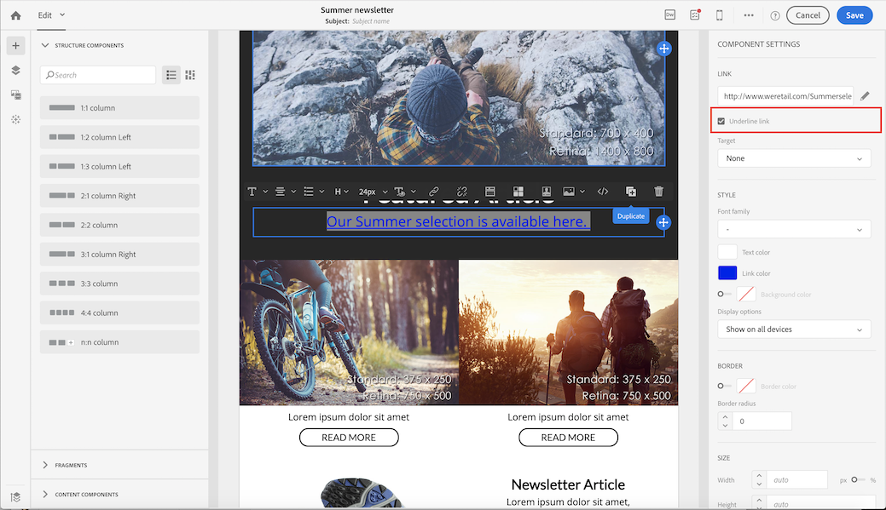
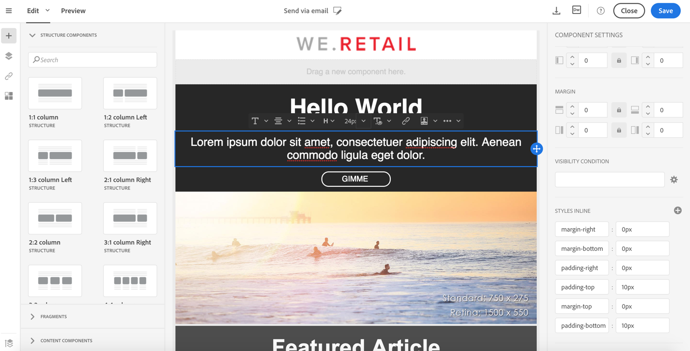

# 이메일 스타일 관리 {#managing-styles}

이메일 디자이너의 요소를 선택할 때 선택한 컨텐츠 유형과 관련된 몇 가지 옵션이 **[!UICONTROL Settings]** 창에 표시됩니다. 이러한 옵션을 사용하여 이메일 스타일을 손쉽게 변경할 수 있습니다.

## 요소 선택 {#selecting-an-element}

이메일 디자이너 인터페이스에서 요소를 선택하려면 다음 중 하나를 수행합니다.

* 이메일에서 직접 클릭,
* 또는 왼쪽 팔레트에 있는 옵션에서 구조 트리를 **탐색합니다**.

구조 트리를 탐색하면 보다 정확하게 선택할 수 있습니다. 다음 중 하나를 선택할 수 있습니다.

* 전체 구조 구성 요소
* 구조 구성 요소를 구성하는 열 중 하나,
* 열 내에 있는 구성 요소만 해당됩니다.

열을 선택하려면 다음을 수행할 수도 있습니다.

1. 구조 구성 요소(이메일에서 직접 또는 왼쪽 팔레트에서 사용할 수 있는 구조 트리 사용)를 **선택합니다**.
1. 컨텍스트 **도구 모음에서**&#x200B;을 클릭하여 원하는 열을 선택합니다 **[!UICONTROL Select a column]** .

이 섹션의 예를 [참조하십시오](#example--adjusting-vertical-alignment-and-padding).

## 스타일 설정 조정 {#adjusting-style-settings}

1. 이메일에서 요소를 선택합니다. For more on this, see [Selecting an element](#selecting-an-element).
1. 필요에 따라 설정을 조정합니다. 선택한 각 요소는 서로 다른 설정 세트를 제공합니다.

   배경 삽입, 크기 변경, 가로 또는 세로 정렬 수정, 색상 관리, [패딩 또는 여백](#selecting-an-element)추가 등을 수행할 수 있습니다.

   이렇게 하려면 **[!UICONTROL Settings]** 창에 표시된 옵션을 사용하거나 인라인 스타일 속성을 [추가합니다](#adding-inline-styling-attributes).

   

1. 콘텐츠 저장

## 패딩 및 여백 조정 {#about-padding-and-margin}

이메일 디자이너 인터페이스를 사용하면 패딩 및 여백 설정을 신속하게 조정할 수 있습니다.

**[!UICONTROL Padding]**:이 설정을 사용하면 요소의 테두리 내에 있는 공간을 관리할 수 있습니다.

예제:

* 패딩을 사용하여 이미지의 왼쪽 및 오른쪽 측면에 여백을 설정할 수 있습니다.
* 위쪽 및 아래쪽 패딩을 사용하여 하나 **[!UICONTROL Text]** 또는 **[!UICONTROL Divider]** 구성 요소에 간격을 더 추가합니다.
* 구조 요소 내의 열 사이의 테두리를 설정하려면 각 열에 대한 패딩을 정의합니다.

**[!UICONTROL Margin]**:이 설정을 사용하면 요소의 테두리와 다음 요소 사이의 공간을 관리할 수 있습니다.

>[!NOTE]
>
>선택(구조 구성 요소, 열 또는 컨텐츠 구성 요소)에 따라 결과가 동일하지 않습니다. Adobe에서는 열 수준에서 **[!UICONTROL Padding]** 및 **[!UICONTROL Margin]** 매개 변수를 설정하는 것이 좋습니다.

및 **[!UICONTROL Padding]** 의 경우, 잠금 아이콘을 **[!UICONTROL Margin]**&#x200B;클릭하여 위나 아래 또는 오른쪽 및 왼쪽 매개 변수 간의 동기화를 중단합니다. 이를 통해 각 매개 변수를 개별적으로 조정할 수 있습니다.

## 스타일 정렬 {#about-alignment}

* **텍스트 정렬**:텍스트 위에 마우스 커서를 놓고 상황에 맞는 툴바를 사용하여 텍스트를 정렬할 수 있습니다.

   

* **가로 정렬을** 텍스트, 이미지 및 단추에 적용할 수 있으며 현재 **[!UICONTROL Divider]** 및 **[!UICONTROL Social]** 구성 요소에는 적용되지 않습니다.

   

* 세로 **정렬을**&#x200B;설정하려면 구조 구성 요소 내의 열을 선택하고 설정 창에서 옵션을 선택합니다.

   

## 배경 설정 {#about-backgrounds}

>[!CONTEXTUALHELP]
>id="ac_edition_backgroundimage"
>title="배경 설정"
>abstract="이메일 디자이너를 사용하면 콘텐츠의 배경색 또는 배경 이미지를 개인화할 수 있습니다."

이메일 디자이너와 배경을 설정하는 경우 Adobe에서 다음을 권장합니다.

1. 디자인에 필요한 경우 이메일 본문에 배경색을 적용합니다.
1. 대부분의 경우 열 수준에서 배경색을 설정합니다.
1. 관리하기가 어려우므로 이미지 또는 텍스트 구성 요소에 배경색을 사용하지 마십시오.

다음은 사용할 수 있는 배경 설정입니다.

* 전체 이메일 **[!UICONTROL Background color]** 에 대한 설정을 참조하십시오. 왼쪽 팔레트에서 액세스할 수 있는 탐색 트리에서 본문 설정을 선택해야 합니다.

   

* 모든 구조 구성 요소에 대해 동일한 배경색을 선택하여 설정합니다 **[!UICONTROL Viewport background color]**. 이 옵션을 사용하면 배경색과 다른 설정을 선택할 수 있습니다.

   

* 각 구조 구성 요소에 대해 다른 배경색을 설정합니다. 왼쪽 팔레트에서 액세스할 수 있는 탐색 트리에서 구조를 선택하여 해당 구조에만 특정 배경색을 적용합니다.

   

   구조 배경색을 숨길 수 있으므로 뷰포트 배경색을 설정하지 마십시오.

* 구조 구성 요소 **[!UICONTROL Background image]** 의 컨텐츠에 대해 a를 설정합니다.

   

   >[!NOTE]
   >
   >일부 이메일 프로그램은 배경 이미지를 지원하지 않습니다. 지원되지 않는 경우 행 배경색이 대신 사용됩니다. 이미지를 표시할 수 없는 경우 적절한 폴백 배경색을 선택해야 합니다.

* 열 수준에서 배경색을 설정합니다.

   

   >[!NOTE]
   >
   >가장 일반적인 사용 사례입니다. Adobe에서는 전체 이메일 컨텐츠를 편집할 때 보다 유연하게 편집할 수 있도록 열 수준에서 배경색을 설정하는 것이 좋습니다.

   열 수준에서 배경 이미지를 설정할 수도 있지만 거의 사용되지 않습니다.

### 예:세로 정렬 및 패딩 조정 {#example--adjusting-vertical-alignment-and-padding}

3개의 열로 구성된 구조 구성 요소 내에서 패딩 및 세로 정렬을 조정할 수 있습니다. 이렇게 하려면 아래 단계를 수행합니다:

1. 이메일에서 직접 또는 왼쪽 팔레트에서 사용할 수 있는 구조 트리를 사용하여 구조 구성 요소를 **선택합니다**.
1. 상황에 맞는 **도구 모음**&#x200B;에서 을 클릭하고 편집할 도구 모음 **[!UICONTROL Select a column]** 을 선택합니다. 구조 트리에서 선택할 수도 있습니다.

   

   해당 열에 대한 편집 가능한 매개 변수가 오른쪽 **[!UICONTROL Settings]** 창에 표시됩니다.

1. 아래에서 **[!UICONTROL Vertical alignment]**&#x200B;을 선택합니다 **[!UICONTROL Up]**.

   

   컨텐츠 구성 요소는 열 상단에 표시됩니다.

1. 아래 **[!UICONTROL Padding]**&#x200B;에서 열 안의 위쪽 패딩을 정의합니다. 잠금 아이콘을 클릭하여 아래쪽 패딩과의 동기화를 중단합니다.

   해당 열에 대한 왼쪽 및 오른쪽 패딩을 정의합니다.

   

1. 다른 열의 정렬 및 패딩을 조정하려면 비슷하게 진행하십시오.

   

1. 변경 내용을 저장합니다.

## 스타일 지정 링크 {#about-styling-links}

링크에 밑줄을 긋고 이메일 디자이너에서 해당 색상과 대상을 선택할 수 있습니다.

1. 링크가 삽입된 구성 요소에서 링크의 레이블 텍스트를 선택합니다.

1. 구성 요소 설정에서 링크 **[!UICONTROL Underline link]** 의 레이블 텍스트에 밑줄을 지정하는지 확인합니다.

   

1. 링크를 열 검색 컨텍스트를 선택하려면 을 선택합니다 **[!UICONTROL Target]**.

   

1. 링크의 색상을 변경하려면 아이콘을 클릭합니다 **[!UICONTROL Link color]**.

   

1. 원하는 색상을 선택할 수 있습니다.

   

1. 변경 내용을 저장합니다.

## 인라인 스타일 특성 추가 {#adding-inline-styling-attributes}

이메일 디자이너 인터페이스에서 요소를 선택하고 사이드 패널에 해당 설정을 표시하면 해당 특정 요소에 대한 인라인 속성과 해당 값을 사용자 정의할 수 있습니다.

1. 컨텐츠에서 요소를 선택합니다.
1. 사이드 패널에서 설정을 **[!UICONTROL Styles Inline]** 찾습니다.

   

1. 기존 속성의 값을 수정하거나 **+** 단추를 사용하여 새 속성을 추가합니다. CSS를 준수하는 모든 속성과 값을 추가할 수 있습니다.

그러면 스타일이 선택한 요소에 적용됩니다. 하위 요소에 특정 스타일 속성이 정의되어 있지 않으면 상위 요소의 스타일이 상속됩니다.
