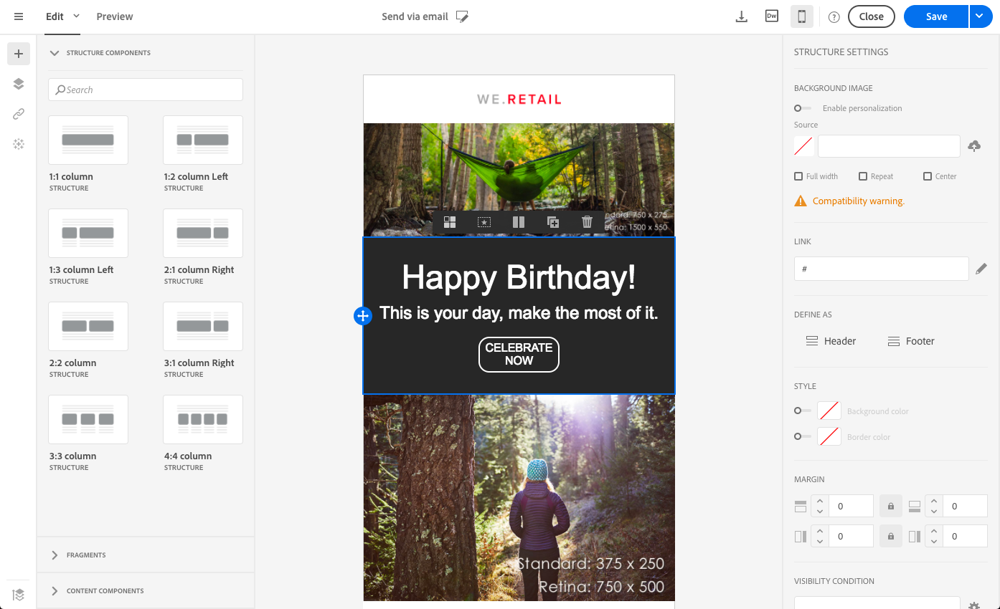

# 스타일 관리 {#managing-styles}

이메일 디자이너의 요소를 선택할 때 선택한 컨텐츠 유형과 관련된 몇 가지 옵션이 **[!UICONTROL Settings]** 창에 표시됩니다. 이러한 옵션을 사용하여 이메일 스타일을 손쉽게 변경할 수 있습니다.

## 요소 선택 {#selecting-an-element}

이메일 디자이너 인터페이스에서 요소를 선택하려면 다음 중 하나를 수행합니다.

* 이메일에서 직접 클릭,
* 또는 왼쪽 팔레트에 있는 옵션에서 구조 트리를 **찾습니다**.

구조 트리를 탐색하면 보다 정확하게 선택할 수 있습니다. 다음 중 하나를 선택할 수 있습니다.

* 전체 구조 구성 요소
* 구조 구성 요소를 구성하는 열 중 하나,
* 또는 열 내부에 있는 구성 요소만 포함할 수 있습니다.

열을 선택하려면 다음을 수행할 수도 있습니다.

1. 구조 구성 요소(이메일에서 직접 또는 왼쪽 팔레트에서 사용 가능한 구조 트리 사용)를 **선택합니다**.
1. 컨텍스트 **도구 모음에서**&#x200B;을 클릭하여 원하는 열을 **[!UICONTROL Select a column]** 선택합니다.

이 [섹션의](#example--adjusting-vertical-alignment-and-padding)예를 참조하십시오.

## 스타일 설정 조정 {#adjusting-style-settings}

1. 이메일에서 요소를 선택합니다. 자세한 내용은 요소 [선택을](#selecting-an-element)참조하십시오.
1. 필요에 따라 설정을 조정합니다. 선택한 각 요소는 다른 설정 세트를 제공합니다.

   배경 삽입, 크기 변경, 수평 또는 수직 정렬 수정, 색상 관리, [패딩 또는 여백](#selecting-an-element)추가 등을 수행할 수 있습니다.

   이렇게 하려면 **[!UICONTROL Settings]** 창에 표시된 옵션을 사용하거나 인라인 스타일 속성을 [추가합니다](#adding-inline-styling-attributes).

   

1. 콘텐츠를 저장합니다.

## 패딩 및 여백 정보 {#about-padding-and-margin}

이메일 디자이너 인터페이스를 사용하면 패딩 및 여백 설정을 신속하게 조정할 수 있습니다.

**[!UICONTROL Padding]**:이 설정을 사용하면 요소의 테두리 내에 있는 공간을 관리할 수 있습니다.

예:

* 패딩을 사용하여 이미지의 왼쪽과 오른쪽에 여백을 설정할 수 있습니다.
* 위쪽 및 아래쪽 패딩을 사용하여 **[!UICONTROL Text]** 또는 **[!UICONTROL Divider]** 구성 요소에 더 많은 간격을 추가합니다.
* 구조 요소 안의 열 간의 테두리를 설정하려면 각 열에 대한 패딩을 정의합니다.

**[!UICONTROL Margin]**:이 설정을 사용하면 요소의 테두리와 다음 요소 사이의 공간을 관리할 수 있습니다.

>[!NOTE]
>
>선택 항목(구조 구성 요소, 열 또는 컨텐츠 구성 요소)에 따라 결과가 동일하지 않습니다. 열 수준에서 **[!UICONTROL Padding]** 및 **[!UICONTROL Margin]** 매개 변수를 설정하는 것이 좋습니다.

및 **[!UICONTROL Padding]** 에 대해 잠금 아이콘을 **[!UICONTROL Margin]**&#x200B;클릭하여 상단 및 하단 또는 오른쪽 및 왼쪽 매개 변수 간의 동기화를 중단합니다. 이를 통해 각 매개 변수를 별도로 조정할 수 있습니다.

## 스타일 정렬 {#about-alignment}

* **텍스트 정렬**:텍스트 위에 마우스 커서를 놓고 상황에 맞는 툴바를 사용하여 텍스트를 정렬할 수 있습니다.

   

* **가로 정렬을** 텍스트, 이미지 및 단추에 적용할 수 있습니다. 현재 **[!UICONTROL Divider]** 및 **[!UICONTROL Social]** 구성 요소에는 적용되지 않습니다.

   

* 세로 정렬을 ****&#x200B;설정하려면 구조 구성 요소 내의 열을 선택하고 설정 창에서 옵션을 선택합니다.

   

## 배경 설정 {#about-backgrounds}

이메일 디자이너와 배경을 설정하는 방법은 다음과 같습니다.

1. 디자인에 필요한 경우 이메일 본문에 배경색을 적용합니다.
1. 대부분의 경우 열 수준에서 배경색을 설정합니다.
1. 관리하기가 어려우므로 이미지 또는 텍스트 구성 요소에 배경색을 사용하지 마십시오.

다음은 사용할 수 있는 배경 설정입니다.

* 전체 **[!UICONTROL Background color]** 이메일에 대한 설정을 지정합니다. 왼쪽 팔레트에서 액세스할 수 있는 탐색 트리에서 본문 설정을 선택해야 합니다.

   

* 모든 구조 구성 요소에 대해 동일한 배경색을 선택하여 설정합니다 **[!UICONTROL Viewport background color]**. 이 옵션을 사용하면 배경색에서 다른 설정을 선택할 수 있습니다.

   

* 각 구조 구성 요소에 대해 다른 배경색을 설정합니다. 왼쪽 팔레트에서 액세스할 수 있는 탐색 트리에서 구조를 선택하여 해당 구조에만 특정 배경색을 적용합니다.

   

   구조 배경색을 숨길 수 있으므로 뷰포트 배경색을 설정하지 마십시오.

* 구조 구성 요소의 컨텐츠에 **[!UICONTROL Background image]** 대해 를 설정합니다.

   

   >[!NOTE]
   >
   >일부 이메일 프로그램은 배경 이미지를 지원하지 않습니다. 이미지를 표시할 수 없는 경우 적절한 폴백 배경색을 선택해야 합니다.

* 열 수준에서 배경색을 설정합니다.

   

   >[!NOTE]
   >
   >가장 일반적인 사용 사례입니다. 전체 이메일 컨텐츠를 편집할 때 보다 유연하게 편집할 수 있도록 열 수준에서 배경색을 설정하는 것이 좋습니다.

   열 수준에서 배경 이미지를 설정할 수도 있지만 거의 사용되지 않습니다.

### 예:세로 정렬 및 패딩 조정 {#example--adjusting-vertical-alignment-and-padding}

3개의 열로 구성된 구조 구성 요소 내에서 패딩 및 세로 정렬을 조정할 수 있습니다. 이렇게 하려면 아래 절차를 따르십시오.

1. 이메일에서 직접 또는 왼쪽 팔레트에서 사용할 수 있는 구조 트리를 사용하여 구조 구성 요소를 **선택합니다**.
1. 컨텍스트 **기반의 도구 모음에서**&#x200B;을 클릭하고 편집할 도구 모음을 **[!UICONTROL Select a column]** 선택합니다. 구조 트리에서 선택할 수도 있습니다.

   

   해당 열에 대한 편집 가능한 매개 변수가 오른쪽 **[!UICONTROL Settings]** 창에 표시됩니다.

1. 아래에서 **[!UICONTROL Vertical alignment]**&#x200B;을 선택합니다 **[!UICONTROL Up]**.

   

   컨텐츠 구성 요소가 열 상단에 표시됩니다.

1. 아래에서 **[!UICONTROL Padding]**&#x200B;열 내부의 위쪽 패딩을 정의합니다. 잠금 아이콘을 클릭하여 아래쪽 패딩과 동기화를 중단합니다.

   해당 열에 대한 왼쪽 및 오른쪽 패딩을 정의합니다.

   

1. 다른 열의 정렬 및 패딩을 조정하려면 비슷하게 진행하십시오.

   

1. 변경 내용을 저장합니다.

## 스타일 지정 링크 {#about-styling-links}

링크에 밑줄을 지정하고 이메일 디자이너에서 해당 색상과 대상을 선택할 수 있습니다.

1. 링크가 삽입된 구성 요소에서 링크의 레이블 텍스트를 선택합니다.

1. 구성 요소 설정에서 링크의 레이블 텍스트에 밑줄을 **[!UICONTROL Underline link]** 지정할지 선택합니다.

   

1. 링크를 열 검색 컨텍스트를 선택하려면 링크를 선택합니다 **[!UICONTROL Target]**.

   

1. 링크의 색상을 변경하려면 을 클릭합니다 **[!UICONTROL Link color]**.

   

1. 원하는 색상을 선택할 수 있습니다.

   

1. 변경 내용을 저장합니다.

## 인라인 스타일 특성 추가 {#adding-inline-styling-attributes}

이메일 디자이너 인터페이스에서 요소를 선택하고 사이드 패널에 해당 설정을 표시하면 해당 특정 요소에 대한 인라인 특성 및 해당 값을 사용자 정의할 수 있습니다.

1. 컨텐츠에서 요소를 선택합니다.
1. 사이드 패널에서 **[!UICONTROL Styles Inline]** 설정을 찾습니다.

   

1. 기존 속성의 값을 수정하거나 **+** 단추를 사용하여 새 속성을 추가합니다. CSS를 준수하는 모든 속성과 값을 추가할 수 있습니다.

그러면 선택한 요소에 스타일이 적용됩니다. 하위 요소에 특정 스타일 속성이 정의되어 있지 않으면 상위 요소의 스타일이 상속됩니다.

## 모바일 보기로 전환 {#switching-to-mobile-view}

모바일 디스플레이를 위한 모든 스타일 옵션을 별도로 편집하여 이메일의 반응형 디자인을 세밀하게 조정할 수 있습니다. 예를 들어 여백과 패딩을 조정하고, 더 작거나 큰 글꼴 크기를 사용하거나, 단추를 변경하거나, 이메일의 모바일 버전에 맞는 다른 배경색을 적용할 수 있습니다.

모든 스타일 옵션은 모바일 보기에서 사용할 수 있습니다. 이메일 디자이너 스타일 설정은 이 페이지의 이전에 제공되었습니다.

1. 이메일을 만들고 컨텐츠 편집을 시작합니다. 자세한 내용은 처음부터 [이메일 컨텐츠 디자인을 참조하십시오](../../designing/using/designing-from-scratch.md#designing-an-email-content-from-scratch).
1. 전용 모바일 보기에 액세스하려면 **[!UICONTROL Switch to mobile view]** 단추를 선택합니다.

   

   이메일의 모바일 버전이 표시됩니다. 여기에는 데스크톱 보기에 정의된 모든 구성 요소 및 스타일이 포함되어 있습니다.

1. 배경색, 정렬, 패딩, 여백, 글꼴 모음, 텍스트 색상 등과 같은 모든 스타일 설정을 개별적으로 편집할 수 있습니다.

   

1. 모바일 보기에서 스타일 설정을 편집할 때 수정 사항은 모바일 디스플레이에만 적용됩니다.

   예를 들어 이미지 크기를 줄이고 녹색 배경을 추가하고 모바일 보기에서 패딩을 변경합니다.

   

1. 모바일 장치에 표시될 때 구성 요소를 숨길 수 있습니다. 이렇게 하려면 **[!UICONTROL Show only on desktop devices]** 에서 선택합니다 **[!UICONTROL Display options]**.
데스크톱 장치에서 이 구성 요소를 숨기도록 선택할 수도 있습니다. 즉, 모바일 장치에만 표시됩니다. 이렇게 하려면 **[!UICONTROL Show only on mobile devices]**선택합니다.
예를 들어, 이 옵션을 사용하면 모바일 장치에 특정 이미지를 표시하고 데스크톱 장치에 다른 이미지를 표시할 수 있습니다.
모바일 또는 데스크탑 보기에서 이 옵션을 설정할 수 있습니다.

   

1. 다시 **[!UICONTROL Switch to mobile view]** 단추를 클릭하여 표준 데스크탑 보기로 돌아갑니다. 방금 변경한 스타일은 반영되지 않습니다.

   

   >[!NOTE]
   >
   >유일한 예외는 **[!UICONTROL Style inline]** 설정입니다. 스타일 인라인 설정 변경 사항은 표준 데스크톱 보기에도 적용됩니다.

1. 텍스트 편집, 새 이미지 업로드, 새 구성 요소 추가 등과 같이 이메일의 구조 또는 컨텐트에 대한 기타 변경 사항 는 표준 뷰에도 적용됩니다.

   예를 들어 모바일 보기로 전환하고 일부 텍스트를 편집하고 이미지를 바꿀 수 있습니다.

   

   다시 **[!UICONTROL Switch to mobile view]** 단추를 클릭하여 표준 데스크탑 보기로 돌아갑니다. 변경 사항이 반영됩니다.

   

1. 모바일 보기에서 스타일을 제거하면 데스크톱 모드에서 적용된 스타일로 돌아갑니다.

   예를 들어 모바일 보기에서 단추에 녹색 배경색을 적용합니다.

   

1. 데스크탑 보기로 전환하고 동일한 단추에 회색 배경을 적용합니다.

   

1. 모바일 보기로 다시 전환한 다음 **[!UICONTROL Background color]** 설정을 비활성화합니다.

   

   이제 데스크톱 보기에 정의된 배경색이 적용됩니다.회색으로 바뀝니다(비어 있지 않음).

   유일한 예외는 **[!UICONTROL Border color]** 설정입니다. 모바일 보기에서 비활성화하면 데스크톱 보기에 테두리 색상이 정의되어 있어도 테두리가 더 이상 적용되지 않습니다.

>[!NOTE]
>
>모바일 보기는 [조각에서](../../designing/using/using-reusable-content.md#about-fragments)사용할 수 없습니다.
