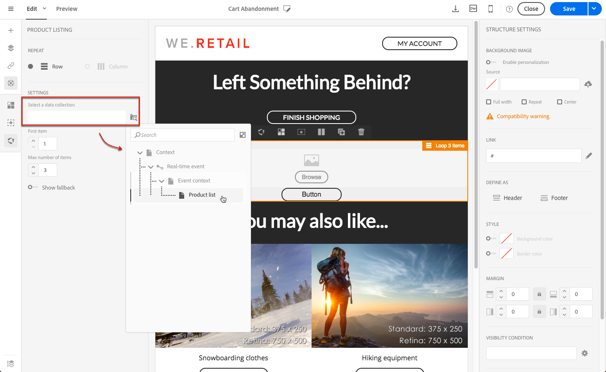
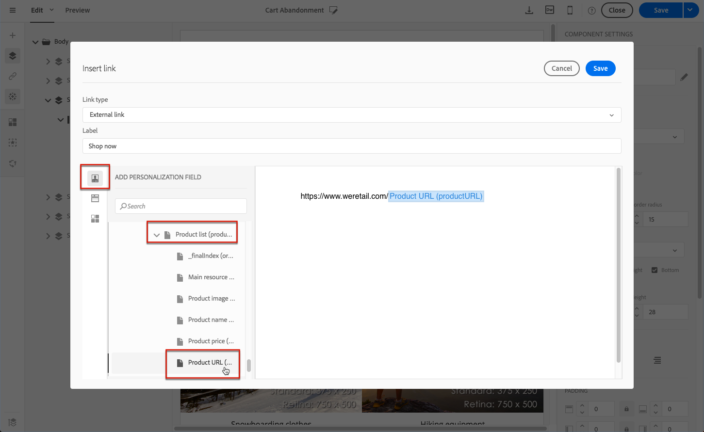

# 트랜잭션 메시지에서 제품 목록 사용 {#using-product-listings}

>[!IMPORTANT]
>
>제품 목록은 [이메일 디자이너](../../designing/using/designing-content-in-adobe-campaign.md#email-designer-interface) 인터페이스를 통해 **트랜잭션 이메일 메시지**&#x200B;에 대해서만 사용할 수 있습니다.

트랜잭션 이메일의 내용을 편집할 때 하나 이상의 데이터 컬렉션을 참조하는 제품 목록을 만들 수 있습니다. 예를 들어 장바구니 포기 이메일에는 사용자가 웹 사이트를 떠날 때 장바구니에 있던 모든 제품 목록과 이미지, 가격 및 각 제품에 대한 링크를 포함할 수 있습니다.

트랜잭션 메시지에 포기된 제품 목록을 추가하려면 아래 단계를 따르십시오.

트랜잭션 이메일에서 제품 목록을 구성하는 데 필요한 단계를 설명하는 [이 비디오 집합](https://experienceleague.adobe.com/docs/campaign-standard-learn/tutorials/designing-content/product-listings-in-transactional-email.html?lang=en#configure-product-listings-in-transactional-emails)을 볼 수도 있습니다.

>[!NOTE]
>
>Adobe Campaign은 중첩된 제품 목록을 지원하지 않습니다. 즉, 다른 제품 목록 내에 제품 목록을 포함할 수 없습니다.

## 제품 목록 정의 {#defining-a-product-listing}

트랜잭션 메시지에서 제품 목록을 사용하려면 이벤트 수준에서 표시하려는 목록의 각 제품에 대한 제품 목록과 필드를 정의해야 합니다. 자세한 내용은 [데이터 컬렉션 정의](../../channels/using/configuring-transactional-event.md#defining-data-collections)를 참조하십시오.

1. 트랜잭션 메시지에서 **[!UICONTROL Content]** 블록을 클릭하여 전자 메일 콘텐츠를 수정합니다.
1. 구조 구성 요소를 작업 영역으로 끌어다 놓습니다. 자세한 내용은 [이메일 구조 정의](../../designing/using/designing-from-scratch.md#defining-the-email-structure)를 참조하십시오.

   예를 들어 하나의 열 구조 구성 요소를 선택하고 텍스트 구성 요소, 이미지 구성 요소 및 단추 구성 요소를 추가합니다. 자세한 내용은 [콘텐츠 구성 요소 사용](../../designing/using/designing-from-scratch.md#about-content-components)을 참조하십시오.

1. 방금 만든 구조 구성 요소를 선택하고 상황별 도구 모음에서 **[!UICONTROL Enable product listing]** 아이콘을 클릭합니다.

   

   구조 구성 요소는 주황색 프레임으로 강조 표시되고 **[!UICONTROL Product listing]** 설정이 왼쪽 팔레트에 표시됩니다.

   

1. 다음과 같은 컬렉션의 요소가 표시되는 방식을 선택합니다.

   * **[!UICONTROL Row]**: 가로 즉, 다른 행 아래에 있는 각 요소를 의미합니다.
   * **[!UICONTROL Column]**: 세로 즉, 같은 행의 다른 요소 옆에 있는 각 요소를 의미합니다.

   >[!NOTE]
   >
   >**[!UICONTROL Column]** 옵션은 다중 열 구조 구성 요소( **[!UICONTROL 2:2 column]**, **[!UICONTROL 3:3 column]** 및 **[!UICONTROL 4:4 column]** )를 사용하는 경우에만 사용할 수 있습니다. 제품 목록을 편집할 때는 다른 열은 고려하지 않고 첫 번째 열만 채웁니다. 구조 구성 요소 선택에 대한 자세한 내용은 [이메일 구조 정의](../../designing/using/designing-from-scratch.md#defining-the-email-structure)를 참조하십시오.

1. 트랜잭션 메시지와 관련된 이벤트를 구성할 때 만든 데이터 컬렉션을 선택합니다. **[!UICONTROL Context]** > **[!UICONTROL Real-time event]** > **[!UICONTROL Event context]** 노드 아래에서 찾을 수 있습니다.

   

   이벤트 구성에 대한 자세한 내용은 [데이터 컬렉션 정의](../../channels/using/configuring-transactional-event.md#defining-data-collections)를 참조하십시오.

1. 전자 메일에 표시된 목록을 시작할 요소를 선택하려면 **[!UICONTROL First item]** 드롭다운 목록을 사용합니다.

   예를 들어 2를 선택하면 컬렉션의 첫 번째 항목이 전자 메일에 표시되지 않습니다. 제품 목록은 두 번째 항목에서 시작됩니다.

1. 목록에 표시할 최대 항목 수를 선택합니다.

   >[!NOTE]
   >
   >목록의 요소를 세로( **[!UICONTROL Column]** )로 표시하려면 선택한 구조 구성 요소(2, 3 또는 4열)에 따라 최대 항목 수가 제한됩니다. 구조 구성 요소 선택에 대한 자세한 내용은 [전자 메일 구조 편집](../../designing/using/designing-from-scratch.md#defining-the-email-structure)을 참조하십시오.

## 제품 목록 채우기 {#populating-the-product-listing}

트랜잭션 전자 메일에 연결된 이벤트에서 오는 제품 목록을 표시하려면 아래 단계를 따르십시오.

이벤트 구성 시 컬렉션 및 관련 필드 만들기에 대한 자세한 내용은 [데이터 컬렉션 정의](../../channels/using/configuring-transactional-event.md#defining-data-collections)를 참조하십시오.

1. 삽입한 이미지 구성 요소를 선택하고 설정 창에서 **[!UICONTROL Enable personalization]**&#x200B;을(를) 선택한 다음 연필을 클릭합니다.

   

1. 열려 있는 **[!UICONTROL Image source URL]** 창에서 **[!UICONTROL Add personalization field]**&#x200B;을 선택합니다.

   **[!UICONTROL Context]** > **[!UICONTROL Real-time event]** > **[!UICONTROL Event context]** 노드에서 만든 컬렉션에 해당하는 노드(여기서는 **[!UICONTROL Product list]**)를 열고 정의한 이미지 필드(여기서는 **[!UICONTROL Product image]** )를 선택합니다. **[!UICONTROL Save]**&#x200B;을(를) 클릭합니다.

   

   선택한 개인화 필드가 이제 설정 창에 표시됩니다.

1. 원하는 위치에서 상황별 도구 모음의 **[!UICONTROL Insert personalization field]**&#x200B;을(를) 선택합니다.

   

1. **[!UICONTROL Context]** > **[!UICONTROL Real-time event]** > **[!UICONTROL Event context]** 노드에서 만든 컬렉션에 해당하는 노드(여기서는 **[!UICONTROL Product list]**)를 열고 만든 필드(여기서는 **[!UICONTROL Product name]**)를 선택합니다. **[!UICONTROL Confirm]**&#x200B;을(를) 클릭합니다.

   

   선택한 개인화 필드가 이제 전자 메일 콘텐츠의 원하는 위치에 표시됩니다.

1. 가격을 삽입하려면 유사하게 진행합니다..
1. 텍스트를 선택하고 상황별 도구 모음에서 **[!UICONTROL Insert link]**&#x200B;를 선택합니다.

   

1. 열려 있는 **[!UICONTROL Insert link]** 창에서 **[!UICONTROL Add personalization field]**&#x200B;을(를) 선택합니다.

   **[!UICONTROL Context]** > **[!UICONTROL Real-time event]** > **[!UICONTROL Event context]** 노드에서 만든 컬렉션에 해당하는 노드(여기서는 **[!UICONTROL Product list]**)를 열고 만든 URL 필드(여기서는 **[!UICONTROL Product URL]**)를 선택합니다. **[!UICONTROL Save]**&#x200B;을(를) 클릭합니다.

   >[!IMPORTANT]
   >
   >보안상의 이유로 적합한 정적 도메인 이름으로 시작하는 링크 내에 개인화 필드를 삽입해야 합니다.

   

   선택한 개인화 필드가 이제 설정 창에 표시됩니다.

1. 제품 목록이 적용되는 구조 구성 요소를 선택하고 기본 콘텐츠를 정의하려면 **[!UICONTROL Show fallback]**&#x200B;을(를) 선택합니다.

   

1. 하나 이상의 콘텐츠 구성 요소를 끌어서 필요에 따라 편집합니다.

   

   예를 들어 고객이 장바구니에 아무것도 없는 경우, 이벤트가 트리거될 때 컬렉션이 비어 있으면 대체 콘텐츠가 표시됩니다.

1. 설정 창에서 제품 목록의 스타일을 편집합니다. 자세한 내용은 [이메일 스타일 관리](../../designing/using/styles.md)를 참조하십시오.
1. 관련 트랜잭션 이벤트에 연결된 컬렉션 데이터를 정의한 테스트 프로필을 사용하여 전자 메일을 미리 봅니다. 예를 들어, 사용할 테스트 프로필의 **[!UICONTROL Event data]** 섹션에 다음 정보를 추가합니다.

   

   트랜잭션 메시지에서 테스트 프로필을 정의하는 방법에 대한 자세한 내용은 [이 섹션](../../channels/using/testing-transactional-message.md#defining-specific-test-profile)을 참조하십시오.
