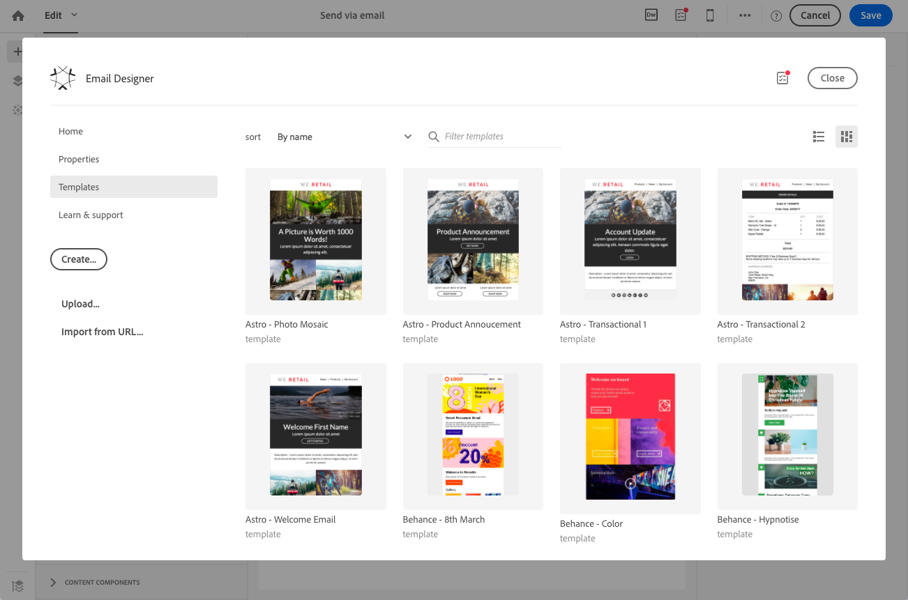
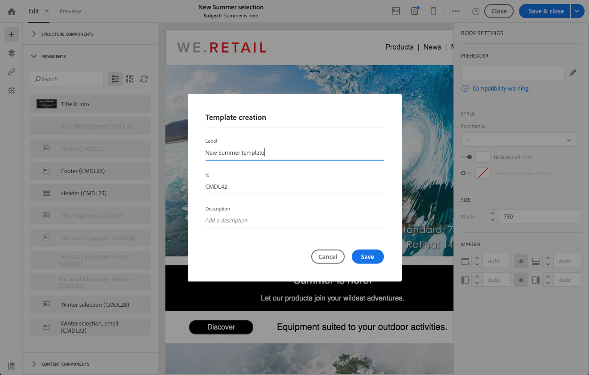
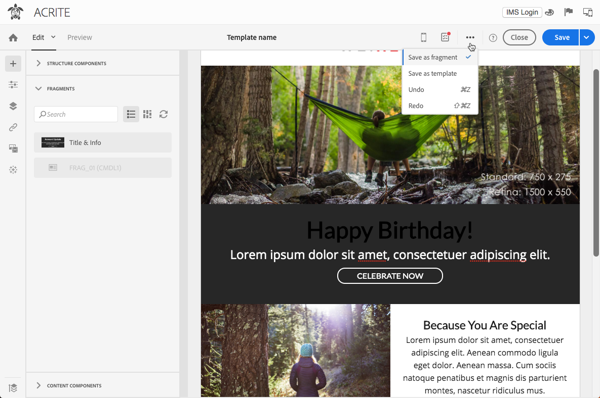

# 재사용 가능한 컨텐츠 만들기 및 사용 {#using-reusable-content}

이메일 컨텐츠 에디션을 마스터하는 방법을 살펴보십시오. 이메일 디자이너는 사전 정의된 컨텐츠로 템플릿과 조각을 만들고 이를 재사용하여 다음 게재에 사용할 수 있습니다.

## 템플릿을 사용하여 이메일 디자인 {#designing-templates}

>[!NOTE]
>
> Adobe Campaign Standard에서는 리소스 > 템플릿 **메뉴에서 액세스할 수 있는 다양한 유형의 템플릿을 만들 수** 있습니다 **** . 이메일 디자이너에 사용되는 템플릿은 컨텐츠 템플릿입니다. 자세한 내용은 템플릿 [정보를 참조하십시오](../../start/using/marketing-activity-templates.md).

### 컨텐츠 템플릿 정보 {#content-templates}

이메일 디자이너 **[!UICONTROL Templates]** 홈 페이지의 [탭에서 제공되는 HTML 컨텐츠를 관리할 수](../../designing/using/designing-content-in-adobe-campaign.md) 있습니다.

즉시 사용 가능한 이메일 컨텐츠 템플릿에는 Behance 아티스트가 디자인한 18개의 모바일에 최적화된 레이아웃과 4개의 동급 최강의 반응형 템플릿이 포함되어 있습니다. 고객 환영 메시지, 뉴스레터 및 재참여 이메일 등 가장 최근의 용도에 해당합니다. 브랜드 콘텐츠로 손쉽게 맞춤화할 수 있으므로 이메일을 처음부터 손쉽게 디자인할 수 있습니다.

HTML 컨텐츠 템플릿은 **[!UICONTROL Resources]** 고급 메뉴의 **[!UICONTROL Content templates & fragments]** > [화면에서 액세스할 수 있습니다](../../start/using/interface-description.md#advanced-menu). 여기서 랜딩 페이지 컨텐츠 템플릿, 이메일 컨텐츠 템플릿 및 조각을 관리할 수 있습니다.

즉시 사용 가능한 컨텐츠 템플릿은 읽기 전용입니다. 이러한 템플릿 중 하나를 편집하려면 먼저 원하는 템플릿을 복제해야 합니다.

새 템플릿이나 조각을 만들고 자신만의 컨텐트를 정의할 수 있습니다. 자세한 내용은 컨텐츠 템플릿 [만들기](#creating-a-content-template) 및 컨텐츠 조각 [만들기를 참조하십시오](#creating-a-content-fragment).

이메일 디자이너와 함께 컨텐츠를 편집할 때 컨텐츠를 조각 또는 템플릿으로 저장하여 컨텐츠 템플릿을 만들 수도 있습니다. 자세한 내용은 컨텐츠를 템플릿으로 [저장](#saving-content-as-template) 및 컨텐츠 [를 조각으로 저장을 참조하십시오](../../designing/using/using-reusable-content.md#saving-content-as-a-fragment).

**관련 항목:**

* 이 비디오에서 콘텐츠 템플릿 [을 개인화하는 방법을 살펴볼 수 있습니다](https://docs.adobe.com/content/help/en/campaign-learn/campaign-standard-tutorials/designing-content/email-designer/email-content-templates.html).
* 컨텐츠 편집에 대한 자세한 내용은 이메일 컨텐츠 디자인 [정보를 참조하십시오](../../designing/using/designing-content-in-adobe-campaign.md).

### Creating a content template {#creating-a-content-template}

필요에 따라 여러 번 사용할 수 있도록 자체 콘텐츠 템플릿을 만들 수 있습니다.

다음 예는 이메일 컨텐츠 템플릿을 만드는 방법을 보여줍니다.

1. > **[!UICONTROL Resources]** 로 이동하고 **[!UICONTROL Content templates & fragments]** 을 클릭합니다 **[!UICONTROL Create]**.
1. 이메일 디자이너의 **[!UICONTROL Properties]** 탭에 액세스하려면 이메일 레이블을 클릭합니다.
1. 인식할 수 있는 레이블을 지정하고 이 템플릿을 이메일에 사용할 수 있도록 다음 매개 변수를 선택합니다.

   * **[!UICONTROL Shared]** 드롭다운 목록에서 또는 **[!UICONTROL Delivery]** **[!UICONTROL Content type]** 을 선택합니다.
   * 드롭다운 목록 **[!UICONTROL Template]** 에서 **[!UICONTROL HTML type]** 선택합니다.

   

1. 필요한 경우 템플릿의 축소판으로 사용할 이미지를 설정할 수 있습니다. 템플릿 속성의 **[!UICONTROL Thumbnail]** 탭에서 선택합니다.

   

   이 축소판은 **[!UICONTROL Templates]** 이메일 디자이너 [홈 페이지의 탭](../../designing/using/designing-content-in-adobe-campaign.md) 에표시됩니다.

1. 기본 작업 영역으로 돌아가려면 **[!UICONTROL Properties]** 탭을 닫습니다.
1. 필요에 따라 사용자 정의할 수 있는 구조 구성 요소 및 컨텐츠 구성 요소를 추가합니다.
   >[!NOTE]
   >
   > 콘텐츠 템플릿 내에는 개인화 필드 또는 조건부 콘텐츠를 삽입할 수 없습니다.
1. 편집했으면 템플릿을 저장합니다.

이제 이메일 디자이너와 함께 만든 모든 이메일에서 이 템플릿을 사용할 수 있습니다. 이메일 디자이너 **[!UICONTROL Templates]** 홈 페이지의 [탭에서](../../designing/using/designing-content-in-adobe-campaign.md) 선택합니다.

### 컨텐츠를 템플릿으로 저장 {#saving-content-as-template}

이메일 디자이너와 함께 이메일을 편집할 때 해당 이메일의 내용을 템플릿으로 직접 저장할 수 있습니다.

<!--[!CAUTION]
>
>You cannot save as template a structure containing personalization fields or dynamic content.-->

1. 이메일 디자이너 기본 도구 모음 **[!UICONTROL Save as template]** 에서 선택합니다.

   

1. 필요한 경우 레이블과 설명을 추가한 다음 을 클릭합니다 **[!UICONTROL Save]**.

   

1. 방금 만든 템플릿을 찾으려면 > **[!UICONTROL Resources]** 로 이동합니다 **[!UICONTROL Content templates & fragments]**.

1. 새 템플릿을 사용하려면 **[!UICONTROL Templates]** 이메일 디자이너 [홈 페이지의 탭](../../designing/using/designing-content-in-adobe-campaign.md) 에서 선택합니다.

   

### 조각 및 구성 요소로 템플릿 만들기 {#template-fragments-components}

이제 이메일 디자이너와 함께 이메일 템플릿을 만들 수 있습니다. 컨텐츠 구성 요소를 사용하여 이메일의 다양한 섹션을 반영하고 설정을 조정하여 원본 뉴스레터에 최대한 가깝게 만듭니다. 마지막으로 방금 만든 조각을 삽입합니다.

1. 이메일 디자이너를 사용하여 템플릿을 만듭니다. 자세한 내용은 [컨텐츠 템플릿을 참조하십시오](#content-templates).
1. 템플릿의 머리글, 바닥글 및 본문에 해당하는 몇 가지 구조 구성 요소를 템플릿에 삽입합니다. 구조 구성 요소 추가에 대한 자세한 내용은 이메일 [디자이너를 사용하여 이메일 구조 편집을 참조하십시오](../../designing/using/designing-from-scratch.md#defining-the-email-structure).
1. 필요한 만큼 컨텐츠 구성 요소를 삽입하여 뉴스레터의 본문을 만듭니다. 매달 업데이트되는 이메일의 편집 가능한 컨텐츠가 됩니다.

   

   HTML 코드에 익숙한 경우 원본 이메일의 보다 복잡한 요소를 복사하여 붙여넣을 수 있는 구성 요소를 활용하는 것이 좋습니다. **[!UICONTROL Html]** 기타 구성 요소(예: **[!UICONTROL Button]****[!UICONTROL Image]** 또는 나머지 컨텐츠 **[!UICONTROL Text]** )를 사용합니다. 자세한 내용은 콘텐츠 구성 요소 [정보를 참조하십시오](../../designing/using/designing-from-scratch.md#about-content-components).

   >[!NOTE]
   >
   >구성 요소를 사용하면 **[!UICONTROL Html]** 제한된 옵션으로 편집할 수 있는 구성 요소를 만들 수 있습니다. 이 구성 요소를 선택하기 전에 HTML 코드를 처리하는 방법을 알고 있어야 합니다.

1. 콘텐츠 구성 요소를 최대한 원본 이메일에 맞게 조정합니다.

   

   스타일 설정 및 인라인 속성 관리에 대한 자세한 내용은 이메일 스타일 [편집을 참조하십시오](../../designing/using/styles.md).

1. 이전에 만든 두 조각(머리글과 바닥글)을 원하는 구조 구성 요소에 삽입합니다.

   

1. 템플릿을 저장합니다.

이제 이메일 디자이너 내에서 이 템플릿을 완전히 관리하여 매달 수신자에게 전송할 뉴스레터를 작성하고 업데이트할 수 있습니다.

이 템플릿을 사용하려면 이메일을 만들고 방금 만든 콘텐츠 템플릿을 선택합니다.

**관련 항목**:

* [전자 메일 만들기](../../channels/using/creating-an-email.md)
* [이메일 디자이너를 위한 소개 비디오](https://video.tv.adobe.com/v/22771/?autoplay=true&hidetitle=true&captions=kor)
* [처음부터 이메일 컨텐츠 디자인](../../designing/using/designing-from-scratch.md#designing-an-email-content-from-scratch)

## 조각 정보 {#about-fragments}

>[!CONTEXTUALHELP]
>id="ac_fragments"
>title="조각 정보"
>abstract="조각은 하나 이상의 이메일에서 참조할 수 있는 재사용 가능한 컨텐츠 블록입니다."

조각은 하나 이상의 이메일에서 참조할 수 있는 재사용 가능한 구성 요소입니다.
이러한 템플릿은 리소스 > **컨텐츠 조각** 및 템플릿 아래의 인터페이스에서 찾을 수 **있습니다**.

이메일 디자이너에서 조각을 가장 잘 사용하려면 다음을 수행하십시오.

* 고유한 조각 만들기 컨텐츠 조각 [만들기](#creating-a-content-fragment) 및 [컨텐츠를 조각으로 저장을 참조하십시오](#saving-content-as-a-fragment).
* 이메일에 필요한 만큼 사용할 수 있습니다. 이메일 [에 요소 삽입을 참조하십시오](#inserting-elements-into-an-email).
* 조각을 편집할 때 변경 사항이 동기화됩니다.이러한 구성 요소는 해당 조각을 포함하는 모든 이메일에 자동으로 전파됩니다(준비 또는 전송되지 않은 경우).

이메일에 추가하면 기본적으로 조각이 잠겨 있습니다. 특정 이메일의 조각을 수정하려면 사용된 이메일에서 해당 조각을 잠금 해제하여 원본 조각과의 동기화를 중단할 수 있습니다. 변경 내용이 더 이상 동기화되지 않습니다.

이메일 내의 조각을 잠금 해제하려면 이메일 섹션을 선택하고 컨텍스트 도구 모음에서 잠금 아이콘을 클릭합니다.

해당 조각은 더 이상 원본 조각에 연결되지 않은 독립형 구성 요소가 됩니다. 그런 다음 다른 컨텐츠 구성 요소로 편집할 수 있습니다. 컨텐츠 구성 [요소 정보를 참조하십시오](../../designing/using/designing-from-scratch.md#about-content-components).

### 이메일에 조각 삽입 {#inserting-elements-into-an-email}

이메일의 내용을 정의하려면 이전에 배치했던 구조 구성 요소에 컨텐츠 요소를 추가할 수 있습니다. 이메일 [구조 편집을 참조하십시오](../../designing/using/designing-from-scratch.md#defining-the-email-structure).

1. 왼쪽의 **+** 아이콘을 선택하여 컨텐츠 요소에 액세스합니다. 조각 [또는](#about-fragments) 컨텐츠 구성 [요소를 선택합니다](../../designing/using/designing-from-scratch.md#about-content-components).
1. 추가하려는 조각 레이블의 레이블 또는 일부를 이미 알고 있는 경우 이를 검색할 수 있습니다.

   

1. 팔레트에서 이메일의 구조 구성 요소로 조각 또는 컨텐츠 구성 요소를 드래그하여 놓습니다.

   

   요소가 이메일에 추가되면 구조 구성 요소 내부 또는 이메일의 다른 구조 구성 요소로 이동할 수 있습니다.

   

1. 이 이메일의 정확한 요구 사항에 맞게 요소를 편집합니다. 텍스트, 링크, 이미지 등을 추가할 수 있습니다.

   >[!NOTE]
   >
   >조각은 이메일에 추가될 때 기본적으로 잠겨 있습니다. 특정 이메일의 조각을 수정하려면 원본 조각과의 동기화를 중단하거나 조각에서 직접 변경을 수행할 수 있습니다. 조각 [정보를 참조하십시오](#about-fragments).

1. 이메일에 추가해야 하는 모든 요소에 대해 이 절차를 반복합니다.
1. 이메일 저장

이메일 구조가 채워지면 각 콘텐츠 요소의 스타일을 편집할 수 있습니다. 요소 [편집을 참조하십시오](../../designing/using/styles.md).

>[!NOTE]
>
>조각을 수정하면 변경 사항이 사용된 이메일에 자동으로 전파됩니다. 자세한 내용은 조각 [정보를 참조하십시오](#about-fragments).

### 컨텐츠 조각 만들기 {#creating-a-content-fragment}

하나 이상의 이메일에서 필요에 따라 사용하도록 고유한 컨텐츠 조각을 만들 수 있습니다.

1. > **[!UICONTROL Resources]** 로 이동하고 **[!UICONTROL Content templates & fragments]** 을 클릭합니다 **[!UICONTROL Create]**.
1. 이메일 디자이너의 **[!UICONTROL Properties]** 탭에 액세스하려면 이메일 레이블을 클릭합니다.
1. 인식 가능한 레이블을 지정하고 이메일 컨텐츠를 편집할 때 조각을 찾으려면 다음 매개 변수를 선택합니다.

   * 조각은 이메일만 호환되므로 **[!UICONTROL Delivery]** **[!UICONTROL Content type]** 드롭다운 목록에서 선택합니다.
   * 이 컨텐츠 **[!UICONTROL Fragment]** 를 **[!UICONTROL HTML type]** 조각으로 사용하려면 드롭다운 목록에서 선택합니다.

   

1. 필요한 경우 조각의 축소판으로 사용할 이미지를 설정할 수 있습니다. 템플릿 속성의 **[!UICONTROL Thumbnail]** 탭에서 선택합니다.

   

   이 축소판은 이메일을 편집할 때 조각 레이블 옆에 표시됩니다.

1. 기본 작업 영역으로 돌아가려면 **[!UICONTROL Properties]** 탭을 닫습니다.
1. 필요에 따라 사용자 정의할 수 있는 구조 구성 요소 및 컨텐츠 구성 요소를 추가합니다.

   >[!CAUTION]
   >
   >조각에는 개인화 필드, 동적 컨텐츠 또는 다른 조각을 포함할 수 없습니다.
   >
   >비어 있는 구조 구성 요소가 있는 조각 컨텐츠로 저장하지 마십시오. >조각을 삽입하면 편집할 수 없습니다.
   >
   >모바일 [보기는](../../designing/using/plain-text-html-modes.md#switching-to-mobile-view) 조각에서 사용할 수 없습니다.

1. 편집했으면 조각을 저장합니다.

이제 이메일 디자이너와 함께 빌드된 모든 이메일에서 이 조각을 사용할 수 있습니다. 팔레트 섹션 아래에 **[!UICONTROL Fragments]** 나타납니다.

>[!NOTE]
>
>개인화 필드는 이메일에서 사용하고 잠금 해제되어 있지 않으면 조각 내에 삽입할 수 없습니다. 조각 [정보를 참조하십시오](#about-fragments).

### 컨텐츠를 조각으로 저장 {#saving-content-as-a-fragment}

이메일 디자이너와 함께 이메일을 편집할 때 해당 이메일의 일부를 조각으로 직접 저장할 수 있습니다.

* 개인화 필드, 동적 컨텐츠 또는 다른 조각을 포함하는 구조는 조각으로 저장할 수 없습니다.
* 서로 인접한 구조물만 선택할 수 있습니다.
<!-- - You cannot select an empty structure.-->

1. 이메일 디자이너에서 이메일을 편집할 때 기본 도구 모음 **[!UICONTROL Save as fragment]** 에서 선택합니다.

   

1. 작업 공간에서 조각을 구성할 구조를 선택합니다.

   

   >[!NOTE]
   >
   >개인화 필드, 동적 컨텐츠 또는 다른 조각이 포함되지 않은 구조를 선택해야 합니다.
   <!--You cannot select an empty structure.-->

1. **[!UICONTROL Create]**&#x200B;을(를) 클릭합니다.

1. 필요한 경우 레이블과 설명을 추가한 다음 을 클릭합니다 **[!UICONTROL Save]**.

   

1. 방금 생성한 조각을 찾으려면 **[!UICONTROL Resources]** >로 **[!UICONTROL Content templates & fragments]**&#x200B;이동합니다.

   

1. 새 조각을 사용하려면 이메일 컨텐츠를 열고 조각 목록에서 선택합니다.

>[!NOTE]
>모바일 [보기는](../../designing/using/plain-text-html-modes.md#switching-to-mobile-view) 조각에서 사용할 수 없습니다. 이메일 모바일 보기를 편집하려면 컨텐츠를 조각으로 저장하기 전에 먼저 편집합니다.

<!--You need to copy-paste the HTML corresponding to the section that you want to save into a new fragment.

>[!NOTE]
>
>To do this, you need to be familiar with HTML code.

To save as a fragment some email content that you created, follow the steps below.

1. When editing an email in the Email Designer, select **[!UICONTROL Edit]** > **[!UICONTROL HTML]** to open the HTML version of that email.
1. Select and copy the HTML corresponding to the part that you want to save.
1. Go to **[!UICONTROL Resources]** > **[!UICONTROL Content templates & fragments]** and click **[!UICONTROL Create]**.
1. Click the email label to access the **[!UICONTROL Properties]** tab of the Email Designer and select **[!UICONTROL Fragment]** from the **[!UICONTROL HTML type]** drop-down list.
1. Select **[!UICONTROL Edit]** > **[!UICONTROL HTML]** to open the HTML version of the fragment.
1. Paste the HTML that you copied where appropriate.
1. Switch back to the **[!UICONTROL Edit]** view to check the result and save the new fragment.-->

## 조각을 사용하여 재사용 가능한 머리글 및 바닥글 만들기 {#header-footer-fragments}

이메일 디자이너를 사용하여 재사용 가능한 각 섹션의 조각을 만듭니다. 이 예에서는 두 개의 조각을 만듭니다.머리글 및 바닥글에 대해 하나씩 지정합니다. 그런 다음 기존 컨텐츠의 관련 부품을 이러한 조각으로 복사할 수 있습니다.

이렇게 하려면 아래 단계를 수행합니다:

1. Adobe Campaign에서 **[!UICONTROL Resources]** > **[!UICONTROL Content templates & fragments]** 로 이동하여 헤더에 사용할 조각을 만듭니다. 자세한 내용은 컨텐츠 조각 [만들기를 참조하십시오](#creating-a-content-fragment).
1. 조각에 필요한 만큼 구조 구성 요소를 추가합니다.

   

1. 구조에 이미지 및 텍스트 구성 요소를 삽입합니다.

   

1. 해당 이미지를 업로드하고 텍스트를 입력하고 설정을 조정합니다.

   

1. 조각을 저장합니다.
1. 바닥글을 만들어 저장하려면 비슷하게 진행하십시오.

   

이제 템플릿에서 조각을 사용할 준비가 되었습니다.
