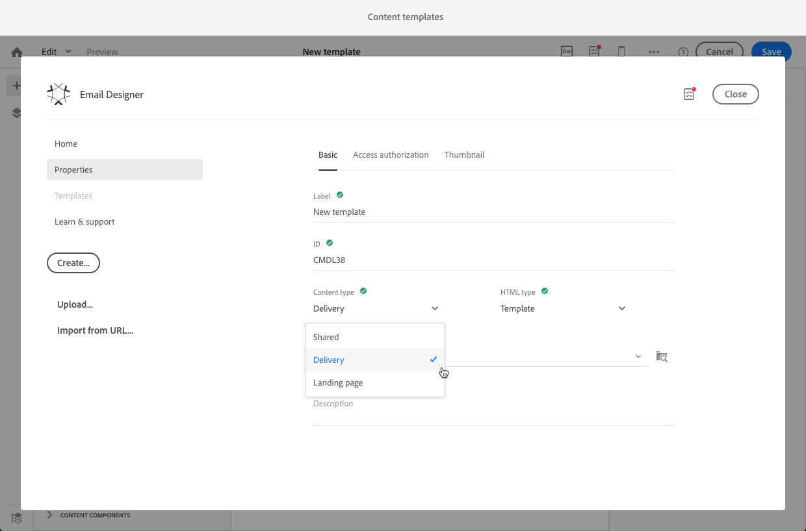

# 재사용 가능한 콘텐츠 제작 및 사용 {#using-reusable-content}

이메일 콘텐츠 에디션을 마스터하는 방법에 대해 알아봅니다. 이메일 Designer을 사용하면 미리 정의된 자체 콘텐츠로 템플릿과 조각을 만들고 다음 게재에 재사용할 수 있습니다.

## 템플릿을 사용하여 이메일 디자인 {#designing-templates}

>[!NOTE]
>
> Adobe Campaign Standard에서는 **리소스** > **템플릿** 메뉴에서 액세스할 수 있는 다양한 유형의 템플릿을 만들 수 있습니다. 이메일 Designer에 사용되는 템플릿은 콘텐츠 템플릿입니다. 자세한 내용은 [템플릿 정보](../../start/using/marketing-activity-templates.md)를 참조하세요.

 [비디오에서 템플릿을 만드는 방법을 살펴보세요](#video)

### 콘텐츠 템플릿 기본 정보 {#content-templates}

[전자 메일 Designer](../../designing/using/designing-content-in-adobe-campaign.md) 홈 페이지의 **[!UICONTROL Templates]** 탭에서 제공되는 HTML 콘텐츠를 관리할 수 있습니다.

기본 제공되는 이메일 콘텐츠 템플릿에는 모바일에 최적화된 레이아웃 18개와 Behance 아티스트가 디자인한 동급 최고의 반응형 템플릿 4개가 포함됩니다. 고객 환영 메시지, 뉴스레터 및 재참여 이메일 등 가장 최근의 용도에 해당합니다. 브랜드의 콘텐츠로 손쉽게 사용자 정의하여 이메일 디자인 프로세스를 처음부터 간편하게 할 수 있습니다.

HTML 콘텐츠 템플릿은 [고급 메뉴](../../start/using/interface-description.md#advanced-menu)의 **[!UICONTROL Resources]** > **[!UICONTROL Content templates & fragments]** 화면에서 액세스할 수 있습니다. 여기에서 랜딩 페이지 콘텐츠 템플릿, 이메일 콘텐츠 템플릿 및 조각을 관리할 수 있습니다.

기본 제공 콘텐츠 템플릿은 읽기 전용입니다. 이 중 하나를 편집하려면 먼저 원하는 템플릿을 복제해야 합니다.

새 템플릿 또는 조각을 만들고 원하는 콘텐츠를 정의할 수 있습니다. 자세한 내용은 [콘텐츠 템플릿 만들기](#creating-a-content-template) 및 [콘텐츠 조각 만들기](#creating-a-content-fragment)를 참조하십시오.

이메일 Designer으로 콘텐츠를 편집할 때 콘텐츠를 조각 또는 템플릿으로 저장하여 콘텐츠 템플릿을 만들 수도 있습니다. 자세한 내용은 [콘텐츠를 템플릿으로 저장](#saving-content-as-template) 및 [콘텐츠를 조각으로 저장](../../designing/using/using-reusable-content.md#saving-content-as-a-fragment)을 참조하십시오.

**관련 항목:**

* 콘텐츠 편집에 대한 자세한 내용은 [전자 메일 콘텐츠 디자인 정보](../../designing/using/designing-content-in-adobe-campaign.md)를 참조하세요.

### 콘텐츠 템플릿 만들기 {#creating-a-content-template}

나만의 콘텐츠 템플릿을 만들어 필요한 횟수만큼 사용할 수 있습니다.

다음 예제에서는 이메일 콘텐츠 템플릿을 만드는 방법을 보여 줍니다.

1. **[!UICONTROL Resources]** > **[!UICONTROL Content templates & fragments]**(으)로 이동한 다음 **[!UICONTROL Create]**&#x200B;을(를) 클릭합니다.
1. 이메일 레이블을 클릭하여 이메일 Designer의 **[!UICONTROL Properties]** 탭에 액세스합니다.
1. 인식할 수 있는 레이블을 지정하고 이 템플릿을 이메일에서 사용할 수 있도록 다음 매개 변수를 선택합니다.

   * **[!UICONTROL Content type]** 드롭다운 목록에서 **[!UICONTROL Shared]** 또는 **[!UICONTROL Delivery]** 선택
   * **[!UICONTROL HTML type]** 드롭다운 목록에서 **[!UICONTROL Template]** 선택.

   

1. 필요한 경우 템플릿의 썸네일로 사용할 이미지를 설정할 수 있습니다. 템플릿 속성의 **[!UICONTROL Thumbnail]** 탭에서 선택합니다.

   

   이 썸네일은 [전자 메일 Designer](../../designing/using/designing-content-in-adobe-campaign.md) 홈 페이지의 **[!UICONTROL Templates]** 탭에 표시됩니다.

1. **[!UICONTROL Properties]** 탭을 닫고 기본 작업 영역으로 돌아갑니다.
1. 필요에 따라 사용자 정의할 수 있는 구조 구성 요소와 콘텐츠 구성 요소를 추가합니다.
   >[!NOTE]
   >
   > 콘텐츠 템플릿 내부에는 개인화 필드 또는 조건부 콘텐츠를 삽입할 수 없습니다.
1. 편집한 후 템플릿을 저장합니다.

이제 이 템플릿은 이메일 Designer으로 빌드된 모든 이메일에서 사용할 수 있습니다. [전자 메일 Designer](../../designing/using/designing-content-in-adobe-campaign.md) 홈 페이지의 **[!UICONTROL Templates]** 탭에서 선택하세요.

### 콘텐츠를 템플릿으로 저장 {#saving-content-as-template}

이메일 Designer으로 이메일을 편집할 때 해당 이메일의 콘텐츠를 템플릿으로 직접 저장할 수 있습니다.

<!--[!CAUTION]
>
>You cannot save as template a structure containing personalization fields or dynamic content.-->

1. 전자 메일 Designer 기본 도구 모음에서 **[!UICONTROL Save as template]**&#x200B;을(를) 선택합니다.

   

1. 필요한 경우 레이블과 설명을 추가한 다음 **[!UICONTROL Save]**&#x200B;을(를) 클릭합니다.

   

1. 방금 만든 템플릿을 찾으려면 **[!UICONTROL Resources]** > **[!UICONTROL Content templates & fragments]**(으)로 이동합니다.

1. 새 템플릿을 사용하려면 [전자 메일 Designer](../../designing/using/designing-content-in-adobe-campaign.md) 홈 페이지의 **[!UICONTROL Templates]** 탭에서 선택하세요.

   

### 조각 및 구성 요소를 사용하여 템플릿 만들기 {#template-fragments-components}

이제 이메일 Designer으로 이메일 템플릿을 만들 수 있습니다. 콘텐츠 구성 요소를 사용하여 이메일의 여러 섹션을 반영하고 설정을 조정하여 원본 뉴스레터와 최대한 비슷하게 만듭니다. 마지막으로 방금 만든 조각을 삽입합니다.

1. 이메일 Designer을 사용하여 템플릿을 만듭니다. 자세한 내용은 [콘텐츠 템플릿](#content-templates)을 참조하세요.
1. 템플릿에 이메일 머리글, 바닥글 및 본문에 해당하는 여러 구조 구성 요소를 삽입합니다. 구조 구성 요소를 추가하는 방법에 대한 자세한 내용은 [전자 메일 Designer으로 전자 메일 구조 편집](../../designing/using/designing-from-scratch.md#defining-the-email-structure)을 참조하십시오.
1. 뉴스레터 본문을 만드는 데 필요한 만큼 콘텐츠 구성 요소를 삽입합니다. 매월 업데이트되는 이메일의 편집 가능한 콘텐츠입니다.

   

   HTML Adobe 코드에 익숙하다면 원본 전자 메일의 보다 복잡한 요소를 복사하여 붙여 넣을 수 있는 **[!UICONTROL Html]** 구성 요소를 활용하는 것이 좋습니다. 나머지 콘텐츠에는 **[!UICONTROL Button]**, **[!UICONTROL Image]** 또는 **[!UICONTROL Text]**&#x200B;과(와) 같은 다른 구성 요소를 사용하십시오. 자세한 내용은 [콘텐츠 구성 요소 정보](../../designing/using/designing-from-scratch.md#about-content-components)를 참조하세요.

   >[!NOTE]
   >
   >**[!UICONTROL Html]** 구성 요소를 사용하면 제한된 옵션으로 편집할 수 있는 구성 요소가 만들어집니다. 이 구성 요소를 선택하기 전에 HTML 코드를 처리하는 방법을 확인하십시오.

1. 가능한 한 원본 이메일과 일치하도록 콘텐츠 구성 요소를 조정합니다.

   

   스타일 설정 및 인라인 특성 관리에 대한 자세한 내용은 [전자 메일 스타일 편집](../../designing/using/styles.md)을 참조하세요.

1. 이전에 만든 두 조각(머리글과 바닥글)을 원하는 구조 구성 요소에 삽입합니다.

   

1. 템플릿을 저장합니다.

이제 이메일 Designer 내에서 이 템플릿을 완전히 관리하여 수신자에게 매달 전송할 뉴스레터를 만들고 업데이트할 수 있습니다.

사용하려면 이메일을 만들고 방금 만든 콘텐츠 템플릿을 선택합니다.

**관련 항목**:

* [이메일 만들기](../../channels/using/creating-an-email.md)
* [이메일 Designer 소개 비디오](../../designing/using/designing-content-in-adobe-campaign.md#video)
* [이메일 콘텐츠를 처음부터 디자인하기](../../designing/using/designing-from-scratch.md#designing-an-email-content-from-scratch)

### 튜토리얼 비디오 {#video}

이 비디오에서는 나만의 템플릿을 만드는 방법을 보여 줍니다.

>[!VIDEO](https://video.tv.adobe.com/v/23106?quality=12)

추가 Campaign Standard 방법 비디오를 [여기](https://experienceleague.adobe.com/docs/campaign-standard-learn/tutorials/overview.html?lang=ko)에서 사용할 수 있습니다.

## 조각 정보 {#about-fragments}

>[!CONTEXTUALHELP]
>id="ac_fragments"
>title="조각 정보"
>abstract="조각은 하나 이상의 이메일에서 참조할 수 있는 재사용 가능한 콘텐츠 블록입니다."

조각은 하나 이상의 이메일에서 참조할 수 있는 재사용 가능한 구성 요소입니다.
**리소스** > **콘텐츠 조각 및 템플릿**&#x200B;의 인터페이스에서 찾을 수 있습니다.

이메일 Designer에서 조각을 최대한 활용하려면 다음 작업을 수행하십시오.

* 나만의 조각을 만들어 보세요. [콘텐츠 조각 만들기](#creating-a-content-fragment) 및 [조각으로 콘텐츠 저장](#saving-content-as-a-fragment)을 참조하세요.
* 이메일에서 필요한 만큼 많이 사용합니다. [전자 메일에 요소 삽입](#inserting-elements-into-an-email)을 참조하세요.
* 조각을 편집하면 변경 사항이 동기화됩니다. 해당 조각을 포함하는 모든 이메일(아직 준비 또는 전송되지 않은 경우)에 변경 사항이 자동으로 전파됩니다.

이메일에 추가되면 조각은 기본적으로 잠깁니다. 특정 이메일에 대한 조각을 수정하려는 경우 조각이 사용된 이메일의 잠금을 해제하여 원본 조각과의 동기화를 중단할 수 있습니다. 변경 사항은 더 이상 동기화되지 않습니다.

이메일 내의 조각 잠금을 해제하려면 조각을 선택하고 상황별 도구 모음에서 잠금 아이콘을 클릭합니다.

해당 조각은 원래 조각에 더 이상 연결되지 않는 독립 실행형 구성 요소가 됩니다. 그런 다음 다른 콘텐츠 구성 요소로 편집할 수 있습니다. [콘텐츠 구성 요소 정보](../../designing/using/designing-from-scratch.md#about-content-components)를 참조하세요.

### 이메일에 조각 삽입 {#inserting-elements-into-an-email}

이메일 콘텐츠를 정의하기 위해 미리 배치한 구조 구성 요소에 콘텐츠 요소를 추가할 수 있습니다. [전자 메일 구조 편집](../../designing/using/designing-from-scratch.md#defining-the-email-structure)을 참조하세요.

1. 왼쪽의 **+** 아이콘을 선택하여 콘텐츠 요소에 액세스합니다. [조각](#about-fragments) 또는 [콘텐츠 구성 요소](../../designing/using/designing-from-scratch.md#about-content-components)를 선택하십시오.
1. 추가하려는 조각의 레이블 또는 일부를 이미 알고 있는 경우 검색할 수 있습니다.

   

1. 조각이나 콘텐츠 구성 요소를 팔레트에서 이메일의 구조 구성 요소로 끌어다 놓습니다.

   

   요소가 이메일에 추가되면 이메일의 구조 구성 요소 내부 또는 다른 구조 구성 요소로 이동할 수 있습니다.

   

1. 이 이메일의 정확한 요구 사항과 일치하도록 요소를 편집합니다. 텍스트, 링크, 이미지 등을 추가할 수 있습니다.

   >[!NOTE]
   >
   >조각은 이메일에 추가될 때 기본적으로 잠깁니다. 특정 이메일에 대한 조각을 수정하려는 경우 원본 조각과의 동기화를 중단하거나 조각에서 직접 변경할 수 있습니다. [조각 정보](#about-fragments)를 참조하세요.

1. 이메일에 추가해야 하는 모든 요소에 대해 이 절차를 반복합니다.
1. 이메일을 저장합니다.

이제 이메일 구조가 채워졌으므로 각 콘텐츠 요소의 스타일을 편집할 수 있습니다. [요소 편집](../../designing/using/styles.md)을 참조하세요.

>[!NOTE]
>
>조각이 수정되면 해당 조각이 사용되는 이메일에 변경 사항이 자동으로 전파됩니다. 자세한 내용은 [조각 정보](#about-fragments)를 참조하세요.

### 컨텐츠 조각 만들기 {#creating-a-content-fragment}

필요에 따라 하나 이상의 이메일에서 사용할 수 있도록 고유한 콘텐츠 조각을 만들 수 있습니다.

1. **[!UICONTROL Resources]** > **[!UICONTROL Content templates & fragments]**(으)로 이동한 다음 **[!UICONTROL Create]**&#x200B;을(를) 클릭합니다.
1. 이메일 레이블을 클릭하여 이메일 Designer의 **[!UICONTROL Properties]** 탭에 액세스합니다.
1. 인식 가능한 레이블을 지정하고 다음 매개 변수를 선택하여 이메일 콘텐츠를 편집할 때 조각을 찾습니다.

   * 조각은 전자 메일만 호환되므로 **[!UICONTROL Content type]** 드롭다운 목록에서 **[!UICONTROL Delivery]**&#x200B;을(를) 선택하십시오.
   * 이 콘텐츠를 조각으로 사용하려면 **[!UICONTROL HTML type]** 드롭다운 목록에서 **[!UICONTROL Fragment]**&#x200B;을(를) 선택하십시오.

   

1. 필요한 경우 조각의 썸네일로 사용할 이미지를 설정할 수 있습니다. 템플릿 속성의 **[!UICONTROL Thumbnail]** 탭에서 선택합니다.

   

   이메일을 편집할 때 조각의 레이블 옆에 이 썸네일이 표시됩니다.

1. **[!UICONTROL Properties]** 탭을 닫고 기본 작업 영역으로 돌아갑니다.
1. 필요에 따라 사용자 정의할 수 있는 구조 구성 요소와 콘텐츠 구성 요소를 추가합니다.

   >[!CAUTION]
   >
   >조각에는 개인화 필드, 다이내믹 콘텐츠 또는 다른 조각이 포함될 수 없습니다.
   >
   >빈 구조 구성 요소가 있는 조각 콘텐츠로 저장하지 마십시오. >조각을 삽입하면 편집할 수 없습니다.
   >
   >조각에서 [모바일 보기](../../designing/using/plain-text-html-modes.md#switching-to-mobile-view)를 사용할 수 없습니다.

1. 편집한 후 조각을 저장합니다.

이제 이 조각을 이메일 Designer으로 빌드된 모든 이메일에서 사용할 수 있습니다. 팔레트의 **[!UICONTROL Fragments]** 섹션 아래에 나타납니다.

>[!NOTE]
>
>이메일에서 사용되고 잠금 해제되지 않는 한 조각 내에 개인화 필드를 삽입할 수 없습니다. [조각 정보](#about-fragments)를 참조하세요.

### 콘텐츠를 조각으로 저장 {#saving-content-as-a-fragment}

이메일 Designer을 사용하여 이메일을 편집할 때 해당 이메일의 일부를 조각으로 직접 저장할 수 있습니다.

* 개인화 필드, 다이내믹 콘텐츠 또는 다른 조각이 포함된 구조를 조각으로 저장할 수 없습니다.
* 서로 인접한 구조만 선택할 수 있습니다.
  <!-- - You cannot select an empty structure.-->

1. 전자 메일 Designer에서 전자 메일을 편집할 때 기본 도구 모음에서 **[!UICONTROL Save as fragment]**&#x200B;을(를) 선택합니다.

   

1. 작업 영역에서 조각을 구성할 구조를 선택합니다.

   

   >[!NOTE]
   >
   >서로 인접하며 개인화 필드, 다이내믹 콘텐츠 또는 다른 조각을 포함하지 않는 구조를 선택해야 합니다.
   <!--You cannot select an empty structure.-->

1. **[!UICONTROL Create]**&#x200B;를 클릭합니다.

1. 필요한 경우 레이블과 설명을 추가한 다음 **[!UICONTROL Save]**&#x200B;을(를) 클릭합니다.

   

1. 방금 만든 조각을 찾으려면 **[!UICONTROL Resources]** > **[!UICONTROL Content templates & fragments]**(으)로 이동합니다.

   

1. 새 조각을 사용하려면 이메일 콘텐츠를 열고 조각 목록에서 선택합니다.

>[!NOTE]
>조각에서 [모바일 보기](../../designing/using/plain-text-html-modes.md#switching-to-mobile-view)를 사용할 수 없습니다. 이메일 모바일 보기를 편집하려면 콘텐츠를 조각으로 저장하기 전에 편집하십시오.

<!--You need to copy-paste the HTML corresponding to the section that you want to save into a new fragment.

>[!NOTE]
>
>To do this, you need to be familiar with HTML code.

To save as a fragment some email content that you created, follow the steps below.

1. When editing an email in the Email Designer, select **[!UICONTROL Edit]** > **[!UICONTROL HTML]** to open the HTML version of that email.
1. Select and copy the HTML corresponding to the part that you want to save.
1. Go to **[!UICONTROL Resources]** > **[!UICONTROL Content templates & fragments]** and click **[!UICONTROL Create]**.
1. Click the email label to access the **[!UICONTROL Properties]** tab of the Email Designer and select **[!UICONTROL Fragment]** from the **[!UICONTROL HTML type]** drop-down list.
1. Select **[!UICONTROL Edit]** > **[!UICONTROL HTML]** to open the HTML version of the fragment.
1. Paste the HTML that you copied where appropriate.
1. Switch back to the **[!UICONTROL Edit]** view to check the result and save the new fragment.-->

## 조각을 사용하여 재사용 가능한 머리글 및 바닥글 만들기 {#header-footer-fragments}

이메일 Designer을 사용하여 재사용 가능한 각 섹션에 대한 조각을 만듭니다. 이 예제에서는 머리글과 바닥글에 대해 하나씩, 이렇게 두 개의 조각을 만듭니다. 그런 다음 기존 콘텐츠의 관련 부분을 이러한 조각으로 복사할 수 있습니다.

이렇게 하려면 아래 단계를 수행합니다.

1. Adobe Campaign에서 **[!UICONTROL Resources]** > **[!UICONTROL Content templates & fragments]**(으)로 이동하여 헤더에 대한 조각을 만듭니다. 자세한 내용은 [콘텐츠 조각 만들기](#creating-a-content-fragment)를 참조하세요.
1. 조각에 필요한 수만큼 구조 구성 요소를 추가합니다.

   

1. 구조에 이미지 및 텍스트 구성 요소를 삽입합니다.

   

1. 해당 이미지를 업로드하고 텍스트를 입력한 다음 설정을 조정합니다.

   

1. 조각을 저장합니다.
1. 유사하게 진행하여 바닥글을 만들고 저장합니다.

   

이제 조각이 템플릿에서 사용할 준비가 되었습니다.
