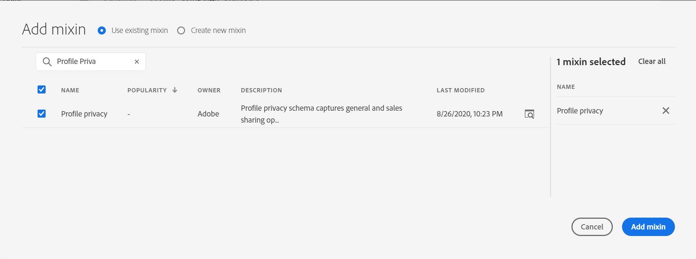

# 매핑 활성화 {#mapping-activation}

>[!IMPORTANT]
>
>Adobe Experience Platform Data Connector는 현재 베타 버전으로, 사전 예고 없이 빈번하게 업데이트될 수 있습니다. 이러한 기능에 액세스하려면 고객이 Azure(현재 북미 전용 베타 버전)에서 호스팅되어야 합니다. 액세스하려면 Adobe 고객 지원 센터에 문의하십시오.

매핑 정의가 완료되면 매핑을 게시할 수 있습니다. 배포 단계 후 Campaign Standard과 Adobe Experience Platform 간 데이터 복제가 자동으로 시작됩니다. 언제든지 **[!UICONTROL Stop]** 단추를 클릭하여 복제를 중지할 수 있습니다.

매핑 수정 사항에 따라 모든 레코드를 Adobe Experience Platform에 재전송하도록 선택할 수 있습니다.

배포 타일에서 게시 로그에 액세스하고 로그를 내보낼 수 있습니다.

**[!UICONTROL Export jobs]** 탭에서 게시된 매핑에 대한 내보내기 작업을 모니터링할 수 있습니다.

모든 데이터 내보내기 작업을 모니터링하려면 **[!UICONTROL Administration]** > **[!UICONTROL Development]** > **[!UICONTROL Platform]** > **[!UICONTROL Status of data export to platform]** 메뉴로 이동합니다.

데이터 통합 작업 상태는 다음과 같습니다.

* **[!UICONTROL Created]**:데이터 통합 작업이 생성되어 데이터 수집이 진행 중입니다.
* **[!UICONTROL Failed]**:데이터 수집 작업이 실패했습니다. 사유 필드는 실패 이유를 설명합니다. 실패가 일시적 또는 영구적일 수 있습니다. 일시적인 실패의 경우 구성된 간격이 지나면 새 통합 작업이 만들어집니다. 문제 해결을 위한 첫 번째 단계로, 사용자는 실패 이유 필드를 확인할 수 있습니다. 이유가 사용자를 Adobe Experience Platform UI로 리디렉션하는 경우, 사용자는 Adobe Experience Platform에 로그인하고 데이터 세트에 있는 일괄 처리 상태를 확인하여 정확한 실패 이유를 파악할 수 있습니다.
* **[!UICONTROL Uploaded]**:Adobe Experience Platform에서 먼저 일괄 처리가 생성되고 데이터가 일괄 처리로 수집됩니다. 일괄 처리 ID 필드에는 Adobe Experience Platform의 일괄 처리에 대한 배치 ID가 표시됩니다. 또한 Adobe Experience Platform에서는 일괄 처리에 대한 게시물 유효성 검사를 수행합니다. Adobe Experience Platform이 게시물 유효성 검사 단계를 완료할 때까지 일괄 처리는 먼저 업로드된 것으로 표시됩니다. 업로드 후 작업이 Adobe Experience Platform을 계속 폴링하여 일괄 처리 상태를 확인합니다. 일괄 처리는 Adobe Experience Platform의 [실패] 또는 [성공 상태 게시물 확인]에서 실행할 수 있습니다.
* **[!UICONTROL Success]**:일괄 처리가 Adobe Experience Platform에 업로드되면 구성된 간격 후에 작업 상태(플랫폼의 게시 유효성 검사)가 확인됩니다. &#39;성공&#39; 상태는 Adobe Experience Platform에서 데이터를 성공적으로 수집했음을 식별합니다.

경우에 따라 매핑을 게시할 때 아래에 유효성 확인 오류가 표시될 수 있습니다.

이 문제는 사용 중인 XDM 스키마가 개인 정보 관리와 관련된 최신 XDM 필드로 업데이트되지 않고 더 이상 사용되지 않는 &quot;ccpa&quot; XDM 필드가 포함되어 있을 때 발생합니다.

XDM 스키마를 업데이트하려면 다음 단계를 수행합니다.

1. XDM 매핑 페이지에 있는 링크를 사용하여 Adobe Experience Platform의 데이터 세트로 이동합니다.

1. XDM 스키마로 이동합니다.

1. **[!UICONTROL Profile Privacy]** 믹싱을 스키마에 추가합니다.

   

1. 스키마를 저장한 다음 매핑 게시를 다시 시도하십시오. 이제 발행물을 통과해야 합니다.

   
