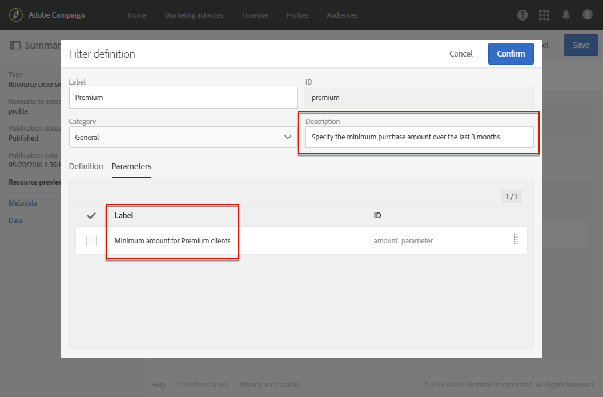

# Configuring filter definition{#configuring-filter-definition}

**[!UICONTROL Filter definition]** 이 탭에서 사용자가 대상을 정의할 때 같이 복잡한 쿼리를 만들 때 바로 액세스할 수 있는 고급 필터를 만들 수 있습니다.

워크플로우, 대상 및 REST API를 통해 리소스를 채우고 데이터에 액세스할 수 있으므로 이 단계는 필수가 아닙니다.

이러한 필터는 사전 구성된 규칙 형태의 쿼리 편집기에서 사용됩니다. 이 도구를 사용하면 원하는 구성을 얻는 데 필요한 단계를 제한할 수 있으며, 반복되는 세그먼트화에 특히 유용합니다.

예를 들어, 필터를 만들어 지난 3 개월 이내에 특정 금액보다 큰 모든 거래를 선택할 수 있습니다.

To do this, you need to extend the **[!UICONTROL Profiles]** resource and define a filter linking to a transaction table (that you have previously created) with a rule indicating that the transaction price must be greater than or equal to a given parameter and that the transaction date must fall within a range corresponding to the last three months.

1. 거래 테이블을 만들고 게시해야 합니다. See [Creating or extending the resource](../../developing/using/creating-or-extending-the-resource.md).

   >[!NOTE]
   >
   >이 절차에서는 사용자 지정 트랜잭션 테이블의 예를 사용합니다. 비즈니스 요구 사항에 맞게 조정하십시오.

1. **[!UICONTROL Profiles]** 리소스에 있는 트랜잭션 테이블과 관련된 필터를 정의하기 전에 이 테이블에 대한 링크를 정의하고 변경 내용을 게시해야 합니다. See [Defining links with other resources](../../developing/using/configuring-the-resource-s-data-structure.md#defining-links-with-other-resources) and [Updating the database structure](../../developing/using/updating-the-database-structure.md).
1. In the **[!UICONTROL Definition]** tab of your new filter's definition screen, select the transaction table.

   

1. **[!UICONTROL Add a rule - Profiles/Transactions]** 창에서 트랜잭션 테이블을 작업 공간으로 드래그하여 놓습니다. 표시되는 다음 창에서 사용할 필드를 선택합니다.

   

1. In the **[!UICONTROL Optional parameter settings]** of the **[!UICONTROL Add a rule - Transactions]** window, check the **[!UICONTROL Switch to parameters]** box.

   In the **[!UICONTROL Filter conditions]**, select the **[!UICONTROL Greater than or equal to]** operator. **[!UICONTROL Parameters]** 필드에 이름을 입력하고 더하기 기호를 클릭하여 새 매개 변수를 만듭니다.

   

1. 변경 사항을 확인합니다. 이 정의는 사용자가 나중에 쿼리를 실행하기 위해 채워야 하는 구성 가능한 필드에 해당합니다.

   

1. 거래 날짜가 지난 3 개월에 해당하는 범위에 속해야 함을 지정하는 다른 규칙과 이 규칙을 결합합니다.

   

1. 필터를 표시할 카테고리를 선택합니다.

   

1. In the **[!UICONTROL Parameters]** tab of the filter definition screen, modify the description and the label to clearly indicate the subject of your filter to the users. 이 정보는 쿼리 편집기에 나타납니다.

   

   구성 가능한 여러 필드를 정의하는 경우 인터페이스에 표시되는 순서를 수정할 수 있습니다.

1. 변경 내용을 저장하고 리소스를 게시합니다. For more on this, refer to the [Updating the database structure](../../developing/using/updating-the-database-structure.md) section.

**[!UICONTROL Profiles]** 리소스 확장이 게시되면 사용자는 [쿼리 편집기](../../automating/using/editing-queries.md) 인터페이스의 단축키 탭 아래에 이 필터를 볼 수 있습니다.

이를 통해 사용자는 지난 3 개월 동안 일정 금액을 초과하여 보낸 모든 고객에게 이메일을 보낼 때 사용자를 쉽게 정의할 수 있습니다.

직접 구성하는 대신 표시되는 대화 상자에 원하는 금액을 입력해야 합니다.

