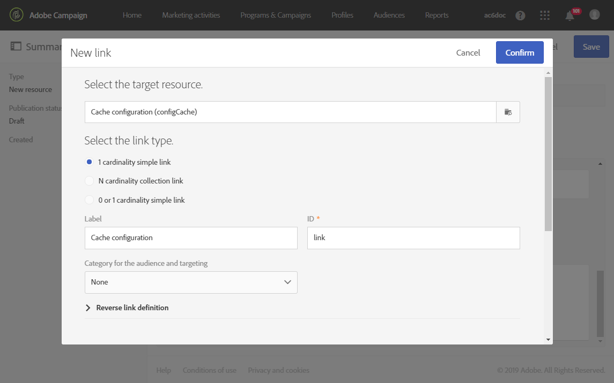
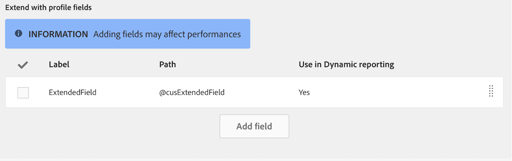

# 리소스의 데이터 구조 구성{#configuring-the-resource-s-data-structure}

새 사용자 지정 리소스를 만든 후 데이터 구조를 구성해야 합니다.

리소스를 편집할 때 **[!UICONTROL Data structure]** 탭에서 다음을 추가할 수 있습니다.

* [필드](#adding-fields-to-a-resource)
* [식별 키](#defining-identification-keys)
* [인덱스](#defining-indexes)
* [링크](#defining-links-with-other-resources)
* [전송 로그](#defining-sending-logs-extension)

## 리소스에 필드 추가 {#adding-fields-to-a-resource}

새로운 필드를 리소스에 추가하여 기본 데이터 모델의 일부가 아닌 데이터를 저장할 수 있습니다.

1. **[!UICONTROL Create element]** 버튼을 사용하여 필드를 만듭니다.
1. 레이블, ID, 필드 유형을 지정하고 이 필드에 허용된 최대 길이를 정의합니다.

   **[!UICONTROL ID]** 필드는 필수 항목이며 추가된 각 필드에 대해 고유해야 합니다.

   >[!NOTE]
   >
   >최대 30자를 사용할 수 있습니다.

   

1. 필드 중 하나를 수정하려면 **[!UICONTROL Edit Properties]** 버튼을 선택합니다.

   

1. **[!UICONTROL Field definition]** 화면에서 대상자 및 타겟팅에 사용할 카테고리를 정의하거나 설명을 추가할 수 있습니다. 

   

1. 사용자에게 제공할 값(열거형 값)을 정의해야 하는 경우 옵션을 **[!UICONTROL Specify a list of authorized values]** 선택합니다.

   그런 다음 **[!UICONTROL Create element]**&#x200B;을(를) 클릭하고 **[!UICONTROL Label]** 및 **[!UICONTROL Value]**&#x200B;을(를) 지정합니다. 필요한 만큼 값을 추가합니다.

1. 필드를 추가한 후에는 **[!UICONTROL Add audit fields]** 상자를 선택하여 생성 날짜, 리소스를 생성한 사용자, 날짜 및 마지막으로 수정한 작성자를 설명하는 필드를 포함합니다.
1. 특정 리소스에 대한 액세스 권한이 있는 사람을 나타내는 필드를 포함하려면 **[!UICONTROL Add access authorization management fields]** 상자를 선택합니다.

   이러한 필드는 데이터베이스 업데이트가 수행된 후 표시할 수 있는 데이터 및 메타데이터에 나타납니다. 자세한 내용은 [데이터베이스 구조 업데이트](../../developing/using/updating-the-database-structure.md) 섹션을 참조하십시오.

1. **[!UICONTROL Add automatic ID]** 필드를 선택하여 ID를 자동으로 생성합니다. 기존 엔터티는 비어 있습니다. 자세한 내용은 [프로필 및 사용자 지정 리소스에 대한 고유 ID 생성](../../developing/using/configuring-the-resource-s-data-structure.md#generating-a-unique-id-for-profiles-and-custom-resources)을 참조하십시오.
1. 목록 및 작성 단계에서 리소스 요소의 이름이 표시되는 방식을 수정하려면 **[!UICONTROL Customize the title of the resource elements]** 상자를 선택합니다. 이 리소스를 위해 생성한 필드에서 필드를 선택합니다.

   

   >[!NOTE]
   >
   >이 옵션을 선택하지 않으면 이 테이블의 모든 엔티티를 나열할 때 자동 기본 키(엔티티가 테이블에 추가될 때마다 자동으로 생성됨)가 사용됩니다.

이제 리소스의 필드가 정의되었습니다.

## 식별 키 정의 {#defining-identification-keys}

각 리소스에는 하나 이상의 고유 키가 있어야 합니다. 예를 들어 두 제품이 구매 테이블에서 동일한 ID를 가질 수 없도록 키를 지정할 수 있습니다.

1. 기술 키를 자동으로 증분 생성하려는 경우 **[!UICONTROL Automatic primary key]** 섹션에 저장 공간 크기를 지정합니다.

   

1. **[!UICONTROL Create element]** 버튼을 사용하여 키를 만듭니다.

   **[!UICONTROL Label]** 및 **[!UICONTROL ID]** 필드는 기본적으로 작성되지만 편집할 수 있습니다.

   >[!NOTE]
   >
   >최대 30자를 사용할 수 있습니다.

1. 이 키를 구성하는 요소를 정의하려면 **[!UICONTROL Create element]**&#x200B;을(를) 클릭하고 이 리소스를 위해 생성한 필드를 선택합니다.

   

   생성된 키가 **[!UICONTROL Custom keys]** 섹션에 표시됩니다.

이제 리소스에 대한 식별 키가 생성되었습니다.

>[!NOTE]
>
>식별 키를 만드는 모범 사례에 대한 자세한 내용은 이 [섹션](../../developing/using/data-model-best-practices.md#keys)을 참조하십시오.

## 인덱스 정의 {#defining-indexes}

인덱스는 하나 또는 여러 리소스 필드를 참조할 수 있습니다. 인덱스를 통해 데이터베이스는 레코드를 보다 쉽게 복구하기 위해 정렬할 수 있습니다. SQL 쿼리의 성능을 최적화합니다.

인덱스를 정의하는 것이 좋지만 필수는 아닙니다.

1. **[!UICONTROL Create element]** 버튼을 사용하여 인덱스를 만듭니다.

   

1. **[!UICONTROL Label]** 및 **[!UICONTROL ID]** 필드는 기본적으로 작성되지만 편집할 수 있습니다.

   >[!NOTE]
   >
   >최대 30자를 사용할 수 있습니다.

1. 이 인덱스를 구성하는 요소를 정의하려면 이 리소스를 위해 생성한 필드에서 필드를 선택합니다.

   

1. **[!UICONTROL Confirm]**&#x200B;을(를) 클릭합니다.

생성된 인덱스가 **[!UICONTROL Index]** 섹션의 목록에 나타납니다.

>[!NOTE]
>
>인덱스를 만드는 모범 사례에 대한 자세한 내용은 이 [섹션](../../developing/using/data-model-best-practices.md#indexes)을(를) 참조하십시오.

## 다른 리소스와의 링크 정의 {#defining-links-with-other-resources}

링크는 한 테이블과 다른 테이블의 연관성에 대해 자세히 설명합니다.

1. **[!UICONTROL Create element]** 버튼을 사용하여 타겟 리소스에 대한 링크를 만듭니다.
1. **[!UICONTROL Select a target resource]**&#x200B;을(를) 클릭합니다.

   

1. 리소스는 알파벳순으로 표시되며 이름별로 필터링할 수 있습니다. 기술적 이름은 대괄호 안에 표시됩니다.

   목록에서 요소를 선택하고 **[!UICONTROL Confirm]**&#x200B;을(를) 클릭합니다.

   

1. 카디널리티에 따라 **[!UICONTROL Link type]**&#x200B;을(를) 선택합니다. 선택한 카디널리티 유형에 따라 레코드가 삭제되거나 중복될 경우 동작이 달라질 수 있습니다.

   다양한 링크 유형은 다음과 같습니다.

   * **[!UICONTROL 1 cardinality simple link]**: 소스 테이블의 발생 항목 하나는 타겟 테이블의 해당 발생 항목을 최대 한 개까지 가질 수 있습니다.
   * **[!UICONTROL N cardinality collection link]**: 소스 테이블의 발생 항목 하나는 타겟 테이블의 여러 발생 항목을 가질 수 있지만, 타겟 테이블의 발생 항목 하나는 소스 테이블의 해당 발생 항목을 최대 한 개까지 가질 수 있습니다.
   * **[!UICONTROL 0 or 1 cardinality simple link]**: 소스 테이블의 발생 항목 하나는 타겟 테이블의 해당 발생 항목을 최대 한 개까지 가질 수도 있고 가질 수 없을 수도 있습니다. 이러한 종류의 **[!UICONTROL Link type]**&#x200B;은(는) 성능 문제를 일으킬 수 있습니다.
   

1. **[!UICONTROL New link]** 화면에서 **[!UICONTROL Label]** 및 **[!UICONTROL ID]** 필드는 기본적으로 작성되지만 편집할 수 있습니다.

   >[!NOTE]
   >
   >최대 30자를 사용할 수 있습니다.

   >[!IMPORTANT]
   >
   >생성 후에는 링크 이름을 바꿀 수 없습니다. 링크의 이름을 변경하려면 링크를 삭제하고 다시 만들어야 합니다.

1. **[!UICONTROL Category for the audience and targeting]** 목록을 사용하면 이 링크를 카테고리에 할당하여 쿼리 편집기 도구에서 보다 잘 보이도록 할 수 있습니다.
1. 필요한 경우 **[!UICONTROL Reverse link definition]** 섹션에서 타겟팅된 리소스에 있는 리소스의 레이블과 ID를 표시할 수 있습니다.
1. **[!UICONTROL Behavior if deleted/duplicated]** 섹션에서 링크가 참조하는 레코드의 동작을 정의합니다.

   기본적으로 타겟 레코드는 더 이상 링크가 참조하지 않으면 삭제됩니다.

   

1. **[!UICONTROL Join definition]** 섹션에서 기본 **[!UICONTROL Use the primary keys to make the join]** 옵션이 선택되지만 다음 두 옵션 중 하나를 선택할 수 있습니다.

   * **[!UICONTROL Use the primary key to make the join]**: 이 조인 정의를 사용하면 프로필 기본 키를 사용하여 구매의 기본 키와 조정할 수 있습니다.
   * **[!UICONTROL Define specific join conditions]**: 이 조인 정의를 사용하면 두 리소스를 모두 조인할 필드를 수동으로 선택할 수 있습니다. 데이터가 올바르게 구성되지 않으면 **구매** 레코드가 표시되지 않습니다.
   

생성된 링크는 **[!UICONTROL Links]** 섹션의 목록에 표시됩니다.

>[!NOTE]
>
>인덱스를 만드는 모범 사례에 대한 자세한 내용은 이 [섹션](../../developing/using/data-model-best-practices.md#links)을(를) 참조하십시오.

**예제: 생성된 리소스를 &#39;Profiles&#39; 리소스와 연결**

이 예제에서는 새 리소스 **Purchase**&#x200B;를 **Profiles** 사용자 지정 리소스와 연결하려고 합니다.

1. 새 **Purchase** 리소스를 생성합니다.
1. **Profiles** 사용자 지정 리소스와 연결하려면 **[!UICONTROL Data structure]** 탭에서 **[!UICONTROL Links]** 섹션을 펼친 후 **[!UICONTROL Create element]**&#x200B;을(를) 클릭합니다.
1.  **[!UICONTROL Profiles (profile)]**&#x200B;에서 타겟 리소스를 선택합니다.
1. 이 예제에서는 기본 **[!UICONTROL 1 cardinality simple link]** 링크 유형을 선택한 상태로 유지합니다.

   

1. 조인 정의를 선택합니다. 여기서는 기본값 **[!UICONTROL Use the primary key to make the join]**&#x200B;을(를) 유지합니다.

   

1. 필요한 경우 **Purchase**&#x200B;를 편집하고 프로필에 연결할 수 있는 세부 사항 화면을 정의할 수 있습니다.

   **[!UICONTROL Detail screen configuration]** 섹션을 펼치고 **[!UICONTROL Define a detail screen]**&#x200B;을(를) 선택하여 리소스의 각 요소에 해당하는 화면을 구성합니다. 이 상자를 선택하지 않으면 이 리소스의 요소 상세 보기에 액세스할 수 없습니다.

1. **[!UICONTROL Create element]**&#x200B;을(를) 클릭합니다.
1. 연결된 리소스를 선택하고 **[!UICONTROL Add]**&#x200B;을(를) 클릭합니다.

   그런 다음 **[!UICONTROL Client data]** > **[!UICONTROL Purchase]**&#x200B;을(를) 선택하여 고급 메뉴에서 새 리소스를 사용할 수 있습니다.

   

1. 구성이 완료되면 **[!UICONTROL Confirm]**&#x200B;을(를) 클릭합니다.

   이제 새 리소스를 게시할 수 있습니다.

이 링크를 추가하면 **Purchase** 탭이 **[!UICONTROL Profiles & audiences]** > **[!UICONTROL Profiles]** 메뉴에서 프로필 세부 정보 화면에 추가됩니다. 이는 **[!UICONTROL Profile]** 리소스 전용입니다.

## 전송 로그 확장 정의 {#defining-sending-logs-extension}

전송 로그 확장을 사용하면 다음 작업을 수행할 수 있습니다.

* **프로필 사용자 지정 필드를 추가**&#x200B;하여 동적 보고서 기능 확장
* 전송 로그 데이터를 **세그먼트 코드 및 프로필 데이터**&#x200B;로 확장

**세그먼트 코드로 확장**

사용자는 워크플로우 엔진에서 나오는 세그먼트 코드로 로그를 확장할 수 있습니다.

세그먼트 코드는 워크플로우에 정의되어야 합니다.

이 확장을 활성화하려면 **[!UICONTROL Add segment code]** 옵션을 선택합니다.

세그먼트 코드에 대한 자세한 내용은 [세분화](../../automating/using/segmentation.md) 섹션을 참조하십시오.

**프로필 필드로 확장**

>[!NOTE]
>
>관리자는 사용자 지정 필드로 프로필 리소스를 확장해야 합니다.

**[!UICONTROL Add field]**&#x200B;을(를) 클릭하고 프로필 리소스에서 사용자 지정 필드를 선택합니다.

프로필 차원에 연결된 새 하위 차원을 생성하려면 **[!UICONTROL Add this field in Dynamic reporting as a new dimension]** 옵션을 선택합니다.

동적 보고에서 사용자 지정 필드 차원을 자유 형식 테이블로 끌어서 놓을 수 있습니다.

동적 보고에 대한 자세한 내용은 [구성 요소 목록](../../reporting/using/list-of-components-.md)을 참조하십시오.

>[!IMPORTANT]
>
>동적 보고로 전송되는 필드 수는 20개로 제한됩니다.

## 리소스 속성 편집 {#editing-resource-properties}

사용자 지정 리소스 화면에서 **[!UICONTROL Summary]** 창은 새로 생성된 리소스의 상태를 나타냅니다. 액세스 및 일반 속성을 관리할 수 있습니다.

1. **[!UICONTROL Edit properties]** 버튼을 클릭하여 설명을 추가합니다.

   

1. 필요한 경우 리소스의 레이블 및 ID를 수정합니다.

   >[!NOTE]
   >
   >최대 30자를 사용할 수 있습니다.

1. 이 리소스에 대한 액세스를 특정 조직 단위로 제한해야 하는 경우 여기에서 지정합니다. 승인된 장치의 사용자만 애플리케이션에서 이 리소스로 작업할 수 있습니다.
1. 수정 사항을 저장합니다.

수정 사항이 저장되었습니다. 리소스를 적용하려면 리소스를 다시 게시해야 합니다.

## 프로필 및 사용자 지정 리소스에 대한 고유 ID 생성 {#generating-a-unique-id-for-profiles-and-custom-resources}

기본적으로 프로필 및 사용자 지정 리소스는 만들 때 비즈니스 ID가 없습니다. 요소를 만들 때 자동으로 고유 ID를 생성하는 옵션을 활성화할 수 있습니다. 이 ID를 사용하여 다음을 수행할 수 있습니다.

* 외부 도구에서 내보낸 레코드를 쉽게 식별합니다.
* 다른 애플리케이션에서 처리된 업데이트된 데이터를 가져올 때 레코드를 조정합니다.

프로필 및 사용자 지정 리소스에만 사용할 수 있습니다.

1. 프로필 리소스에 대한 확장을 만들거나 새 리소스를 만듭니다.
1. 데이터 구조 정의에서 **[!UICONTROL Add automatic ID field]** 섹션 아래의 **[!UICONTROL Fields]** 옵션을 선택합니다.

   

   >[!NOTE]
   >
   >새 레코드에만 ACS ID가 있습니다. **[!UICONTROL ACS ID]** 필드는 이 옵션을 활성화하기 전에 생성된 프로필 또는 요소에 대해서는 비어 있는 상태로 유지됩니다.

1. 리소스에 대한 수정 사항을 저장하고 게시합니다. API를 통해 만든 요소에 이 메커니즘을 적용하려면 API를 확장하는 옵션을 선택합니다.

이제 **[!UICONTROL ACS ID]** 필드를 사용할 수 있으며 새 요소를 수동으로 생성하거나 API 또는 가져오기 워크플로우에서 삽입되면 자동으로 채워집니다. ACS ID 필드는 UUID 필드이며 인덱싱됩니다.

이제 프로필 또는 사용자 지정 리소스를 내보낼 때 해당 리소스에 대해 **[!UICONTROL ACS ID]** 열이 활성화된 경우 이를 추가할 수 있습니다. 외부 도구에서 이 ID를 다시 사용하여 레코드를 식별할 수 있습니다.

다른 애플리케이션(예: CRM)에서 처리/업데이트된 데이터를 다시 가져오는 경우 이 고유 ID로 쉽게 조정할 수 있습니다.

>[!NOTE]
>
>**[!UICONTROL ACS ID]** 필드는 이 옵션을 사용하기 전에 생성된 프로필 또는 요소에 대해서는 업데이트되지 않습니다. 새 레코드에만 ACS ID가 있습니다.
>
>이 필드는 읽기 전용 모드입니다. 수정할 수 없습니다.
