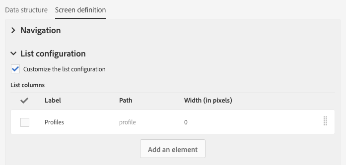
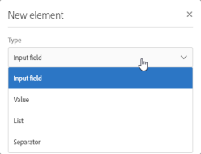

# 화면 정의 구성{#configuring-the-screen-definition}

리소스를 만들거나 기존 리소스에 새 필드를 추가할 때 인터페이스에 표시할 방법을 정의할 수 있습니다.

워크플로우, 대상자 및 REST API를 통해 리소스를 채우고 해당 데이터에 액세스할 수 있으므로 이 단계는 필수가 아닙니다.

**[!UICONTROL Screen definition]** 탭에서 다음을 수행할 수 있습니다.

* 탐색 창에서 사용자 지정 리소스에 대한 액세스 추가
* 리소스를 구성하는 요소 목록을 표시하는 방식 개인화
* 리소스의 각 요소에 대한 세부 사항 보기를 표시하는 방식 정의

## 탐색 메뉴에서 액세스 활성화 {#enabling-access-from-the-navigation-menu}

리소스에 전용 화면이 필요한 경우 탐색 메뉴에서 사용할 수 있게 만들 수 있습니다.

1. 리소스의 **[!UICONTROL Screen definition]** 탭에서 **[!UICONTROL Navigation]** 섹션을 펼칩니다.
1. 탐색 창에서 이 리소스에 대한 액세스를 허용하려면 **[!UICONTROL Add an entry in the 'Client data' section]** 상자를 선택합니다.

   

리소스는 **[!UICONTROL Client data]** 섹션 내에 하위 항목으로 나타납니다.

## 기본 목록 구성 정의 {#defining-the-default-list-configuration}

화면 정의의 **[!UICONTROL List configuration]** 섹션에서 리소스 개요에 기본적으로 표시되는 열과 정보를 정의할 수 있습니다.

1. 리소스 열을 표시하는 방식을 정의하려면 **[!UICONTROL Customize the list configuration]** 상자를 선택합니다.
1. **[!UICONTROL Create element]** 버튼을 사용하여 생성한 필드에서 필드를 선택합니다.
1. 생성한 필드가 목록에 표시됩니다. 레이블과 너비를 편집할 수 있습니다.

   

1. **[!UICONTROL Simple search]** 섹션에서 **[!UICONTROL Specify the fields to be taken into account in the search]**&#x200B;을(를) 확인하여 검색에 포함할 필드를 정의합니다.

   >[!IMPORTANT]
   >
   >이 구성은 기본 검색에 사용되는 필드를 대체합니다.

1. **[!UICONTROL Advanced filtering]** 섹션에서 **[!UICONTROL Add search fields]** 상자를 선택하여 단순 검색 필드 이상의 필드를 추가합니다. 예를 들어 생성한 필드에서 &quot;날짜&quot; 필드를 선택하면 사용자는 날짜만 참조하는 검색을 수행할 수 있습니다.
1. 두 가지 검색 유형에 대한 필드 순서를 수정할 수 있습니다.
1. 고급 검색의 경우 연결된 리소스에 연결된 필드를 추가할 수 있습니다. 이 필터는 생성된 화면의 **[!UICONTROL Search]** 메뉴에 나타납니다.

이제 리소스의 개요 화면이 정의되었습니다.

## 세부 사항 화면 구성 정의 {#defining-the-detail-screen-configuration}

화면 정의의 **[!UICONTROL Detail screen configuration]** 섹션에서 각 리소스 요소의 세부 사항 화면에 표시될 열과 정보를 정의할 수 있습니다.

1. **[!UICONTROL Detail screen configuration]** 섹션을 펼치고 **[!UICONTROL Define a detail screen]**&#x200B;을(를) 선택하여 리소스의 각 요소에 해당하는 화면을 구성합니다. 이 상자를 선택하지 않으면 이 리소스의 요소 상세 보기에 액세스할 수 없습니다.
1. 한 번의 클릭으로 사용자 지정 리소스의 모든 필드를 추가할 수 있습니다. 이렇게 하려면  아이콘을 클릭하거나 **[!UICONTROL Add an element]** 버튼을 사용합니다.
1. 이 리소스에 대해 생성된 요소에서 요소를 선택하고 필드 유형을 지정합니다.

   * **[!UICONTROL Input field]**: 편집 가능한 필드입니다.
   * **[!UICONTROL Value]**: 읽기 전용 필드입니다.
   * **[!UICONTROL List]**: 테이블입니다.
   * **[!UICONTROL Separator]**: 요소를 카테고리로 나눕니다.

   

1. 추가된 요소가 목록에 표시됩니다. 해당 레이블을 편집할 수 있습니다.

   

1. 요소를 다른 카테고리로 분할하는 데 필요한 만큼 **[!UICONTROL Separator]**&#x200B;를 추가합니다.

   이렇게 하면 구분 기호를 표시하여 창을 더 잘 구성할 수 있습니다.

   

이제 리소스의 세부 사항 화면이 구성되었습니다.

## 데이터 섹션에 대한 작업 {#actions-on-data-section}

이 설정을 통해 사용자 지정 리소스 화면에 제어 표시줄을 표시할 수 있습니다. 다음 세 가지 옵션을 사용할 수 있습니다.

* **[!UICONTROL Authorize creating]**: 이 옵션을 사용하면 리소스의 요소 만들기를 활성화할 수 있습니다. 따라서 사용자는 추가 레코드를 추가할 수 있습니다.

   >[!NOTE]
   >
   >이 옵션을 사용하려면 먼저 리소스에 연결된 세부 사항 화면을 활성화해야 합니다.

* **[!UICONTROL Authorize duplicating]**: 이 옵션을 사용하면 사용자 지정 리소스에 연결된 중복 레코드를 활성화할 수 있습니다.
* **[!UICONTROL Authorize deleting]**: 이 옵션을 사용하면 사용자 지정 리소스에 연결된 삭제 레코드를 활성화할 수 있습니다.
